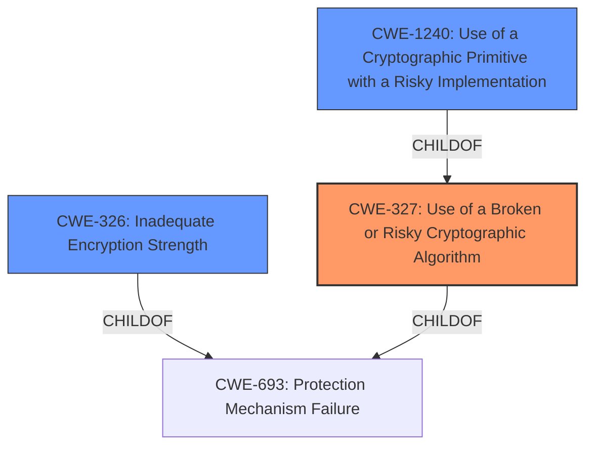

# Raw Analyzer Response for CVE-2021-20400

# Summary
| CWE ID | CWE Name | Confidence | CWE Abstraction Level | CWE Vulnerability Mapping Label | CWE-Vulnerability Mapping Notes |
|---|---|---|---|---|---|
| CWE-327 | Use of a Broken or Risky Cryptographic Algorithm | 1.0 | Class | Allowed-with-Review | Primary CWE |
| CWE-326 | Inadequate Encryption Strength | 0.7 | Class | Allowed-with-Review | Secondary Candidate |
| CWE-1240 | Use of a Cryptographic Primitive with a Risky Implementation | 0.6 | Base | Allowed | Secondary Candidate |

## Evidence and Confidence

*   **Confidence Score:** 0.9
*   **Evidence Strength:** HIGH

## Relationship Analysis
The primary CWE identified is CWE-327 (Use of a Broken or Risky Cryptographic Algorithm), which is a Class-level CWE. Its child CWE, CWE-1240 (Use of a Cryptographic Primitive with a Risky Implementation), is a Base-level CWE and represents a more specific instance of using risky cryptographic algorithms. CWE-326 (Inadequate Encryption Strength) is also a Class-level CWE and is related to the strength of encryption, but less specific than algorithms. The relationships indicate a hierarchy from general cryptographic issues to specific algorithm implementation risks, helping to refine the selection.

## Vulnerability Chain
The vulnerability chain starts with the use of **weaker than expected cryptographic algorithms** (CWE-327), which leads to the potential to **decrypt highly sensitive information**.

## Summary of Analysis
The initial assessment focused on the provided vulnerability description, highlighting the use of **weaker than expected cryptographic algorithms** in IBM QRadar SIEM. The evidence from the "Vulnerability Description Key Phrases" and "CVE Reference Links Content Summary" clearly points to a cryptographic issue. The "CWE for similar CVE Descriptions" also lists CWE-327 as the primary match.

The analysis considered several CWEs, particularly CWE-327, CWE-326, and CWE-1240. The final decision emphasizes CWE-327 as the primary weakness because it directly addresses the use of a broken or risky cryptographic algorithm. CWE-326 (Inadequate Encryption Strength) was considered, but CWE-327 is more specific to the algorithm itself being risky. CWE-1240 (Use of a Cryptographic Primitive with a Risky Implementation) is more specific but still relevant as a secondary concern.

The selection of CWE-327 is based on the following evidence:
- The vulnerability description states "**weaker than expected cryptographic algorithms**".
- The "Vulnerability Description Key Phrases" identifies "**weaker than expected cryptographic algorithms**" as the root cause.
- The "CVE Reference Links Content Summary" mentions "Use of weak cryptographic algorithms."
- "CWE for similar CVE Descriptions" identifies CWE-327 as the primary CWE match.

The usage guidance for CWE-327 is "Allowed-with-Review," suggesting a check for more specific children. While CWE-1240 is a child, the description indicates a non-standard implementation, which isn't explicitly stated in the vulnerability. Therefore, CWE-327 is the most appropriate primary mapping.

Relevant CWE Information:

# Enhanced Context (25 CWEs)
The following CWEs were identified as potentially relevant to this vulnerability:

## CWE-311: Missing Encryption of Sensitive Data
**Abstraction Level**: Class
**Similarity Score**: 0.80
**Source**: dense

**Description**:
The product does not encrypt sensitive or critical information before storage or transmission.

**Mapping Guidance**:
- Usage: Discouraged
- Rationale: CWE-311 is high-level with more precise children available. It is a level-1 Class (i.e., a child of a Pillar).

*Not used because the description indicates the use of cryptographic algorithms, even though they are **weaker than expected**, so encryption exists.*

## CWE-312: Cleartext Storage of Sensitive Information
**Abstraction Level**: Base
**Similarity Score**: 0.79
**Source**: dense

**Description**:
The product stores sensitive information in cleartext within a resource that might be accessible to another control sphere.

**Mapping Guidance**:
- Usage: Allowed
- Rationale: This CWE entry is at the Base level of abstraction, which is a preferred level of abstraction for mapping to the root causes of vulnerabilities.

*Not used because the description indicates the use of cryptographic algorithms, even though they are **weaker than expected**, so encryption exists and data is not stored in cleartext.*

## CWE-319: Cleartext Transmission of Sensitive Information
**Abstraction Level**: Base
**Similarity Score**: 0.78
**Source**: dense

**Description**:
The product transmits sensitive or security-critical data in cleartext in a communication channel that can be sniffed by unauthorized actors.

**Mapping Guidance**:
- Usage: Allowed
- Rationale: This CWE entry is at the Base level of abstraction, which is a preferred level of abstraction for mapping to the root causes of vulnerabilities.

*Not used because the description indicates the use of cryptographic algorithms, even though they are **weaker than expected**, so encryption exists and data is not transmitted in cleartext.*

## CWE-1240: Use of a Cryptographic Primitive with a Risky Implementation
**Abstraction Level**: Base
**Similarity Score**: 0.78
**Source**: dense

**Description**:
To fulfill the need for a cryptographic primitive, the product implements a cryptographic algorithm using a non-standard, unproven, or disallowed/non-compliant cryptographic implementation.

**Mapping Guidance**:
- Usage: Allowed
- Rationale: This CWE entry is at the Base level of abstraction, which is a preferred level of abstraction for mapping to the root causes of vulnerabilities.

*Considered because this vulnerability deals with cryptographic algorithms. But it is secondary because it focuses on implementation, which is not explicitly stated in the vulnerability.*

## CWE-1391: Use of Weak Credentials
**Abstraction Level**: Class
**Similarity Score**: 0.76
**Source**: dense

**Description**:
The product uses weak credentials (such as a default key or hard-coded password) that can be calculated, derived, reused, or guessed by an attacker.

**Mapping Guidance**:
- Usage: Allowed-with-Review
- Rationale: This CWE entry is a Class and might have Base-level children that would be more appropriate

*Not used because the vulnerability is about the cryptographic algorithm being **weaker than expected** and not about weak credentials.*

## CWE-203: Observable Discrepancy
**Abstraction Level**: Base
**Similarity Score**: 0.76
**Source**: dense

**Description**:
The product behaves differently or sends different responses under different circumstances in a way that is observable to an unauthorized actor, which exposes security-relevant information about the state of the product, such as whether a particular operation was successful or not.

**Mapping Guidance**:
- Usage: Allowed
- Rationale: This CWE entry is at the Base level of abstraction, which is a preferred level of abstraction for mapping to the root causes of vulnerabilities.

*Not used because the vulnerability is about the cryptographic algorithm being **weaker than expected** and not about observable discrepancies.*

## CWE-326: Inadequate Encryption Strength
**Abstraction Level**: Class
**Similarity Score**: 0.75
**Source**: dense

**Description**:
The product stores or transmits sensitive data using an encryption scheme that is theoretically sound, but is not strong enough for the level of protection required.

**Mapping Guidance**:
- Usage: Allowed-with-Review
- Rationale: This CWE entry is a Class and might have Base-level children that would be more appropriate

*Considered because this vulnerability deals with cryptographic algorithms. The vulnerability description implies that encryption strength is an issue because the algorithms are **weaker than expected**. It is a secondary candidate because it is closely related to the primary cause.*

## CWE-345: Insufficient Verification of Data Authenticity
**Abstraction Level**: Class
**Similarity Score**: 0.75
**Source**: dense

**Description**:
The product does not sufficiently verify the origin or authenticity of data, in a way that causes it to accept invalid data.

**Mapping Guidance**:
- Usage: Discouraged
- Rationale: This CWE entry is a level-1 Class (i.e