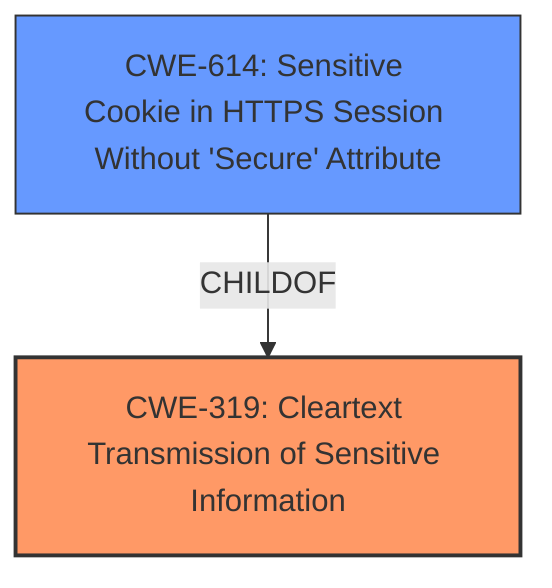

# Analysis for CVE-2021-20409

# Summary
| CWE ID | CWE Name | Confidence | CWE Abstraction Level | CWE Vulnerability Mapping Label | CWE-Vulnerability Mapping Notes |
|---|---|---|---|---|---|
| CWE-319 | Cleartext Transmission of Sensitive Information | 1.0 | Base | Allowed | Primary CWE |

## Evidence and Confidence

*   **Confidence Score:** 1.0
*   **Evidence Strength:** HIGH

## Relationship Analysis
The primary relationship influencing the decision is the ChildOf relationship between CWE-614 and CWE-319. Although CWE-614 is more specific ("Sensitive Cookie in HTTPS Session Without 'Secure' Attribute"), the vulnerability description focuses on the **failure to properly enable HTTP Strict Transport Security** in general, which leads to sensitive information being transmitted in cleartext. Therefore, the more general CWE-319 is more appropriate.

## Vulnerability Chain
The vulnerability chain starts with the **failure to properly enable HTTP Strict Transport Security**, leading to cleartext transmission of sensitive information, which can be intercepted by a remote attacker using man-in-the-middle techniques.

## Summary of Analysis
The primary factor in the assessment is based on the vulnerability description key phrases, which states the **rootcause** as **failure to properly enable HTTP Strict Transport Security**. The CVE Reference Links Content Summary indicates that the ISIQ server **does not include the HTTP Strict Transport Security (HSTS) header** in error responses.

The selected CWE, CWE-319 (Cleartext Transmission of Sensitive Information), is at the Base level of abstraction, which is preferred. The vulnerability allows a remote attacker to obtain sensitive information because HSTS is not properly enabled, resulting in transmission of data in cleartext. The retriever results also list CWE-319 as the top combined result.

Relevant CWE Information:

# Enhanced Context (25 CWEs)

## CWE-319: Cleartext Transmission of Sensitive Information
**Abstraction Level**: Base
**Similarity Score**: 0.78
**Source**: dense

**Description**:
The product transmits sensitive or security-critical data in cleartext in a communication channel that can be sniffed by unauthorized actors.

**Mapping Guidance**:
- Usage: Allowed
- Rationale: This CWE entry is at the Base level of abstraction, which is a preferred level of abstraction for mapping to the root causes of vulnerabilities.

## CWE-300: Channel Accessible by Non-Endpoint
**Abstraction Level**: Class
**Similarity Score**: 0.77
**Source**: dense

**Description**:
The product does not adequately verify the identity of actors at both ends of a communication channel, or does not adequately ensure the integrity of the channel, in a way that allows the channel to be accessed or influenced by an actor that is not an endpoint.

**Mapping Guidance**:
- Usage: Discouraged
- Rationale: CWE-300 is commonly misused for vulnerabilities in which the prerequisites for exploitation require the adversary to be in a privileged "in-the-middle" position.

*CWE Considered but not used:*

*   CWE-300 (Channel Accessible by Non-Endpoint): This was considered but not chosen because the description states that CWE-300 is commonly misused when the attacker needs to be in a privileged "in-the-middle" position. The vulnerability here is directly caused by the **failure to enable HSTS**, resulting in cleartext transmission.
*   CWE-614 (Sensitive Cookie in HTTPS Session Without 'Secure' Attribute): This CWE is too specific, as it focuses on the 'Secure' attribute for cookies. The vulnerability is broader, relating to the general lack of HSTS.