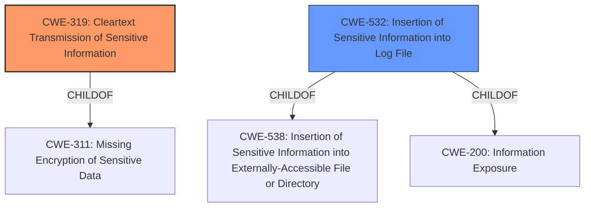

# Raw Analyzer Response for CVE-2021-20410

# Summary
| CWE ID | CWE Name | Confidence | CWE Abstraction Level | CWE Vulnerability Mapping Label | CWE-Vulnerability Mapping Notes |
|---|---|---|---|---|---|
| CWE-319 | Cleartext Transmission of Sensitive Information | 1.0 | Base | Allowed | Primary CWE. The vulnerability explicitly states that user credentials are sent in cleartext. |
| CWE-532 | Insertion of Sensitive Information into Log File | 0.8 | Base | Allowed | Secondary CWE. The CVE Reference Links Content Summary indicates that InfluxDB user and password credentials were included in the logs stack YAML file. |

## Evidence and Confidence

*   **Confidence Score:** 0.9
*   **Evidence Strength:** HIGH

## Relationship Analysis
The primary CWE is CWE-319 **Cleartext Transmission of Sensitive Information**, which is a base level CWE and a child of CWE-311 **Missing Encryption of Sensitive Data**. The secondary CWE is CWE-532 **Insertion of Sensitive Information into Log File**, which is a base level CWE and a child of both CWE-538 **Insertion of Sensitive Information into Externally-Accessible File or Directory** and CWE-200 **Information Exposure**.

## Vulnerability Chain
The vulnerability chain starts with the **sending of user credentials in plain clear text** (CWE-319). Because the credentials were included in the logs stack YAML file, this becomes **insertion of sensitive information into log file** (CWE-532). An authenticated user can then use man in the middle techniques to read this information. The root cause is the **transmission of sensitive information in cleartext**, leading to potential exposure and unauthorized access.

## Summary of Analysis
The initial analysis focused on the **sending user credentials in plain clear text**, which directly corresponds to CWE-319 **Cleartext Transmission of Sensitive Information**. The CVE Reference Links Content Summary reinforces this by stating that InfluxDB credentials were included in the logs stack YAML file, leading to the addition of CWE-532 **Insertion of Sensitive Information into Log File**.

The relationship graph shows that CWE-319 is a child of CWE-311, but CWE-319 is more specific and thus a better fit. Similarly, CWE-532 is a child of CWE-538 and CWE-200, but again, CWE-532 is a more specific description of the vulnerability.

The selection of CWE-319 is based on the explicit statement in the vulnerability description: "IBM Security Verify Information Queue 1.0.6 and 1.0.7 **sends user credentials in plain clear text** which can be read by an authenticated user using man in the middle techniques." The selection of CWE-532 is based on the CVE Reference Links Content Summary: "Root cause of vulnerability: The InfluxDB user and password credentials were included in the logs stack YAML file of IBM Security Verify Information Queue (ISIQ)."

The selected CWEs are at the optimal level of specificity, as they directly address the root cause and the immediate context of the vulnerability. Other CWEs considered, such as CWE-522 **Insufficiently Protected Credentials** and CWE-256 **Plaintext Storage of a Password**, were not as precise in describing the actual mechanism of the vulnerability.