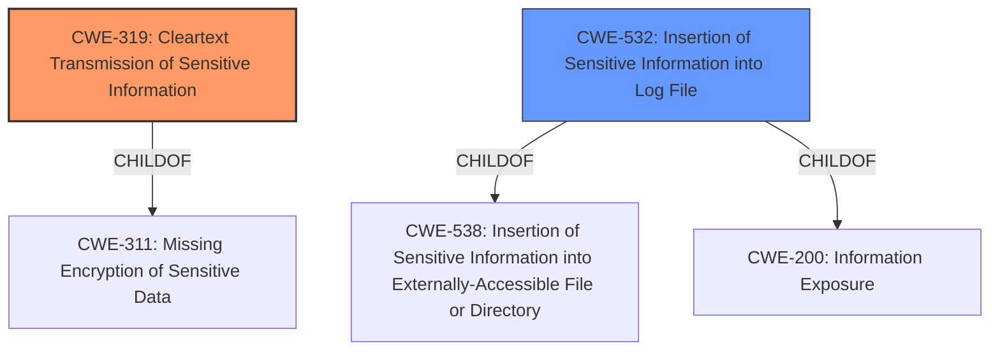

# Analysis for CVE-2021-20410

# Summary
| CWE ID | CWE Name | Confidence | CWE Abstraction Level | CWE Vulnerability Mapping Label | CWE-Vulnerability Mapping Notes |
|---|---|---|---|---|---|
| CWE-319 | Cleartext Transmission of Sensitive Information | 1.0 | Base | Allowed | Primary CWE. The vulnerability explicitly states that user credentials are sent in cleartext. |
| CWE-532 | Insertion of Sensitive Information into Log File | 0.8 | Base | Allowed | Secondary CWE. The CVE Reference Links Content Summary indicates that InfluxDB user and password credentials were included in the logs stack YAML file. |

## Evidence and Confidence

*   **Confidence Score:** 0.9
*   **Evidence Strength:** HIGH

## Relationship Analysis
The primary CWE is CWE-319 **Cleartext Transmission of Sensitive Information**, which is a base level CWE and a child of CWE-311 **Missing Encryption of Sensitive Data**. The secondary CWE is CWE-532 **Insertion of Sensitive Information into Log File**, which is a base level CWE and a child of both CWE-538 **Insertion of Sensitive Information into Externally-Accessible File or Directory** and CWE-200 **Information Exposure**.

## Vulnerability Chain
The vulnerability chain starts with the **sending of user credentials in plain clear text** (CWE-319). Because the credentials were included in the logs stack YAML file, this becomes **insertion of sensitive information into log file** (CWE-532). An authenticated user can then use man in the middle techniques to read this information. The root cause is the **transmission of sensitive information in cleartext**, leading to potential exposure and unauthorized access.

## Summary of Analysis
The initial analysis focused on the **sending user credentials in plain clear text**, which directly corresponds to CWE-319 **Cleartext Transmission of Sensitive Information**. The CVE Reference Links Content Summary reinforces this by stating that InfluxDB credentials were included in the logs stack YAML file, leading to the addition of CWE-532 **Insertion of Sensitive Information into Log File**.

The relationship graph shows that CWE-319 is a child of CWE-311, but CWE-319 is more specific and thus a better fit. Similarly, CWE-532 is a child of CWE-538 and CWE-200, but again, CWE-532 is a more specific description of the vulnerability.

The selection of CWE-319 is based on the explicit statement in the vulnerability description: "IBM Security Verify Information Queue 1.0.6 and 1.0.7 **sends user credentials in plain clear text** which can be read by an authenticated user using man in the middle techniques." The selection of CWE-532 is based on the CVE Reference Links Content Summary: "Root cause of vulnerability: The InfluxDB user and password credentials were included in the logs stack YAML file of IBM Security Verify Information Queue (ISIQ)."

The selected CWEs are at the optimal level of specificity, as they directly address the root cause and the immediate context of the vulnerability. Other CWEs considered, such as CWE-522 **Insufficiently Protected Credentials** and CWE-256 **Plaintext Storage of a Password**, were not as precise in describing the actual mechanism of the vulnerability.

# Enhanced Query for CVE-2021-20410

## Vulnerability Description
IBM Security Verify Information Queue 1.0.6 and 1.0.7 **sends user credentials in plain clear text** which can be read by an authenticated user using man in the middle techniques. IBM X-Force ID 198190.

### Vulnerability Description Key Phrases
- **rootcause:** **sends user credentials in plain clear text**
- **vector:** man in the middle techniques
- **attacker:** authenticated user
- **product:** IBM Security Verify Information Queue
- **version:** 1.0.6 and 1.0.7

## CVE Reference Links Content Summary
- **Root cause of vulnerability:** The InfluxDB user and password credentials were included in the logs stack YAML file of IBM Security Verify Information Queue (ISIQ).
- **Weaknesses/vulnerabilities present:** Exposure of sensitive information (InfluxDB credentials) within the ISIQ configuration files.
- **Impact of exploitation:** Unauthorized access to the InfluxDB instance, potentially leading to data breaches, modification, or denial of service for the logging and monitoring system.
- **Attack vectors:** An attacker could gain access to the YAML configuration file, either through unauthorized access to the system or by exploiting other vulnerabilities to read or download the file.
- **Required attacker capabilities/position:** The attacker needs access to the YAML configuration file containing the InfluxDB credentials. This could be through local access, compromised credentials, or a vulnerability allowing file access.

## Retriever Results

### Top Combined Results

| Rank | CWE ID | Name | Abstraction | Usage  | Retrievers | Individual Scores |
|------|--------|------|-------------|-------|------------|-------------------|
| 1 | 522 | Insufficiently Protected Credentials | Class | Allowed-with-Review | sparse | 0.356 |
| 2 | 319 | Cleartext Transmission of Sensitive Information | Base | Allowed | sparse | 0.348 |
| 3 | 256 | Plaintext Storage of a Password | Base | Allowed | sparse | 0.310 |
| 4 | 532 | Insertion of Sensitive Information into Log File | Base | Allowed | sparse | 0.284 |
| 5 | 311 | Missing Encryption of Sensitive Data | Class | Discouraged | sparse | 0.244 |
| 6 | 649 | Reliance on Obfuscation or Encryption of Security-Relevant Inputs without Integrity Checking | Base | Allowed | dense | 0.550 |
| 7 | 208 | Observable Timing Discrepancy | Base | Allowed | graph | 0.002 |
| 8 | 327 | Use of a Broken or Risky Cryptographic Algorithm | Class | Allowed-with-Review | sparse | 0.242 |
| 9 | 300 | Channel Accessible by Non-Endpoint | Class | Discouraged | sparse | 0.242 |
| 10 | 312 | Cleartext Storage of Sensitive Information | Base | Allowed | sparse | 0.235 |

# Complete CWE Specifications

## CWE-522: Insufficiently Protected Credentials
**Abstraction:** Class
**Status:** Incomplete

### Description
The product transmits or stores authentication credentials, but it uses an insecure method that is susceptible to unauthorized interception and/or retrieval.

### Extended Description
Not provided

### Alternative Terms
None

### Relationships
ChildOf -> CWE-1390
ChildOf -> CWE-287
ChildOf -> CWE-668

### Mapping Guidance
**Usage:** Allowed-with-Review
**Rationale:** This CWE entry is a Class and might have Base-level children that would be more appropriate
**Comments:** Examine children of this entry to see if there is a better fit
**Reasons:**
- Abstraction

### Observed Examples
- **CVE-2022-30018:** A messaging platform serializes all elements of User/Group objects, making private information available to adversaries
- **CVE-2022-29959:** Initialization file contains credentials that can be decoded using a "simple string transformation"
- **CVE-2022-35411:** Python-based RPC framework enables pickle functionality by default, allowing clients to unpickle untrusted data.

## CWE-319: Cleartext Transmission of Sensitive Information
**Abstraction:** Base
**Status:** Draft

### Description
The product transmits sensitive or security-critical data in cleartext in a communication channel that can be sniffed by unauthorized actors.

### Extended Description

Many communication channels can be "sniffed" (monitored) by adversaries during data transmission. For example, in networking, packets can traverse many intermediary nodes from the source to the destination, whether across the internet, an internal network, the cloud, etc. Some actors might have privileged access to a network interface or any link along the channel, such as a router, but they might not be authorized to collect the underlying data. As a result, network traffic could be sniffed by adversaries, spilling security-critical data.

Applicable communication channels are not limited to software products. Applicable channels include hardware-specific technologies such as internal hardware networks and external debug channels, supporting remote JTAG debugging. When mitigations are not applied to combat adversaries within the product's threat model, this weakness significantly lowers the difficulty of exploitation by such adversaries.

When full communications are recorded or logged, such as with a packet dump, an adversary could attempt to obtain the dump long after the transmission has occurred and try to "sniff" the cleartext from the recorded communications in the dump itself. Even if the information is encoded in a way that is not human-readable, certain techniques could determine which encoding is being used, then decode the information. 

### Alternative Terms
None

### Relationships
ChildOf -> CWE-311
ChildOf -> CWE-311

### Mapping Guidance
**Usage:** Allowed
**Rationale:** This CWE entry is at the Base level of abstraction, which is a preferred level of abstraction for mapping to the root causes of vulnerabilities.
**Comments:** Carefully read both the name and description to ensure that this mapping is an appropriate fit. Do not try to 'force' a mapping to a lower-level Base/Variant simply to comply with this preferred level of abstraction.
**Reasons:**
- Acceptable-Use

### Additional Notes
**[Maintenance]** The Taxonomy_Mappings to ISA/IEC 62443 were added in CWE 4.10, but they are still under review and might change in future CWE versions. These draft mappings were performed by members of the "Mapping CWE to 62443" subgroup of the CWE-CAPEC ICS/OT Special Interest Group (SIG), and their work is incomplete as of CWE 4.10. The mappings are included to facilitate discussion and review by the broader ICS/OT community, and they are likely to change in future CWE versions.

### Observed Examples
- **CVE-2022-29519:** Programmable Logic Controller (PLC) sends sensitive information in plaintext, including passwords and session tokens.
- **CVE-2022-30312:** Building Controller uses a protocol that transmits authentication credentials in plaintext.
- **CVE-2022-31204:** Programmable Logic Controller (PLC) sends password in plaintext.

## CWE-256: Plaintext Storage of a Password
**Abstraction:** Base
**Status:** Incomplete

### Description
Storing a password in plaintext may result in a system compromise.

### Extended Description
Password management issues occur when a password is stored in plaintext in an application's properties, configuration file, or memory. Storing a plaintext password in a configuration file allows anyone who can read the file access to the password-protected resource. In some contexts, even storage of a plaintext password in memory is considered a security risk if the password is not cleared immediately after it is used.

### Alternative Terms
None

### Relationships
ChildOf -> CWE-522

### Mapping Guidance
**Usage:** Allowed
**Rationale:** This CWE entry is at the Base level of abstraction, which is a preferred level of abstraction for mapping to the root causes of vulnerabilities.
**Comments:** Carefully read both the name and description to ensure that this mapping is an appropriate fit. Do not try to 'force' a mapping to a lower-level Base/Variant simply to comply with this preferred level of abstraction.
**Reasons:**
- Acceptable-Use

### Observed Examples
- **CVE-2022-30275:** Remote Terminal Unit (RTU) uses a driver that relies on a password stored in plaintext.

## CWE-532: Insertion of Sensitive Information into Log File
**Abstraction:** Base
**Status:** Incomplete

### Description
The product writes sensitive information to a log file.

### Extended Description
Not provided

### Alternative Terms
None

### Relationships
ChildOf -> CWE-538
ChildOf -> CWE-200

### Mapping Guidance
**Usage:** Allowed
**Rationale:** This CWE entry is at the Base level of abstraction, which is a preferred level of abstraction for mapping to the root causes of vulnerabilities.
**Comments:** Carefully read both the name and description to ensure that this mapping is an appropriate fit. Do not try to 'force' a mapping to a lower-level Base/Variant simply to comply with this preferred level of abstraction.
**Reasons:**
- Acceptable-Use

### Observed Examples
- **CVE-2017-9615:** verbose logging stores admin credentials in a world-readable log file
- **CVE-2018-1999036:** SSH password for private key stored in build log

## CWE-311: Missing Encryption of Sensitive Data
**Abstraction:** Class
**Status:** Draft

### Description
The product does not encrypt sensitive or critical information before storage or transmission.

### Extended Description
The lack of proper data encryption passes up the guarantees of confidentiality, integrity, and accountability that properly implemented encryption conveys.

### Alternative Terms
None

### Relationships
ChildOf -> CWE-693

### Mapping Guidance
**Usage:** Discouraged
**Rationale:** CWE-311 is high-level with more precise children available. It is a level-1 Class (i.e., a child of a Pillar).
**Comments:** Consider children CWE-312: Cleartext Storage of Sensitive Information or CWE-319: Cleartext Transmission of Sensitive Information.
**Reasons:**
- Abstraction

### Additional Notes
**[Relationship]** There is an overlapping relationship between insecure storage of sensitive information (CWE-922) and missing encryption of sensitive information (CWE-311). Encryption is often used to prevent an attacker from reading the sensitive data. However, encryption does not prevent the attacker from erasing or overwriting the data.

### Observed Examples
- **CVE-2009-2272:** password and username stored in cleartext in a cookie
- **CVE-2009-1466:** password stored in cleartext in a file with insecure permissions
- **CVE-2009-0152:** chat program disables SSL in some circumstances even when the user says to use SSL.

## CWE-649: Reliance on Obfuscation or Encryption of Security-Relevant Inputs without Integrity Checking
**Abstraction:** Base
**Status:** Incomplete

### Description
The product uses obfuscation or encryption of inputs that should not be mutable by an external actor, but the product does not use integrity checks to detect if those inputs have been modified.

### Extended Description
When an application relies on obfuscation or incorrectly applied / weak encryption to protect client-controllable tokens or parameters, that may have an effect on the user state, system state, or some decision made on the server. Without protecting the tokens/parameters for integrity, the application is vulnerable to an attack where an adversary traverses the space of possible values of the said token/parameter in order to attempt to gain an advantage. The goal of the attacker is to find another admissible value that will somehow elevate their privileges in the system, disclose information or change the behavior of the system in some way beneficial to the attacker. If the application does not protect these critical tokens/parameters for integrity, it will not be able to determine that these values have been tampered with. Measures that are used to protect data for confidentiality should not be relied upon to provide the integrity service.

### Alternative Terms
None

### Relationships
ChildOf -> CWE-345

### Mapping Guidance
**Usage:** Allowed
**Rationale:** This CWE entry is at the Base level of abstraction, which is a preferred level of abstraction for mapping to the root causes of vulnerabilities.
**Comments:** Carefully read both the name and description to ensure that this mapping is an appropriate fit. Do not try to 'force' a mapping to a lower-level Base/Variant simply to comply with this preferred level of abstraction.
**Reasons:**
- Acceptable-Use

### Observed Examples
- **CVE-2005-0039:** An IPSec configuration does not perform integrity checking of the IPSec packet as the result of either not configuring ESP properly to support the integrity service or using AH improperly. In either case, the security gateway receiving the IPSec packet would not validate the integrity of the packet to ensure that it was not changed. Thus if the packets were intercepted the attacker could undetectably change some of the bits in the packets. The meaningful bit flipping was possible due to the known weaknesses in the CBC encryption mode. Since the attacker knew the structure of the packet, they were able (in one variation of the attack) to use bit flipping to change the destination IP of the packet to the destination machine controlled by the attacker. And so the destination security gateway would decrypt the packet and then forward the plaintext to the machine controlled by the attacker. The attacker could then read the original message. For instance if VPN was used with the vulnerable IPSec configuration the attacker could read the victim's e-mail. This vulnerability demonstrates the need to enforce the integrity service properly when critical data could be modified by an attacker. This problem might have also been mitigated by using an encryption mode that is not susceptible to bit flipping attacks, but the preferred mechanism to address this problem still remains message verification for integrity. While this attack focuses on the network layer and requires an entity that controls part of the communication path such as a router, the situation is not much different at the software level, where an attacker can modify tokens/parameters used by the application.

## CWE-208: Observable Timing Discrepancy
**Abstraction:** Base
**Status:** Incomplete

### Description
Two separate operations in a product require different amounts of time to complete, in a way that is observable to an actor and reveals security-relevant information about the state of the product, such as whether a particular operation was successful or not.

### Extended Description
In security-relevant contexts, even small variations in timing can be exploited by attackers to indirectly infer certain details about the product's internal operations. For example, in some cryptographic algorithms, attackers can use timing differences to infer certain properties about a private key, making the key easier to guess. Timing discrepancies effectively form a timing side channel.

### Alternative Terms
None

### Relationships
ChildOf -> CWE-203
CanPrecede -> CWE-385
CanPrecede -> CWE-327

### Mapping Guidance
**Usage:** Allowed
**Rationale:** This CWE entry is at the Base level of abstraction, which is a preferred level of abstraction for mapping to the root causes of vulnerabilities.
**Comments:** Carefully read both the name and description to ensure that this mapping is an appropriate fit. Do not try to 'force' a mapping to a lower-level Base/Variant simply to comply with this preferred level of abstraction.
**Reasons:**
- Acceptable-Use

### Additional Notes
**[Relationship]** Often primary in cryptographic applications and algorithms.

**[Maintenance]** CWE 4.16 removed a demonstrative example for a hardware module because it was inaccurate and unable to be adapted. The CWE team is developing an alternative.

### Observed Examples
- **CVE-2019-10071:** Java-oriented framework compares HMAC signatures using String.equals() instead of a constant-time algorithm, causing timing discrepancies
- **CVE-2019-10482:** Smartphone OS uses comparison functions that are not in constant time, allowing side channels
- **CVE-2014-0984:** Password-checking function in router terminates validation of a password entry when it encounters the first incorrect character, which allows remote attackers to obtain passwords via a brute-force attack that relies on timing differences in responses to incorrect password guesses, aka a timing side-channel attack.

## CWE-327: Use of a Broken or Risky Cryptographic Algorithm
**Abstraction:** Class
**Status:** Draft

### Description
The product uses a broken or risky cryptographic algorithm or protocol.

### Extended Description

Cryptographic algorithms are the methods by which data is scrambled to prevent observation or influence by unauthorized actors. Insecure cryptography can be exploited to expose sensitive information, modify data in unexpected ways, spoof identities of other users or devices, or other impacts.

It is very difficult to produce a secure algorithm, and even high-profile algorithms by accomplished cryptographic experts have been broken. Well-known techniques exist to break or weaken various kinds of cryptography. Accordingly, there are a small number of well-understood and heavily studied algorithms that should be used by most products. Using a non-standard or known-insecure algorithm is dangerous because a determined adversary may be able to break the algorithm and compromise whatever data has been protected.

Since the state of cryptography advances so rapidly, it is common for an algorithm to be considered "unsafe" even if it was once thought to be strong. This can happen when new attacks are discovered, or if computing power increases so much that the cryptographic algorithm no longer provides the amount of protection that was originally thought.

For a number of reasons, this weakness is even more challenging to manage with hardware deployment of cryptographic algorithms as opposed to software implementation. First, if a flaw is discovered with hardware-implemented cryptography, the flaw cannot be fixed in most cases without a recall of the product, because hardware is not easily replaceable like software. Second, because the hardware product is expected to work for years, the adversary's computing power will only increase over time.

### Alternative Terms
None

### Relationships
ChildOf -> CWE-693
PeerOf -> CWE-311

### Mapping Guidance
**Usage:** Allowed-with-Review
**Rationale:** This CWE entry is a Class and might have Base-level children that would be more appropriate
**Comments:** Examine children of this entry to see if there is a better fit
**Reasons:**
- Abstraction

### Additional Notes
**[Maintenance]** Since CWE 4.4, various cryptography-related entries, including CWE-327 and CWE-1240, have been slated for extensive research, analysis, and community consultation to define consistent terminology, improve relationships, and reduce overlap or duplication. As of CWE 4.6, this work is still ongoing.

**[Maintenance]** The Taxonomy_Mappings to ISA/IEC 62443 were added in CWE 4.10, but they are still under review and might change in future CWE versions. These draft mappings were performed by members of the "Mapping CWE to 62443" subgroup of the CWE-CAPEC ICS/OT Special Interest Group (SIG), and their work is incomplete as of CWE 4.10. The mappings are included to facilitate discussion and review by the broader ICS/OT community, and they are likely to change in future CWE versions.

### Observed Examples
- **CVE-2022-30273:** SCADA-based protocol supports a legacy encryption mode that uses Tiny Encryption Algorithm (TEA) in ECB mode, which leaks patterns in messages and cannot protect integrity
- **CVE-2022-30320:** Programmable Logic Controller (PLC) uses a protocol with a cryptographically insecure hashing algorithm for passwords.
- **CVE-2008-3775:** Product uses "ROT-25" to obfuscate the password in the registry.

## CWE-300: Channel Accessible by Non-Endpoint
**Abstraction:** Class
**Status:** Draft

### Description
The product does not adequately verify the identity of actors at both ends of a communication channel, or does not adequately ensure the integrity of the channel, in a way that allows the channel to be accessed or influenced by an actor that is not an endpoint.

### Extended Description
In order to establish secure communication between two parties, it is often important to adequately verify the identity of entities at each end of the communication channel. Inadequate or inconsistent verification may result in insufficient or incorrect identification of either communicating entity. This can have negative consequences such as misplaced trust in the entity at the other end of the channel. An attacker can leverage this by interposing between the communicating entities and masquerading as the original entity. In the absence of sufficient verification of identity, such an attacker can eavesdrop and potentially modify the communication between the original entities.

### Alternative Terms
Adversary-in-the-Middle / AITM
Man-in-the-Middle / MITM
Person-in-the-Middle / PITM
Monkey-in-the-Middle
Monster-in-the-Middle
Manipulator-in-the-Middle
On-path attack
Interception attack

### Relationships
ChildOf -> CWE-923

### Mapping Guidance
**Usage:** Discouraged
**Rationale:** CWE-300 is commonly misused for vulnerabilities in which the prerequisites for exploitation require the adversary to be in a privileged "in-the-middle" position.
**Comments:** Consider root-cause weaknesses that allow adversary-in-the-middle attacks to happen, such as CWEs involving poor integrity protection.
**Reasons:**
- Frequent Misuse

### Additional Notes
**[Maintenance]** The summary identifies multiple distinct possibilities, suggesting that this is a category that must be broken into more specific weaknesses.

### Observed Examples
- **CVE-2014-1266:** chain: incorrect "goto" in Apple SSL product bypasses certificate validation, allowing Adversry-in-the-Middle (AITM) attack (Apple "goto fail" bug). CWE-705 (Incorrect Control Flow Scoping) -> CWE-561 (Dead Code) -> CWE-295 (Improper Certificate Validation) -> CWE-393 (Return of Wrong Status Code) -> CWE-300 (Channel Accessible by Non-Endpoint).

## CWE-312: Cleartext Storage of Sensitive Information
**Abstraction:** Base
**Status:** Draft

### Description
The product stores sensitive information in cleartext within a resource that might be accessible to another control sphere.

### Extended Description

Because the information is stored in cleartext (i.e., unencrypted), attackers could potentially read it. Even if the information is encoded in a way that is not human-readable, certain techniques could determine which encoding is being used, then decode the information.

When organizations adopt cloud services, it can be easier for attackers to access the data from anywhere on the Internet.

In some systems/environments such as cloud, the use of "double encryption" (at both the software and hardware layer) might be required, and the developer might be solely responsible for both layers, instead of shared responsibility with the administrator of the broader system/environment.

### Alternative Terms
None

### Relationships
ChildOf -> CWE-311
ChildOf -> CWE-311
ChildOf -> CWE-922

### Mapping Guidance
**Usage:** Allowed
**Rationale:** This CWE entry is at the Base level of abstraction, which is a preferred level of abstraction for mapping to the root causes of vulnerabilities.
**Comments:** Carefully read both the name and description to ensure that this mapping is an appropriate fit. Do not try to 'force' a mapping to a lower-level Base/Variant simply to comply with this preferred level of abstraction.
**Reasons:**
- Acceptable-Use

### Additional Notes
**[Terminology]** Different people use "cleartext" and "plaintext" to mean the same thing: the lack of encryption. However, within cryptography, these have more precise meanings. Plaintext is the information just before it is fed into a cryptographic algorithm, including already-encrypted text. Cleartext is any information that is unencrypted, although it might be in an encoded form that is not easily human-readable (such as base64 encoding).

### Observed Examples
- **CVE-2022-30275:** Remote Terminal Unit (RTU) uses a driver that relies on a password stored in plaintext.
- **CVE-2009-2272:** password and username stored in cleartext in a cookie
- **CVE-2009-1466:** password stored in cleartext in a file with insecure permissions

