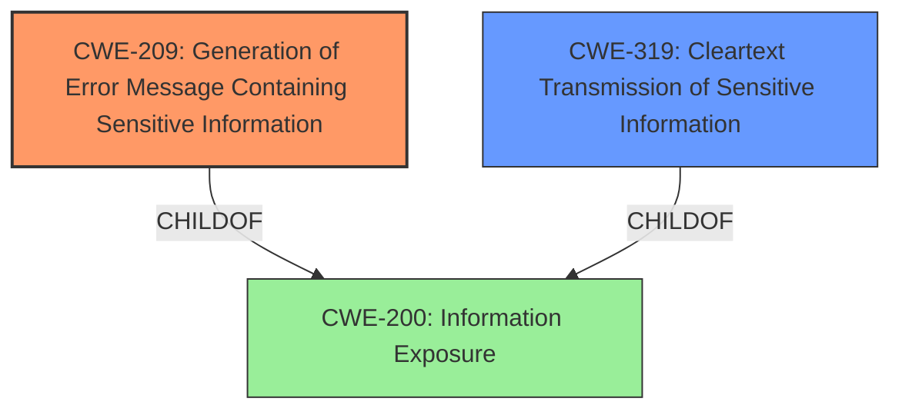

# Raw Analyzer Response for CVE-2021-20413

# Summary
| CWE ID | CWE Name | Confidence | CWE Abstraction Level | CWE Vulnerability Mapping Label | CWE-Vulnerability Mapping Notes |
|---|---|---|---|---|---|
| CWE-209 | Generation of Error Message Containing Sensitive Information | 1.0 | Base | Primary | Allowed |
| CWE-319 | Cleartext Transmission of Sensitive Information | 0.5 | Base | Secondary | Allowed |

## Evidence and Confidence

*   **Confidence Score:** 0.8
*   **Evidence Strength:** HIGH

## Relationship Analysis
The primary CWE, CWE-209 **(Generation of Error Message Containing Sensitive Information)**, is a Base level CWE. This is a child of the Class CWE-200 **(Information Exposure)**. While CWE-319 **(Cleartext Transmission of Sensitive Information)** is also a Base CWE, it is less directly supported by the vulnerability description but included because the error message could be transmitted in clear text.

## Vulnerability Chain
The chain of events starts with a **vulnerability** that leads to the generation of a detailed technical error message. This message contains **sensitive information** that is then exposed to a remote attacker. The attacker can then use this information for further attacks against the system.

## Summary of Analysis
The initial analysis focused on the **impact** of the vulnerability, which is the exposure of **sensitive information**. The vulnerability description states, "IBM Guardium Data Encryption (GDE) 4.0.0.4 could allow a remote attacker to obtain sensitive information when a detailed technical error message is returned in the browser." The CVE Reference Links Content Summary confirms this, stating that the **impact** is "Unspecified, but these vulnerabilities have been fixed in GDE 4.0.0.5".

CWE-209 **(Generation of Error Message Containing Sensitive Information)** is the most appropriate CWE because it directly addresses the root cause of the vulnerability. The description for CWE-209 states: "The product generates an error message that includes sensitive information about its environment, users, or associated data." This aligns perfectly with the vulnerability description. The retriever results also list CWE-209 as the top combined result. The MITRE mapping guidance for CWE-209 allows its use at the Base level of abstraction.

CWE-319 **(Cleartext Transmission of Sensitive Information)** was considered as a secondary CWE because the error message containing sensitive information might be transmitted in clear text. However, the vulnerability description does not explicitly state that the error message is transmitted in clear text, so the confidence in this mapping is lower.

The selected CWEs are at the optimal level of specificity because they accurately represent the weakness and are at the Base level of abstraction, as recommended by MITRE.

Relevant CWE Information:

# Enhanced Context (25 CWEs)
The following CWEs were identified as potentially relevant to this vulnerability:

## CWE-319: Cleartext Transmission of Sensitive Information
**Abstraction Level**: Base
**Similarity Score**: 0.79
**Source**: dense

**Description**:
The product transmits sensitive or security-critical data in cleartext in a communication channel that can be sniffed by unauthorized actors.

**Mapping Guidance**:
- Usage: Allowed
- Rationale: This CWE entry is at the Base level of abstraction, which is a preferred level of abstraction for mapping to the root causes of vulnerabilities.

**Technical Explanation**:
CWE-209 **(Generation of Error Message Containing Sensitive Information)**: This CWE accurately captures the vulnerability where the system generates error messages that expose sensitive details. The security implication is potential unauthorized access to sensitive information, which an attacker could leverage for further malicious activities. This is the primary weakness.

CWE-319 **(Cleartext Transmission of Sensitive Information)**: This CWE is considered as a secondary weakness because the error message containing sensitive data could potentially be transmitted in cleartext, making it susceptible to interception. The security implication is that an attacker could eavesdrop on the communication channel and obtain the sensitive information. This is a potential, but not explicitly stated, aspect of the vulnerability.