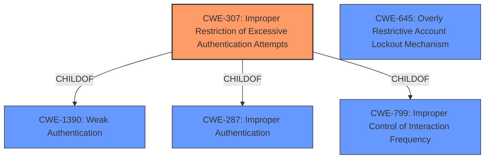

# Analysis for CVE-2021-20415

# Summary
| CWE ID | CWE Name | Confidence | CWE Abstraction Level | CWE Vulnerability Mapping Label | CWE-Vulnerability Mapping Notes |
|---|---|---|---|---|---|
| CWE-307 | Improper Restriction of Excessive Authentication Attempts | 1.0 | Base | Allowed | Primary CWE |
| CWE-799 | Improper Control of Interaction Frequency | 0.5 | Class | Allowed-with-Review | Secondary Candidate |
| CWE-645 | Overly Restrictive Account Lockout Mechanism | 0.3 | Base | Allowed | Secondary Candidate |

## Evidence and Confidence

*   **Confidence Score:** 0.8
*   **Evidence Strength:** HIGH

## Relationship Analysis
The primary CWE, CWE-307, is a Base-level weakness that is a child of both CWE-1390 (Weak Authentication) and CWE-287 (Improper Authentication), indicating it's a specific type of authentication failure. It's also a child of CWE-799, which is a class level weakness. CWE-645 is a peer of CWE-307, as they both fall under the umbrella of authentication issues, but CWE-645 describes an overly restrictive lockout, the opposite of CWE-307.

## Vulnerability Chain
The vulnerability chain starts with an **inadequate account lockout setting** (CWE-307), which leads to the possibility of a brute-force attack on account credentials. The root cause is the insufficient restriction on authentication attempts, and the impact is the potential compromise of accounts.

## Summary of Analysis
The vulnerability description clearly states an **inadequate account lockout setting**, which allows for brute-force attacks.

The primary selection is CWE-307 (Improper Restriction of Excessive Authentication Attempts). The description of CWE-307 directly aligns with the vulnerability: "The product does not implement sufficient measures to prevent multiple failed authentication attempts within a short time frame." The evidence from the **Vulnerability Description Key Phrases** section states that the **rootcause** is an **inadequate account lockout setting**, which leads to the **impact** of a brute force account credentials attack, directly supporting this choice. The Confidence score is 1.0.

CWE-799 (Improper Control of Interaction Frequency) was considered because it broadly covers cases where the frequency of interactions is not properly limited. While applicable, it is a Class-level CWE and less specific than CWE-307. Therefore, it is a secondary candidate with a lower confidence score of 0.5.

CWE-645 (Overly Restrictive Account Lockout Mechanism) was also considered. However, the vulnerability description specifies an **inadequate** lockout, which is the opposite of an overly restrictive lockout. Thus, it is not a good fit, but is included as a secondary candidate. Confidence score of 0.3.

The selected CWEs are at the optimal level of specificity because CWE-307 directly addresses the **inadequate account lockout setting**, and it is a Base-level CWE.
Relevant CWE Information:

# Enhanced Context (25 CWEs)
The following CWEs were identified as potentially relevant to this vulnerability:

## CWE-799: Improper Control of Interaction Frequency
**Abstraction Level**: Class
**Similarity Score**: 0.80
**Source**: dense

**Description**:
The product does not properly limit the number or frequency of interactions that it has with an actor, such as the number of incoming requests.

**Mapping Guidance**:
- Usage: Allowed-with-Review
- Rationale: This CWE entry is a Class and might have Base-level children that would be more appropriate

## CWE-307: Improper Restriction of Excessive Authentication Attempts
**Abstraction Level**: Base
**Similarity Score**: 0.77
**Source**: dense

**Description**:
The product does not implement sufficient measures to prevent multiple failed authentication attempts within a short time frame.

**Mapping Guidance**:
- Usage: Allowed
- Rationale: This CWE entry is at the Base level of abstraction, which is a preferred level of abstraction for mapping to the root causes of vulnerabilities.

## CWE-807: Reliance on Untrusted Inputs in a Security Decision
**Abstraction Level**: Base
**Similarity Score**: 0.77
**Source**: dense

**Description**:
The product uses a protection mechanism that relies on the existence or values of an input, but the input can be modified by an untrusted actor in a way that bypasses the protection mechanism.

**Mapping Guidance**:
- Usage: Allowed
- Rationale: This CWE entry is at the Base level of abstraction, which is a preferred level of abstraction for mapping to the root causes of vulnerabilities.

## CWE-1391: Use of Weak Credentials
**Abstraction Level**: Class
**Similarity Score**: 0.77
**Source**: dense

**Description**:
The product uses weak credentials (such as a default key or hard-coded password) that can be calculated, derived, reused, or guessed by an attacker.

**Mapping Guidance**:
- Usage: Allowed-with-Review
- Rationale: This CWE entry is a Class and might have Base-level children that would be more appropriate

## CWE-208: Observable Timing Discrepancy
**Abstraction Level**: Base
**Similarity Score**: 0.76
**Source**: dense

**Description**:
Two separate operations in a product require different amounts of time to complete, in a way that is observable to an actor and reveals security-relevant information about the state of the product, such as whether a particular operation was successful or not.

**Mapping Guidance**:
- Usage: Allowed
- Rationale: This CWE entry is at the Base level of abstraction, which is a preferred level of abstraction for mapping to the root causes of vulnerabilities.

## CWE-668: Exposure of Resource to Wrong Sphere
**Abstraction Level**: Class
**Similarity Score**: 0.76
**Source**: dense

**Description**:
The product exposes a resource to the wrong control sphere, providing unintended actors with inappropriate access to the resource.

**Mapping Guidance**:
- Usage: Discouraged
- Rationale: CWE-668 is high-level and is often misused as a catch-all when lower-level CWE IDs might be applicable. It is sometimes used for low-information vulnerability reports [REF-1287]. It is a level-1 Class (i.e., a child of a Pillar). It is not useful for trend analysis.

## CWE-330: Use of Insufficiently Random Values
**Abstraction Level**: Class
**Similarity Score**: 0.75
**Source**: dense

**Description**:
The product uses insufficiently random numbers or values in a security context that depends on unpredictable numbers.

**Mapping Guidance**:
- Usage: Discouraged
- Rationale: This CWE entry is a level-1 Class (i.e., a child of a Pillar). It might have lower-level children that would be more appropriate

## CWE-203: Observable Discrepancy
**Abstraction Level**: Base
**Similarity Score**: 0.75
**Source**: dense

**Description**:
The product behaves differently or sends different responses under different circumstances in a way that is observable to an unauthorized actor, which exposes security-relevant information about the state of the product, such as whether a particular operation was successful or not.

**Mapping Guidance**:
- Usage: Allowed
- Rationale: This CWE entry is at the Base level of abstraction, which is a preferred level of abstraction for mapping to the root causes of vulnerabilities.

## CWE-345: Insufficient Verification of Data Authenticity
**Abstraction Level**: Class
**Similarity Score**: 0.75
**Source**: dense

**Description**:
The product does not sufficiently verify the origin or authenticity of data, in a way that causes it to accept invalid data.

**Mapping Guidance**:
- Usage: Discouraged
- Rationale: This CWE entry is a level-1 Class (i.e., a child of a Pillar). It might have lower-level children that would be more appropriate

## CWE-1390: Weak Authentication
**Abstraction Level**: Class
**Similarity Score**: 0.75
**Source**: dense

**Description**:
The product uses an