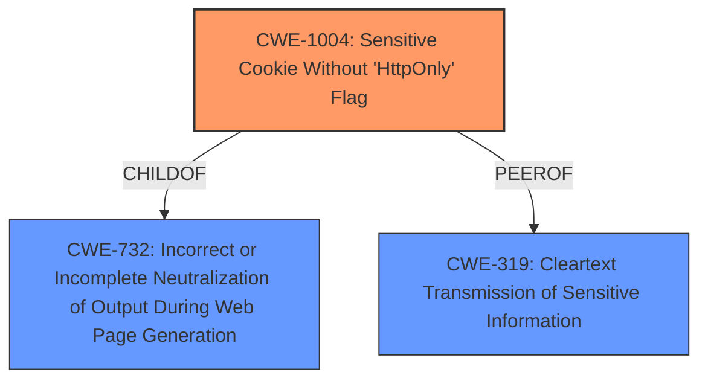

# Analysis for CVE-2021-20416

# Summary
| CWE ID   | CWE Name                                          | Confidence | CWE Abstraction Level | CWE Vulnerability Mapping Label | CWE-Vulnerability Mapping Notes |
| :-------- | :------------------------------------------------ | :--------- | :-------------------- | :------------------------------ | :------------------------------ |
| CWE-1004 | Sensitive Cookie Without 'HttpOnly' Flag          | 1.0        | Variant               | Primary                         | Allowed                       |
| CWE-319  | Cleartext Transmission of Sensitive Information | 0.7        | Base                  | Secondary                       | Allowed                       |

## Evidence and Confidence

*   **Confidence Score:** 0.9
*   **Evidence Strength:** HIGH

## Relationship Analysis
The primary CWE, CWE-1004 (Sensitive Cookie Without 'HttpOnly' Flag), is a Variant of CWE-732 (Incorrect or Incomplete продукта Neutralization of выходные данные During Web Page Generation). The vulnerability description clearly states the **failure to set the HTTPOnly flag**, which directly aligns with CWE-1004. While CWE-319 (Cleartext Transmission of Sensitive Information) is a broader category, it is related because the absence of the HTTPOnly flag can lead to sensitive cookie data being exposed in transmission.

## Vulnerability Chain
The vulnerability chain starts with the **failure to set the HTTPOnly flag** (CWE-1004). This **weakness** allows a remote attacker to potentially obtain sensitive information from the cookie. The absence of the HTTPOnly flag doesn't guarantee cleartext transmission, but it increases the risk, potentially leading to CWE-319 if the cookie's content is then transmitted without proper encryption.

## Summary of Analysis
The initial analysis identified CWE-1004 as the most appropriate CWE due to the explicit mention of the **failure to set the HTTPOnly flag** in the vulnerability description. The retriever results also listed CWE-1004 as the top candidate. Further examination of the CWE specifications confirmed that CWE-1004 accurately represents the **root cause** of the vulnerability.

The graph relationships show that CWE-1004 is a variant of CWE-732, indicating a more specific type of output neutralization issue. This specificity further supports the choice of CWE-1004. The secondary consideration, CWE-319, is related because the unprotected cookie could potentially be transmitted in cleartext, but the primary **weakness** is the missing flag.

The final decision is based on the clear evidence from the vulnerability description, the retriever results, and the CWE specifications, which all point to CWE-1004 as the most accurate and specific representation of the vulnerability. The choice of CWE-1004 is at the optimal level of specificity as it directly addresses the missing HTTPOnly flag, which is the **root cause** of the potential information disclosure.

Relevant CWE Information:

# Enhanced Context (25 CWEs)
The following CWEs were identified as potentially relevant to this vulnerability:

## CWE-1391: Use of Weak Credentials
**Abstraction Level**: Class
**Similarity Score**: 0.77
**Source**: dense

**Description**:
The product uses weak credentials (such as a default key or hard-coded password) that can be calculated, derived, reused, or guessed by an attacker.

**Mapping Guidance**:
- Usage: Allowed-with-Review
- Rationale: This CWE entry is a Class and might have Base-level children that would be more appropriate

## CWE-807: Reliance on Untrusted Inputs in a Security Decision
**Abstraction Level**: Base
**Similarity Score**: 0.77
**Source**: dense

**Description**:
The product uses a protection mechanism that relies on the existence or values of an input, but the input can be modified by an untrusted actor in a way that bypasses the protection mechanism.

**Mapping Guidance**:
- Usage: Allowed
- Rationale: This CWE entry is at the Base level of abstraction, which is a preferred level of abstraction for mapping to the root causes of vulnerabilities.

## CWE-307: Improper Restriction of Excessive Authentication Attempts
**Abstraction Level**: Base
**Similarity Score**: 0.77
**Source**: dense

**Description**:
The product does not implement sufficient measures to prevent multiple failed authentication attempts within a short time frame.

**Mapping Guidance**:
- Usage: Allowed
- Rationale: This CWE entry is at the Base level of abstraction, which is a preferred level of abstraction for mapping to the root causes of vulnerabilities.

## CWE-345: Insufficient Verification of Data Authenticity
**Abstraction Level**: Class
**Similarity Score**: 0.76
**Source**: dense

**Description**:
The product does not sufficiently verify the origin or authenticity of data, in a way that causes it to accept invalid data.

**Mapping Guidance**:
- Usage: Discouraged
- Rationale: This CWE entry is a level-1 Class (i.e., a child of a Pillar). It might have lower-level children that would be more appropriate

## CWE-319: Cleartext Transmission of Sensitive Information
**Abstraction Level**: Base
**Similarity Score**: 0.76
**Source**: dense

**Description**:
The product transmits sensitive or security-critical data in cleartext in a communication channel that can be sniffed by unauthorized actors.

**Mapping Guidance**:
- Usage: Allowed
- Rationale: This CWE entry is at the Base level of abstraction, which is a preferred level of abstraction for mapping to the root causes of vulnerabilities.

## CWE-303: Incorrect Implementation of Authentication Algorithm
**Abstraction Level**: Base
**Similarity Score**: 0.76
**Source**: dense

**Description**:
The requirements for the product dictate the use of an established authentication algorithm, but the implementation of the algorithm is incorrect.

**Mapping Guidance**:
- Usage: Allowed
- Rationale: This CWE entry is at the Base level of abstraction, which is a preferred level of abstraction for mapping to the root causes of vulnerabilities.

## CWE-203: Observable Discrepancy
**Abstraction Level**: Base
**Similarity Score**: 0.76
**Source**: dense

**Description**:
The product behaves differently or sends different responses under different circumstances in a way that is observable to an unauthorized actor, which exposes security-relevant information about the state of the product, such as whether a particular operation was successful or not.

**Mapping Guidance**:
- Usage: Allowed
- Rationale: This CWE entry is at the Base level of abstraction, which is a preferred level of abstraction for mapping to the root causes of vulnerabilities.

## CWE-330: Use of Insufficiently Random Values
**Abstraction Level**: Class
**Similarity Score**: 0.76
**Source**: dense

**Description**:
The product uses insufficiently random numbers or values in a security context that depends on unpredictable numbers.

**Mapping Guidance**:
- Usage: Discouraged
- Rationale: This CWE entry is a level-1 Class (i.e., a child of a Pillar). It might have lower-level children that would be more appropriate

## CWE-668: Exposure of Resource to Wrong Sphere
**Abstraction Level**: Class
**Similarity Score**: 0.76
**Source**: dense

**Description**:
The product exposes a resource to the wrong control sphere, providing unintended actors with inappropriate access to the resource.

**Mapping Guidance**:
- Usage: Discouraged
- Rationale: CWE-668 is high-level and is often misused as a catch-all when lower-level CWE IDs might be applicable. It is sometimes used for low-information vulnerability reports [REF-1287]. It is a level-1 Class (i.e., a child of a Pillar). It is not useful for trend analysis.

## CWE-799: Improper Control of Interaction Frequency
**Abstraction Level**: Class
**Similarity Score**: 0.76
**Source**: dense

**Description**:
The product does not properly limit the number or frequency of interactions that it has with an actor, such as the number of incoming requests.

**Mapping Guidance**:
- Usage: Allowed-with-Review
- Rationale: This CWE entry is a Class and might have Base-level children that would be more appropriate

## CWE-327: Use of a Broken or Risky Cryptographic Algorithm
**Abstraction Level**: class
**Similarity Score**: 5028.68
**Source**: sparse

**Description**:
The product uses a broken or risky cryptographic algorithm or protocol.

**Mapping Guidance**:
- Usage: Allowed-with-Review
- Rationale: This CWE entry is a Class