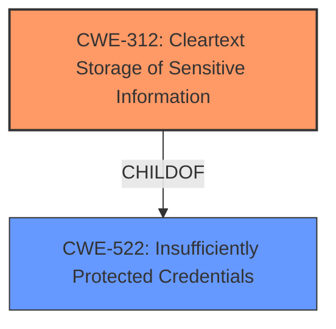

# Enhanced Analysis for CVE-2021-20445

# Summary
| CWE ID | CWE Name | Confidence | CWE Abstraction Level | CWE Vulnerability Mapping Label | CWE-Vulnerability Mapping Notes |
|---|---|---|---|---|---|
| CWE-312 | Cleartext Storage of Sensitive Information | 0.9 | Base | Allowed | Primary CWE. The vulnerability stems from the **insecure storage of authentication credentials** due to the autocomplete HTML attribute not being disabled for password fields. |
| CWE-522 | Insufficiently Protected Credentials | 0.7 | Class | Allowed-with-Review | Secondary CWE. The **insecure storage of authentication credentials** makes them insufficiently protected. |

## Evidence and Confidence

*   **Confidence Score:** 0.9
*   **Evidence Strength:** HIGH

## Relationship Analysis
The primary CWE is CWE-312, which is a Base level CWE. CWE-522, Insufficiently Protected Credentials, is a Class level CWE and a parent of more specific Base level CWEs which include CWE-312. The hierarchical relationship influenced my decision to select CWE-312 as the primary because it is more specific.



## Vulnerability Chain
The vulnerability chain starts with the **insecure storage of authentication credentials** due to the autocomplete HTML attribute not being disabled for password fields, leading to the potential bypass of authentication mechanisms.

## Summary of Analysis
The initial assessment points to **insecure storage of authentication credentials** as the root cause, aligning with CWE-312 (Cleartext Storage of Sensitive Information). The evidence from "CVE Reference Links Content Summary" states "The autocomplete HTML attribute is not disabled for password fields in the Maximo Data Loader," which directly supports this. The retriever results also list CWE-312 with a high similarity score.

I considered other CWEs such as CWE-522 (Insufficiently Protected Credentials) and CWE-922 (Insecure Storage of Sensitive Information), but ultimately decided that CWE-312 is the most accurate because it specifies the **cleartext storage** aspect, whereas the others are more general.

The selection of CWE-312 is at the optimal level of specificity because it directly addresses the root cause identified in the vulnerability description: the **insecure storage of authentication credentials** in cleartext.

Relevant CWE Information:

# Enhanced Context (25 CWEs)

## CWE-312: Cleartext Storage of Sensitive Information
**Abstraction Level**: Base
**Similarity Score**: 0.79
**Source**: dense

**Description**:
The product stores sensitive information in cleartext within a resource that might be accessible to another control sphere.

**Mapping Guidance**:
- Usage: Allowed
- Rationale: This CWE entry is at the Base level of abstraction, which is a preferred level of abstraction for mapping to the root causes of vulnerabilities.

**Observed Examples**:
- None

The vulnerability is described as **insecure storage of authentication credentials**. The "CVE Reference Links Content Summary" indicates the root cause is that "The autocomplete HTML attribute is not disabled for password fields in the Maximo Data Loader." This aligns with CWE-312 since the browser can store the password in cleartext if autocomplete is enabled.

## CWE-522: Insufficiently Protected Credentials
**Abstraction:** Class
**Status:** Incomplete

### Description
The product transmits or stores authentication credentials, but it uses an insecure method that is susceptible to unauthorized interception and/or retrieval.

### Extended Description
Not provided

### Alternative Terms
None

### Relationships
ChildOf -> CWE-1390
ChildOf -> CWE-287
ChildOf -> CWE-668

### Mapping Guidance
**Usage:** Allowed-with-Review
**Rationale:** This CWE entry is a Class and might have Base-level children that would be more appropriate
**Comments:** Examine children of this entry to see if there is a better fit
**Reasons:**
- Abstraction

### Observed Examples
- None

The **insecure storage of authentication credentials** makes them insufficiently protected. I am selecting it as a secondary CWE because it is less specific than CWE-312, which identifies the **cleartext storage** aspect.

## CWE-311: Missing Encryption of Sensitive Data
**Abstraction:** Class
**Similarity Score**: 0.78
**Source**: dense

**Description**:
The product does not encrypt sensitive or critical information before storage or transmission.

**Mapping Guidance**:
- Usage: Discouraged
- Rationale: CWE-311 is high-level with more precise children available. It is a level-1 Class (i.e., a child of a Pillar).

I am not selecting CWE-311 because the problem isn't necessarily the *lack* of encryption, but the **insecure storage of credentials**. This can be true even with encryption enabled, so it isn't the root cause.

## CWE-922: Insecure Storage of Sensitive Information
**Abstraction:** Class
**Similarity Score**: 0.76
**Source**: dense

**Description**:
The product stores sensitive information without properly limiting read or write access by unauthorized actors.

**Mapping Guidance**:
- Usage: Allowed-with-Review
- Rationale: This CWE entry is a Class and might have Base-level children that would be more appropriate

I am not selecting CWE-922 because it's a more general description of insecure storage, and CWE-312 provides a more specific description of **cleartext storage**.


## CWE Relationship Analysis

Current CWEs represent these abstraction levels: .


### Vulnerability Chain Analysis

**Chain starting from CWE-312:**
- 312 (Cleartext Storage of Sensitive Information) - ROOT


**Chain starting from CWE-311:**
- 311 (Missing Encryption of Sensitive Data) - ROOT


### CWE Relationship Diagram

```mermaid
graph TD
    classDef primary fill:#f96,stroke:#333,stroke-width:2px
    classDef secondary fill:#69f,stroke:#333
    classDef tertiary fill:#9e9,stroke:#333
```