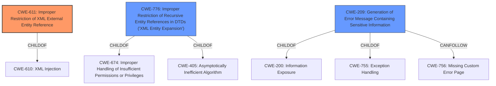

# Analysis for CVE-2021-20453

# Summary
| CWE ID  | CWE Name                                                     | Confidence | CWE Abstraction Level | CWE Vulnerability Mapping Label | CWE-Vulnerability Mapping Notes |
| :-------- | :----------------------------------------------------------- | :--------- | :---------------------- | :------------------------------ | :------------------------------ |
| CWE-611 | Improper Restriction of XML External Entity Reference        | 1          | Base                    | Allowed                         | Primary CWE                     |
| CWE-776 | Improper Restriction of Recursive Entity References in DTDs ('XML Entity Expansion') | 0.6          | Base                    | Allowed                         | Secondary Candidate |
| CWE-209 | Generation of Error Message Containing Sensitive Information | 0.4          | Base                    | Allowed                         | Secondary Candidate                     |

## Evidence and Confidence

*   **Confidence Score:** 0.9
*   **Evidence Strength:** HIGH

## Relationship Analysis
The primary CWE, CWE-611 (Improper Restriction of XML External Entity Reference), is a base-level CWE which is a child of CWE-610. CWE-776 (Improper Restriction of Recursive Entity References in DTDs ('XML Entity Expansion')) is related as a potential denial-of-service attack vector related to XML processing. CWE-209 (Generation of Error Message Containing Sensitive Information) can occur if the application echoes back the data read from the external entity, exposing file contents in an error message. The selection of CWE-611 is based on the direct evidence of XXE vulnerability.

## Vulnerability Chain
The vulnerability chain starts with the **weakness:** **XML external entity injection**. The chain of events is as follows:
1.  The application fails to properly restrict XML external entities (XXE).
2.  A remote attacker exploits this **weakness** by injecting malicious XML data.
3.  The application processes the malicious XML, leading to the inclusion of external entities.
4.  This results in the **impact:** exposing sensitive information or consuming memory resources.

Here, the root cause is the improper restriction of XML external entities, and the impact is the exposure of sensitive information or denial of service due to resource consumption.

## Summary of Analysis
The initial analysis correctly identifies CWE-611 as the primary CWE for the XXE vulnerability. The analysis is based on the evidence from the vulnerability description, which explicitly mentions "XML External Entity Injection (XXE) attack". The key phrase "**weakness:** **XML external entity injection**" directly supports this classification.

The graph relationships influenced the selection by providing context on how the vulnerability can be chained with other CWEs, such as CWE-209 (Generation of Error Message Containing Sensitive Information), if sensitive data is exposed in error messages.

The selected CWE is at the optimal level of specificity (Base) because it directly addresses the root cause of the vulnerability.

Relevant CWE Information:

# Enhanced Context (25 CWEs)
The following CWEs were identified as potentially relevant to this vulnerability:

## CWE-312: Cleartext Storage of Sensitive Information
**Abstraction Level**: Base
**Similarity Score**: 0.80

## CWE-319: Cleartext Transmission of Sensitive Information
**Abstraction Level**: Base
**Similarity Score**: 0.78

## CWE-311: Missing Encryption of Sensitive Data
**Abstraction Level**: Class
**Similarity Score**: 0.77

## CWE-1391: Use of Weak Credentials
**Abstraction Level**: Class
**Similarity Score**: 0.77

## CWE-538: Insertion of Sensitive Information into Externally-Accessible File or Directory
**Abstraction Level**: Base
**Similarity Score**: 0.77

## CWE-668: Exposure of Resource to Wrong Sphere
**Abstraction Level**: Class
**Similarity Score**: 0.76

## CWE-345: Insufficient Verification of Data Authenticity
**Abstraction Level**: Class
**Similarity Score**: 0.76

## CWE-212: Improper Removal of Sensitive Information Before Storage or Transfer
**Abstraction Level**: Base
**Similarity Score**: 0.76

## CWE-807: Reliance on Untrusted Inputs in a Security Decision
**Abstraction Level**: Base
**Similarity Score**: 0.76

## CWE-209: Generation of Error Message Containing Sensitive Information
**Abstraction Level**: Base
**Similarity Score**: 0.76

## CWE-611: Improper Restriction of XML External Entity Reference
**Abstraction Level**: Base
**Similarity Score**: 5433.07

## CWE-327: Use of a Broken or Risky Cryptographic Algorithm
**Abstraction Level**: Class
**Similarity Score**: 4986.90

## CWE-319: Cleartext Transmission of Sensitive Information
**Abstraction Level**: Base
**Similarity Score**: 4952.71

## CWE-209: Generation of Error Message Containing Sensitive Information
**Abstraction Level**: Base
**Similarity Score**: 4893.20

## CWE-776: Improper Restriction of Recursive Entity References in DTDs ('XML Entity Expansion')
**Abstraction Level**: Base
**Similarity Score**: 4887.26

## CWE-756: Missing Custom Error Page
**Abstraction Level**: base
**Similarity Score**: 4.33

## CWE-22: Improper Limitation of a Pathname to a Restricted Directory ('Path Traversal')
**Abstraction Level**: base
**Similarity Score**: 3.89

## CWE-611: Improper Restriction of XML External Entity Reference
**Abstraction Level**: base
**Similarity Score**: 3.64

## CWE-441: Unintended Proxy or Intermediary ('Confused Deputy')
**Abstraction Level**: class
**Similarity Score**: 2.98

## CWE-770: Allocation of Resources Without Limits or Throttling
**Abstraction Level**: base
**Similarity Score**: 2.95

## CWE-209: Generation of Error Message Containing Sensitive Information
**Abstraction Level**: Base
**Similarity Score**: 2.90

## CWE-73: External Control of File Name or Path
**Abstraction Level**: base
**Similarity Score**: 2.87

## CWE-208: Observable Timing Discrepancy
**Abstraction Level**: base
**Similarity Score**: 2.73

## CWE-499: Serializable Class Containing Sensitive Data
**Abstraction Level**: variant
**Similarity Score**: 2.68

## CWE-498: Cloneable Class Containing Sensitive Information
**Abstraction Level**: variant
**Similarity Score**: 2.68

CWE-611 (Improper Restriction of XML External Entity Reference) is selected as the primary CWE because the vulnerability description clearly states that it is an XXE vulnerability, and the provided information aligns directly with the description and characteristics of CWE-611. The impact of the vulnerability includes exposing sensitive information and consuming memory resources, which are typical consequences of XXE attacks. The high retriever score and the primary match in "CWE for similar CVE Descriptions" further support this selection.

CWE-776 (Improper Restriction of Recursive Entity References in DTDs ('XML Entity Expansion')) is considered as a secondary CWE because XXE vulnerabilities can sometimes be exploited to cause denial-of-service through XML entity expansion. If the application doesn't properly restrict recursive entity references, an attacker can define entities that refer to each other, leading to exponential expansion and resource exhaustion. While this is a potential impact, it is not the primary characteristic of the described vulnerability, hence it is a secondary consideration.

CWE-209 (Generation of Error Message Containing Sensitive Information) is considered as another secondary CWE. If the vulnerable application exposes sensitive information via

# Enhanced Query for CVE-2021-20453

## Vulnerability Description
IBM WebSphere Application Server 8.0, 8.5, and 9.0 is vulnerable to a XML External Entity Injection (XXE) attack when processing XML data. A remote attacker could exploit this vulnerability to expose sensitive information or consume memory resources. IBM X-Force ID 196648.

### Vulnerability Description Key Phrases
- **weakness:** **XML external entity injection**
- **impact:** expose sensitive information and consume memory resources
- **attacker:** remote attacker
- **product:** IBM WebSphere Application Server
- **version:** 8.0, 8.5, and 9.0

### CWE for similar CVE Descriptions
### Primary CWE Match
CWE-611

#### Top CWEs
- CWE-611 (Count: 67)
- CWE-770 (Count: 1)
- CWE-NVD-noinfo (Count: 1)

## CVE Reference Links Content Summary
- **Root cause of vulnerability:** The vulnerability is due to an XML External Entity (XXE) Injection in WebSphere Application Server.
- **Weaknesses/vulnerabilities present:** The software is vulnerable to XXE Injection.
- **Impact of exploitation:** The provided document does not elaborate on the impact beyond stating it is an XXE vulnerability.
- **Attack vectors:** The document does not specify the attack vector beyond the fact that it is an XXE vulnerability.
- **Required attacker capabilities/position:** The document does not provide information about the attacker's required capabilities or position.

The provided content is a security bulletin from IBM which confirms the existence of an XXE vulnerability in WebSphere Application Server and provides remediation guidance. It is more descriptive than the provided CVE description as it includes a list of affected products and versions.

## Retriever Results

### Top Combined Results

| Rank | CWE ID | Name | Abstraction | Usage  | Retrievers | Individual Scores |
|------|--------|------|-------------|-------|------------|-------------------|
| 1 | 611 | Improper Restriction of XML External Entity Reference | Base | Allowed | sparse | 0.425 |
| 2 | 776 | Improper Restriction of Recursive Entity References in DTDs ('XML Entity Expansion') | Base | Allowed | sparse | 0.246 |
| 3 | 90 | Improper Neutralization of Special Elements used in an LDAP Query ('LDAP Injection') | Base | Allowed | sparse | 0.233 |
| 4 | 522 | Insufficiently Protected Credentials | Class | Allowed-with-Review | sparse | 0.230 |
| 5 | 209 | Generation of Error Message Containing Sensitive Information | Base | Allowed | sparse | 0.224 |
| 6 | 8 | J2EE Misconfiguration: Entity Bean Declared Remote | Variant | Allowed | dense | 0.606 |
| 7 | 756 | Missing Custom Error Page | Base | Allowed | graph | 0.002 |
| 8 | 327 | Use of a Broken or Risky Cryptographic Algorithm | Class | Allowed-with-Review | sparse | 0.221 |
| 9 | 319 | Cleartext Transmission of Sensitive Information | Base | Allowed | sparse | 0.219 |
| 10 | 256 | Plaintext Storage of a Password | Base | Allowed | sparse | 0.216 |

# Complete CWE Specifications

## CWE-611: Improper Restriction of XML External Entity Reference
**Abstraction:** Base
**Status:** Draft

### Description
The product processes an XML document that can contain XML entities with URIs that resolve to documents outside of the intended sphere of control, causing the product to embed incorrect documents into its output.

### Extended Description

XML documents optionally contain a Document Type Definition (DTD), which, among other features, enables the definition of XML entities. It is possible to define an entity by providing a substitution string in the form of a URI. The XML parser can access the contents of this URI and embed these contents back into the XML document for further processing.

By submitting an XML file that defines an external entity with a file:// URI, an attacker can cause the processing application to read the contents of a local file. For example, a URI such as "file:///c:/winnt/win.ini" designates (in Windows) the file C:\Winnt\win.ini, or file:///etc/passwd designates the password file in Unix-based systems. Using URIs with other schemes such as http://, the attacker can force the application to make outgoing requests to servers that the attacker cannot reach directly, which can be used to bypass firewall restrictions or hide the source of attacks such as port scanning.

Once the content of the URI is read, it is fed back into the application that is processing the XML. This application may echo back the data (e.g. in an error message), thereby exposing the file contents.

### Alternative Terms
XXE: An acronym used for the term "XML eXternal Entities"

### Relationships
ChildOf -> CWE-610
ChildOf -> CWE-610
PeerOf -> CWE-441

### Mapping Guidance
**Usage:** Allowed
**Rationale:** This CWE entry is at the Base level of abstraction, which is a preferred level of abstraction for mapping to the root causes of vulnerabilities.
**Comments:** Carefully read both the name and description to ensure that this mapping is an appropriate fit. Do not try to 'force' a mapping to a lower-level Base/Variant simply to comply with this preferred level of abstraction.
**Reasons:**
- Acceptable-Use

### Additional Notes
**[Relationship]** CWE-918 (SSRF) and CWE-611 (XXE) are closely related, because they both involve web-related technologies and can launch outbound requests to unexpected destinations. However, XXE can be performed client-side, or in other contexts in which the software is not acting directly as a server, so the "Server" portion of the SSRF acronym does not necessarily apply.

### Observed Examples
- **CVE-2022-42745:** Recruiter software allows reading arbitrary files using XXE
- **CVE-2005-1306:** A browser control can allow remote attackers to determine the existence of files via Javascript containing XML script.
- **CVE-2012-5656:** XXE during SVG image conversion

## CWE-776: Improper Restriction of Recursive Entity References in DTDs ('XML Entity Expansion')
**Abstraction:** Base
**Status:** Draft

### Description
The product uses XML documents and allows their structure to be defined with a Document Type Definition (DTD), but it does not properly control the number of recursive definitions of entities.

### Extended Description
If the DTD contains a large number of nested or recursive entities, this can lead to explosive growth of data when parsed, causing a denial of service.

### Alternative Terms
XEE: XEE is the acronym commonly used for XML Entity Expansion.
Billion Laughs Attack
XML Bomb: While the "XML Bomb" term was used in the early years of knowledge of this issue, the XEE term seems to be more commonly used.

### Relationships
ChildOf -> CWE-674
ChildOf -> CWE-674
ChildOf -> CWE-405

### Mapping Guidance
**Usage:** Allowed
**Rationale:** This CWE entry is at the Base level of abstraction, which is a preferred level of abstraction for mapping to the root causes of vulnerabilities.
**Comments:** Carefully read both the name and description to ensure that this mapping is an appropriate fit. Do not try to 'force' a mapping to a lower-level Base/Variant simply to comply with this preferred level of abstraction.
**Reasons:**
- Acceptable-Use

### Observed Examples
- **CVE-2008-3281:** XEE in XML-parsing library.
- **CVE-2011-3288:** XML bomb / XEE in enterprise communication product.
- **CVE-2011-1755:** "Billion laughs" attack in XMPP server daemon.

## CWE-90: Improper Neutralization of Special Elements used in an LDAP Query ('LDAP Injection')
**Abstraction:** Base
**Status:** Draft

### Description
The product constructs all or part of an LDAP query using externally-influenced input from an upstream component, but it does not neutralize or incorrectly neutralizes special elements that could modify the intended LDAP query when it is sent to a downstream component.

### Extended Description
Not provided

### Alternative Terms
None

### Relationships
ChildOf -> CWE-943

### Mapping Guidance
**Usage:** Allowed
**Rationale:** This CWE entry is at the Base level of abstraction, which is a preferred level of abstraction for mapping to the root causes of vulnerabilities.
**Comments:** Carefully read both the name and description to ensure that this mapping is an appropriate fit. Do not try to 'force' a mapping to a lower-level Base/Variant simply to comply with this preferred level of abstraction.
**Reasons:**
- Acceptable-Use

### Additional Notes
**[Relationship]** Factors: resultant to special character mismanagement, MAID, or denylist/allowlist problems. Can be primary to authentication and verification errors.

### Observed Examples
- **CVE-2021-41232:** Chain: authentication routine in Go-based agile development product does not escape user name (CWE-116), allowing LDAP injection (CWE-90)
- **CVE-2005-2301:** Server does not properly escape LDAP queries, which allows remote attackers to cause a DoS and possibly conduct an LDAP injection attack.

## CWE-522: Insufficiently Protected Credentials
**Abstraction:** Class
**Status:** Incomplete

### Description
The product transmits or stores authentication credentials, but it uses an insecure method that is susceptible to unauthorized interception and/or retrieval.

### Extended Description
Not provided

### Alternative Terms
None

### Relationships
ChildOf -> CWE-1390
ChildOf -> CWE-287
ChildOf -> CWE-668

### Mapping Guidance
**Usage:** Allowed-with-Review
**Rationale:** This CWE entry is a Class and might have Base-level children that would be more appropriate
**Comments:** Examine children of this entry to see if there is a better fit
**Reasons:**
- Abstraction

### Observed Examples
- **CVE-2022-30018:** A messaging platform serializes all elements of User/Group objects, making private information available to adversaries
- **CVE-2022-29959:** Initialization file contains credentials that can be decoded using a "simple string transformation"
- **CVE-2022-35411:** Python-based RPC framework enables pickle functionality by default, allowing clients to unpickle untrusted data.

## CWE-209: Generation of Error Message Containing Sensitive Information
**Abstraction:** Base
**Status:** Draft

### Description
The product generates an error message that includes sensitive information about its environment, users, or associated data.

### Extended Description

The sensitive information may be valuable information on its own (such as a password), or it may be useful for launching other, more serious attacks. The error message may be created in different ways:

  - self-generated: the source code explicitly constructs the error message and delivers it

  - externally-generated: the external environment, such as a language interpreter, handles the error and constructs its own message, whose contents are not under direct control by the programmer

An attacker may use the contents of error messages to help launch another, more focused attack. For example, an attempt to exploit a path traversal weakness (CWE-22) might yield the full pathname of the installed application. In turn, this could be used to select the proper number of ".." sequences to navigate to the targeted file. An attack using SQL injection (CWE-89) might not initially succeed, but an error message could reveal the malformed query, which would expose query logic and possibly even passwords or other sensitive information used within the query.

### Alternative Terms
None

### Relationships
ChildOf -> CWE-200
ChildOf -> CWE-200
ChildOf -> CWE-755

### Mapping Guidance
**Usage:** Allowed
**Rationale:** This CWE entry is at the Base level of abstraction, which is a preferred level of abstraction for mapping to the root causes of vulnerabilities.
**Comments:** Carefully read both the name and description to ensure that this mapping is an appropriate fit. Do not try to 'force' a mapping to a lower-level Base/Variant simply to comply with this preferred level of abstraction.
**Reasons:**
- Acceptable-Use

### Observed Examples
- **CVE-2008-2049:** POP3 server reveals a password in an error message after multiple APOP commands are sent. Might be resultant from another weakness.
- **CVE-2007-5172:** Program reveals password in error message if attacker can trigger certain database errors.
- **CVE-2008-4638:** Composite: application running with high privileges (CWE-250) allows user to specify a restricted file to process, which generates a parsing error that leaks the contents of the file (CWE-209).

## CWE-8: J2EE Misconfiguration: Entity Bean Declared Remote
**Abstraction:** Variant
**Status:** Incomplete

### Description
When an application exposes a remote interface for an entity bean, it might also expose methods that get or set the bean's data. These methods could be leveraged to read sensitive information, or to change data in ways that violate the application's expectations, potentially leading to other vulnerabilities.

### Extended Description
Not provided

### Alternative Terms
None

### Relationships
ChildOf -> CWE-668

### Mapping Guidance
**Usage:** Allowed
**Rationale:** This CWE entry is at the Variant level of abstraction, which is a preferred level of abstraction for mapping to the root causes of vulnerabilities.
**Comments:** Carefully read both the name and description to ensure that this mapping is an appropriate fit. Do not try to 'force' a mapping to a lower-level Base/Variant simply to comply with this preferred level of abstraction.
**Reasons:**
- Acceptable-Use

### Additional Notes
**[Other]** Entity beans that expose a remote interface become part of an application's attack surface. For performance reasons, an application should rarely use remote entity beans, so there is a good chance that a remote entity bean declaration is an error.

## CWE-756: Missing Custom Error Page
**Abstraction:** Base
**Status:** Incomplete

### Description
The product does not return custom error pages to the user, possibly exposing sensitive information.

### Extended Description
Not provided

### Alternative Terms
None

### Relationships
ChildOf -> CWE-755
CanPrecede -> CWE-209

### Mapping Guidance
**Usage:** Allowed
**Rationale:** This CWE entry is at the Base level of abstraction, which is a preferred level of abstraction for mapping to the root causes of vulnerabilities.
**Comments:** Carefully read both the name and description to ensure that this mapping is an appropriate fit. Do not try to 'force' a mapping to a lower-level Base/Variant simply to comply with this preferred level of abstraction.
**Reasons:**
- Acceptable-Use

## CWE-327: Use of a Broken or Risky Cryptographic Algorithm
**Abstraction:** Class
**Status:** Draft

### Description
The product uses a broken or risky cryptographic algorithm or protocol.

### Extended Description

Cryptographic algorithms are the methods by which data is scrambled to prevent observation or influence by unauthorized actors. Insecure cryptography can be exploited to expose sensitive information, modify data in unexpected ways, spoof identities of other users or devices, or other impacts.

It is very difficult to produce a secure algorithm, and even high-profile algorithms by accomplished cryptographic experts have been broken. Well-known techniques exist to break or weaken various kinds of cryptography. Accordingly, there are a small number of well-understood and heavily studied algorithms that should be used by most products. Using a non-standard or known-insecure algorithm is dangerous because a determined adversary may be able to break the algorithm and compromise whatever data has been protected.

Since the state of cryptography advances so rapidly, it is common for an algorithm to be considered "unsafe" even if it was once thought to be strong. This can happen when new attacks are discovered, or if computing power increases so much that the cryptographic algorithm no longer provides the amount of protection that was originally thought.

For a number of reasons, this weakness is even more challenging to manage with hardware deployment of cryptographic algorithms as opposed to software implementation. First, if a flaw is discovered with hardware-implemented cryptography, the flaw cannot be fixed in most cases without a recall of the product, because hardware is not easily replaceable like software. Second, because the hardware product is expected to work for years, the adversary's computing power will only increase over time.

### Alternative Terms
None

### Relationships
ChildOf -> CWE-693
PeerOf -> CWE-311

### Mapping Guidance
**Usage:** Allowed-with-Review
**Rationale:** This CWE entry is a Class and might have Base-level children that would be more appropriate
**Comments:** Examine children of this entry to see if there is a better fit
**Reasons:**
- Abstraction

### Additional Notes
**[Maintenance]** Since CWE 4.4, various cryptography-related entries, including CWE-327 and CWE-1240, have been slated for extensive research, analysis, and community consultation to define consistent terminology, improve relationships, and reduce overlap or duplication. As of CWE 4.6, this work is still ongoing.

**[Maintenance]** The Taxonomy_Mappings to ISA/IEC 62443 were added in CWE 4.10, but they are still under review and might change in future CWE versions. These draft mappings were performed by members of the "Mapping CWE to 62443" subgroup of the CWE-CAPEC ICS/OT Special Interest Group (SIG), and their work is incomplete as of CWE 4.10. The mappings are included to facilitate discussion and review by the broader ICS/OT community, and they are likely to change in future CWE versions.

### Observed Examples
- **CVE-2022-30273:** SCADA-based protocol supports a legacy encryption mode that uses Tiny Encryption Algorithm (TEA) in ECB mode, which leaks patterns in messages and cannot protect integrity
- **CVE-2022-30320:** Programmable Logic Controller (PLC) uses a protocol with a cryptographically insecure hashing algorithm for passwords.
- **CVE-2008-3775:** Product uses "ROT-25" to obfuscate the password in the registry.

## CWE-319: Cleartext Transmission of Sensitive Information
**Abstraction:** Base
**Status:** Draft

### Description
The product transmits sensitive or security-critical data in cleartext in a communication channel that can be sniffed by unauthorized actors.

### Extended Description

Many communication channels can be "sniffed" (monitored) by adversaries during data transmission. For example, in networking, packets can traverse many intermediary nodes from the source to the destination, whether across the internet, an internal network, the cloud, etc. Some actors might have privileged access to a network interface or any link along the channel, such as a router, but they might not be authorized to collect the underlying data. As a result, network traffic could be sniffed by adversaries, spilling security-critical data.

Applicable communication channels are not limited to software products. Applicable channels include hardware-specific technologies such as internal hardware networks and external debug channels, supporting remote JTAG debugging. When mitigations are not applied to combat adversaries within the product's threat model, this weakness significantly lowers the difficulty of exploitation by such adversaries.

When full communications are recorded or logged, such as with a packet dump, an adversary could attempt to obtain the dump long after the transmission has occurred and try to "sniff" the cleartext from the recorded communications in the dump itself. Even if the information is encoded in a way that is not human-readable, certain techniques could determine which encoding is being used, then decode the information. 

### Alternative Terms
None

### Relationships
ChildOf -> CWE-311
ChildOf -> CWE-311

### Mapping Guidance
**Usage:** Allowed
**Rationale:** This CWE entry is at the Base level of abstraction, which is a preferred level of abstraction for mapping to the root causes of vulnerabilities.
**Comments:** Carefully read both the name and description to ensure that this mapping is an appropriate fit. Do not try to 'force' a mapping to a lower-level Base/Variant simply to comply with this preferred level of abstraction.
**Reasons:**
- Acceptable-Use

### Additional Notes
**[Maintenance]** The Taxonomy_Mappings to ISA/IEC 62443 were added in CWE 4.10, but they are still under review and might change in future CWE versions. These draft mappings were performed by members of the "Mapping CWE to 62443" subgroup of the CWE-CAPEC ICS/OT Special Interest Group (SIG), and their work is incomplete as of CWE 4.10. The mappings are included to facilitate discussion and review by the broader ICS/OT community, and they are likely to change in future CWE versions.

### Observed Examples
- **CVE-2022-29519:** Programmable Logic Controller (PLC) sends sensitive information in plaintext, including passwords and session tokens.
- **CVE-2022-30312:** Building Controller uses a protocol that transmits authentication credentials in plaintext.
- **CVE-2022-31204:** Programmable Logic Controller (PLC) sends password in plaintext.

## CWE-256: Plaintext Storage of a Password
**Abstraction:** Base
**Status:** Incomplete

### Description
Storing a password in plaintext may result in a system compromise.

### Extended Description
Password management issues occur when a password is stored in plaintext in an application's properties, configuration file, or memory. Storing a plaintext password in a configuration file allows anyone who can read the file access to the password-protected resource. In some contexts, even storage of a plaintext password in memory is considered a security risk if the password is not cleared immediately after it is used.

### Alternative Terms
None

### Relationships
ChildOf -> CWE-522

### Mapping Guidance
**Usage:** Allowed
**Rationale:** This CWE entry is at the Base level of abstraction, which is a preferred level of abstraction for mapping to the root causes of vulnerabilities.
**Comments:** Carefully read both the name and description to ensure that this mapping is an appropriate fit. Do not try to 'force' a mapping to a lower-level Base/Variant simply to comply with this preferred level of abstraction.
**Reasons:**
- Acceptable-Use

### Observed Examples
- **CVE-2022-30275:** Remote Terminal Unit (RTU) uses a driver that relies on a password stored in plaintext.

