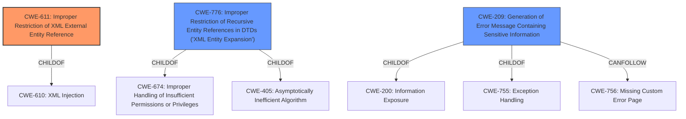

# Analysis Report for CVE-2021-20453

# Vulnerability Analysis Report: CVE-2021-20453

## Description


## Analysis (with Relationship Data)

# Summary
| CWE ID  | CWE Name                                                     | Confidence | CWE Abstraction Level | CWE Vulnerability Mapping Label | CWE-Vulnerability Mapping Notes |
| :-------- | :----------------------------------------------------------- | :--------- | :---------------------- | :------------------------------ | :------------------------------ |
| CWE-611 | Improper Restriction of XML External Entity Reference        | 1          | Base                    | Allowed                         | Primary CWE                     |
| CWE-776 | Improper Restriction of Recursive Entity References in DTDs ('XML Entity Expansion') | 0.6          | Base                    | Allowed                         | Secondary Candidate |
| CWE-209 | Generation of Error Message Containing Sensitive Information | 0.4          | Base                    | Allowed                         | Secondary Candidate                     |

## Evidence and Confidence

*   **Confidence Score:** 0.9
*   **Evidence Strength:** HIGH

## Relationship Analysis
The primary CWE, CWE-611 (Improper Restriction of XML External Entity Reference), is a base-level CWE which is a child of CWE-610. CWE-776 (Improper Restriction of Recursive Entity References in DTDs ('XML Entity Expansion')) is related as a potential denial-of-service attack vector related to XML processing. CWE-209 (Generation of Error Message Containing Sensitive Information) can occur if the application echoes back the data read from the external entity, exposing file contents in an error message. The selection of CWE-611 is based on the direct evidence of XXE vulnerability.



## Vulnerability Chain
The vulnerability chain starts with the **weakness:** **XML external entity injection**. The chain of events is as follows:
1.  The application fails to properly restrict XML external entities (XXE).
2.  A remote attacker exploits this **weakness** by injecting malicious XML data.
3.  The application processes the malicious XML, leading to the inclusion of external entities.
4.  This results in the **impact:** exposing sensitive information or consuming memory resources.

Here, the root cause is the improper restriction of XML external entities, and the impact is the exposure of sensitive information or denial of service due to resource consumption.

## Summary of Analysis
The initial analysis correctly identifies CWE-611 as the primary CWE for the XXE vulnerability. The analysis is based on the evidence from the vulnerability description, which explicitly mentions "XML External Entity Injection (XXE) attack". The key phrase "**weakness:** **XML external entity injection**" directly supports this classification.

The graph relationships influenced the selection by providing context on how the vulnerability can be chained with other CWEs, such as CWE-209 (Generation of Error Message Containing Sensitive Information), if sensitive data is exposed in error messages.

The selected CWE is at the optimal level of specificity (Base) because it directly addresses the root cause of the vulnerability.

Relevant CWE Information:

# Enhanced Context (25 CWEs)
The following CWEs were identified as potentially relevant to this vulnerability:

## CWE-312: Cleartext Storage of Sensitive Information
**Abstraction Level**: Base
**Similarity Score**: 0.80

## CWE-319: Cleartext Transmission of Sensitive Information
**Abstraction Level**: Base
**Similarity Score**: 0.78

## CWE-311: Missing Encryption of Sensitive Data
**Abstraction Level**: Class
**Similarity Score**: 0.77

## CWE-1391: Use of Weak Credentials
**Abstraction Level**: Class
**Similarity Score**: 0.77

## CWE-538: Insertion of Sensitive Information into Externally-Accessible File or Directory
**Abstraction Level**: Base
**Similarity Score**: 0.77

## CWE-668: Exposure of Resource to Wrong Sphere
**Abstraction Level**: Class
**Similarity Score**: 0.76

## CWE-345: Insufficient Verification of Data Authenticity
**Abstraction Level**: Class
**Similarity Score**: 0.76

## CWE-212: Improper Removal of Sensitive Information Before Storage or Transfer
**Abstraction Level**: Base
**Similarity Score**: 0.76

## CWE-807: Reliance on Untrusted Inputs in a Security Decision
**Abstraction Level**: Base
**Similarity Score**: 0.76

## CWE-209: Generation of Error Message Containing Sensitive Information
**Abstraction Level**: Base
**Similarity Score**: 0.76

## CWE-611: Improper Restriction of XML External Entity Reference
**Abstraction Level**: Base
**Similarity Score**: 5433.07

## CWE-327: Use of a Broken or Risky Cryptographic Algorithm
**Abstraction Level**: Class
**Similarity Score**: 4986.90

## CWE-319: Cleartext Transmission of Sensitive Information
**Abstraction Level**: Base
**Similarity Score**: 4952.71

## CWE-209: Generation of Error Message Containing Sensitive Information
**Abstraction Level**: Base
**Similarity Score**: 4893.20

## CWE-776: Improper Restriction of Recursive Entity References in DTDs ('XML Entity Expansion')
**Abstraction Level**: Base
**Similarity Score**: 4887.26

## CWE-756: Missing Custom Error Page
**Abstraction Level**: base
**Similarity Score**: 4.33

## CWE-22: Improper Limitation of a Pathname to a Restricted Directory ('Path Traversal')
**Abstraction Level**: base
**Similarity Score**: 3.89

## CWE-611: Improper Restriction of XML External Entity Reference
**Abstraction Level**: base
**Similarity Score**: 3.64

## CWE-441: Unintended Proxy or Intermediary ('Confused Deputy')
**Abstraction Level**: class
**Similarity Score**: 2.98

## CWE-770: Allocation of Resources Without Limits or Throttling
**Abstraction Level**: base
**Similarity Score**: 2.95

## CWE-209: Generation of Error Message Containing Sensitive Information
**Abstraction Level**: Base
**Similarity Score**: 2.90

## CWE-73: External Control of File Name or Path
**Abstraction Level**: base
**Similarity Score**: 2.87

## CWE-208: Observable Timing Discrepancy
**Abstraction Level**: base
**Similarity Score**: 2.73

## CWE-499: Serializable Class Containing Sensitive Data
**Abstraction Level**: variant
**Similarity Score**: 2.68

## CWE-498: Cloneable Class Containing Sensitive Information
**Abstraction Level**: variant
**Similarity Score**: 2.68

CWE-611 (Improper Restriction of XML External Entity Reference) is selected as the primary CWE because the vulnerability description clearly states that it is an XXE vulnerability, and the provided information aligns directly with the description and characteristics of CWE-611. The impact of the vulnerability includes exposing sensitive information and consuming memory resources, which are typical consequences of XXE attacks. The high retriever score and the primary match in "CWE for similar CVE Descriptions" further support this selection.

CWE-776 (Improper Restriction of Recursive Entity References in DTDs ('XML Entity Expansion')) is considered as a secondary CWE because XXE vulnerabilities can sometimes be exploited to cause denial-of-service through XML entity expansion. If the application doesn't properly restrict recursive entity references, an attacker can define entities that refer to each other, leading to exponential expansion and resource exhaustion. While this is a potential impact, it is not the primary characteristic of the described vulnerability, hence it is a secondary consideration.

CWE-209 (Generation of Error Message Containing Sensitive Information) is considered as another secondary CWE. If the vulnerable application exposes sensitive information via


## CWE Relationship Analysis

Current CWEs represent these abstraction levels: .


### Vulnerability Chain Analysis

**Chain starting from CWE-311:**
- 311 (Missing Encryption of Sensitive Data) - ROOT


**Chain starting from CWE-441:**
- 441 (Unintended Proxy or Intermediary ('Confused Deputy')) - ROOT


### CWE Relationship Diagram

```mermaid
graph TD
    classDef primary fill:#f96,stroke:#333,stroke-width:2px
    classDef secondary fill:#69f,stroke:#333
    classDef tertiary fill:#9e9,stroke:#333
```


*Report generated on 2025-04-02 02:16:51*
