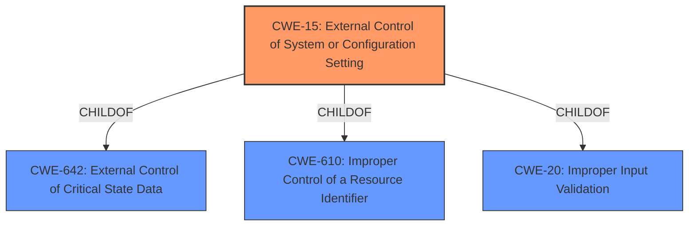

# Enhanced Analysis for CVE-2021-20461

# Summary
| CWE ID  | CWE Name                                                            | Confidence | CWE Abstraction Level | CWE Vulnerability Mapping Label | CWE-Vulnerability Mapping Notes |
| :-------- | :------------------------------------------------------------------ | :--------- | :---------------------- | :------------------------------ | :------------------------------ |
| CWE-15   | External Control of System or Configuration Setting                | 0.85       | Base                    | Allowed                         | Primary CWE                     |

## Evidence and Confidence

*   **Confidence Score:** 0.85
*   **Evidence Strength:** HIGH

## Relationship Analysis
The primary CWE selected is CWE-15, which is a Base level CWE. This is appropriate because the vulnerability involves a **weakness in the implementation of the System Appearance configuration setting**. CWE-15 is a child of CWE-642, CWE-610, and CWE-20. The relationships indicate that external control of configuration settings can stem from various sources like improper control of resource identifiers or general improper input validation. The base level of abstraction of CWE-15 is the most appropriate in this scenario.



## Vulnerability Chain
The vulnerability chain starts with a **weakness in the implementation of the System Appearance configuration setting**, leading to a bypass of business logic and the ability to modify the application's appearance and behavior.

## Summary of Analysis
The initial analysis identified the vulnerability as a **weakness in the implementation of the System Appearance configuration setting** which leads to an attacker bypassing business logic to modify the appearance and behavior of the application. The **root cause** is the **weakness in the implementation of the System Appearance configuration setting**.

The evidence supporting this assessment is:

*   Vulnerability Description Key Phrases: "**rootcause:** **weakness in the implementation of the System Appearance configuration setting**" and "**impact:** bypass business logic to modify the appearance and behavior of the application"
*   CVE Reference Links Content Summary: "A vulnerability exists in IBM Cognos Analytics versions 11.0 and 11.1 which are incorporated into multiple NetApp products." and "The vulnerability allows for the addition or modification of data"

Based on this evidence, the most appropriate CWE is CWE-15: External Control of System or Configuration Setting. This CWE accurately reflects the vulnerability's **root cause**, where an attacker can externally control system settings, leading to unintended behavior.

The other CWEs considered were not as specific. CWE-327: Use of a Broken or Risky Cryptographic Algorithm is not relevant because the vulnerability doesn't involve cryptography. CWE-1004: Sensitive Cookie Without 'HttpOnly' Flag is not applicable as it deals with cookies and the 'HttpOnly' flag. CWE-522: Insufficiently Protected Credentials is not relevant because the vulnerability does not involve credentials. CWE-732: Incorrect Permission Assignment for Critical Resource is not relevant because the vulnerability is not about incorrect permission assignments.

The selection of CWE-15 is at the optimal level of specificity because it directly addresses the **root cause**: a **weakness in the implementation of the System Appearance configuration setting** that allows external control.


## CWE Relationship Analysis

Current CWEs represent these abstraction levels: .


### Vulnerability Chain Analysis

**Chain starting from CWE-732:**
- 732 (Incorrect Permission Assignment for Critical Resource) - ROOT


**Chain starting from CWE-15:**
- 15 (External Control of System or Configuration Setting) - ROOT


### CWE Relationship Diagram

```mermaid
graph TD
    classDef primary fill:#f96,stroke:#333,stroke-width:2px
    classDef secondary fill:#69f,stroke:#333
    classDef tertiary fill:#9e9,stroke:#333
```