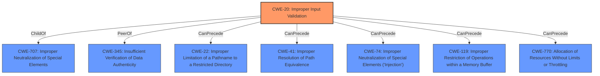

# Analysis Report for CVE-2021-20496

# Vulnerability Analysis Report: CVE-2021-20496

## Description


## Analysis (with Relationship Data)

# Summary
| CWE ID | CWE Name | Confidence | CWE Abstraction Level | CWE Vulnerability Mapping Label | CWE-Vulnerability Mapping Notes |
|---|---|---|---|---|---|
| CWE-20 | Improper Input Validation | 0.8 | Class | Discouraged | The vulnerability description explicitly states "**improper input validation**". While this is a Class-level CWE and generally discouraged, it accurately reflects the provided information. |

## Evidence and Confidence

*   **Confidence Score:** 0.8
*   **Evidence Strength:** MEDIUM

## Relationship Analysis
The primary relationship to consider is that CWE-20 is a Class-level CWE, and MITRE discourages its use when more specific Base or Variant level CWEs are available. The provided information is limited, making it difficult to pinpoint a more specific CWE.



## Vulnerability Chain
The vulnerability chain is simple: **improper input validation** leads to the ability to bypass input validation.

## Summary of Analysis
The analysis is heavily based on the provided evidence, which explicitly states "**improper input validation**". While CWE-20 is a discouraged Class-level CWE, the lack of specific details prevents selection of a more precise Base or Variant.

The relationship graph highlights that CWE-20 can precede several other CWEs, but without further information, it's impossible to determine which of these (if any) are relevant.

CWE-20 is selected because the vulnerability description specifically uses the term "**improper input validation**." The provided context doesn't allow for a more specific classification.


## CWE Relationship Analysis

Current CWEs represent these abstraction levels: .


### Vulnerability Chain Analysis

**Chain starting from CWE-41:**
- 41 (Improper Resolution of Path Equivalence) - ROOT


**Chain starting from CWE-770:**
- 770 (Allocation of Resources Without Limits or Throttling) - ROOT


### CWE Relationship Diagram

```mermaid
graph TD
    classDef primary fill:#f96,stroke:#333,stroke-width:2px
    classDef secondary fill:#69f,stroke:#333
    classDef tertiary fill:#9e9,stroke:#333
```


*Report generated on 2025-04-01 17:40:49*
