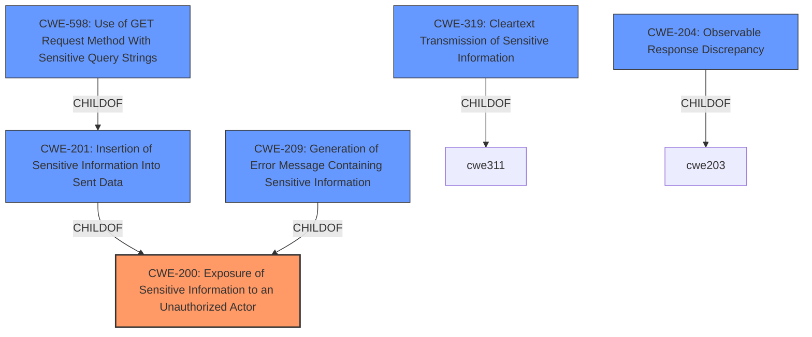

# Raw Analyzer Response for CVE-2021-20498

# Summary
| CWE ID | CWE Name | Confidence | CWE Abstraction Level | CWE Vulnerability Mapping Label | CWE-Vulnerability Mapping Notes |
|---|---|---|---|---|---|
| CWE-200 | Exposure of Sensitive Information to an Unauthorized Actor | 0.9 | Class | Primary | Discouraged, but selected because it's the best fit given the limited information. |

## Evidence and Confidence

*   **Confidence Score:** 0.9
*   **Evidence Strength:** LOW

## Relationship Analysis
The primary CWE identified is CWE-200, which is a Class-level CWE. Although it is generally discouraged, in this case, it seems most fitting due to the limited information available about the vulnerability. Other considered CWEs, like CWE-201, CWE-209, CWE-598, CWE-319, and CWE-204 are children or related to CWE-200, but they require more specific details about how the information is exposed, which are not provided in the description.

## Vulnerability Chain
The chain of events is as follows:
1.  The IBM Security Verify Access Docker 10.0.0 reveals version information in HTTP requests (**ROOT CAUSE**).
2.  This leads to **information disclosure** (**IMPACT**), which could be used in further attacks against the system.

## Summary of Analysis
The initial assessment strongly points to **CWE-200 (Exposure of Sensitive Information to an Unauthorized Actor)**. The vulnerability description explicitly mentions that the product reveals version information, which constitutes sensitive information. The description key phrases also highlight "**information disclosure**" as a **weakness**. The provided content does not contain CVE reference link content summary.

Although CWE-200 is generally discouraged due to its broad nature, the lack of specific details in the vulnerability description makes it the most appropriate choice. We don't know *how* the information is exposed, only that it *is* exposed. Therefore, choosing a more specific CWE like CWE-201, CWE-209, or CWE-319 would be speculative without further evidence.

Relevant CWE Information:
- **CWE-200 (Exposure of Sensitive Information to an Unauthorized Actor)**: The vulnerability's details align with this CWE's characteristics, as it involves exposing sensitive information (version information) to unauthorized actors via HTTP requests. The security implication is that attackers could use this information for further attacks against the system.

### Alternatives Considered and Rejected

*   **CWE-201 (Insertion of Sensitive Information Into Sent Data)**: While this CWE is related to sending sensitive information, it's more specific and requires knowing that the information is explicitly inserted into the sent data. The description doesn't provide this level of detail.
*   **CWE-209 (Generation of Error Message Containing Sensitive Information)**: This CWE is relevant when sensitive information is exposed through error messages. However, the vulnerability description doesn't mention anything about error messages.
*   **CWE-598 (Use of GET Request Method With Sensitive Query Strings)**: This CWE is specific to sensitive information being passed in GET requests. The description doesn't specify the HTTP method used, so this CWE is not appropriate.
*   **CWE-319 (Cleartext Transmission of Sensitive Information)**: This CWE relates to transmitting sensitive information in cleartext. The description doesn't mention whether the information is transmitted in cleartext, so this CWE is not appropriate.
*   **CWE-204 (Observable Response Discrepancy)**: This CWE relates to different responses revealing internal state. While the version information being revealed could be seen as a response, it doesn't quite fit the description of differing responses, making CWE-200 a better fit.

The decision to use CWE-200 is based on the available evidence, even though it is a higher-level class. More specific CWEs could be considered if more details were available.