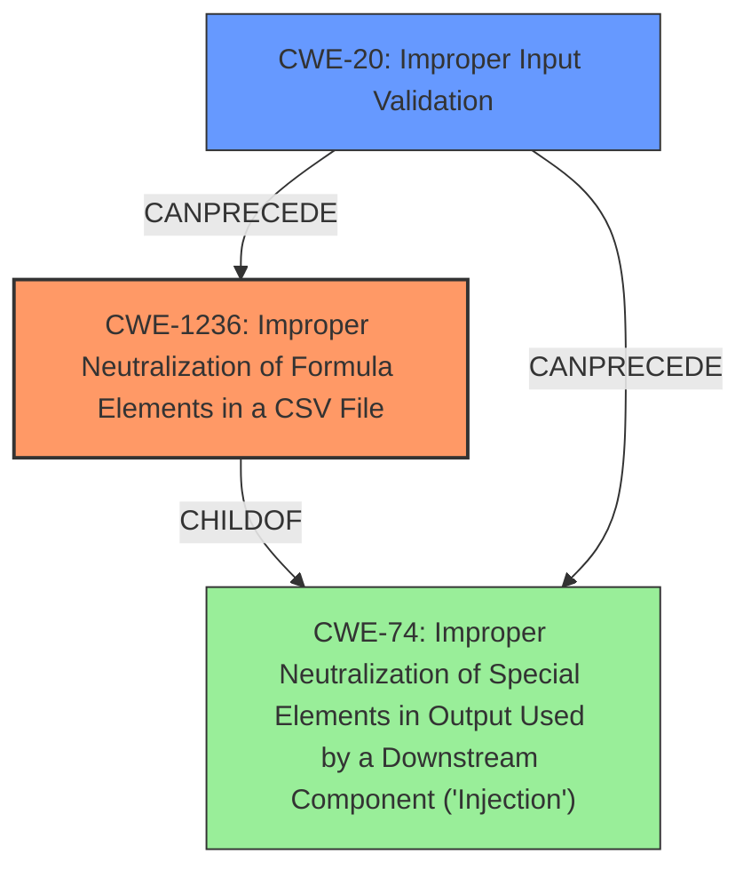

# Raw Analyzer Response for CVE-2021-20509

# Summary
| CWE ID    | CWE Name                                                                        | Confidence | CWE Abstraction Level | CWE Vulnerability Mapping Label | CWE-Vulnerability Mapping Notes |
| :-------- | :------------------------------------------------------------------------------ | :--------- | :---------------------- | :------------------------------ | :------------------------------ |
| CWE-1236  | Improper Neutralization of Formula Elements in a CSV File                      | 1.0        | Base                    | Primary CWE                     | Allowed                       |
| CWE-20    | Improper Input Validation                                                        | 0.5        | Class                   | Secondary Candidate             | Discouraged                    |

## Evidence and Confidence

*   **Confidence Score:** 0.8
*   **Evidence Strength:** HIGH

## Relationship Analysis
The primary CWE, CWE-1236, is a base-level CWE which is a child of CWE-74 (Improper Neutralization of Special Elements in Output Used by a Downstream Component ('Injection')). CWE-20 (Improper Input Validation) can precede CWE-74 and CWE-1236, indicating a potential chain where **improper input validation** leads to injection vulnerabilities like CSV injection.

## Vulnerability Chain
The vulnerability chain starts with the **improper validation of CSV file contents** (CWE-1236), which allows a remote attacker to inject malicious formulas into CSV files. When a user opens this file, the injected formulas are executed, leading to arbitrary command execution.

## Summary of Analysis
The primary weakness is CWE-1236 (Improper Neutralization of Formula Elements in a CSV File). This aligns directly with the vulnerability description stating "**improper validation of csv file contents**" leads to **CSV injection**, allowing remote attackers to execute arbitrary commands. The "Retriever Results" also lists CWE-1236 as the top candidate with a score of 1.0. The description of CWE-1236 matches the vulnerability by stating "The product saves user-provided information into a Comma-Separated Value (CSV) file, but it does not neutralize or incorrectly neutralizes special elements that could be interpreted as a command when the file is opened by a spreadsheet product."

CWE-20 (Improper Input Validation) was considered as a secondary weakness. While there is **improper validation**, the vulnerability specifically involves formula elements in CSV files. CWE-1236 is a more specific and accurate representation of the vulnerability. The mapping guidance for CWE-20 discourages its use when more specific CWEs are available.

Relevant CWE Information:

# Enhanced Context (25 CWEs)

## CWE-653: Improper Isolation or Compartmentalization
**Abstraction Level**: Class
**Similarity Score**: 0.74
**Source**: dense
This CWE isn't applicable as the vulnerability stems from **improper handling of CSV content**, not a lack of isolation.

## CWE-74: Improper Neutralization of Special Elements in Output Used by a Downstream Component ('Injection')
**Abstraction Level**: Class
**Similarity Score**: 0.73
**Source**: dense
CWE-74 is a parent of CWE-1236, but CWE-1236 offers greater specificity.

## CWE-691: Insufficient Control Flow Management
**Abstraction Level**: Pillar
**Similarity Score**: 0.73
**Source**: dense
This is too high-level and doesn't directly relate to the **CSV injection** issue.

## CWE-807: Reliance on Untrusted Inputs in a Security Decision
**Abstraction Level**: Base
**Similarity Score**: 0.72
**Source**: dense
While the vulnerability does involve untrusted input, the core issue is the **lack of proper neutralization** rather than reliance on the input for a security decision.

## CWE-41: Improper Resolution of Path Equivalence
**Abstraction Level**: Base
**Similarity Score**: 0.72
**Source**: dense
This CWE is not relevant as the vulnerability is not related to path equivalence issues.

## CWE-274: Improper Handling of Insufficient Privileges
**Abstraction Level**: Base
**Similarity Score**: 0.72
**Source**: dense
Privilege handling is not the primary issue in this vulnerability.

## CWE-1289: Improper Validation of Unsafe Equivalence in Input
**Abstraction Level**: Base
**Similarity Score**: 0.72
**Source**: dense
This CWE is not applicable as the vulnerability is not related to unsafe equivalence in input.

## CWE-664: Improper Control of a Resource Through its Lifetime
**Abstraction Level**: Pillar
**Similarity Score**: 0.72
**Source**: dense
This CWE is too high-level and doesn't directly relate to the **CSV injection** issue.

## CWE-184: Incomplete List of Disallowed Inputs
**Abstraction Level**: Base
**Similarity Score**: 0.72
**Source**: dense
While there's a failure to disallow certain characters in the CSV file, CWE-1236 is more precise because it relates directly to the formula injection context.

## CWE-1220: Insufficient Granularity of Access Control
**Abstraction Level**: Base
**Similarity Score**: 0.72
**Source**: dense
Access control granularity is not directly relevant to the **CSV injection** vulnerability.

## CWE-79: Improper Neutralization of Input During Web Page Generation ('Cross-site Scripting')
**Abstraction Level**: Base
**Similarity Score**: 9693.15
**Source**: sparse
XSS is not the vulnerability in question.

## CWE-22: Improper Limitation of a Pathname to a Restricted Directory ('Path Traversal')
**Abstraction Level**: Base
**Similarity Score**: 9501.12
**Source**: sparse
Path traversal is not the vulnerability in question.

## CWE-116: Improper Encoding or Escaping of Output
**Abstraction Level**: Class
**Similarity Score**: 9289.27
**Source**: sparse
Encoding/escaping is a related mitigation technique, but CWE-1236 is more specific to the CSV injection context.

## CWE-611: Improper Restriction of XML External Entity Reference
**Abstraction Level**: Base
**Similarity Score**: 9178.02
**Source**: sparse
XML External Entity is not the vulnerability in question.

## CWE-138: Improper Neutralization of Special Elements
**Abstraction Level**: Class
**Similarity Score**: 9068.79
**Source**: sparse
CWE-138 is too high-level, and CWE-1236 is a more specific child of CWE-74.

## CWE-79: Improper Neutralization of Input During Web Page Generation ('Cross-site Scripting')
**Abstraction Level**: base
**Similarity Score**: 5.03
**Source**: graph
XSS is not the vulnerability in question.

## CWE-494: Download of Code Without Integrity Check
**Abstraction Level**: base
**Similarity Score**: 4.33
**Source**: graph
Integrity checks on code downloads are not related to the vulnerability.

## CWE-22: Improper Limitation of a Pathname to a Restricted Directory ('Path Traversal')
**Abstraction Level**: base
**Similarity Score**: 4.33
**Source**: graph
Path traversal is not the vulnerability in question.

## CWE-770: Allocation of Resources Without Limits or Throttling
**Abstraction Level**: base
**Similarity Score**: 4.33
**Source**: graph
Resource allocation is not the primary issue.

## CWE-190: Integer Overflow or Wraparound
**Abstraction Level**: base
**Similarity Score**: 4.33
**Source**: graph
Integer overflow is not the vulnerability.

## CWE-611: Improper Restriction of XML External Entity Reference
**Abstraction Level**: base
**Similarity Score**: 3.64
**Source**: graph
XML External Entity is not the vulnerability in question.

## CWE-78: Improper Neutralization of Special Elements used in an OS Command ('OS Command Injection')
**Abstraction Level**: base
**Similarity Score**: 3.57
**Source**: graph
OS Command Injection is a result of the vulnerability, but not the root cause.

## CWE-352: Cross-Site Request Forgery (CSRF)
**Abstraction Level**: compound
**Similarity Score**: