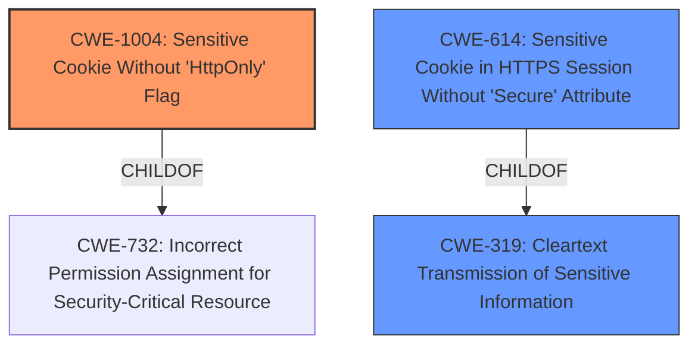

# Raw Analyzer Response for CVE-2021-20526

# Summary
| CWE ID | CWE Name | Confidence | CWE Abstraction Level | CWE Vulnerability Mapping Label | CWE-Vulnerability Mapping Notes |
|---|---|---|---|---|---|
| CWE-1004 | Sensitive Cookie Without 'HttpOnly' Flag | 1.0 | Variant | Allowed | Primary CWE |
| CWE-614 | Sensitive Cookie in HTTPS Session Without 'Secure' Attribute | 0.5 | Variant | Allowed | Secondary Candidate |
| CWE-319 | Cleartext Transmission of Sensitive Information | 0.3 | Base | Allowed | Secondary Candidate |

## Evidence and Confidence

*   **Confidence Score:** 1.0
*   **Evidence Strength:** HIGH

## Relationship Analysis
The primary CWE, CWE-1004 (Sensitive Cookie Without 'HttpOnly' Flag), is a variant-level weakness that is part of a larger weakness, CWE-732 (Incorrect Permission Assignment for Security-Critical Resource). CWE-614 (Sensitive Cookie in HTTPS Session Without 'Secure' Attribute) is another variant that is a child of CWE-319 (Cleartext Transmission of Sensitive Information). The vulnerability directly states the **failure to set the HTTPOnly flag**, which makes CWE-1004 the most specific and appropriate choice.

## Vulnerability Chain
The vulnerability chain starts with the **failure to set the HTTPOnly flag**, leading to the potential **exposure of sensitive information from the cookie** to a remote attacker.

## Summary of Analysis
The initial analysis and the retriever results both pointed towards CWE-1004 (Sensitive Cookie Without 'HttpOnly' Flag) as the most relevant CWE. The vulnerability description clearly states the **root cause** as the **failure to set the HTTPOnly flag**, which directly aligns with the description of CWE-1004. The relationship analysis further solidifies this choice, as CWE-1004 is a variant-level weakness, providing a specific representation of the vulnerability. The retriever results also list CWE-1004 as the top combined result.

*   The selection is based on the following evidence:
    *   **Vulnerability Description Key Phrases:** "**rootcause:** **failure to set HTTPOnly flag**"
    *   **Retriever Results:** CWE-1004 is the top combined result.
    *   **CWE-1004 Description:** "The product uses a cookie to store sensitive information, but the cookie is not marked with the HttpOnly flag."

CWE-614 (Sensitive Cookie in HTTPS Session Without 'Secure' Attribute) was considered because it also relates to cookie security. However, the vulnerability description specifically mentions the HTTPOnly flag, making CWE-1004 a more precise match. CWE-319 (Cleartext Transmission of Sensitive Information) was also considered but is less specific to the **root cause**, as it describes the general issue of transmitting sensitive information in cleartext.

The selected CWE is at the optimal level of specificity because it directly addresses the **failure to set the HTTPOnly flag**, which is the **root cause** of the vulnerability.
Relevant CWE Information:

# Enhanced Context (25 CWEs)
The following CWEs were identified as potentially relevant to this vulnerability:

## CWE-1236: Improper Neutralization of Formula Elements in a CSV File
**Abstraction Level**: Base
**Similarity Score**: 0.78
**Source**: dense

**Description**:
The product saves user-provided information into a Comma-Separated Value (CSV) file, but it does not neutralize or incorrectly neutralizes special elements that could be interpreted as a command when the file is opened by a spreadsheet product.

**Mapping Guidance**:
- Usage: Allowed
- Rationale: This CWE entry is at the Base level of abstraction, which is a preferred level of abstraction for mapping to the root causes of vulnerabilities.

## CWE-538: Insertion of Sensitive Information into Externally-Accessible File or Directory
**Abstraction Level**: Base
**Similarity Score**: 0.77
**Source**: dense

**Description**:
The product places sensitive information into files or directories that are accessible to actors who are allowed to have access to the files, but not to the sensitive information.

**Mapping Guidance**:
- Usage: Allowed
- Rationale: This CWE entry is at the Base level of abstraction, which is a preferred level of abstraction for mapping to the root causes of vulnerabilities.

## CWE-74: Improper Neutralization of Special Elements in Output Used by a Downstream Component ('Injection')
**Abstraction Level**: Class
**Similarity Score**: 0.76
**Source**: dense

**Description**:
The product constructs all or part of a command, data structure, or record using externally-influenced input from an upstream component, but it does not neutralize or incorrectly neutralizes special elements that could modify how it is parsed or interpreted when it is sent to a downstream component.

**Mapping Guidance**:
- Usage: Discouraged
- Rationale: CWE-74 is high-level and often misused when lower-level weaknesses are more appropriate.

## CWE-807: Reliance on Untrusted Inputs in a Security Decision
**Abstraction Level**: Base
**Similarity Score**: 0.76
**Source**: dense

**Description**:
The product uses a protection mechanism that relies on the existence or values of an input, but the input can be modified by an untrusted actor in a way that bypasses the protection mechanism.

**Mapping Guidance**:
- Usage: Allowed
- Rationale: This CWE entry is at the Base level of abstraction, which is a preferred level of abstraction for mapping to the root causes of vulnerabilities.

## CWE-319: Cleartext Transmission of Sensitive Information
**Abstraction Level**: Base
**Similarity Score**: 0.76
**Source**: dense

**Description**:
The product transmits sensitive or security-critical data in cleartext in a communication channel that can be sniffed by unauthorized actors.

**Mapping Guidance**:
- Usage: Allowed
- Rationale: This CWE entry is at the Base level of abstraction, which is a preferred level of abstraction for mapping to the root causes of vulnerabilities.

## CWE-668: Exposure of Resource to Wrong Sphere
**Abstraction Level**: Class
**Similarity Score**: 0.75
**Source**: dense

**Description**:
The product exposes a resource to the wrong control sphere, providing unintended actors with inappropriate access to the resource.

**Mapping Guidance**:
- Usage: Discouraged
- Rationale: CWE-668 is high-level and is often misused as a catch-all when lower-level CWE IDs might be applicable. It is sometimes used for low-information vulnerability reports [REF-1287]. It is a level-1 Class (i.e., a child of a Pillar). It is not useful for trend analysis.

## CWE-212: Improper Removal of Sensitive Information Before Storage or Transfer
**Abstraction Level**: Base
**Similarity Score**: 0.75
**Source**: dense

**Description**:
The product stores, transfers, or shares a resource that contains sensitive information, but it does not properly remove that information before the product makes the resource available to unauthorized actors.

**Mapping Guidance**:
- Usage: Allowed
- Rationale: This CWE entry is at the Base level of abstraction, which is a preferred level of abstraction for mapping to the root causes of vulnerabilities.

## CWE-203: Observable Discrepancy
**Abstraction Level**: Base
**Similarity Score**: 0.75
**Source**: dense

**Description**:
The product behaves differently or sends different responses under different circumstances in a way that is observable to an unauthorized actor, which exposes security-relevant information about the state of the product, such as whether a particular operation was successful or not.

**Mapping Guidance**:
- Usage: Allowed
- Rationale: This CWE entry is at the Base level of abstraction, which is a preferred level of abstraction for mapping to the root causes of vulnerabilities.

## CWE-138: Improper Neutralization of Special Elements
**Abstraction Level**: Class
**Similarity Score**: 0.75
**Source**: dense

**Description**:
The product receives input from an upstream component, but it does not neutralize or incorrectly neutralizes special elements that could be interpreted as control elements or syntactic markers when they are sent to a downstream component.

**Mapping Guidance**:
- Usage: Discouraged
- Rationale: This CWE entry is a level-1 Class (i.e., a child of a Pillar). It might have lower-level children that would be more appropriate

## CWE-41: