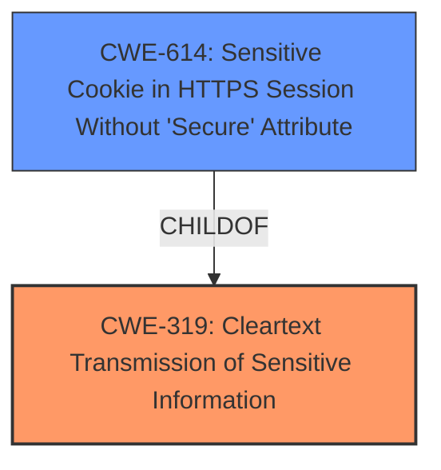

# Analysis for CVE-2021-20564

# Summary
| CWE ID | CWE Name | Confidence | CWE Abstraction Level | CWE Vulnerability Mapping Label | CWE-Vulnerability Mapping Notes |
|---|---|---|---|---|---|
| CWE-319 | Cleartext Transmission of Sensitive Information | 0.9 | Base | Allowed | Primary CWE |
| CWE-614 | Sensitive Cookie in HTTPS Session Without 'Secure' Attribute | 0.7 | Variant | Allowed | Secondary Candidate |

## Evidence and Confidence

*   **Confidence Score:** 0.9
*   **Evidence Strength:** HIGH

## Relationship Analysis
The primary relationship that influenced the decision was the ChildOf relationship between CWE-614 and CWE-319. CWE-614 is a more specific Variant of CWE-319, indicating a particular scenario where sensitive cookies are transmitted in cleartext due to the missing 'Secure' attribute in an HTTPS session. While CWE-319 is appropriate, the additional context provided by CWE-614 makes it a relevant secondary consideration.

## Vulnerability Chain
The vulnerability chain starts with the **failure to properly enable HTTP Strict Transport Security (HSTS)**, which leads to a risk of **cleartext transmission of sensitive information**. This **cleartext transmission**, if exploited using man-in-the-middle techniques, allows a remote attacker to **obtain sensitive information**.

## Summary of Analysis
The initial analysis focused on the **root cause**, which is the **failure to properly enable HTTP Strict Transport Security**. This directly leads to the potential for transmitting sensitive information in cleartext. The vulnerability description clearly states that this **failure** can be exploited by a remote attacker using man-in-the-middle techniques to **obtain sensitive information**.

The selection of CWE-319 is based on the vulnerability description indicating a **failure to properly enable HTTP Strict Transport Security**, resulting in the possibility of sensitive information being transmitted in cleartext. The "Vulnerability Description Key Phrases" section reinforces this by highlighting "**failure to properly enable HTTP Strict Transport Security**" as the **rootcause**.

The graph relationships influenced the decision by highlighting that CWE-614 is a child of CWE-319, indicating a more specific scenario. While CWE-319 is the primary CWE due to the general **cleartext transmission**, CWE-614 provides valuable additional context related to cookies and the 'Secure' attribute in HTTPS sessions.

The selected CWEs are at an optimal level of specificity. CWE-319 accurately captures the essence of the vulnerability, while CWE-614 adds a relevant detail without being overly specific or losing the core issue. The evidence supports both CWEs, and the relationship between them enhances the overall understanding of the vulnerability.

Relevant CWE Information:

# Enhanced Context (25 CWEs)

## CWE-1391: Use of Weak Credentials
**Abstraction Level**: Class
**Similarity Score**: 0.78
**Source**: dense

**Description**:
The product uses weak credentials (such as a default key or hard-coded password) that can be calculated, derived, reused, or guessed by an attacker.

**Mapping Guidance**:
- Usage: Allowed-with-Review
- Rationale: This CWE entry is a Class and might have Base-level children that would be more appropriate

*Not Selected:* This CWE is not related to the described vulnerability, which centers on the **failure to properly enable HTTP Strict Transport Security** rather than the use of weak credentials.

## CWE-303: Incorrect Implementation of Authentication Algorithm
**Abstraction Level**: Base
**Similarity Score**: 0.78
**Source**: dense

**Description**:
The requirements for the product dictate the use of an established authentication algorithm, but the implementation of the algorithm is incorrect.

**Mapping Guidance**:
- Usage: Allowed
- Rationale: This CWE entry is at the Base level of abstraction, which is a preferred level of abstraction for mapping to the root causes of vulnerabilities.

*Not Selected:* The vulnerability doesn't involve an incorrect implementation of an authentication algorithm, but rather a **failure to properly enable HTTP Strict Transport Security**.

## CWE-319: Cleartext Transmission of Sensitive Information
**Abstraction Level**: Base
**Similarity Score**: 0.78
**Source**: dense

**Description**:
The product transmits sensitive or security-critical data in cleartext in a communication channel that can be sniffed by unauthorized actors.

**Mapping Guidance**:
- Usage: Allowed
- Rationale: This CWE entry is at the Base level of abstraction, which is a preferred level of abstraction for mapping to the root causes of vulnerabilities.

*Selected:* The vulnerability description explicitly mentions the risk of sensitive information being obtained due to the **failure to properly enable HTTP Strict Transport Security**, making this CWE highly relevant.

## CWE-807: Reliance on Untrusted Inputs in a Security Decision
**Abstraction Level**: Base
**Similarity Score**: 0.78
**Source**: dense

**Description**:
The product uses a protection mechanism that relies on the existence or values of an input, but the input can be modified by an untrusted actor in a way that bypasses the protection mechanism.

**Mapping Guidance**:
- Usage: Allowed
- Rationale: This CWE entry is at the Base level of abstraction, which is a preferred level of abstraction for mapping to the root causes of vulnerabilities.

*Not Selected:* This CWE does not fit the vulnerability, as the issue is the **failure to properly enable HTTP Strict Transport Security** rather than a reliance on untrusted inputs.

## CWE-1240: Use of a Cryptographic Primitive with a Risky Implementation
**Abstraction Level**: Base
**Similarity Score**: 0.77
**Source**: dense

**Description**:
To fulfill the need for a cryptographic primitive, the product implements a cryptographic algorithm using a non-standard, unproven, or disallowed/non-compliant cryptographic implementation.

**Mapping Guidance**:
- Usage: Allowed
- Rationale: This CWE entry is at the Base level of abstraction, which is a preferred level of abstraction for mapping to the root causes of vulnerabilities.

*Not Selected:* The vulnerability is related to HSTS, not the use of a cryptographic primitive.

## CWE-345: Insufficient Verification of Data Authenticity
**Abstraction Level**: Class
**Similarity Score**: 0.77
**Source**: dense

**Description**:
The product does not sufficiently verify the origin or authenticity of data, in a way that causes it to accept invalid data.

**Mapping Guidance**:
- Usage: Discouraged
- Rationale: This CWE entry is a level-1 Class (i.e., a child of a Pillar). It might have lower-level children that would be more appropriate

*Not Selected:* This CWE is not applicable, as the vulnerability involves a **failure to properly enable HTTP Strict Transport Security** rather than data authenticity verification issues.

## CWE-312: Cleartext Storage of Sensitive Information
**Abstraction Level**: Base
**Similarity Score**: 0.76
**Source**: dense

**Description**:
The product stores sensitive information in cleartext within a resource that might be accessible to another control sphere.

**Mapping Guidance**:
- Usage: Allowed
- Rationale: This CWE entry is at the Base level of abstraction, which is a preferred level of abstraction for mapping to the root causes of vulnerabilities.

*Not Selected:* This vulnerability is about the **transmission** of sensitive information, not its storage.

## CWE-311: Missing Encryption of Sensitive Data
**Abstraction Level**: Class
**Similarity Score**: 0.76
**Source**: dense

**Description**:
The product does not encrypt sensitive or critical information before storage or transmission.

**Mapping Guidance**:
- Usage: Discouraged
- Rationale: CWE-311 is high-level with more precise children available. It is a level-1 Class (i.e., a child of a Pillar).

*Not Selected:* While related, CWE-319 is more specific to **cleartext transmission**, making it a better fit.

## CWE-203: Observable Discrepancy
**Abstraction Level**: Base
**Similarity Score**: 0.76
**Source**: dense

**Description**:
The product behaves differently or sends different responses under different circumstances in a way that is observable to an unauthorized actor, which exposes security-relevant information about the state of the product, such as whether a particular operation was successful or not.

**Mapping Guidance**:
- Usage: Allowed
- Rationale: This CWE entry is at the Base level of abstraction, which is a preferred level of abstraction for mapping to the root causes of vulnerabilities.

*Not Selected:* This CWE is about observable discrepancies, which is not directly related to the **failure to properly enable HTTP Strict Transport Security**.

## CWE-294: Authentication Bypass by Capture-replay
**Abstraction Level**: Base
**Similarity Score**: 0.76
**Source**: dense

**Description**:
A capture-replay flaw exists when the design of the