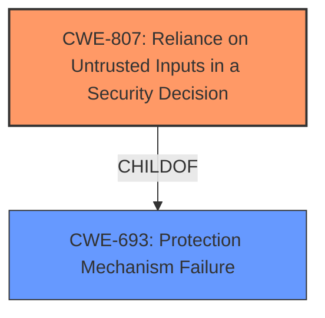

# Analysis Report for CVE-2021-20565

# Vulnerability Analysis Report: CVE-2021-20565

## Description


## Analysis (with Relationship Data)

# Summary
| CWE ID | CWE Name | Confidence | CWE Abstraction Level | CWE Vulnerability Mapping Label | CWE-Vulnerability Mapping Notes |
|---|---|---|---|---|---|
| CWE-807 | Reliance on Untrusted Inputs in a Security Decision | 1.0 | Base | Allowed | Primary CWE |

## Evidence and Confidence

*   **Confidence Score:** 1.0
*   **Evidence Strength:** HIGH

## Relationship Analysis
The primary CWE identified is CWE-807 (**Reliance on Untrusted Inputs in a Security Decision**). This CWE is a base-level weakness. It has a parent, CWE-693 (**Protection Mechanism Failure**), but the description provided is specific enough to warrant the base CWE.



## Vulnerability Chain
The vulnerability chain begins with the application relying on an input for a security decision, followed by an attacker modifying that input, leading to a bypassed protection mechanism.

## Summary of Analysis
The vulnerability description explicitly states that the IBM Cloud Pak for Security uses a protection mechanism that relies on the existence or values of an input. An untrusted actor can modify this input, thereby bypassing the protection mechanism. This perfectly aligns with the description of CWE-807 (**Reliance on Untrusted Inputs in a Security Decision**).

The evidence supporting this decision is the vulnerability description itself: "IBM Cloud Pak for Security (CP4S) uses a protection mechanism that relies on the existence or values of an input, but the input can be modified by an untrusted actor in a way that bypasses the protection mechanism."

The CWE-807 is at the optimal level of specificity, which is the base level.

Relevant CWE Information:

# Enhanced Context (25 CWEs)
The following CWEs were identified as potentially relevant to this vulnerability:

## CWE-807: Reliance on Untrusted Inputs in a Security Decision
**Abstraction Level**: Base
**Similarity Score**: 0.77
**Source**: dense

**Description**:
The product uses a protection mechanism that relies on the existence or values of an input, but the input can be modified by an untrusted actor in a way that bypasses the protection mechanism.

**Mapping Guidance**:
- Usage: Allowed
- Rationale: This CWE entry is at the Base level of abstraction, which is a preferred level of abstraction for mapping to the root causes of vulnerabilities.


## CWE Relationship Analysis

Current CWEs represent these abstraction levels: .


### Vulnerability Chain Analysis

**Chain starting from CWE-807:**
- 807 (Reliance on Untrusted Inputs in a Security Decision) - ROOT


**Chain starting from CWE-693:**
- 693 (Protection Mechanism Failure) - ROOT


### CWE Relationship Diagram

```mermaid
graph TD
    classDef primary fill:#f96,stroke:#333,stroke-width:2px
    classDef secondary fill:#69f,stroke:#333
    classDef tertiary fill:#9e9,stroke:#333
```


*Report generated on 2025-04-02 16:44:37*
