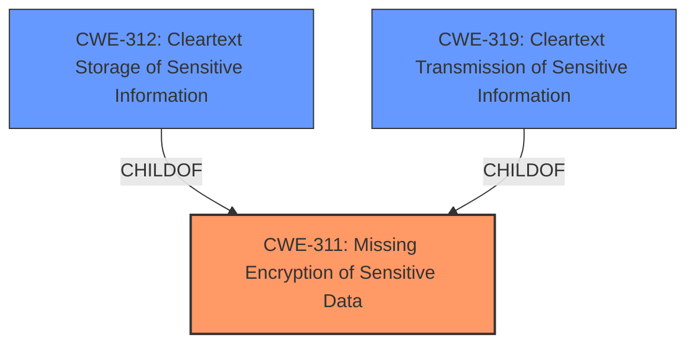

# Analysis for CVE-2021-20567

# Summary
| CWE ID | CWE Name | Confidence | CWE Abstraction Level | CWE Vulnerability Mapping Label | CWE-Vulnerability Mapping Notes |
|---|---|---|---|---|---|
| CWE-311 | Missing Encryption of Sensitive Data | 0.9 | Class | Primary | Allowed-with-Review |
| CWE-312 | Cleartext Storage of Sensitive Information | 0.7 | Base | Secondary | Allowed |
| CWE-319 | Cleartext Transmission of Sensitive Information | 0.7 | Base | Secondary | Allowed |

## Evidence and Confidence

*   **Confidence Score:** 0.9
*   **Evidence Strength:** HIGH

## Relationship Analysis
The primary relationship is that CWE-311 [CWE-311: Missing Encryption of Sensitive Data] is a class-level CWE, and it has child CWEs like CWE-312 [CWE-312: Cleartext Storage of Sensitive Information] and CWE-319 [CWE-319: Cleartext Transmission of Sensitive Information] which are more specific base-level CWEs. The vulnerability involves missing encryption, which could lead to either storage or transmission of sensitive information in cleartext.

## Vulnerability Chain
The vulnerability chain starts with the **root cause** of **improper or nonexisting encryption**. This leads to the impact of sensitive information being obtained by a local privileged attacker. The chain is: **Missing encryption** -> **Sensitive information stored in cleartext** -> **Local privileged attacker obtains sensitive information**.

## Summary of Analysis
The initial analysis identified **improper or nonexisting encryption** as the **root cause**, leading to the potential compromise of sensitive information. The evidence from the "CVE Reference Links Content Summary" confirms that "Secrets within the Resilient App Host... are not encrypted by default" and "The secrets can be viewed in clear text by the 'root' user."

CWE-311 [CWE-311: Missing Encryption of Sensitive Data] is the most appropriate primary CWE because the vulnerability description and CVE summary explicitly mention the lack of encryption. While CWE-312 [CWE-312: Cleartext Storage of Sensitive Information] and CWE-319 [CWE-319: Cleartext Transmission of Sensitive Information] could be potential outcomes of the missing encryption, the provided information doesn't definitively state whether the secrets were stored, transmitted, or both in cleartext. Therefore, I chose CWE-311 [CWE-311: Missing Encryption of Sensitive Data] as the primary CWE. The retriever results also listed CWE-311 [CWE-311: Missing Encryption of Sensitive Data] at the top. The mapping guidance for CWE-311 [CWE-311: Missing Encryption of Sensitive Data] suggests considering its children CWE-312 [CWE-312: Cleartext Storage of Sensitive Information] or CWE-319 [CWE-319: Cleartext Transmission of Sensitive Information]. Due to the potential for both storage and transmission, I've included both CWE-312 [CWE-312: Cleartext Storage of Sensitive Information] and CWE-319 [CWE-319: Cleartext Transmission of Sensitive Information] as secondary CWEs.

CWE-327 [CWE-327: Use of a Broken or Risky Cryptographic Algorithm] was considered but not used as the vulnerability description explicitly states "improper or nonexisting encryption" rather than a broken algorithm. Similarly, CWE-326 [CWE-326: Inadequate Encryption Strength] was not selected as the **root cause** is the absence of encryption, not the use of weak encryption. CWE-269 [CWE-269: Improper Privilege Management] was also considered but discarded because the primary weakness is the lack of encryption, not a problem with privilege management, although a local privileged attacker is needed to exploit the vulnerability.