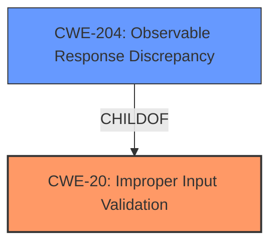

# Analysis Report for CVE-2021-20569

# Vulnerability Analysis Report: CVE-2021-20569

## Description


## Analysis (with Relationship Data)

# Summary
| CWE ID | CWE Name | Confidence | CWE Abstraction Level | CWE Vulnerability Mapping Label | CWE-Vulnerability Mapping Notes |
|---|---|---|---|---|---|
| CWE-20 | Improper Input Validation | 0.75 | Class | Primary | Discouraged |
| CWE-204 | Observable Response Discrepancy | 0.6 | Base | Secondary | Allowed |

## Evidence and Confidence

*   **Confidence Score:** 0.7
*   **Evidence Strength:** MEDIUM

## Relationship Analysis
The primary relationship impacting the decision is the parent-child relationship between CWE-20 (Improper Input Validation) and its potential children. While CWE-20 is a high-level class, the provided information does not point to a more specific variant. CWE-204 (Observable Response Discrepancy) is considered as a secondary CWE, as it describes the impact of the **improper input validation** leading to username enumeration.



## Vulnerability Chain
The vulnerability chain starts with **improper input validation** (CWE-20), which leads to the ability to enumerate usernames. This enumeration can be observed through response discrepancies (CWE-204).

## Summary of Analysis
The initial assessment focuses on the provided evidence, which indicates **improper input validation** as the root cause. The vulnerability description states, "IBM Security Secret Server up to 11.0 could allow an attacker to enumerate usernames due to **improper input validation**."

The retriever results suggest CWE-20 (Improper Input Validation) as a potential match, along with CWE-204 (Observable Response Discrepancy).

CWE-20 is a Class-level CWE, and the mapping guidance discourages its use when more specific CWEs are available. However, the provided information lacks the granularity to identify a more specific input validation error. Therefore, CWE-20 is selected as the primary CWE, acknowledging its limitations.

CWE-204 is selected as a secondary CWE because the impact of the **improper input validation** leads to an observable discrepancy, which is the ability to enumerate usernames.

The selection of CWE-20 is at a higher level of abstraction due to the limited information provided in the vulnerability description. If more details were available about the specific input validation failure, a more specific CWE variant could be selected.

Relevant CWE Information:

# Enhanced Context (25 CWEs)

## CWE-807: Reliance on Untrusted Inputs in a Security Decision
**Abstraction Level**: Base
**Similarity Score**: 0.78
**Source**: dense

**Description**:
The product uses a protection mechanism that relies on the existence or values of an input, but the input can be modified by an untrusted actor in a way that bypasses the protection mechanism.

*Rationale for not selecting:* While reliance on untrusted inputs might be a factor, the description primarily focuses on **improper input validation**.

## CWE-538: Insertion of Sensitive Information into Externally-Accessible File or Directory
**Abstraction Level**: Base
**Similarity Score**: 0.77
**Source**: dense

**Description**:
The product places sensitive information into files or directories that are accessible to actors who are allowed to have access to the files, but not to the sensitive information.

*Rationale for not selecting:* This CWE does not align with the vulnerability description, as it involves files or directories.

## CWE-204: Observable Response Discrepancy
**Abstraction Level**: Base
**Similarity Score**: 0.77
**Source**: dense

**Description**:
The product provides different responses to incoming requests in a way that reveals internal state information to an unauthorized actor outside of the intended control sphere.

*Rationale for selecting:* This CWE aligns with the impact of the vulnerability, as it allows an attacker to enumerate usernames due to observable response discrepancies.

## CWE-668: Exposure of Resource to Wrong Sphere
**Abstraction Level**: Class
**Similarity Score**: 0.76
**Source**: dense

**Description**:
The product exposes a resource to the wrong control sphere, providing unintended actors with inappropriate access to the resource.

*Rationale for not selecting:* This is a high-level CWE and less specific than the described **improper input validation**.

## CWE-74: Improper Neutralization of Special Elements in Output Used by a Downstream Component ('Injection')
**Abstraction Level**: Class
**Similarity Score**: 0.76
**Source**: dense

**Description**:
The product constructs all or part of a command, data structure, or record using externally-influenced input from an upstream component, but it does not neutralize or incorrectly neutralizes special elements that could modify how it is parsed or interpreted when it is sent to a downstream component.

*Rationale for not selecting:* This CWE is related to injection vulnerabilities, which is not the primary issue described.

## CWE-1289: Improper Validation of Unsafe Equivalence in Input
**Abstraction Level**: Base
**Similarity Score**: 0.76
**Source**: dense

**Description**:
The product receives an input value that is used as a resource identifier or other type of reference, but it does not validate or incorrectly validates that the input is equivalent to a potentially-unsafe value.

*Rationale for not selecting:* While this CWE is more specific, there isn't enough information to conclude that the input validation involves unsafe equivalence.

## CWE-212: Improper Removal of Sensitive Information Before Storage or Transfer
**Abstraction Level**: Base
**Similarity Score**: 0.75
**Source**: dense

**Description**:
The product stores, transfers, or shares a resource that contains sensitive information, but it does not properly remove that information before the product makes the resource available to unauthorized actors.

*Rationale for not selecting:* This CWE involves the removal of sensitive information, which is not relevant to the described vulnerability.

## CWE-345: Insufficient Verification of Data Authenticity
**Abstraction Level**: Class
**Similarity Score**: 0.75
**Source**: dense

**Description**:
The product does not sufficiently verify the origin or authenticity of data, in a way that causes it to accept invalid data.

*Rationale for not selecting:* This CWE is focused on data authenticity, which is not the primary issue.

## CWE-41: Improper Resolution of Path Equivalence
**Abstraction Level**: Base
**Similarity Score**: 0.75
**Source**: dense

**Description**:
The product is vulnerable to file system contents disclosure through path equivalence. Path equivalence involves the use of special characters in file and directory names. The associated manipulations are intended to generate multiple names for the same object.

*Rationale for not selecting:* This CWE is related to file system vulnerabilities, which is not the focus.

## CWE-203: Observable Discrepancy
**Abstraction Level**: Base
**Similarity Score**: 0.75
**Source**: dense

**Description**:
The product behaves differently or sends different responses under different circumstances in a way that is observable to an unauthorized actor, which exposes security-relevant information about the state of the product, such as whether a particular operation was successful or not.

*Rationale for selecting:* See CWE-204 above.

## CWE-22: Improper Limitation of a Pathname to a Restricted Directory ('Path Traversal')
**Abstraction Level**: Base
**Similarity Score**: 5955.18
**Source**: sparse

**Description**:
The product uses external input to construct a pathname that is intended to identify a file or directory that is located underneath a restricted parent directory, but the product does not properly neutralize special elements within the pathname that can cause the pathname to resolve to a location that is outside of the restricted directory.

*Rationale for not selecting:* This CWE is related to path traversal vulnerabilities, not directly relevant.

## CWE-209: Generation of Error Message Containing Sensitive Information
**Abstraction Level**: Base
**Similarity Score**: 5888.69
**Source**: sparse

**Description**:
The product generates an error message that includes sensitive information about its environment, users, or associated data.

*Rationale for not selecting:* This CWE describes a specific type of information disclosure (sensitive information in error messages), but the provided description does not specifically mention this.

## CWE-116: Improper Encoding or Escaping of Output
**Abstraction Level**: Class
**Similarity Score**: 5833.27
**Source**: sparse

**Description**:
The product prepares a structured message for communication with another component, but encoding or escaping of the data is either missing or done incorrectly. As a result, the intended structure of the message is not preserved.

*Rationale for not selecting:* This CWE involves output encoding, which is not the primary issue described.

## CWE-770: Allocation of Resources Without Limits or Throttling
**Abstraction Level**: base
**Similarity Score**: 4.33
**Source**: graph

**Description**:
CWE-770: Allocation of Resources Without Limits


## CWE Relationship Analysis

Current CWEs represent these abstraction levels: .


### Vulnerability Chain Analysis

**Chain starting from CWE-41:**
- 41 (Improper Resolution of Path Equivalence) - ROOT


**Chain starting from CWE-770:**
- 770 (Allocation of Resources Without Limits or Throttling) - ROOT


### CWE Relationship Diagram

```mermaid
graph TD
    classDef primary fill:#f96,stroke:#333,stroke-width:2px
    classDef secondary fill:#69f,stroke:#333
    classDef tertiary fill:#9e9,stroke:#333
```


*Report generated on 2025-04-02 07:06:53*
