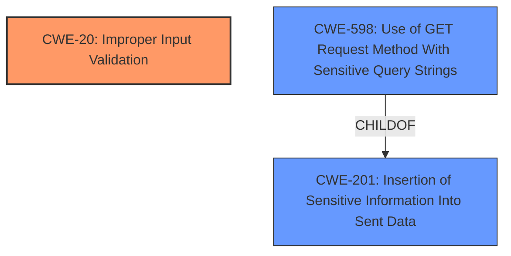

# Enhanced Analysis for CVE-2021-20583

# Summary
| CWE ID | CWE Name | Confidence | CWE Abstraction Level | CWE Vulnerability Mapping Label | CWE-Vulnerability Mapping Notes |
|---|---|---|---|---|---|
| CWE-20 | Improper Input Validation | 0.75 | Class | Primary | Discouraged Usage, but no better option available based on provided evidence. |
| CWE-598 | Use of GET Request Method With Sensitive Query Strings | 0.5 | Variant | Secondary | Allowed Usage. Considered due to "HTTP GET request" vector, but not directly supported by the evidence. |
| CWE-201 | Insertion of Sensitive Information Into Sent Data | 0.5 | Base | Secondary | Allowed Usage. Considered due to "disclose sensitive information" impact, but not directly supported by the evidence. |

## Evidence and Confidence

*   **Confidence Score:** 0.7
*   **Evidence Strength:** MEDIUM

## Relationship Analysis
The primary identified CWE is CWE-20, which is a Class-level weakness. While discouraged for direct mapping, the provided information is insufficient to pinpoint a more specific Base or Variant. The vulnerability description mentions **improper input validation** as the root cause, making CWE-20 a reasonable, albeit generic, fit.

CWE-598 (Variant) and CWE-201 (Base) were considered due to the HTTP GET request vector and the potential disclosure of sensitive information, respectively. However, these are more related to the potential impact of **improper input validation** rather than the root cause itself.



## Vulnerability Chain
The vulnerability chain is as follows:
1.  **Root Cause:** **Improper Input Validation** (CWE-20)
2.  **Vector:** HTTP GET request
3.  **Impact:** Disclosure of sensitive information

The chain begins with **improper input validation**, which allows for the potential inclusion of sensitive information within the HTTP GET request. This can lead to the sensitive information being disclosed. A more specific CWE for the **improper input validation** would be ideal, but is unsupported by the available evidence.

## Summary of Analysis
The initial analysis focused on identifying the root cause described in the **Vulnerability Description Key Phrases**, which is **improper input validation**. While the Retriever Results suggested several CWEs, including CWE-20, CWE-201, and CWE-598, the primary focus remained on the **improper input validation**.

The provided evidence is limited. The **Vulnerability Description Key Phrases** mention **improper input validation**, and the description states that the vulnerability leads to sensitive information disclosure through an HTTP GET request. However, there are no details about the specific input that is not validated, how the validation is **improper**, or what type of sensitive information is disclosed.

Based on this limited evidence and the MITRE mapping guidance, CWE-20 is the most appropriate primary CWE. It directly addresses the root cause of **improper input validation**, even though it is a Class and its usage is discouraged. Without more information, a more specific Base or Variant CWE cannot be selected.

CWE-598 and CWE-201 were considered as secondary CWEs due to the HTTP GET request vector and the potential disclosure of sensitive information, respectively. However, they are more related to the impact than the root cause.

Ultimately, the selection of CWE-20 as the primary CWE is a cautious decision based on the available evidence and the need to identify the root cause of the vulnerability. A more detailed analysis with more specific information would likely lead to a more precise CWE selection.

Relevant CWE Information:

# Enhanced Context (25 CWEs)
The following CWEs were identified as potentially relevant to this vulnerability:

## CWE-300: Channel Accessible by Non-Endpoint
**Abstraction Level**: Class
**Similarity Score**: 0.77
**Source**: dense

**Description**:
The product does not adequately verify the identity of actors at both ends of a communication channel, or does not adequately ensure the integrity of the channel, in a way that allows the channel to be accessed or influenced by an actor that is not an endpoint.

**Mapping Guidance**:
- Usage: Discouraged
- Rationale: CWE-300 is commonly misused for vulnerabilities in which the prerequisites for exploitation require the adversary to be in a privileged "in-the-middle" position.

*Not Selected:* This CWE is not relevant to **improper input validation**.

## CWE-807: Reliance on Untrusted Inputs in a Security Decision
**Abstraction Level**: Base
**Similarity Score**: 0.77
**Source**: dense

**Description**:
The product uses a protection mechanism that relies on the existence or values of an input, but the input can be modified by an untrusted actor in a way that bypasses the protection mechanism.

**Mapping Guidance**:
- Usage: Allowed
- Rationale: This CWE entry is at the Base level of abstraction, which is a preferred level of abstraction for mapping to the root causes of vulnerabilities.

*Not Selected:* There is no evidence to suggest the reliance on untrusted inputs in a security decision.

## CWE-1289: Improper Validation of Unsafe Equivalence in Input
**Abstraction Level**: Base
**Similarity Score**: 0.77
**Source**: dense

**Description**:
The product receives an input value that is used as a resource identifier or other type of reference, but it does not validate or incorrectly validates that the input is equivalent to a potentially-unsafe value.

**Mapping Guidance**:
- Usage: Allowed
- Rationale: This CWE entry is at the Base level of abstraction, which is a preferred level of abstraction for mapping to the root causes of vulnerabilities.

*Not Selected:* Insufficient evidence to suggest unsafe equivalence.

## CWE-319: Cleartext Transmission of Sensitive Information
**Abstraction Level**: Base
**Similarity Score**: 0.75
**Source**: dense

**Description**:
The product transmits sensitive or security-critical data in cleartext in a communication channel that can be sniffed by unauthorized actors.

**Mapping Guidance**:
- Usage: Allowed
- Rationale: This CWE entry is at the Base level of abstraction, which is a preferred level of abstraction for mapping to the root causes of vulnerabilities.

*Not Selected:* While sensitive information is disclosed, the root cause is **improper input validation**, not necessarily cleartext transmission.

## CWE-1391: Use of Weak Credentials
**Abstraction Level**: Class
**Similarity Score**: 0.74
**Source**: dense

**Description**:
The product uses weak credentials (such as a default key or hard-coded password) that can be calculated, derived, reused, or guessed by an attacker.

**Mapping Guidance**:
- Usage: Allowed-with-Review
- Rationale: This CWE entry is a Class and might have Base-level children that would be more appropriate

*Not Selected:* Not related to the root cause.

## CWE-303: Incorrect Implementation of Authentication Algorithm
**Abstraction Level**: Base
**Similarity Score**: 0.74
**Source**: dense

**Description**:
The requirements for the product dictate the use of an established authentication algorithm, but the implementation of the algorithm is incorrect.

**Mapping Guidance**:
- Usage: Allowed
- Rationale: This CWE entry is at the Base level of abstraction, which is a preferred level of abstraction for mapping to the root causes of vulnerabilities.

*Not Selected:* Not related to the root cause.

## CWE-345: Insufficient Verification of Data Authenticity
**Abstraction Level**: Class
**Similarity Score**: 0.74
**Source**: dense

**Description**:
The product does not sufficiently verify the origin or authenticity of data, in a way that causes it to accept invalid data.

**Mapping Guidance**:
- Usage: Discouraged
- Rationale: This CWE entry is a level-1 Class (i.e., a child of a Pillar). It might have lower-level children that would be more appropriate

*Not Selected:* Not directly supported by evidence.

## CWE-799: Improper Control of Interaction Frequency
**Abstraction Level**: Class
**Similarity Score**: 0.74
**Source**: dense

**Description**:
The product does not properly limit the number or frequency of interactions that it has with an actor, such as the number of incoming requests.

**Mapping Guidance**:
- Usage: Allowed-with-Review
- Rationale: This CWE entry is a Class and might have Base-level children that would be more appropriate

*Not Selected:* Not related to the root cause.

## CWE-74: Improper Neutralization of Special Elements in Output Used by a Downstream Component ('Injection')
**Abstraction Level**: Class
**Similarity Score**: 0.74
**Source**: dense

**Description**:
The product constructs all or part


## CWE Relationship Analysis

Current CWEs represent these abstraction levels: .


### Vulnerability Chain Analysis

**Chain starting from CWE-303:**
- 303 (Incorrect Implementation of Authentication Algorithm) - ROOT


**Chain starting from CWE-201:**
- 201 (Insertion of Sensitive Information Into Sent Data) - ROOT


### CWE Relationship Diagram

```mermaid
graph TD
    classDef primary fill:#f96,stroke:#333,stroke-width:2px
    classDef secondary fill:#69f,stroke:#333
    classDef tertiary fill:#9e9,stroke:#333
```