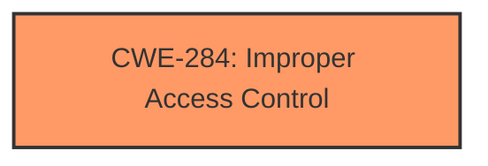

# Analysis for CVE-2021-20584

# Summary
| CWE ID  | CWE Name   | Confidence | CWE Abstraction Level | CWE Vulnerability Mapping Label | CWE-Vulnerability Mapping Notes |
|-----------------|------------------------------------------------------|------------|-----------------------|-----------------------------------|------------------------------------|
| CWE-284 | Improper Access Control | 0.75 | Pillar | Allowed-with-Review | Discouraged, but selected because it directly reflects the stated **improper access controls** root cause. Consider more specific children if more information becomes available. |

## Evidence and Confidence

*   **Confidence Score:** 0.75
*   **Evidence Strength:** MEDIUM

## Relationship Analysis
The primary relationship influencing the CWE selection is the hierarchical relationship. CWE-284 is a Pillar, and therefore is discouraged, but the vulnerability description explicitly states **"improper access controls"** as the root cause, making it the closest fit. The children of CWE-284, such as CWE-862 (Missing Authorization) and CWE-863 (Incorrect Authorization), could be more specific, but the current evidence lacks the detail necessary to determine which is most appropriate.

## Vulnerability Chain
The vulnerability chain, based on the provided information, is as follows:
1.  **Root Cause:** **Improper access controls** (CWE-284) in IBM Sterling File Gateway.
2.  **Impact:** Remote attacker can upload arbitrary files.

## Summary of Analysis
The initial analysis focused on identifying the root cause described in the vulnerability description and CVE Reference Links Content Summary. The description clearly states **"improper access controls"** as the root cause, supported by the CVE Reference Links Content Summary identifying an "Access Control Vulnerability".

The Retriever Results listed CWE-284 (Improper Access Control) as a candidate, but it is a Pillar and discouraged. However, given the explicit mention of **improper access controls**, it is the most direct match to the available evidence. Other CWEs, such as CWE-862 (Missing Authorization) and CWE-863 (Incorrect Authorization), could be more specific, but require further details on the nature of the access control issue. For example, is the authorization check missing or incorrect? Without additional information, selecting a more specific CWE would be speculative.

The decision to select the Pillar CWE-284 is primarily based on the explicit statement of **improper access controls** in the vulnerability description. While a more specific CWE would be preferred, the lack of detailed information prevents a confident selection of a child CWE. I am overriding the general mapping guidance that discourages the use of Pillar CWEs in favor of accurately reflecting the root cause as described.