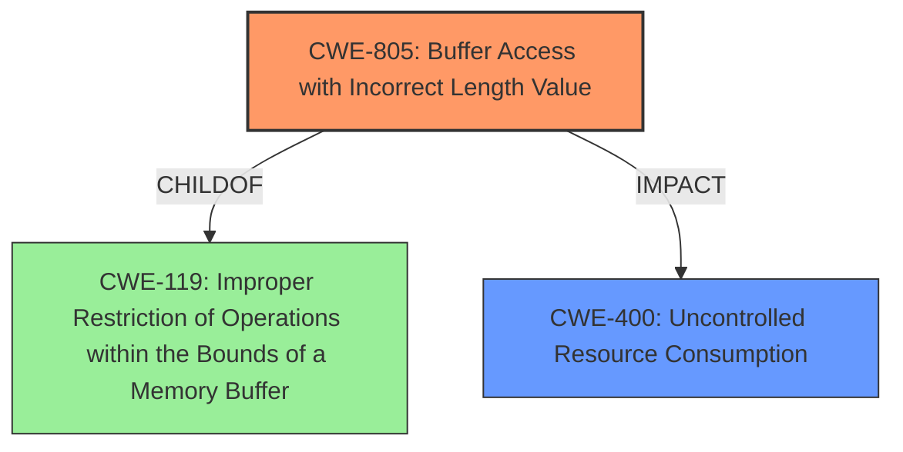

# Analysis for CVE-2021-20589

# Summary
| CWE ID  | CWE Name                                         | Confidence | CWE Abstraction Level | CWE Vulnerability Mapping Label | CWE-Vulnerability Mapping Notes |
| :-------- | :----------------------------------------------- | :--------- | :---------------------- | :------------------------------ | :------------------------------ |
| CWE-805 | Buffer Access with Incorrect Length Value         | 1.0        | Base                    | Primary                         | Allowed                       |
| CWE-400  | Uncontrolled Resource Consumption   | 0.7        | Class                    | Secondary                       | Discouraged                      |

## Evidence and Confidence

*   **Confidence Score:** 0.85
*   **Evidence Strength:** HIGH

## Relationship Analysis
The primary relationship influencing the decision is the parent-child relationship. CWE-805 (Buffer Access with Incorrect Length Value) is a base-level CWE that directly addresses the **buffer access with incorrect length value** issue described in the vulnerability. CWE-805 is a child of CWE-119 (Improper Restriction of Operations within the Bounds of a Memory Buffer). The vulnerability description also states that the impact of the vulnerability is that a remote attacker can cause the communication function to stop, which is a denial-of-service (DoS) condition and relates to CWE-400 (Uncontrolled Resource Consumption).

## Vulnerability Chain
The vulnerability chain starts with the **buffer access with incorrect length value** (CWE-805), which allows a remote attacker to send specially crafted packets. This leads to a denial-of-service (DoS) condition by stopping the communication function of the affected devices, resulting in CWE-400 (Uncontrolled Resource Consumption).

## Summary of Analysis
The initial analysis focused on the "Vulnerability Description Key Phrases" section, which highlights the **weakness** as **"buffer access with incorrect length value."** This phrase strongly suggests CWE-805 (Buffer Access with Incorrect Length Value). The CVE Reference Links Content Summary section further supports this by stating, "The vulnerability stems from a buffer access with an incorrect length value (CWE-805) within the MODBUS/TCP slave communication function." The retriever results also list CWE-805 as the top candidate with a score of 1.522. The impact, the stopping of the communication function, aligns with the effects of CWE-400 (Uncontrolled Resource Consumption).

The graph relationships influenced the final selection by confirming that CWE-805 is at a base level of abstraction and is the most specific CWE for the **buffer access with incorrect length value** issue.

The selected CWEs are at the optimal level of specificity because CWE-805 directly describes the coding error, and CWE-400 captures the impact of the vulnerability.

Relevant CWE Information:

# Enhanced Context (25 CWEs)
The following CWEs were identified as potentially relevant to this vulnerability:

## CWE-405: Asymmetric Resource Consumption (Amplification)
**Abstraction Level**: Class
**Similarity Score**: 0.78
**Source**: dense

**Description**:
The product does not properly control situations in which an adversary can cause the product to consume or produce excessive resources without requiring the adversary to invest equivalent work or otherwise prove authorization, i.e., the adversary's influence is "asymmetric."

**Mapping Guidance**:
- Usage: Allowed-with-Review
- Rationale: This CWE entry is a Class and might have Base-level children that would be more appropriate

*Analysis:* Although resource consumption is involved, the primary weakness is not asymmetric resource consumption, making this less appropriate than CWE-400.

## CWE-789: Memory Allocation with Excessive Size Value
**Abstraction Level**: Variant
**Similarity Score**: 0.77
**Source**: dense

**Description**:
The product allocates memory based on an untrusted, large size value, but it does not ensure that the size is within expected limits, allowing arbitrary amounts of memory to be allocated.

**Mapping Guidance**:
- Usage: Allowed
- Rationale: This CWE entry is at the Variant level of abstraction, which is a preferred level of abstraction for mapping to the root causes of vulnerabilities.

*Analysis:* While this could be related to the incorrect length value, the primary weakness is in accessing the buffer with that incorrect length, not necessarily the memory allocation itself.

## CWE-404: Improper Resource Shutdown or Release
**Abstraction Level**: Class
**Similarity Score**: 0.77
**Source**: dense

**Description**:
The product does not release or incorrectly releases a resource before it is made available for re-use.

**Mapping Guidance**:
- Usage: Allowed-with-Review
- Rationale: This CWE entry is a Class and might have Base-level children that would be more appropriate

*Analysis:* This CWE is not directly related to the root cause of the vulnerability.

## CWE-799: Improper Control of Interaction Frequency
**Abstraction Level**: Class
**Similarity Score**: 0.77
**Source**: dense

**Description**:
The product does not properly limit the number or frequency of interactions that it has with an actor, such as the number of incoming requests.

**Mapping Guidance**:
- Usage: Allowed-with-Review
- Rationale: This CWE entry is a Class and might have Base-level children that would be more appropriate

*Analysis:* This CWE is not directly related to the root cause of the vulnerability.

## CWE-119: Improper Restriction of Operations within the Bounds of a Memory Buffer
**Abstraction Level**: Class
**Similarity Score**: 0.76
**Source**: dense

**Description**:
The product performs operations on a memory buffer, but it reads from or writes to a memory location outside the buffer's intended boundary. This may result in read or write operations on unexpected memory locations that could be linked to other variables, data structures, or internal program data.

**Mapping Guidance**:
- Usage: Discouraged
- Rationale: CWE-119 is commonly misused in low-information vulnerability reports when lower-level CWEs could be used instead, or when more details about the vulnerability are available.

*Analysis:* While CWE-119 is a parent of CWE-805, CWE-805 is more specific and thus more appropriate.

## CWE-130: Improper Handling of Length Parameter Inconsistency
**Abstraction Level**: Base
**Similarity Score**: 0.76
**Source**: dense

**Description**:
The product parses a formatted message or structure, but it does not handle or incorrectly handles a length field that is inconsistent with the actual length of the associated data.

**Mapping Guidance**:
- Usage: Allowed
- Rationale: This CWE entry is at the Base level of abstraction, which is a preferred level of abstraction for mapping to the root causes of vulnerabilities.

*Analysis:* This is closely related, but the core issue is the access with the incorrect length, not necessarily the handling of the length parameter itself.

## CWE-1325: Improperly Controlled Sequential Memory Allocation
**Abstraction Level**: Base
**Similarity Score**: 0.76
**Source**: dense

**Description**:
The product manages a group of objects or resources and performs a separate memory allocation for each object, but it does not properly limit the total amount of memory that is consumed by all of the combined objects.

**Mapping Guidance**:
- Usage: Allowed
- Rationale: This CWE entry is at the Base level of abstraction, which is a preferred level of abstraction for mapping to the root causes of vulnerabilities.

*Analysis:* This is not directly related to the root cause of the vulnerability.

## CWE-226: Sensitive Information in Resource Not Removed Before Reuse
**Abstraction Level**: Base
**Similarity Score**: 0.76
**Source**: dense

**Description**:
The product releases a resource such as memory or a file so that it can be made available for reuse, but it does not clear or "zeroize" the information contained in the resource before the product performs a critical state transition or makes the resource available for reuse by other entities.

**Mapping Guidance**:
- Usage: Allowed
- Rationale: This CWE entry is at the Base level of abstraction, which is a preferred level of abstraction for mapping to the root causes of vulnerabilities.

*Analysis:* This is not directly related to the root cause of the vulnerability.

## CWE-131: Incorrect Calculation of Buffer Size
**Abstraction Level**: Base
**Similarity Score**: 0.75
**Source**: dense

**Description**:
The product does not correctly calculate the size to be used when allocating a buffer, which could lead to a buffer overflow.

**