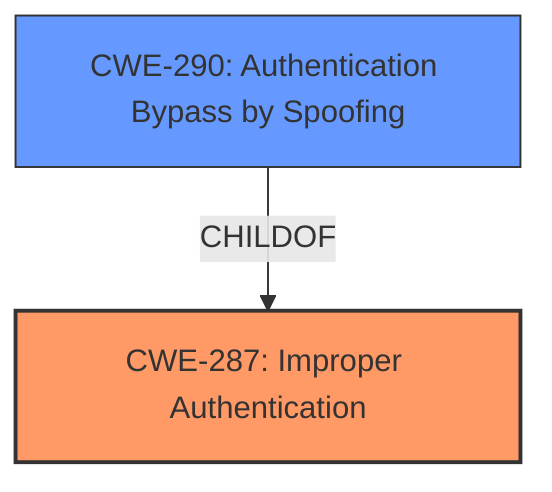

# Raw Analyzer Response for CVE-2021-20590

# Summary
| CWE ID | CWE Name | Confidence | CWE Abstraction Level | CWE Vulnerability Mapping Label | CWE-Vulnerability Mapping Notes |
|---|---|---|---|---|---|
| CWE-287 | Improper Authentication | 1.0 | Class | Primary | Discouraged |
| CWE-290 | Authentication Bypass by Spoofing | 0.7 | Base | Secondary | Allowed |

## Evidence and Confidence

*   **Confidence Score:** 0.85
*   **Evidence Strength:** HIGH

## Relationship Analysis
The primary CWE, CWE-287, is a Class-level weakness and a parent of CWE-290. CWE-290 is a Base-level weakness that describes authentication bypass by spoofing, which is a more specific case of improper authentication. Given that the vulnerability description mentions specially crafted packets to gain unauthorized access, and that the CVE summary indicates password authentication bypass, CWE-290 could be considered as a secondary weakness that adds specificity to the **improper authentication**. The relationship influenced the decision to include both CWE-287 and CWE-290, with CWE-287 as the primary due to the explicit mention of **improper authentication** in the vulnerability description.

## Vulnerability Chain
The chain of events is as follows:
1.  **Root Cause:** CWE-287 (**Improper Authentication**) exists in the VNC server function.
2.  A remote unauthenticated attacker exploits the **improper authentication** vulnerability by sending specially crafted packets.
3.  **Impact:** The attacker gains unauthorized access to the VNC server.

## Summary of Analysis
The initial analysis focused on the **improper authentication** vulnerability. The vulnerability description and the CVE summary both explicitly mention **improper authentication** as the root cause.

The CVE reference links content summary states: "The vulnerability is due to **improper authentication** in the VNC server function of Mitsubishi Electric GOT2000 and GOT SIMPLE series devices. Specifically, the vulnerability allows for password authentication bypass."

The Retriever Results list CWE-287 (**Improper Authentication**) as a potential candidate, although it is marked as Discouraged. However, given the explicit mention of **improper authentication**, it is appropriate to include CWE-287.

The Retriever Results also list CWE-290 (**Authentication Bypass by Spoofing**), which is a child of CWE-287. The vulnerability description mentions "specially crafted packets" which aligns with the concept of spoofing. Including CWE-290 provides a more specific classification.

CWE-287 is selected as the primary CWE because the vulnerability description explicitly states the **rootcause** is **improper authentication**. CWE-290 is included as a secondary CWE to provide more granularity, given that the vulnerability involves specially crafted packets and password authentication bypass. These selections are based on the evidence provided and an understanding of the relationships between different CWEs.

Relevant CWE Information:

# Enhanced Context (25 CWEs)
The following CWEs were identified as potentially relevant to this vulnerability:

## CWE-345: Insufficient Verification of Data Authenticity
**Abstraction Level**: Class
**Similarity Score**: 0.79
**Source**: dense

**Description**:
The product does not sufficiently verify the origin or authenticity of data, in a way that causes it to accept invalid data.

**Mapping Guidance**:
- Usage: Discouraged
- Rationale: This CWE entry is a level-1 Class (i.e., a child of a Pillar). It might have lower-level children that would be more appropriate

## CWE-1391: Use of Weak Credentials
**Abstraction Level**: Class
**Similarity Score**: 0.79
**Source**: dense

**Description**:
The product uses weak credentials (such as a default key or hard-coded password) that can be calculated, derived, reused, or guessed by an attacker.

**Mapping Guidance**:
- Usage: Allowed-with-Review
- Rationale: This CWE entry is a Class and might have Base-level children that would be more appropriate

## CWE-303: Incorrect Implementation of Authentication Algorithm
**Abstraction Level**: Base
**Similarity Score**: 0.78
**Source**: dense

**Description**:
The requirements for the product dictate the use of an established authentication algorithm, but the implementation of the algorithm is incorrect.

**Mapping Guidance**:
- Usage: Allowed
- Rationale: This CWE entry is at the Base level of abstraction, which is a preferred level of abstraction for mapping to the root causes of vulnerabilities.

## CWE-330: Use of Insufficiently Random Values
**Abstraction Level**: Class
**Similarity Score**: 0.78
**Source**: dense

**Description**:
The product uses insufficiently random numbers or values in a security context that depends on unpredictable numbers.

**Mapping Guidance**:
- Usage: Discouraged
- Rationale: This CWE entry is a level-1 Class (i.e., a child of a Pillar). It might have lower-level children that would be more appropriate

## CWE-1289: Improper Validation of Unsafe Equivalence in Input
**Abstraction Level**: Base
**Similarity Score**: 0.78
**Source**: dense

**Description**:
The product receives an input value that is used as a resource identifier or other type of reference, but it does not validate or incorrectly validates that the input is equivalent to a potentially-unsafe value.

**Mapping Guidance**:
- Usage: Allowed
- Rationale: This CWE entry is at the Base level of abstraction, which is a preferred level of abstraction for mapping to the root causes of vulnerabilities.

## CWE-807: Reliance on Untrusted Inputs in a Security Decision
**Abstraction Level**: Base
**Similarity Score**: 0.77
**Source**: dense

**Description**:
The product uses a protection mechanism that relies on the existence or values of an input, but the input can be modified by an untrusted actor in a way that bypasses the protection mechanism.

**Mapping Guidance**:
- Usage: Allowed
- Rationale: This CWE entry is at the Base level of abstraction, which is a preferred level of abstraction for mapping to the root causes of vulnerabilities.

## CWE-657: Violation of Secure Design Principles
**Abstraction Level**: Class
**Similarity Score**: 0.77
**Source**: dense

**Description**:
The product violates well-established principles for secure design.

**Mapping Guidance**:
- Usage: Discouraged
- Rationale: This CWE entry is a level-1 Class (i.e., a child of a Pillar). It might have lower-level children that would be more appropriate

## CWE-703: Improper Check or Handling of Exceptional Conditions
**Abstraction Level**: Pillar
**Similarity Score**: 0.77
**Source**: dense

**Description**:
The product does not properly anticipate or handle exceptional conditions that rarely occur during normal operation of the product.

**Mapping Guidance**:
- Usage: Discouraged
- Rationale: This CWE entry is extremely high-level, a Pillar.

## CWE-274: Improper Handling of Insufficient Privileges
**Abstraction Level**: Base
**Similarity Score**: 0.77
**Source**: dense

**Description**:
The product does not handle or incorrectly handles when it has insufficient privileges to perform an operation, leading to resultant weaknesses.

**Mapping Guidance**:
- Usage: Discouraged
- Rationale: This CWE entry could be deprecated in a future version of CWE.

## CWE-130: Improper Handling of Length Parameter Inconsistency
**Abstraction Level**: Base
**Similarity Score**: 0.77
**Source**: dense

**Description**:
The product parses a formatted message or structure, but it does not handle or incorrectly handles a length field that is inconsistent with the actual length of the associated data.

**Mapping Guidance**:
- Usage: Allowed
- Rationale: This CWE entry is at the Base level of abstraction, which is a preferred level of abstraction for mapping to the root causes of vulnerabilities.

## CWE-287: Improper Authentication
**Abstraction Level**: Class
**Similarity Score**: 4755.61
**Source**: sparse

**Description**:
When an actor claims to have a given identity, the product does not prove or insufficiently proves that the claim is correct.

**Mapping Guidance**:
- Usage: Discouraged
- Rationale: This CWE entry might be misused when lower-level CWE entries are likely to be applicable. It is a level-1 Class (i.e., a child of a Pillar).

## CWE-757: Selection of Less-Secure Algorithm During Negotiation ('Algorithm Downgrade')
**Abstraction Level**: Base
**Similarity Score**: 4717.24
**Source**: sparse

**Description**:
A protocol or its implementation supports interaction between multiple actors and allows those actors to negotiate which algorithm should be