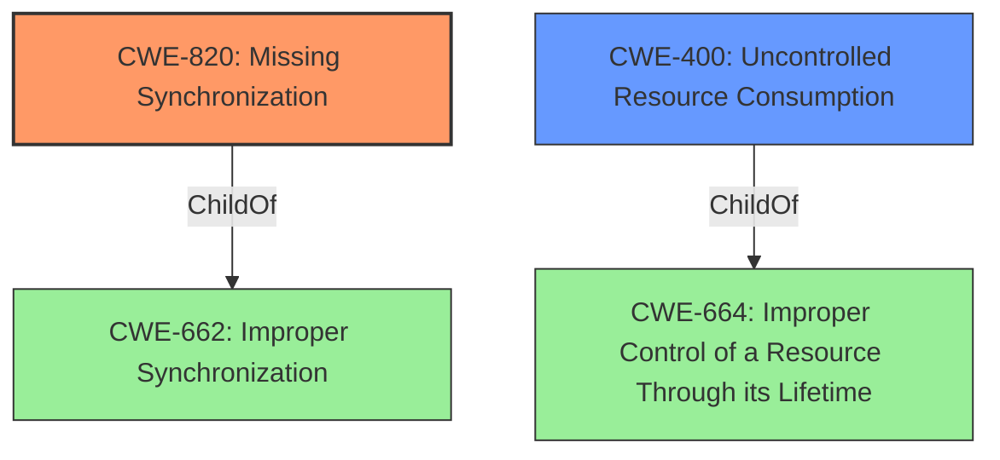

# Raw Analyzer Response for CVE-2021-20592

# Summary

| CWE ID  | CWE Name             | Confidence | CWE Abstraction Level | CWE Vulnerability Mapping Label | CWE-Vulnerability Mapping Notes |
| ------- | -------------------- | ---------- | --------------------- | ------------------------------- | ----------------------------- |
| CWE-820 | Missing Synchronization | 1.0        | Base                  | Primary                         | Allowed                       |
| CWE-400 | Uncontrolled Resource Consumption | 0.7      | Class                   | Secondary                       | Discouraged                  |

## Evidence and Confidence

*   **Confidence Score:** 0.9
*   **Evidence Strength:** HIGH

## Relationship Analysis

The primary relationship influencing the decision is the direct mapping of the **"missing synchronization"** **rootcause** to CWE-820. While CWE-400 is a plausible secondary effect (Denial of Service via resource consumption), CWE-820 directly addresses the **rootcause**.

## Vulnerability Chain

The vulnerability chain starts with a **missing synchronization** mechanism (CWE-820), which allows an attacker to repeatedly connect and disconnect, leading to **uncontrolled resource consumption** (CWE-400) and ultimately a Denial of Service (DoS).

## Summary of Analysis

Initial Analysis: The vulnerability description explicitly states "**Missing synchronization** vulnerability" as the **rootcause**, which directly aligns with CWE-820. The CVE Reference Links Content Summary also confirms that "**Root Cause: The vulnerability stems from a lack of proper synchronization** when accessing shared resources within the MODBUS/TCP slave communication function...This is identified as CWE-820 (Missing Synchronization)." The impact is a denial-of-service (DoS) condition, which could be related to CWE-400 (Uncontrolled Resource Consumption).

Criticism: While the DoS condition is a consequence of the **missing synchronization**, the primary focus should be on the **rootcause**. Mapping only to CWE-400 would be too high-level and would not accurately represent the fundamental flaw in the system.

Conclusion: The primary CWE is CWE-820 because it represents the **rootcause** of the vulnerability. CWE-400 is considered a secondary weakness representing the impact of the vulnerability. The selection of CWE-820 is based on the explicit mention of "**missing synchronization**" in both the vulnerability description and the CVE Reference Links Content Summary. This is further supported by the Retriever Results, which identify CWE-820 as the top candidate.

Relevant CWE Information:

# Enhanced Context (25 CWEs)

## CWE-274: Improper Handling of Insufficient Privileges
**Abstraction Level**: Base
**Similarity Score**: 0.77

**Description**:
The product does not handle or incorrectly handles when it has insufficient privileges to perform an operation, leading to resultant weaknesses.

**Mapping Guidance**:
- Usage: Discouraged

## CWE-653: Improper Isolation or Compartmentalization
**Abstraction Level**: Class
**Similarity Score**: 0.77

**Description**:
The product does not properly compartmentalize or isolate functionality, processes, or resources that require different privilege levels, rights, or permissions.

**Mapping Guidance**:
- Usage: Allowed

## CWE-807: Reliance on Untrusted Inputs in a Security Decision
**Abstraction Level**: Base
**Similarity Score**: 0.76

**Description**:
The product uses a protection mechanism that relies on the existence or values of an input, but the input can be modified by an untrusted actor in a way that bypasses the protection mechanism.

**Mapping Guidance**:
- Usage: Allowed

## CWE-280: Improper Handling of Insufficient Permissions or Privileges
**Abstraction Level**: Base
**Similarity Score**: 0.76

**Description**:
The product does not handle or incorrectly handles when it has insufficient privileges to access resources or functionality as specified by their permissions. This may cause it to follow unexpected code paths that may leave the product in an invalid state.

**Mapping Guidance**:
- Usage: Allowed

## CWE-1289: Improper Validation of Unsafe Equivalence in Input
**Abstraction Level**: Base
**Similarity Score**: 0.76

**Description**:
The product receives an input value that is used as a resource identifier or other type of reference, but it does not validate or incorrectly validates that the input is equivalent to a potentially-unsafe value.

**Mapping Guidance**:
- Usage: Allowed

## CWE-404: Improper Resource Shutdown or Release
**Abstraction Level**: Class
**Similarity Score**: 0.76

**Description**:
The product does not release or incorrectly releases a resource before it is made available for re-use.

**Mapping Guidance**:
- Usage: Allowed-with-Review

## CWE-664: Improper Control of a Resource Through its Lifetime
**Abstraction Level**: Pillar
**Similarity Score**: 0.75

**Description**:
The product does not maintain or incorrectly maintains control over a resource throughout its lifetime of creation, use, and release.

**Mapping Guidance**:
- Usage: Discouraged

## CWE-668: Exposure of Resource to Wrong Sphere
**Abstraction Level**: Class
**Similarity Score**: 0.75

**Description**:
The product exposes a resource to the wrong control sphere, providing unintended actors with inappropriate access to the resource.

**Mapping Guidance**:
- Usage: Discouraged

## CWE-799: Improper Control of Interaction Frequency
**Abstraction Level**: Class
**Similarity Score**: 0.75

**Description**:
The product does not properly limit the number or frequency of interactions that it has with an actor, such as the number of incoming requests.

**Mapping Guidance**:
- Usage: Allowed-with-Review

## CWE-667: Improper Locking
**Abstraction Level**: Class
**Similarity Score**: 0.75

**Description**:
The product does not properly acquire or release a lock on a resource, leading to unexpected resource state changes and behaviors.

**Mapping Guidance**:
- Usage: Allowed-with-Review

## CWE-1284: Improper Validation of Specified Quantity in Input
**Abstraction Level**: Base
**Similarity Score**: 7195.57

**Description**:
The product receives input that is expected to specify a quantity (such as size or length), but it does not validate or incorrectly validates that the quantity has the required properties.

**Mapping Guidance**:
- Usage: Allowed

## CWE-119: Improper Restriction of Operations within the Bounds of a Memory Buffer
**Abstraction Level**: Class
**Similarity Score**: 7167.41

**Description**:
The product performs operations on a memory buffer, but it reads from or writes to a memory location outside the buffer's intended boundary.

**Mapping Guidance**:
- Usage: Discouraged

## CWE-287: Improper Authentication
**Abstraction Level**: Class
**Similarity Score**: 7050.70

**Description**:
When an actor claims to have a given identity, the product does not prove or insufficiently proves that the claim is correct.

**Mapping Guidance**:
- Usage: Discouraged

## CWE-770: Allocation of Resources Without Limits or Throttling
**Abstraction Level**: Base
**Similarity Score**: 7026.40

**Description**:
The product allocates a reusable resource or group of resources on behalf of an actor without imposing any restrictions on the size or number of resources that can be allocated, in violation of the intended security policy for that actor.

**Mapping Guidance**:
- Usage: Allowed

## CWE-125: Out-of-bounds Read
**Abstraction Level**: Base
**Similarity Score**: 7007.32

**Description**:
The product reads data past the end, or before the beginning, of the intended buffer.

**Mapping Guidance**:
- Usage: Allowed

## CWE-41: Improper Resolution of Path Equivalence
**Abstraction Level**: base
**Similarity Score**: 5.03

**Description**:
CWE-41: Improper Resolution of Path Equivalence

**Mapping Guidance**:
- Usage: Allowed

## CWE-410: Insufficient Resource Pool
**Abstraction Level**: base
**Similarity Score**: 4.33

**Description**:
CWE-410: Insufficient Resource Pool

**Mapping Guidance**:
- Usage: Allowed

## CWE-770: Allocation of Resources Without Limits or Throttling
**Abstraction Level**: base
**Similarity Score**: 4.33