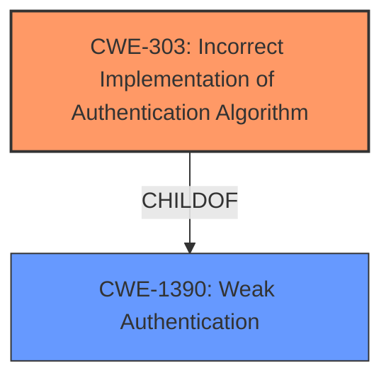

# Raw Analyzer Response for CVE-2021-20593

# Summary
| CWE ID | CWE Name | Confidence | CWE Abstraction Level | CWE Vulnerability Mapping Label | CWE-Vulnerability Mapping Notes |
|---|---|---|---|---|---|
| CWE-303 | Incorrect Implementation of Authentication Algorithm | 1.0 | Base | Allowed | Primary CWE |

## Evidence and Confidence

*   **Confidence Score:** 1.0
*   **Evidence Strength:** HIGH

## Relationship Analysis
The primary CWE, CWE-303, is a Base level CWE and a child of CWE-1390 (Weak Authentication). The relationship analysis shows that the vulnerability stems from a specific implementation flaw in the authentication algorithm, making CWE-303 the most appropriate choice.

## Vulnerability Chain
The vulnerability chain starts with the **incorrect implementation of the authentication algorithm** (CWE-303). This leads to the ability for a remote authenticated attacker to impersonate administrators, which in turn results in the disclosure of configuration information and the tampering of system settings.

## Summary of Analysis
The analysis strongly supports the selection of CWE-303 as the primary CWE for this vulnerability.

The **Vulnerability Description Key Phrases** section lists "**Incorrect Implementation of Authentication Algorithm**" as the **rootcause**. The **CVE Reference Links Content Summary** section confirms this, stating the "**Root cause of vulnerability**: **Incorrect implementation of the authentication algorithm** in the WEB functions of Mitsubishi Electric air conditioning systems." It also explicitly identifies "CWE-303: **Incorrect Implementation of Authentication Algorithm**" as a weakness.

The **Retriever Results** also list CWE-303 as the top combined result.

The CWE-303 description, "The requirements for the product dictate the use of an established authentication algorithm, but the implementation of the algorithm is incorrect," aligns precisely with the vulnerability description. The **Mapping Guidance** for CWE-303 states that it is at the Base level of abstraction, which is a preferred level. The usage is "Allowed" and the rationale specifies that it is an appropriate fit.

Other CWEs like CWE-327 (Use of a Broken or Risky Cryptographic Algorithm) were considered but deemed less appropriate. While related to authentication, CWE-327 focuses on the algorithm itself being flawed, rather than an incorrect implementation of a standard algorithm. In this case, the **rootcause** is the incorrect implementation.
CWE-288 Authentication Bypass Using an Alternate Path or Channel was considered since it has a similar theme, but the vulnerability is not about an alternate channel, but rather a flaw in the primary authentication mechanism.
CWE-1390 Weak Authentication was considered, but it is a class level CWE, and the description is more specific around the algorithm, not the implementation of it.
The selection of CWE-303 is at the optimal level of specificity because it directly addresses the **rootcause** identified in the vulnerability description.

Relevant CWE Information: