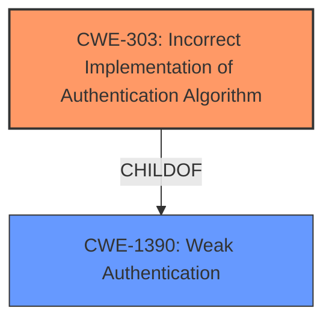

# Analysis for CVE-2021-20593

# Summary
| CWE ID | CWE Name | Confidence | CWE Abstraction Level | CWE Vulnerability Mapping Label | CWE-Vulnerability Mapping Notes |
|---|---|---|---|---|---|
| CWE-303 | Incorrect Implementation of Authentication Algorithm | 1.0 | Base | Allowed | Primary CWE |

## Evidence and Confidence

*   **Confidence Score:** 1.0
*   **Evidence Strength:** HIGH

## Relationship Analysis
The primary CWE, CWE-303, is a Base level CWE and a child of CWE-1390 (Weak Authentication). The relationship analysis shows that the vulnerability stems from a specific implementation flaw in the authentication algorithm, making CWE-303 the most appropriate choice.



## Vulnerability Chain
The vulnerability chain starts with the **incorrect implementation of the authentication algorithm** (CWE-303). This leads to the ability for a remote authenticated attacker to impersonate administrators, which in turn results in the disclosure of configuration information and the tampering of system settings.

## Summary of Analysis
The analysis strongly supports the selection of CWE-303 as the primary CWE for this vulnerability.

The **Vulnerability Description Key Phrases** section lists "**Incorrect Implementation of Authentication Algorithm**" as the **rootcause**. The **CVE Reference Links Content Summary** section confirms this, stating the "**Root cause of vulnerability**: **Incorrect implementation of the authentication algorithm** in the WEB functions of Mitsubishi Electric air conditioning systems." It also explicitly identifies "CWE-303: **Incorrect Implementation of Authentication Algorithm**" as a weakness.

The **Retriever Results** also list CWE-303 as the top combined result.

The CWE-303 description, "The requirements for the product dictate the use of an established authentication algorithm, but the implementation of the algorithm is incorrect," aligns precisely with the vulnerability description. The **Mapping Guidance** for CWE-303 states that it is at the Base level of abstraction, which is a preferred level. The usage is "Allowed" and the rationale specifies that it is an appropriate fit.

Other CWEs like CWE-327 (Use of a Broken or Risky Cryptographic Algorithm) were considered but deemed less appropriate. While related to authentication, CWE-327 focuses on the algorithm itself being flawed, rather than an incorrect implementation of a standard algorithm. In this case, the **rootcause** is the incorrect implementation.
CWE-288 Authentication Bypass Using an Alternate Path or Channel was considered since it has a similar theme, but the vulnerability is not about an alternate channel, but rather a flaw in the primary authentication mechanism.
CWE-1390 Weak Authentication was considered, but it is a class level CWE, and the description is more specific around the algorithm, not the implementation of it.
The selection of CWE-303 is at the optimal level of specificity because it directly addresses the **rootcause** identified in the vulnerability description.

Relevant CWE Information:

# Enhanced Query for CVE-2021-20593

## Vulnerability Description
**Incorrect Implementation of Authentication Algorithm** in Mitsubishi Electric Air Conditioning System/Centralized Controllers (G-50A Ver.2.50 to Ver. 3.35, GB-50A Ver.2.50 to Ver. 3.35, AG-150A-A Ver.3.20 and prior, AG-150A-J Ver.3.20 and prior, GB-50ADA-A Ver.3.20 and prior, GB-50ADA-J Ver.3.20 and prior, EB-50GU-A Ver 7.09 and prior, EB-50GU-J Ver 7.09 and prior, AE-200A Ver 7.93 and prior, AE-200E Ver 7.93 and prior, AE-50A Ver 7.93 and prior, AE-50E Ver 7.93 and prior, EW-50A Ver 7.93 and prior, EW-50E Ver 7.93 and prior, TE-200A Ver 7.93 and prior, TE-50A Ver 7.93 and prior, TW-50A Ver 7.93 and prior, CMS-RMD-J Ver.1.30 and prior) and Air Conditioning System/Expansion Controllers (PAC-YG50ECA Ver.2.20 and prior) allows a remote authenticated attacker to impersonate administrators to disclose configuration information of the air conditioning system and tamper information (e.g. operation information and configuration of air conditioning system) by exploiting this vulnerability.

### Vulnerability Description Key Phrases
- **rootcause:** **Incorrect Implementation of Authentication Algorithm**
- **impact:** disclose configuration information of the air conditioning system and tamper information (e.g. operation information and configuration of air conditioning system)
- **attacker:** remote authenticated attacker
- **product:** Mitsubishi Electric Air Conditioning System/Centralized Controllers and Air Conditioning System/Expansion Controllers
- **version:** G-50A Ver.2.50 to Ver. 3.35 and GB-50A Ver.2.50 to Ver. 3.35 and AG-150A-A Ver.3.20 and prior and AG-150A-J Ver.3.20 and prior and GB-50ADA-A Ver.3.20 and prior and GB-50ADA-J Ver.3.20 and prior and EB-50GU-A Ver 7.09 and prior and EB-50GU-J Ver 7.09 and prior and AE-200A Ver 7.93 and prior and AE-200E Ver 7.93 and prior and AE-50A Ver 7.93 and prior and AE-50E Ver 7.93 and prior and EW-50A Ver 7.93 and prior and EW-50E Ver 7.93 and prior and TE-200A Ver 7.93 and prior and TE-50A Ver 7.93 and prior and TW-50A Ver 7.93 and prior and CMS-RMD-J Ver.1.30 and prior and PAC-YG50ECA Ver.2.20 and prior

## CVE Reference Links Content Summary
```
{
  "Root cause of vulnerability": "Incorrect implementation of the authentication algorithm in the WEB functions of Mitsubishi Electric air conditioning systems.",
  "Weaknesses/vulnerabilities present": [
    "CWE-303: Incorrect Implementation of Authentication Algorithm"
  ],
  "Impact of exploitation": "A malicious attacker can impersonate administrators, leading to the disclosure of configuration information and the ability to tamper with system settings (e.g., operation and configuration of the air conditioning system).",
  "Attack vectors": "The vulnerability can be exploited remotely through the WEB interface of the affected air conditioning systems.",
  "Required attacker capabilities/position": "An attacker needs to have network access to the WEB interface of the air conditioning systems. In certain configurations (without VPN), this may be over the internet."
}
```

## Retriever Results

### Top Combined Results

| Rank | CWE ID | Name | Abstraction | Usage  | Retrievers | Individual Scores |
|------|--------|------|-------------|-------|------------|-------------------|
| 1 | 303 | Incorrect Implementation of Authentication Algorithm | Base | Allowed | sparse | 2.941 |
| 2 | 327 | Use of a Broken or Risky Cryptographic Algorithm | Class | Allowed-with-Review | sparse | 1.741 |
| 3 | 912 | Hidden Functionality | Class | Allowed-with-Review | sparse | 1.207 |
| 4 | 288 | Authentication Bypass Using an Alternate Path or Channel | Base | Allowed | sparse | 1.202 |
| 5 | 291 | Reliance on IP Address for Authentication | Variant | Allowed | sparse | 1.121 |
| 6 | 326 | Inadequate Encryption Strength | Class | Allowed-with-Review | dense | 0.577 |
| 7 | 208 | Observable Timing Discrepancy | Base | Allowed | graph | 0.002 |
| 8 | 284 | Improper Access Control | Pillar | Discouraged | sparse | 1.066 |
| 9 | 1336 | Improper Neutralization of Special Elements Used in a Template Engine | Base | Allowed | sparse | 1.040 |
| 10 | 939 | Improper Authorization in Handler for Custom URL Scheme | Base | Allowed | sparse | 0.973 |


# Complete CWE Specifications


## CWE-303: Incorrect Implementation of Authentication Algorithm
**Abstraction:** Base
**Status:** Draft

### Description
The requirements for the product dictate the use of an established authentication algorithm, but the implementation of the algorithm is incorrect.

### Extended Description
This incorrect implementation may allow authentication to be bypassed.

### Alternative Terms
None

### Relationships
ChildOf -> CWE-1390

### Mapping Guidance
**Usage:** Allowed
**Rationale:** This CWE entry is at the Base level of abstraction, which is a preferred level of abstraction for mapping to the root causes of vulnerabilities.
**Comments:** Carefully read both the name and description to ensure that this mapping is an appropriate fit. Do not try to 'force' a mapping to a lower-level Base/Variant simply to comply with this preferred level of abstraction.
**Reasons:**
- Acceptable-Use


### Observed Examples
- **CVE-2003-0750:** Conditional should have been an 'or' not an 'and'.


## CWE-327: Use of a Broken or Risky Cryptographic Algorithm
**Abstraction:** Class
**Status:** Draft

### Description
The product uses a broken or risky cryptographic algorithm or protocol.

### Extended Description


Cryptographic algorithms are the methods by which data is scrambled to prevent observation or influence by unauthorized actors. Insecure cryptography can be exploited to expose sensitive information, modify data in unexpected ways, spoof identities of other users or devices, or other impacts.


It is very difficult to produce a secure algorithm, and even high-profile algorithms by accomplished cryptographic experts have been broken. Well-known techniques exist to break or weaken various kinds of cryptography. Accordingly, there are a small number of well-understood and heavily studied algorithms that should be used by most products. Using a non-standard or known-insecure algorithm is dangerous because a determined adversary may be able to break the algorithm and compromise whatever data has been protected.


Since the state of cryptography advances so rapidly, it is common for an algorithm to be considered "unsafe" even if it was once thought to be strong. This can happen when new attacks are discovered, or if computing power increases so much that the cryptographic algorithm no longer provides the amount of protection that was originally thought.


For a number of reasons, this weakness is even more challenging to manage with hardware deployment of cryptographic algorithms as opposed to software implementation. First, if a flaw is discovered with hardware-implemented cryptography, the flaw cannot be fixed in most cases without a recall of the product, because hardware is not easily replaceable like software. Second, because the hardware product is expected to work for years, the adversary's computing power will only increase over time.


### Alternative Terms
None

### Relationships
ChildOf -> CWE-693
PeerOf -> CWE-311

### Mapping Guidance
**Usage:** Allowed-with-Review
**Rationale:** This CWE entry is a Class and might have Base-level children that would be more appropriate
**Comments:** Examine children of this entry to see if there is a better fit
**Reasons:**
- Abstraction


### Additional Notes
**[Maintenance]** Since CWE 4.4, various cryptography-related entries, including CWE-327 and CWE-1240, have been slated for extensive research, analysis, and community consultation to define consistent terminology, improve relationships, and reduce overlap or duplication. As of CWE 4.6, this work is still ongoing.

**[Maintenance]** The Taxonomy_Mappings to ISA/IEC 62443 were added in CWE 4.10, but they are still under review and might change in future CWE versions. These draft mappings were performed by members of the "Mapping CWE to 62443" subgroup of the CWE-CAPEC ICS/OT Special Interest Group (SIG), and their work is incomplete as of CWE 4.10. The mappings are included to facilitate discussion and review by the broader ICS/OT community, and they are likely to change in future CWE versions.


### Observed Examples
- **CVE-2022-30273:** SCADA-based protocol supports a legacy encryption mode that uses Tiny Encryption Algorithm (TEA) in ECB mode, which leaks patterns in messages and cannot protect integrity
- **CVE-2022-30320:** Programmable Logic Controller (PLC) uses a protocol with a cryptographically insecure hashing algorithm for passwords.
- **CVE-2008-3775:** Product uses "ROT-25" to obfuscate the password in the registry.


## CWE-912: Hidden Functionality
**Abstraction:** Class
**Status:** Incomplete

### Description
The product contains functionality that is not documented, not part of the specification, and not accessible through an interface or command sequence that is obvious to the product's users or administrators.

### Extended Description
Hidden functionality can take many forms, such as intentionally malicious code, "Easter Eggs" that contain extraneous functionality such as games, developer-friendly shortcuts that reduce maintenance or support costs such as hard-coded accounts, etc. From a security perspective, even when the functionality is not intentionally malicious or damaging, it can increase the product's attack surface and expose additional weaknesses beyond what is already exposed by the intended functionality. Even if it is not easily accessible, the hidden functionality could be useful for attacks that modify the control flow of the application.

### Alternative Terms
None

### Relationships
ChildOf -> CWE-684

### Mapping Guidance
**Usage:** Allowed-with-Review
**Rationale:** This CWE entry is a Class and might have Base-level children that would be more appropriate
**Comments:** Examine children of this entry to see if there is a better fit
**Reasons:**
- Abstraction


### Observed Examples
- **CVE-2022-31260:** Chain: a digital asset management program has an undisclosed backdoor in the legacy version of a PHP script (CWE-912) that could allow an unauthenticated user to export metadata (CWE-306)
- **CVE-2022-3203:** A wireless access point manual specifies that the only method of configuration is via web interface (CWE-1059), but there is an undisclosed telnet server that was activated by default (CWE-912).


## CWE-288: Authentication Bypass Using an Alternate Path or Channel
**Abstraction:** Base
**Status:** Incomplete

### Description
The product requires authentication, but the product has an alternate path or channel that does not require authentication.

### Extended Description
Not provided

### Alternative Terms
None

### Relationships
ChildOf -> CWE-306
ChildOf -> CWE-284
PeerOf -> CWE-420

### Mapping Guidance
**Usage:** Allowed
**Rationale:** This CWE entry is at the Base level of abstraction, which is a preferred level of abstraction for mapping to the root causes of vulnerabilities.
**Comments:** Carefully read both the name and description to ensure that this mapping is an appropriate fit. Do not try to 'force' a mapping to a lower-level Base/Variant simply to comply with this preferred level of abstraction.
**Reasons:**
- Acceptable-Use


### Additional Notes
**[Relationship]** overlaps Unprotected Alternate Channel


### Observed Examples
- **CVE-2000-1179:** Router allows remote attackers to read system logs without authentication by directly connecting to the login screen and typing certain control characters.
- **CVE-1999-1454:** Attackers with physical access to the machine may bypass the password prompt by pressing the ESC (Escape) key.
- **CVE-1999-1077:** OS allows local attackers to bypass the password protection of idled sessions via the programmer's switch or CMD-PWR keyboard sequence, which brings up a debugger that the attacker can use to disable the lock.


## CWE-291: Reliance on IP Address for Authentication
**Abstraction:** Variant
**Status:** Incomplete

### Description
The product uses an IP address for authentication.

### Extended Description
IP addresses can be easily spoofed. Attackers can forge the source IP address of the packets they send, but response packets will return to the forged IP address. To see the response packets, the attacker has to sniff the traffic between the victim machine and the forged IP address. In order to accomplish the required sniffing, attackers typically attempt to locate themselves on the same subnet as the victim machine. Attackers may be able to circumvent this requirement by using source routing, but source routing is disabled across much of the Internet today. In summary, IP address verification can be a useful part of an authentication scheme, but it should not be the single factor required for authentication.

### Alternative Terms
None

### Relationships
ChildOf -> CWE-290
ChildOf -> CWE-923
ChildOf -> CWE-471

### Mapping Guidance
**Usage:** Allowed
**Rationale:** This CWE entry is at the Variant level of abstraction, which is a preferred level of abstraction for mapping to the root causes of vulnerabilities.
**Comments:** Carefully read both the name and description to ensure that this mapping is an appropriate fit. Do not try to 'force' a mapping to a lower-level Base/Variant simply to comply with this preferred level of abstraction.
**Reasons:**
- Acceptable-Use


### Observed Examples
- **CVE-2022-30319:** S-bus functionality in a home automation product performs access control using an IP allowlist, which can be bypassed by a forged IP address.


## CWE-326: Inadequate Encryption Strength
**Abstraction:** Class
**Status:** Draft

### Description
The product stores or transmits sensitive data using an encryption scheme that is theoretically sound, but is not strong enough for the level of protection required.

### Extended Description
A weak encryption scheme can be subjected to brute force attacks that have a reasonable chance of succeeding using current attack methods and resources.

### Alternative Terms
None

### Relationships
ChildOf -> CWE-693

### Mapping Guidance
**Usage:** Allowed-with-Review
**Rationale:** This CWE entry is a Class and might have Base-level children that would be more appropriate
**Comments:** Examine children of this entry to see if there is a better fit
**Reasons:**
- Abstraction


### Observed Examples
- **CVE-2001-1546:** Weak encryption
- **CVE-2004-2172:** Weak encryption (chosen plaintext attack)
- **CVE-2002-1682:** Weak encryption


## CWE-208: Observable Timing Discrepancy
**Abstraction:** Base
**Status:** Incomplete

### Description
Two separate operations in a product require different amounts of time to complete, in a way that is observable to an actor and reveals security-relevant information about the state of the product, such as whether a particular operation was successful or not.

### Extended Description
In security-relevant contexts, even small variations in timing can be exploited by attackers to indirectly infer certain details about the product's internal operations. For example, in some cryptographic algorithms, attackers can use timing differences to infer certain properties about a private key, making the key easier to guess. Timing discrepancies effectively form a timing side channel.

### Alternative Terms
None

### Relationships
ChildOf -> CWE-203
CanPrecede -> CWE-385
CanPrecede -> CWE-327

### Mapping Guidance
**Usage:** Allowed
**Rationale:** This CWE entry is at the Base level of abstraction, which is a preferred level of abstraction for mapping to the root causes of vulnerabilities.
**Comments:** Carefully read both the name and description to ensure that this mapping is an appropriate fit. Do not try to 'force' a mapping to a lower-level Base/Variant simply to comply with this preferred level of abstraction.
**Reasons:**
- Acceptable-Use


### Additional Notes
**[Relationship]** Often primary in cryptographic applications and algorithms.

**[Maintenance]** CWE 4.16 removed a demonstrative example for a hardware module because it was inaccurate and unable to be adapted. The CWE team is developing an alternative.


### Observed Examples
- **CVE-2019-10071:** Java-oriented framework compares HMAC signatures using String.equals() instead of a constant-time algorithm, causing timing discrepancies
- **CVE-2019-10482:** Smartphone OS uses comparison functions that are not in constant time, allowing side channels
- **CVE-2014-0984:** Password-checking function in router terminates validation of a password entry when it encounters the first incorrect character, which allows remote attackers to obtain passwords via a brute-force attack that relies on timing differences in responses to incorrect password guesses, aka a timing side-channel attack.


## CWE-284: Improper Access Control
**Abstraction:** Pillar
**Status:** Incomplete

### Description
The product does not restrict or incorrectly restricts access to a resource from an unauthorized actor.

### Extended Description


Access control involves the use of several protection mechanisms such as:


  - Authentication (proving the identity of an actor)

  - Authorization (ensuring that a given actor can access a resource), and

  - Accountability (tracking of activities that were performed)

When any mechanism is not applied or otherwise fails, attackers can compromise the security of the product by gaining privileges, reading sensitive information, executing commands, evading detection, etc.

There are two distinct behaviors that can introduce access control weaknesses:


  - Specification: incorrect privileges, permissions, ownership, etc. are explicitly specified for either the user or the resource (for example, setting a password file to be world-writable, or giving administrator capabilities to a guest user). This action could be performed by the program or the administrator.

  - Enforcement: the mechanism contains errors that prevent it from properly enforcing the specified access control requirements (e.g., allowing the user to specify their own privileges, or allowing a syntactically-incorrect ACL to produce insecure settings). This problem occurs within the program itself, in that it does not actually enforce the intended security policy that the administrator specifies.


### Alternative Terms
Authorization: The terms "access control" and "authorization" are often used interchangeably, although many people have distinct definitions. The CWE usage of "access control" is intended as a general term for the various mechanisms that restrict which users can access which resources, and "authorization" is more narrowly defined. It is unlikely that there will be community consensus on the use of these terms.

### Relationships
None

### Mapping Guidance
**Usage:** Discouraged
**Rationale:** CWE-284 is extremely high-level, a Pillar. Its name, "Improper Access Control," is often misused in low-information vulnerability reports [REF-1287] or by active use of the OWASP Top Ten, such as "A01:2021-Broken Access Control". It is not useful for trend analysis.
**Comments:** Consider using descendants of CWE-284 that are more specific to the kind of access control involved, such as those involving authorization (Missing Authorization (CWE-862), Incorrect Authorization (CWE-863), Incorrect Permission Assignment for Critical Resource (CWE-732), etc.); authentication (Missing Authentication (CWE-306) or Weak Authentication (CWE-1390)); Incorrect User Management (CWE-286); Improper Restriction of Communication Channel to Intended Endpoints (CWE-923); etc.
**Reasons:**
- Frequent Misuse
- Abstraction
**Suggested Alternatives:**
- CWE-862: Missing Authorization
- CWE-863: Incorrect Authorization
- CWE-732: Incorrect Permission Assignment for Critical Resource
- CWE-306: Missing Authentication
- CWE-1390: Weak Authentication
- CWE-923: Improper Restriction of Communication Channel to Intended Endpoints


### Additional Notes
**[Maintenance]** 

This entry needs more work. Possible sub-categories include:


  - Trusted group includes undesired entities (partially covered by CWE-286)

  - Group can perform undesired actions

  - ACL parse error does not fail closed


### Observed Examples
- **CVE-2022-24985:** A form hosting website only checks the session authentication status for a single form, making it possible to bypass authentication when there are multiple forms
- **CVE-2022-29238:** Access-control setting in web-based document collaboration tool is not properly implemented by the code, which prevents listing hidden directories but does not prevent direct requests to files in those directories.
- **CVE-2022-23607:** Python-based HTTP library did not scope cookies to a particular domain such that "supercookies" could be sent to any domain on redirect


## CWE-1336: Improper Neutralization of Special Elements Used in a Template Engine
**Abstraction:** Base
**Status:** Incomplete

### Description
The product uses a template engine to insert or process externally-influenced input, but it does not neutralize or incorrectly neutralizes special elements or syntax that can be interpreted as template expressions or other code directives when processed by the engine.

### Extended Description


Many web applications use template engines that allow developers to insert externally-influenced values into free text or messages in order to generate a full web page, document, message, etc. Such engines include Twig, Jinja2, Pug, Java Server Pages, FreeMarker, Velocity, ColdFusion, Smarty, and many others - including PHP itself. Some CMS (Content Management Systems) also use templates.


Template engines often have their own custom command or expression language. If an attacker can influence input into a template before it is processed, then the attacker can invoke arbitrary expressions, i.e. perform injection attacks. For example, in some template languages, an attacker could inject the expression "{{7*7}}" and determine if the output returns "49" instead. The syntax varies depending on the language.


In some cases, XSS-style attacks can work, which can obscure the root cause if the developer does not closely investigate the root cause of the error.


Template engines can be used on the server or client, so both "sides" could be affected by injection. The mechanisms of attack or the affected technologies might be different, but the mistake is fundamentally the same.


### Alternative Terms
Server-Side Template Injection / SSTI: This term is used for injection into template engines being used by a server.
Client-Side Template Injection / CSTI: This term is used for injection into template engines being used by a client.

### Relationships
ChildOf -> CWE-94

### Mapping Guidance
**Usage:** Allowed
**Rationale:** This CWE entry is at the Base level of abstraction, which is a preferred level of abstraction for mapping to the root causes of vulnerabilities.
**Comments:** Carefully read both the name and description to ensure that this mapping is an appropriate fit. Do not try to 'force' a mapping to a lower-level Base/Variant simply to comply with this preferred level of abstraction.
**Reasons:**
- Acceptable-Use


### Additional Notes
**[Relationship]** Since expression languages are often used in templating languages, there may be some overlap with CWE-917 (Expression Language Injection). XSS (CWE-79) is also co-located with template injection.

**[Maintenance]** The interrelationships and differences between CWE-917 and CWE-1336 need to be further clarified.


### Observed Examples
- **CVE-2024-34359:** Chain: Python bindings for LLM library do not use a sandboxed environment when parsing a template and constructing a prompt, allowing jinja2 Server Side Template Injection and code execution - one variant of a "prompt injection" attack.
- **CVE-2017-16783:** server-side template injection in content management server
- **CVE-2020-9437:** authentication / identity management product has client-side template injection


## CWE-939: Improper Authorization in Handler for Custom URL Scheme
**Abstraction:** Base
**Status:** Incomplete

### Description
The product uses a handler for a custom URL scheme, but it does not properly restrict which actors can invoke the handler using the scheme.

### Extended Description
Mobile platforms and other architectures allow the use of custom URL schemes to facilitate communication between applications. In the case of iOS, this is the only method to do inter-application communication. The implementation is at the developer's discretion which may open security flaws in the application. An example could be potentially dangerous functionality such as modifying files through a custom URL scheme.

### Alternative Terms
None

### Relationships
ChildOf -> CWE-862

### Mapping Guidance
**Usage:** Allowed
**Rationale:** This CWE entry is at the Base level of abstraction, which is a preferred level of abstraction for mapping to the root causes of vulnerabilities.
**Comments:** Carefully read both the name and description to ensure that this mapping is an appropriate fit. Do not try to 'force' a mapping to a lower-level Base/Variant simply to comply with this preferred level of abstraction.
**Reasons:**
- Acceptable-Use


### Observed Examples
- **CVE-2013-5725:** URL scheme has action replace which requires no user prompt and allows remote attackers to perform undesired actions.
- **CVE-2013-5726:** URL scheme has action follow and favorite which allows remote attackers to force user to perform undesired actions.

