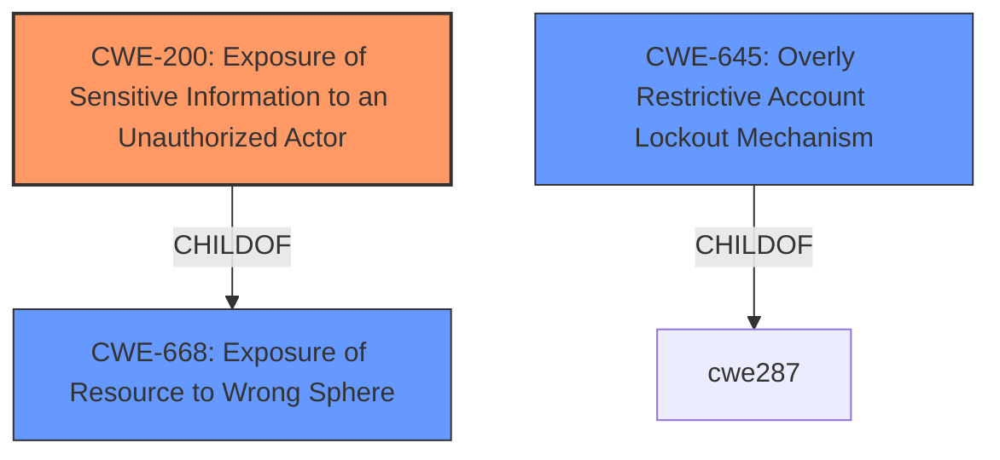

# Raw Analyzer Response for CVE-2021-20594

# Summary
| CWE ID  | CWE Name                                                       | Confidence | CWE Abstraction Level | CWE Vulnerability Mapping Label | CWE-Vulnerability Mapping Notes |
| :-------- | :------------------------------------------------------------- | :--------- | :-------------------- | :------------------------------ | :------------------------------ |
| CWE-200 | Exposure of Sensitive Information to an Unauthorized Actor | 0.75       | Class                 | Primary CWE                     | Discouraged                   |
| CWE-645 | Overly Restrictive Account Lockout Mechanism                | 0.5        | Base                  | Secondary Candidate             | Allowed                         |

## Evidence and Confidence

*   **Confidence Score:** 0.75
*   **Evidence Strength:** HIGH

## Relationship Analysis
The primary relationship that influenced the CWE selection was the parent-child relationship between CWE-668 and CWE-200. CWE-200 is a child of CWE-668, indicating a more specific type of resource exposure. However, CWE-200 is a Class, and the guidance discourages its use. However, given the provided information, it seems to be the most appropriate in this case.

## Vulnerability Chain
The vulnerability chain starts with the **weakness** of **Exposure of Sensitive Information to an Unauthorized Actor**. This leads to the impact of an attacker being able to acquire legitimate user names via a brute-force attack, potentially followed by a lockout due to multiple failed attempts.

## Summary of Analysis
The initial analysis focused on the **weakness** described in the vulnerability description and the CVE reference links content summary: **Exposure of Sensitive Information to an Unauthorized Actor**. The vulnerability allows a remote, unauthenticated attacker to acquire legitimate usernames registered in the module via a brute-force attack.

The selection of CWE-200 is based on the explicit mention of "Exposure of Sensitive Information to an Unauthorized Actor" in the vulnerability description and the CVE reference links content summary. While CWE-200 is discouraged, there is insufficient information to choose a more specific child CWE. The retriever results also include CWE-645: Overly Restrictive Account Lockout Mechanism which may be a secondary issue.

Relevant CWE Information:

# Enhanced Context (25 CWEs)

## CWE-226: Sensitive Information in Resource Not Removed Before Reuse
**Abstraction Level**: Base
**Similarity Score**: 0.77
**Source**: dense

**Description**:
The product releases a resource such as memory or a file so that it can be made available for reuse, but it does not clear or "zeroize" the information contained in the resource before the product performs a critical state transition or makes the resource available for reuse by other entities.
**Rationale:** This CWE is not applicable because the vulnerability is not about releasing resources without clearing sensitive information.

## CWE-1391: Use of Weak Credentials
**Abstraction Level**: Class
**Similarity Score**: 0.76
**Source**: dense

**Description**:
The product uses weak credentials (such as a default key or hard-coded password) that can be calculated, derived, reused, or guessed by an attacker.
**Rationale:** This CWE is not applicable because the vulnerability focuses on information exposure, not weak credentials themselves.

## CWE-807: Reliance on Untrusted Inputs in a Security Decision
**Abstraction Level**: Base
**Similarity Score**: 0.76
**Source**: dense

**Description**:
The product uses a protection mechanism that relies on the existence or values of an input, but the input can be modified by an untrusted actor in a way that bypasses the protection mechanism.
**Rationale:** This CWE is not applicable because it is about bypassing protection mechanisms via untrusted inputs, which is not the primary issue here.

## CWE-538: Insertion of Sensitive Information into Externally-Accessible File or Directory
**Abstraction Level**: Base
**Similarity Score**: 0.76
**Source**: dense

**Description**:
The product places sensitive information into files or directories that are accessible to actors who are allowed to have access to the files, but not to the sensitive information.
**Rationale:** This CWE is not applicable because it focuses on inserting sensitive information into files or directories, not general information exposure.

## CWE-312: Cleartext Storage of Sensitive Information
**Abstraction Level**: Base
**Similarity Score**: 0.75
**Source**: dense

**Description**:
The product stores sensitive information in cleartext within a resource that might be accessible to another control sphere.
**Rationale:** This CWE is not applicable because the vulnerability is not about storing information in cleartext.

## CWE-668: Exposure of Resource to Wrong Sphere
**Abstraction Level**: Class
**Similarity Score**: 0.75
**Source**: dense

**Description**:
The product exposes a resource to the wrong control sphere, providing unintended actors with inappropriate access to the resource.
**Rationale:** This is a parent of CWE-200, but CWE-200 is more specific.

## CWE-922: Insecure Storage of Sensitive Information
**Abstraction Level**: Class
**Similarity Score**: 0.75
**Source**: dense

**Description**:
The product stores sensitive information without properly limiting read or write access by unauthorized actors.
**Rationale:** This CWE is not applicable because the vulnerability is not specifically about insecure storage.

## CWE-319: Cleartext Transmission of Sensitive Information
**Abstraction Level**: Base
**Similarity Score**: 0.75
**Source**: dense

**Description**:
The product transmits sensitive or security-critical data in cleartext in a communication channel that can be sniffed by unauthorized actors.
**Rationale:** This CWE is not applicable because the vulnerability is not about cleartext transmission.

## CWE-798: Use of Hard-coded Credentials
**Abstraction Level**: Base
**Similarity Score**: 0.75
**Source**: dense

**Description**:
The product contains hard-coded credentials, such as a password or cryptographic key.
**Rationale:** This CWE is not applicable because the vulnerability is not about hard-coded credentials.

## CWE-405: Asymmetric Resource Consumption (Amplification)
**Abstraction Level**: Class
**Similarity Score**: 0.75
**Source**: dense

**Description**:
The product does not properly control situations in which an adversary can cause the product to consume or produce excessive resources without requiring the adversary to invest equivalent work or otherwise prove authorization, i.e., the adversary's influence is "asymmetric."
**Rationale:** The vulnerability is about information exposure.

## CWE-328: Use of Weak Hash
**Abstraction Level**: Base
**Similarity Score**: 7417.96
**Source**: sparse

**Description**:
The product uses an algorithm that produces a digest (output value) that does not meet security expectations for a hash function that allows an adversary to reasonably determine the original input (preimage attack), find another input that can produce the same hash (2nd preimage attack), or find multiple inputs that evaluate to the same hash (birthday attack).
**Rationale:** This CWE is not applicable because the vulnerability is not about weak hashing algorithms.

## CWE-200: Exposure of Sensitive Information to an Unauthorized Actor
**Abstraction Level**: Class
**Similarity Score**: 6972.25
**Source**: sparse

**Description**:
The product exposes sensitive information to an actor that is not explicitly authorized to have access to that information.
**Rationale:** This is the best match for the vulnerability, even though it is discouraged.

## CWE-639: Authorization Bypass Through User-Controlled Key
**Abstraction Level**: Base
**Similarity Score**: 6822.24
**Source**: sparse

**Description**:
The system's authorization functionality does not prevent one user from gaining access to another user's data or record by modifying the key value identifying the data.
**Rationale:** This CWE is not applicable because the vulnerability is not about bypassing authorization through user-controlled keys.

## CWE-916: Use of Password Hash With Insufficient Computational Effort
**Abstraction Level**: Base
**Similarity Score**: 6795.67
**Source**: sparse

**Description**:
The product generates a hash for a password, but it uses a scheme that does not provide a sufficient level of computational effort that would make password cracking attacks infeasible or expensive.
**Rationale:** This CWE is not applicable because the vulnerability is not about weak password hashing.

## CWE-327: Use of a Broken or Risky Cryptographic Algorithm
**Abstraction Level**: Class
**Similarity Score**: 6728.36
**Source**: sparse

**Description**:
The product uses a broken or risky cryptographic algorithm or protocol.