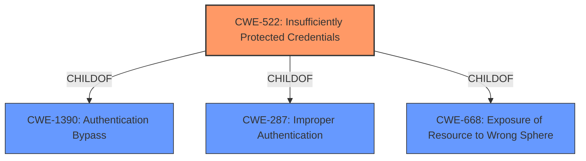

# Analysis for CVE-2021-20597

# Summary
| CWE ID | CWE Name | Confidence | CWE Abstraction Level | CWE Vulnerability Mapping Label | CWE-Vulnerability Mapping Notes |
|---|---|---|---|---|---|
| **CWE-522** | **Insufficiently Protected Credentials** | 0.9 | Class | Primary | Allowed-with-Review |

## Evidence and Confidence

*   **Confidence Score:** 0.9
*   **Evidence Strength:** HIGH

## Relationship Analysis
The primary CWE selected is CWE-522, which is a Class-level CWE. While it would be ideal to map to a Base or Variant CWE, the evidence points directly to the credentials being insufficiently protected during transmission. CWE-522 is the best fit, especially given that the CVE description and summary explicitly mention this weakness. CWE-522 has child relationships like ChildOf -> CWE-1390 (Authentication Bypass), ChildOf -> CWE-287 (Improper Authentication), and ChildOf -> CWE-668 (Exposure of Resource to Wrong Sphere), which could be part of a vulnerability chain, but there's no explicit evidence in the description to confirm those.

## Vulnerability Chain
The vulnerability chain is relatively straightforward:
1.  **Root Cause:** **Insufficiently Protected Credentials** (CWE-522) during user registration or password change.
2.  **Mechanism:** Credentials are transmitted over the network in a way that allows them to be intercepted (sniffing network traffic).
3.  **Impact:** A remote, unauthenticated attacker can obtain the credentials and gain unauthorized access to the target system.

## Summary of Analysis
The initial analysis and the retriever results both pointed to CWE-522 as a strong candidate, and the evidence strongly supports this classification. The vulnerability description explicitly states "**Insufficiently Protected Credentials**" as the root cause. The CVE Reference Links Content Summary confirms that the credentials transmitted over the network are not adequately protected, allowing them to be intercepted. The vulnerability allows a remote unauthenticated attacker to sniff network traffic and obtain credentials when registering user information or changing a password, leading to unauthorized login.

The decision is based on the evidence provided in the vulnerability description and the CVE reference. The retriever results also suggested CWE-522 as a relevant CWE. While CWE-522 is a Class-level CWE, the available information does not provide enough specificity to map to a more detailed Base or Variant CWE.

Relevant CWE Information:

# Enhanced Context (25 CWEs)

## CWE-405: Asymmetric Resource Consumption (Amplification)
**Abstraction Level**: Class
**Similarity Score**: 0.80
**Source**: dense

**Description**:
The product does not properly control situations in which an adversary can cause the product to consume or produce excessive resources without requiring the adversary to invest equivalent work or otherwise prove authorization, i.e., the adversary's influence is "asymmetric."

**Mapping Guidance**:
- Usage: Allowed-with-Review
- Rationale: This CWE entry is a Class and might have Base-level children that would be more appropriate

## CWE-404: Improper Resource Shutdown or Release
**Abstraction Level**: Class
**Similarity Score**: 0.79
**Source**: dense

**Description**:
The product does not release or incorrectly releases a resource before it is made available for re-use.

**Mapping Guidance**:
- Usage: Allowed-with-Review
- Rationale: This CWE entry is a Class and might have Base-level children that would be more appropriate

## CWE-226: Sensitive Information in Resource Not Removed Before Reuse
**Abstraction Level**: Base
**Similarity Score**: 0.78
**Source**: dense

**Description**:
The product releases a resource such as memory or a file so that it can be made available for reuse, but it does not clear or "zeroize" the information contained in the resource before the product performs a critical state transition or makes the resource available for reuse by other entities.

**Mapping Guidance**:
- Usage: Allowed
- Rationale: This CWE entry is at the Base level of abstraction, which is a preferred level of abstraction for mapping to the root causes of vulnerabilities.

## CWE-799: Improper Control of Interaction Frequency
**Abstraction Level**: Class
**Similarity Score**: 0.78
**Source**: dense

**Description**:
The product does not properly limit the number or frequency of interactions that it has with an actor, such as the number of incoming requests.

**Mapping Guidance**:
- Usage: Allowed-with-Review
- Rationale: This CWE entry is a Class and might have Base-level children that would be more appropriate

## CWE-664: Improper Control of a Resource Through its Lifetime
**Abstraction Level**: Pillar
**Similarity Score**: 0.77
**Source**: dense

**Description**:
The product does not maintain or incorrectly maintains control over a resource throughout its lifetime of creation, use, and release.

**Mapping Guidance**:
- Usage: Discouraged
- Rationale: This CWE entry is high-level when lower-level children are available.

## CWE-1391: Use of Weak Credentials
**Abstraction Level**: Class
**Similarity Score**: 0.77
**Source**: dense

**Description**:
The product uses weak credentials (such as a default key or hard-coded password) that can be calculated, derived, reused, or guessed by an attacker.

**Mapping Guidance**:
- Usage: Allowed-with-Review
- Rationale: This CWE entry is a Class and might have Base-level children that would be more appropriate

## CWE-407: Inefficient Algorithmic Complexity
**Abstraction Level**: Class
**Similarity Score**: 0.76
**Source**: dense

**Description**:
An algorithm in a product has an inefficient worst-case computational complexity that may be detrimental to system performance and can be triggered by an attacker, typically using crafted manipulations that ensure that the worst case is being reached.

**Mapping Guidance**:
- Usage: Allowed-with-Review
- Rationale: This CWE entry is a Class and might have Base-level children that would be more appropriate

## CWE-668: Exposure of Resource to Wrong Sphere
**Abstraction Level**: Class
**Similarity Score**: 0.76
**Source**: dense

**Description**:
The product exposes a resource to the wrong control sphere, providing unintended actors with inappropriate access to the resource.

**Mapping Guidance**:
- Usage: Discouraged
- Rationale: CWE-668 is high-level and is often misused as a catch-all when lower-level CWE IDs might be applicable. It is sometimes used for low-information vulnerability reports [REF-1287]. It is a level-1 Class (i.e., a child of a Pillar). It is not useful for trend analysis.

## CWE-789: Memory Allocation with Excessive Size Value
**Abstraction Level**: Variant
**Similarity Score**: 0.76
**Source**: dense

**Description**:
The product allocates memory based on an untrusted, large size value, but it does not ensure that the size is within expected limits, allowing arbitrary amounts of memory to be allocated.

**Mapping Guidance**:
- Usage: Allowed
- Rationale: This CWE entry is at the Variant level of abstraction, which is a preferred level of abstraction for mapping to the root causes of vulnerabilities.

## CWE-667: Improper Locking
**Abstraction Level**: Class
**Similarity Score**: 0.76
**Source**: dense

**Description**:
The product does not properly acquire or release a lock on a resource, leading to unexpected resource state changes and behaviors.

**Mapping Guidance**:
- Usage: Allowed-with-Review
- Rationale: This CWE entry is a Class and might have Base-level children that would be more appropriate

## CWE-328: Use of Weak Hash
**Abstraction Level**: Base
**Similarity Score**: 6211.88
**Source**: sparse

**Description**:
The product uses an algorithm that produces a digest (output value) that does not meet security expectations for a hash function that allows an adversary to reasonably determine the original input (preimage attack), find another input that can produce the same hash (2nd preimage attack), or find multiple inputs that evaluate to the same hash (birthday attack).

**Mapping Guidance**:
- Usage: Allowed
- Rationale: This CWE entry is at the Base level of abstraction, which is

# Enhanced Query for CVE-2021-20597

## Vulnerability Description
**Insufficiently Protected Credentials** vulnerability in Mitsubishi Electric MELSEC iQ-R series Safety CPU modules R08/16/32/120SFCPU firmware versions 26 and prior and Mitsubishi Electric MELSEC iQ-R series SIL2 Process CPU modules R08/16/32/120PSFCPU firmware versions 11 and prior allows a remote unauthenticated attacker to login to the target unauthorizedly by sniffing network traffic and obtaining credentials when registering user information in the target or changing a password.

### Vulnerability Description Key Phrases
- **rootcause:** **Insufficiently Protected Credentials**
- **impact:** login to the target unauthorizedly
- **vector:** sniffing network traffic and obtaining credentials
- **attacker:** remote unauthenticated attacker
- **product:** Mitsubishi Electric MELSEC iQ-R series Safety CPU modules and Mitsubishi Electric MELSEC iQ-R series SIL2 Process CPU modules
- **version:** R08/16/32/120SFCPU firmware versions 26 and prior and R08/16/32/120PSFCPU firmware versions 11 and prior

## CVE Reference Links Content Summary
Based on the provided content, here's the breakdown of CVE-2021-20597:

**Root Cause:**
- The vulnerability stems from insufficiently protected credentials during the process of registering user information or changing passwords in the MELSEC iQ-R series CPU modules.

**Weaknesses/Vulnerabilities Present:**
- **CWE-522: Insufficiently Protected Credentials:** Credentials transmitted over the network are not adequately protected, allowing them to be intercepted.

**Impact of Exploitation:**
- A remote attacker can sniff network traffic to obtain user credentials (usernames and passwords).
- This allows the attacker to gain unauthorized access to the CPU module.

**Attack Vectors:**
- **Remote Network Sniffing:** Attackers can exploit this vulnerability remotely by sniffing network traffic when user information is registered or passwords are changed on the affected device.

**Required Attacker Capabilities/Position:**
- The attacker must be able to intercept network traffic between the user's machine and the MELSEC iQ-R series CPU module.
- The attacker does not need prior access or credentials to begin this attack.

## Retriever Results

### Top Combined Results

| Rank | CWE ID | Name | Abstraction | Usage  | Retrievers | Individual Scores |
|------|--------|------|-------------|-------|------------|-------------------|
| 1 | 836 | Use of Password Hash Instead of Password for Authentication | Base | Allowed | sparse | 0.712 |
| 2 | 294 | Authentication Bypass by Capture-replay | Base | Allowed | sparse | 0.633 |
| 3 | 328 | Use of Weak Hash | Base | Allowed | sparse | 0.596 |
| 4 | 130 | Improper Handling of Length Parameter Inconsistency | Base | Allowed | sparse | 0.566 |
| 5 | 522 | Insufficiently Protected Credentials | Class | Allowed-with-Review | sparse | 0.547 |
| 6 | 326 | Inadequate Encryption Strength | Class | Allowed-with-Review | dense | 0.602 |
| 7 | 805 | Buffer Access with Incorrect Length Value | Base | Allowed | graph | 0.002 |
| 8 | 645 | Overly Restrictive Account Lockout Mechanism | Base | Allowed | sparse | 0.544 |
| 9 | 337 | Predictable Seed in Pseudo-Random Number Generator (PRNG) | Variant | Allowed | sparse | 0.541 |
| 10 | 400 | Uncontrolled Resource Consumption | Class | Discouraged | sparse | 0.452 |

# Complete CWE Specifications

## CWE-836: Use of Password Hash Instead of Password for Authentication
**Abstraction:** Base
**Status:** Incomplete

### Description
The product records password hashes in a data store, receives a hash of a password from a client, and compares the supplied hash to the hash obtained from the data store.

### Extended Description

Some authentication mechanisms rely on the client to generate the hash for a password, possibly to reduce load on the server or avoid sending the password across the network. However, when the client is used to generate the hash, an attacker can bypass the authentication by obtaining a copy of the hash, e.g. by using SQL injection to compromise a database of authentication credentials, or by exploiting an information exposure. The attacker could then use a modified client to replay the stolen hash without having knowledge of the original password.

As a result, the server-side comparison against a client-side hash does not provide any more security than the use of passwords without hashing.

### Alternative Terms
None

### Relationships
ChildOf -> CWE-1390
PeerOf -> CWE-602

### Mapping Guidance
**Usage:** Allowed
**Rationale:** This CWE entry is at the Base level of abstraction, which is a preferred level of abstraction for mapping to the root causes of vulnerabilities.
**Comments:** Carefully read both the name and description to ensure that this mapping is an appropriate fit. Do not try to 'force' a mapping to a lower-level Base/Variant simply to comply with this preferred level of abstraction.
**Reasons:**
- Acceptable-Use

### Observed Examples
- **CVE-2009-1283:** Product performs authentication with user-supplied password hashes that can be obtained from a separate SQL injection vulnerability (CVE-2009-1282).
- **CVE-2005-3435:** Product allows attackers to bypass authentication by obtaining the password hash for another user and specifying the hash in the pwd argument.

## CWE-294: Authentication Bypass by Capture-replay
**Abstraction:** Base
**Status:** Incomplete

### Description
A capture-replay flaw exists when the design of the product makes it possible for a malicious user to sniff network traffic and bypass authentication by replaying it to the server in question to the same effect as the original message (or with minor changes).

### Extended Description
Capture-replay attacks are common and can be difficult to defeat without cryptography. They are a subset of network injection attacks that rely on observing previously-sent valid commands, then changing them slightly if necessary and resending the same commands to the server.

### Alternative Terms
None

### Relationships
ChildOf -> CWE-1390
ChildOf -> CWE-287

### Mapping Guidance
**Usage:** Allowed
**Rationale:** This CWE entry is at the Base level of abstraction, which is a preferred level of abstraction for mapping to the root causes of vulnerabilities.
**Comments:** Carefully read both the name and description to ensure that this mapping is an appropriate fit. Do not try to 'force' a mapping to a lower-level Base/Variant simply to comply with this preferred level of abstraction.
**Reasons:**
- Acceptable-Use

### Observed Examples
- **CVE-2005-3435:** product authentication succeeds if user-provided MD5 hash matches the hash in its database; this can be subjected to replay attacks.
- **CVE-2007-4961:** Chain: cleartext transmission of the MD5 hash of password (CWE-319) enables attacks against a server that is susceptible to replay (CWE-294).

## CWE-328: Use of Weak Hash
**Abstraction:** Base
**Status:** Draft

### Description
The product uses an algorithm that produces a digest (output value) that does not meet security expectations for a hash function that allows an adversary to reasonably determine the original input (preimage attack), find another input that can produce the same hash (2nd preimage attack), or find multiple inputs that evaluate to the same hash (birthday attack).

### Extended Description

A hash function is defined as an algorithm that maps arbitrarily sized data into a fixed-sized digest (output) such that the following properties hold:

  1. The algorithm is not invertible (also called "one-way" or "not reversible")

  1. The algorithm is deterministic; the same input produces the same digest every time

 Building on this definition, a cryptographic hash function must also ensure that a malicious actor cannot leverage the hash function to have a reasonable chance of success at determining any of the following:

  1. the original input (preimage attack), given only the digest

  1. another input that can produce the same digest (2nd preimage attack), given the original input

  1. a set of two or more inputs that evaluate to the same digest (birthday attack), given the actor can arbitrarily choose the inputs to be hashed and can do so a reasonable amount of times

What is regarded as "reasonable" varies by context and threat model, but in general, "reasonable" could cover any attack that is more efficient than brute force (i.e., on average, attempting half of all possible combinations). Note that some attacks might be more efficient than brute force but are still not regarded as achievable in the real world.

Any algorithm that does not meet the above conditions will generally be considered weak for general use in hashing.

In addition to algorithmic weaknesses, a hash function can be made weak by using the hash in a security context that breaks its security guarantees. For example, using a hash function without a salt for storing passwords (that are sufficiently short) could enable an adversary to create a "rainbow table" [REF-637] to recover the password under certain conditions; this attack works against such hash functions as MD5, SHA-1, and SHA-2.

### Alternative Terms
None

### Relationships
ChildOf -> CWE-326
ChildOf -> CWE-327

### Mapping Guidance
**Usage:** Allowed
**Rationale:** This CWE entry is at the Base level of abstraction, which is a preferred level of abstraction for mapping to the root causes of vulnerabilities.
**Comments:** Carefully read both the name and description to ensure that this mapping is an appropriate fit. Do not try to 'force' a mapping to a lower-level Base/Variant simply to comply with this preferred level of abstraction.
**Reasons:**
- Acceptable-Use

### Additional Notes
**[Maintenance]** Since CWE 4.4, various cryptography-related entries including CWE-328 have been slated for extensive research, analysis, and community consultation to define consistent terminology, improve relationships, and reduce overlap or duplication. As of CWE 4.6, this work is still ongoing.

### Observed Examples
- **CVE-2022-30320:** Programmable Logic Controller (PLC) uses a protocol with a cryptographically insecure hashing algorithm for passwords.
- **CVE-2005-4900:** SHA-1 algorithm is not collision-resistant.
- **CVE-2020-25685:** DNS product uses a weak hash (CRC32 or SHA-1) of the query name, allowing attacker to forge responses by computing domain names with the same hash.

## CWE-130: Improper Handling of Length Parameter Inconsistency
**Abstraction:** Base
**Status:** Incomplete

### Description
The product parses a formatted message or structure, but it does not handle or incorrectly handles a length field that is inconsistent with the actual length of the associated data.

### Extended Description
If an attacker can manipulate the length parameter associated with an input such that it is inconsistent with the actual length of the input, this can be leveraged to cause the target application to behave in unexpected, and possibly, malicious ways. One of the possible motives for doing so is to pass in arbitrarily large input to the application. Another possible motivation is the modification of application state by including invalid data for subsequent properties of the application. Such weaknesses commonly lead to attacks such as buffer overflows and execution of arbitrary code.

### Alternative Terms
length manipulation
length tampering

### Relationships
ChildOf -> CWE-240
ChildOf -> CWE-119
ChildOf -> CWE-119
CanPrecede -> CWE-805

### Mapping Guidance
**Usage:** Allowed
**Rationale:** This CWE entry is at the Base level of abstraction, which is a preferred level of abstraction for mapping to the root causes of vulnerabilities.
**Comments:** Carefully read both the name and description to ensure that this mapping is an appropriate fit. Do not try to 'force' a mapping to a lower-level Base/Variant simply to comply with this preferred level of abstraction.
**Reasons:**
- Acceptable-Use

### Additional Notes
**[Relationship]** This probably overlaps other categories including zero-length issues.

### Observed Examples
- **CVE-2014-0160:** Chain: "Heartbleed" bug receives an inconsistent length parameter (CWE-130) enabling an out-of-bounds read (CWE-126), returning memory that could include private cryptographic keys and other sensitive data.
- **CVE-2009-2299:** Web application firewall consumes excessive memory when an HTTP request contains a large Content-Length value but no POST data.
- **CVE-2001-0825:** Buffer overflow in internal string handling routine allows remote attackers to execute arbitrary commands via a length argument of zero or less, which disables the length check.

## CWE-522: Insufficiently Protected Credentials
**Abstraction:** Class
**Status:** Incomplete

### Description
The product transmits or stores authentication credentials, but it uses an insecure method that is susceptible to unauthorized interception and/or retrieval.

### Extended Description
Not provided

### Alternative Terms
None

### Relationships
ChildOf -> CWE-1390
ChildOf -> CWE-287
ChildOf -> CWE-668

### Mapping Guidance
**Usage:** Allowed-with-Review
**Rationale:** This CWE entry is a Class and might have Base-level children that would be more appropriate
**Comments:** Examine children of this entry to see if there is a better fit
**Reasons:**
- Abstraction

### Observed Examples
- **CVE-2022-30018:** A messaging platform serializes all elements of User/Group objects, making private information available to adversaries
- **CVE-2022-29959:** Initialization file contains credentials that can be decoded using a "simple string transformation"
- **CVE-2022-35411:** Python-based RPC framework enables pickle functionality by default, allowing clients to unpickle untrusted data.

## CWE-326: Inadequate Encryption Strength
**Abstraction:** Class
**Status:** Draft

### Description
The product stores or transmits sensitive data using an encryption scheme that is theoretically sound, but is not strong enough for the level of protection required.

### Extended Description
A weak encryption scheme can be subjected to brute force attacks that have a reasonable chance of succeeding using current attack methods and resources.

### Alternative Terms
None

### Relationships
ChildOf -> CWE-693

### Mapping Guidance
**Usage:** Allowed-with-Review
**Rationale:** This CWE entry is a Class and might have Base-level children that would be more appropriate
**Comments:** Examine children of this entry to see if there is a better fit
**Reasons:**
- Abstraction

### Observed Examples
- **CVE-2001-1546:** Weak encryption
- **CVE-2004-2172:** Weak encryption (chosen plaintext attack)
- **CVE-2002-1682:** Weak encryption

## CWE-805: Buffer Access with Incorrect Length Value
**Abstraction:** Base
**Status:** Incomplete

### Description
The product uses a sequential operation to read or write a buffer, but it uses an incorrect length value that causes it to access memory that is outside of the bounds of the buffer.

### Extended Description
When the length value exceeds the size of the destination, a buffer overflow could occur.

### Alternative Terms
None

### Relationships
ChildOf -> CWE-119
ChildOf -> CWE-119
ChildOf -> CWE-119

### Mapping Guidance
**Usage:** Allowed
**Rationale:** This CWE entry is at the Base level of abstraction, which is a preferred level of abstraction for mapping to the root causes of vulnerabilities.
**Comments:** Carefully read both the name and description to ensure that this mapping is an appropriate fit. Do not try to 'force' a mapping to a lower-level Base/Variant simply to comply with this preferred level of abstraction.
**Reasons:**
- Acceptable-Use

### Observed Examples
- **CVE-2011-1959:** Chain: large length value causes buffer over-read (CWE-126)
- **CVE-2011-1848:** Use of packet length field to make a calculation, then copy into a fixed-size buffer
- **CVE-2011-0105:** Chain: retrieval of length value from an uninitialized memory location

## CWE-645: Overly Restrictive Account Lockout Mechanism
**Abstraction:** Base
**Status:** Incomplete

### Description
The product contains an account lockout protection mechanism, but the mechanism is too restrictive and can be triggered too easily, which allows attackers to deny service to legitimate users by causing their accounts to be locked out.

### Extended Description
Account lockout is a security feature often present in applications as a countermeasure to the brute force attack on the password based authentication mechanism of the system. After a certain number of failed login attempts, the users' account may be disabled for a certain period of time or until it is unlocked by an administrator. Other security events may also possibly trigger account lockout. However, an attacker may use this very security feature to deny service to legitimate system users. It is therefore important to ensure that the account lockout security mechanism is not overly restrictive.

### Alternative Terms
None

### Relationships
ChildOf -> CWE-287

### Mapping Guidance
**Usage:** Allowed
**Rationale:** This CWE entry is at the Base level of abstraction, which is a preferred level of abstraction for mapping to the root causes of vulnerabilities.
**Comments:** Carefully read both the name and description to ensure that this mapping is an appropriate fit. Do not try to 'force' a mapping to a lower-level Base/Variant simply to comply with this preferred level of abstraction.
**Reasons:**
- Acceptable-Use

## CWE-337: Predictable Seed in Pseudo-Random Number Generator (PRNG)
**Abstraction:** Variant
**Status:** Draft

### Description
A Pseudo-Random Number Generator (PRNG) is initialized from a predictable seed, such as the process ID or system time.

### Extended Description
The use of predictable seeds significantly reduces the number of possible seeds that an attacker would need to test in order to predict which random numbers will be generated by the PRNG.

### Alternative Terms
None

### Relationships
ChildOf -> CWE-335

### Mapping Guidance
**Usage:** Allowed
**Rationale:** This CWE entry is at the Variant level of abstraction, which is a preferred level of abstraction for mapping to the root causes of vulnerabilities.
**Comments:** Carefully read both the name and description to ensure that this mapping is an appropriate fit. Do not try to 'force' a mapping to a lower-level Base/Variant simply to comply with this preferred level of abstraction.
**Reasons:**
- Acceptable-Use

### Additional Notes
**[Maintenance]** As of CWE 4.5, terminology related to randomness, entropy, and predictability can vary widely. Within the developer and other communities, "randomness" is used heavily. However, within cryptography, "entropy" is distinct, typically implied as a measurement. There are no commonly-used definitions, even within standards documents and cryptography papers. Future versions of CWE will attempt to define these terms and, if necessary, distinguish between them in ways that are appropriate for different communities but do not reduce the usability of CWE for mapping, understanding, or other scenarios.

### Observed Examples
- **CVE-2020-7010:** Cloud application on Kubernetes generates passwords using a weak random number generator based on deployment time.
- **CVE-2019-11495:** server uses erlang:now() to seed the PRNG, which results in a small search space for potential random seeds
- **CVE-2008-0166:** The removal of a couple lines of code caused Debian's OpenSSL Package to only use the current process ID for seeding a PRNG

## CWE-400: Uncontrolled Resource Consumption
**Abstraction:** Class
**Status:** Draft

### Description
The product does not properly control the allocation and maintenance of a limited resource, thereby enabling an actor to influence the amount of resources consumed, eventually leading to the exhaustion of available resources.

### Extended Description

Limited resources include memory, file system storage, database connection pool entries, and CPU. If an attacker can trigger the allocation of these limited resources, but the number or size of the resources is not controlled, then the attacker could cause a denial of service that consumes all available resources. This would prevent valid users from accessing the product, and it could potentially have an impact on the surrounding environment. For example, a memory exhaustion attack against an application could slow down the application as well as its host operating system.

There are at least three distinct scenarios which can commonly lead to resource exhaustion:

  - Lack of throttling for the number of allocated resources

  - Losing all references to a resource before reaching the shutdown stage

  - Not closing/returning a resource after processing

Resource exhaustion problems are often result due to an incorrect implementation of the following situations:

  - Error conditions and other exceptional circumstances.

  - Confusion over which part of the program is responsible for releasing the resource.

### Alternative Terms
Resource Exhaustion

### Relationships
ChildOf -> CWE-664

### Mapping Guidance
**Usage:** Discouraged
**Rationale:** CWE-400 is intended for incorrect behaviors in which the product is expected to track and restrict how many resources it consumes, but CWE-400 is often misused because it is conflated with the "technical impact" of vulnerabilities in which resource consumption occurs. It is sometimes used for low-information vulnerability reports. It is a level-1 Class (i.e., a child of a Pillar).
**Comments:** Closely analyze the specific mistake that is causing resource consumption, and perform a CWE mapping for that mistake. Consider children/descendants such as CWE-770: Allocation of Resources Without Limits or Throttling, CWE-771: Missing Reference to Active Allocated Resource, CWE-410: Insufficient Resource Pool, CWE-772: Missing Release of Resource after Effective Lifetime, CWE-834: Excessive Iteration, CWE-405: Asymmetric Resource Consumption (Amplification), and others.
**Reasons:**
- Frequent Misuse

### Additional Notes
**[Maintenance]** "Resource consumption" could be interpreted as a consequence instead of an insecure behavior, so this entry is being considered for modification. It appears to be referenced too frequently when more precise mappings are available. Some of its children, such as CWE-771, might be better considered as a chain.

**[Theoretical]** Vulnerability theory is largely about how behaviors and resources interact. "Resource exhaustion" can be regarded as either a consequence or an attack, depending on the perspective. This entry is an attempt to reflect the underlying weaknesses that enable these attacks (or consequences) to take place.

**[Other]** 

Database queries that take a long time to process are good DoS targets. An attacker would have to write a few lines of Perl code to generate enough traffic to exceed the site's ability to keep up. This would effectively prevent authorized users from using the site at all. Resources can be exploited simply by ensuring that the target machine must do much more work and consume more resources in order to service a request than the attacker must do to initiate a request.

A prime example of this can be found in old switches that were vulnerable to "macof" attacks (so named for a tool developed by Dugsong). These attacks flooded a switch with random IP and MAC address combinations, therefore exhausting the switch's cache, which held the information of which port corresponded to which MAC addresses. Once this cache was exhausted, the switch would fail in an insecure way and would begin to act simply as a hub, broadcasting all traffic on all ports and allowing for basic sniffing attacks.

**[Maintenance]** The Taxonomy_Mappings to ISA/IEC 62443 were added in CWE 4.10, but they are still under review and might change in future CWE versions. These draft mappings were performed by members of the "Mapping CWE to 62443" subgroup of the CWE-CAPEC ICS/OT Special Interest Group (SIG), and their work is incomplete as of CWE 4.10. The mappings are included to facilitate discussion and review by the broader ICS/OT community, and they are likely to change in future CWE versions.

### Observed Examples
- **CVE-2022-21668:** Chain: Python library does not limit the resources used to process images that specify a very large number of bands (CWE-1284), leading to excessive memory consumption (CWE-789) or an integer overflow (CWE-190).
- **CVE-2020-7218:** Go-based workload orchestrator does not limit resource usage with unauthenticated connections, allowing a DoS by flooding the service
- **CVE-2020-3566:** Resource exhaustion in distributed OS because of "insufficient" IGMP queue management, as exploited in the wild per CISA KEV.

