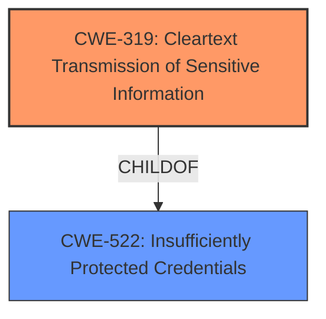

# Analysis for CVE-2021-20599

# Summary
| CWE ID | CWE Name | Confidence | CWE Abstraction Level | CWE Vulnerability Mapping Label | CWE-Vulnerability Mapping Notes |
|---|---|---|---|---|---|
| CWE-319 | Cleartext Transmission of Sensitive Information | 1.0 | Base | Allowed | Primary CWE |
| CWE-522 | Insufficiently Protected Credentials | 0.7 | Class | Allowed-with-Review | Secondary Candidate |

## Evidence and Confidence

*   **Confidence Score:** 0.9
*   **Evidence Strength:** HIGH

## Relationship Analysis
The primary CWE is CWE-319, which is a Base level CWE, making it a good fit. CWE-522 is a Class level CWE, which is a parent of CWE-319, but is less specific.

## Vulnerability Chain
The vulnerability chain starts with the **cleartext transmission of sensitive information** (CWE-319), which leads to the exposure of credentials, ultimately resulting in unauthorized login to the target CPU module.

## Summary of Analysis
The initial assessment, based on the provided evidence, strongly points to CWE-319 (**Cleartext Transmission of Sensitive Information**) as the primary weakness. The **root cause** is the lack of encryption or secure transport mechanisms for sensitive data, which allows unauthorized interception of credentials. This is supported by the "Vulnerability Description Key Phrases" and "CVE Reference Links Content Summary", both of which explicitly mention **cleartext transmission of sensitive information**.

The graph relationships support this assessment, with CWE-319 being a specific, base-level CWE. While CWE-522 (Insufficiently Protected Credentials) is also relevant, it's a broader, class-level CWE.

The decision to prioritize CWE-319 is based on the explicit evidence of **cleartext transmission** as the **root cause**, and the preference for more specific, base-level CWEs when available.

The selected CWEs are at the optimal level of specificity because CWE-319 directly reflects the **root cause** of the vulnerability, while CWE-522 captures the broader context of credential protection but is less precise.

Relevant CWE Information:

# Enhanced Context (25 CWEs)

## CWE-319: Cleartext Transmission of Sensitive Information
**Abstraction Level**: Base
**Similarity Score**: 5429.31
**Source**: sparse

**Description**:
The product transmits sensitive or security-critical data in cleartext in a communication channel that can be sniffed by unauthorized actors.

**Mapping Guidance**:
- Usage: Allowed
- Rationale: This CWE entry is at the Base level of abstraction, which is a preferred level of abstraction for mapping to the root causes of vulnerabilities.

**Relationships**:
- NONE

**Technical Explanation:** The vulnerability description clearly states that credentials are transmitted in cleartext, directly matching the CWE's description. This allows an attacker to intercept the credentials.
**Security Implications:** Interception of cleartext credentials allows unauthorized access to the system.
**Relationship Impact:** N/A
**Primary/Secondary:** Primary
**MITRE Mapping Guidance Influence:** The MITRE mapping guidance suggests that this is an allowed mapping and that base level mappings are preferred.

## CWE-522: Insufficiently Protected Credentials
**Abstraction Level**: Class
**Similarity Score**: 0.422
**Source**: sparse

**Description**:
The product transmits or stores authentication credentials, but it uses an insecure method that is susceptible to unauthorized interception and/or retrieval.

**Mapping Guidance**:
- Usage: Allowed-with-Review
- Rationale: This CWE entry is a Class and might have Base-level children that would be more appropriate

**Relationships**:
- ChildOf -> CWE-1390
- ChildOf -> CWE-287
- ChildOf -> CWE-668

**Technical Explanation:** This CWE is a broader classification that could apply since the credentials were not sufficiently protected during transmission.
**Security Implications:** Credentials could be intercepted and used to gain unauthorized access.
**Relationship Impact:** This CWE is a parent of CWE-319, but since CWE-319 is more specific, it is the primary classification.
**Primary/Secondary:** Secondary
**MITRE Mapping Guidance Influence:** This CWE mapping is allowed with review because there may be a better fit. CWE-319 is a better fit.

**CWEs Considered but Not Used:**

*   **CWE-836 (Use of Password Hash Instead of Password for Authentication):** This CWE was considered because the vulnerability involves credentials, but it does not fit the scenario where password hashes are used instead of passwords. The vulnerability is about **cleartext transmission**, not the method of authentication.
*   **CWE-294 (Authentication Bypass by Capture-replay):** This CWE was considered because the **cleartext transmission** allows for capture and replay of credentials. However, the **root cause** is the **cleartext transmission**, not the replay attack itself.
*   **CWE-328 (Use of Weak Hash):** This CWE was considered, but it does not apply because the vulnerability is not related to the use of weak hashing algorithms.
*   **CWE-639 (Authorization Bypass Through User-Controlled Key):** This CWE was considered, but it does not apply because the vulnerability does not involve authorization bypass through user-controlled keys.
*   **CWE-522 (Insufficiently Protected Credentials):** Although considered, CWE-319 is more specific because it details the exact mechanism that is used (cleartext) to transmit credentials that are not protected.