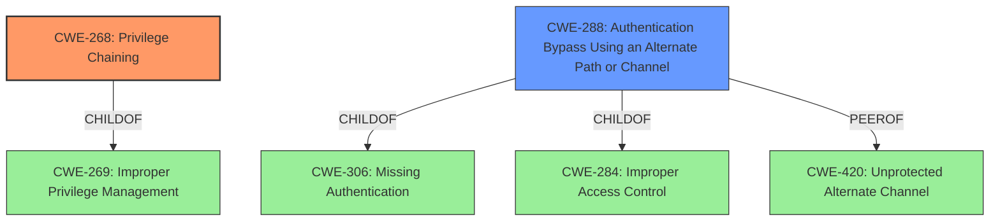

# Enhanced Analysis for CVE-2021-20618

# Summary
| CWE ID  | CWE Name                                                                   | Confidence | CWE Abstraction Level | CWE Vulnerability Mapping Label | CWE-Vulnerability Mapping Notes |
| :-------- | :------------------------------------------------------------------------- | :--------- | :---------------------- | :------------------------------ | :------------------------------ |
| CWE-268   | Privilege Chaining                                                         | 1          | Base                    | Primary CWE                    | Allowed                       |
| CWE-288 | Authentication Bypass Using an Alternate Path or Channel | 0.7        | Base | Secondary Candidate | Allowed |

## Evidence and Confidence

*   **Confidence Score:** 0.9
*   **Evidence Strength:** HIGH

## Relationship Analysis
The primary CWE is CWE-268 **Privilege Chaining**, which is a Base level CWE. CWE-268 is a child of CWE-269 **Improper Privilege Management**, which is a class. The **Privilege Chaining vulnerability** allows an attacker to bypass authentication and gain administrative privileges. The retriever results suggest CWE-288 **Authentication Bypass Using an Alternate Path or Channel** which is a peer of CWE-420 **Unprotected Alternate Channel**, and a child of CWE-306 **Missing Authentication** and CWE-284 **Improper Access Control**.



## Vulnerability Chain
The vulnerability chain starts with a **Privilege Chaining vulnerability**, leading to bypassing authentication and gaining administrative privileges, and finally to obtaining sensitive information on the server.
  - Root Cause: CWE-268 **Privilege Chaining**
  - Impact: Bypass Authentication
  - Impact: Gain Administrative Privilege
  - Impact: Obtain Sensitive Information

## Summary of Analysis
The primary assessment is based on the provided evidence, particularly the CVE Reference Links Content Summary, which explicitly states: "The vulnerability is due to a **Privilege Chaining** issue" and "Privilege Chaining (CWE-268): This vulnerability allows an attacker to gain elevated privileges by exploiting the chain of actions or requests within the affected software."
The graph relationships confirm that CWE-268 is at the optimal level of specificity (Base) and is related to improper privilege management. The retriever results also indicate that CWE-268 is a good match.

CWE-268 is chosen as the primary CWE because the description clearly indicates a **Privilege Chaining vulnerability** is the root cause.

CWE-288 Authentication Bypass Using an Alternate Path or Channel is added as a secondary candidate because the **Privilege Chaining vulnerability** leads to bypassing authentication and gaining administrative privilege.

Relevant CWE Information:

## CWE-268: Privilege Chaining
**Abstraction:** Base
**Status:** Draft

### Description
Two distinct privileges, roles, capabilities, or rights can be combined in a way that allows an entity to perform unsafe actions that would not be allowed without that combination.

### Evidence
The vulnerability description states: "**Privilege chaining vulnerability** in acmailer ver. 4.0.2 and earlier, and acmailer DB ver. 1.1.4 and earlier allows remote attackers to bypass authentication and to gain an administrative privilege which may result in obtaining the sensitive information on the server via unspecified vectors."

### Justification
This CWE accurately describes the vulnerability, where the chaining of privileges leads to unauthorized access and administrative control.

## CWE-288: Authentication Bypass Using an Alternate Path or Channel
**Abstraction:** Base
**Status:** Incomplete

### Description
The product requires authentication, but the product has an alternate path or channel that does not require authentication.

### Evidence
The vulnerability description states that the **Privilege Chaining vulnerability** allows remote attackers to bypass authentication and to gain an administrative privilege.

### Justification
This CWE could be applicable as the privilege chaining could be considered as an alternate path or channel to bypass authentication.

## Other CWEs Considered but Not Used:
CWE-269 **Improper Privilege Management** - This is a class-level CWE and a parent of CWE-268 **Privilege Chaining**, which is a more specific and accurate representation of the vulnerability.
CWE-284 **Improper Access Control** - This is a very high-level (Pillar) CWE and is too general for the specific vulnerability. The description explicitly mentions **Privilege Chaining**, making CWE-268 a more appropriate choice.
CWE-912 **Hidden Functionality** - This CWE does not directly relate to the vulnerability description, as there is no mention of hidden functionality.
CWE-427 **Uncontrolled Search Path Element** - This CWE is not relevant as the vulnerability is related to privilege chaining, not an uncontrolled search path.
CWE-613 **Insufficient Session Expiration** - This CWE is not relevant as the vulnerability description does not mention session expiration issues.
CWE-522 **Insufficiently Protected Credentials** - This CWE is not relevant as the vulnerability description does not mention issues with protecting credentials.
CWE-285 **Improper Authorization** - This CWE is a class and too general.
CWE-327 **Use of a Broken or Risky Cryptographic Algorithm** - This CWE is not relevant as the vulnerability description does not mention cryptographic algorithms.


## CWE Relationship Analysis

Current CWEs represent these abstraction levels: .


### Vulnerability Chain Analysis

**Chain starting from CWE-288:**
- 288 (Authentication Bypass Using an Alternate Path or Channel) - ROOT


**Chain starting from CWE-912:**
- 912 (Hidden Functionality) - ROOT


### CWE Relationship Diagram

```mermaid
graph TD
    classDef primary fill:#f96,stroke:#333,stroke-width:2px
    classDef secondary fill:#69f,stroke:#333
    classDef tertiary fill:#9e9,stroke:#333
```