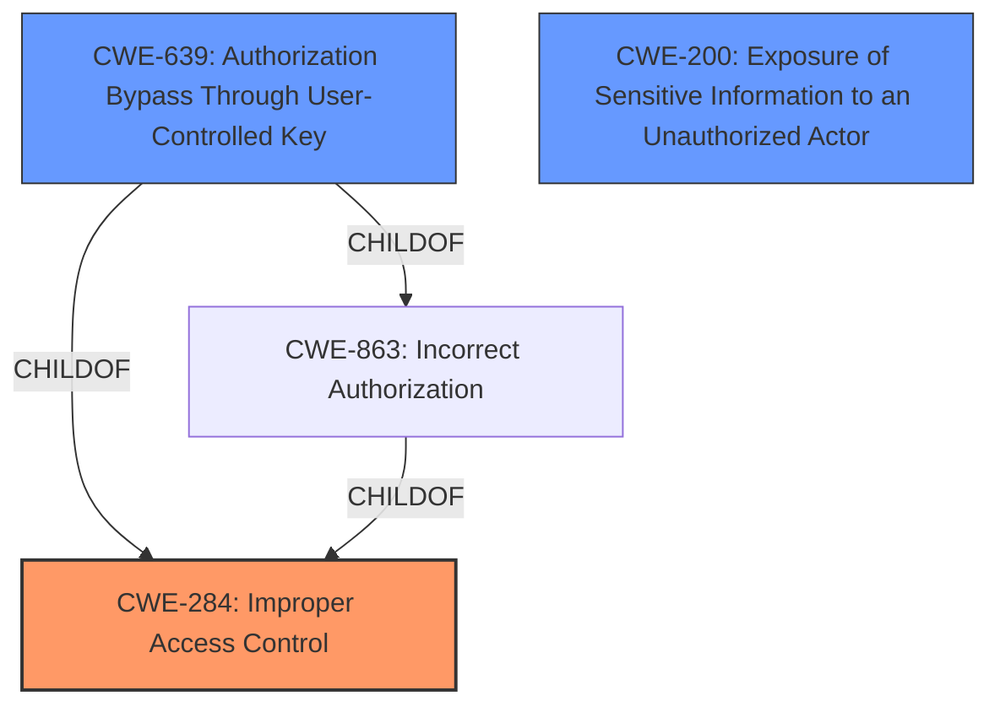

# Analysis Report for CVE-2021-20630

# Vulnerability Analysis Report: CVE-2021-20630

## Description


## Analysis (with Relationship Data)

# Summary
| CWE ID    | CWE Name                         | Confidence | CWE Abstraction Level | CWE Vulnerability Mapping Label | CWE-Vulnerability Mapping Notes |
| :-------- | :------------------------------- | :--------- | :-------------------- | :------------------------------ | :------------------------------ |
| CWE-284 | Improper Access Control | 0.7 | Pillar | Allowed-with-Review | Primary CWE |
| CWE-639 | Authorization Bypass Through User-Controlled Key | 0.6 | Base | Allowed | Secondary Candidate |
| CWE-200 | Exposure of Sensitive Information to an Unauthorized Actor | 0.5 | Class | Discouraged | Secondary Candidate |

## Evidence and Confidence

*   **Confidence Score:** 0.7
*   **Evidence Strength:** MEDIUM

## Relationship Analysis
The primary CWE identified is CWE-284, which is a high-level pillar. The analysis also considered CWE-639, which is a child of CWE-863 (Incorrect Authorization) and related to CWE-284 through authorization bypass. CWE-200 was considered as a potential impact due to information disclosure, but it is a class-level CWE and its use is discouraged as it represents the impact rather than the root cause.



## Vulnerability Chain
The vulnerability chain begins with **improper access control**, leading to a bypass of access restrictions, ultimately resulting in the unauthorized disclosure of data.
  - **Root Cause:** **Improper Access Control**
  - **Weakness:** Authorization Bypass
  - **Impact:** Exposure of Sensitive Information

## Summary of Analysis
The initial analysis focused on the **improper access control** vulnerability, which allows authenticated attackers to bypass access restrictions and obtain data. The primary CWE selected is CWE-284 because the vulnerability description specifically mentions **improper access control**. However, CWE-284 is a high-level pillar, and the mapping guidance discourages its use, suggesting more specific descendants.

The retriever results indicated that CWE-639 (Authorization Bypass Through User-Controlled Key) is a potentially relevant CWE. The vulnerability involves a bypass of viewing restrictions, which could be achieved through manipulation of a user-controlled key. Therefore, CWE-639 is considered a secondary candidate as it provides a more specific description of the **improper access control**.

CWE-200 (Exposure of Sensitive Information to an Unauthorized Actor) was also considered, but it represents the impact of the vulnerability rather than the root cause, and its usage is discouraged.

The selection of CWE-284 as the primary CWE is based on the explicit mention of **improper access control** in the vulnerability description. The selection is influenced by the retriever results. While CWE-284 is a high-level pillar, it is the most direct representation of the described vulnerability.
The evidence comes from the vulnerability description: "**Improper access control** vulnerability in Phone Messages of Cybozu Office 10.0.0 to 10.8.4 allows authenticated attackers to bypass access restriction and obtain the data of Phone Messages via unspecified vectors." and "The vulnerability stems from a bypass of viewing restrictions in the "Phone Messages" feature of Cybozu Office."

Relevant CWE Information:

# Enhanced Context (25 CWEs)
The following CWEs were identified as potentially relevant to this vulnerability:

## CWE-668: Exposure of Resource to Wrong Sphere
**Abstraction Level**: Class
**Similarity Score**: 0.73
**Source**: dense

**Description**:
The product exposes a resource to the wrong control sphere, providing unintended actors with inappropriate access to the resource.

**Mapping Guidance**:
- Usage: Discouraged
- Rationale: CWE-668 is high-level and is often misused as a catch-all when lower-level CWE IDs might be applicable. It is sometimes used for low-information vulnerability reports [REF-1287]. It is a level-1 Class (i.e., a child of a Pillar). It is not useful for trend analysis.


## CWE-451: User Interface (UI) Misrepresentation of Critical Information
**Abstraction Level**: Class
**Similarity Score**: 0.73
**Source**: dense

**Description**:
The user interface (UI) does not properly represent critical information to the user, allowing the information - or its source - to be obscured or spoofed. This is often a component in phishing attacks.

**Mapping Guidance**:
- Usage: Allowed-with-Review
- Rationale: This CWE entry is a Class and might have Base-level children that would be more appropriate


## CWE-807: Reliance on Untrusted Inputs in a Security Decision
**Abstraction Level**: Base
**Similarity Score**: 0.73
**Source**: dense

**Description**:
The product uses a protection mechanism that relies on the existence or values of an input, but the input can be modified by an untrusted actor in a way that bypasses the protection mechanism.

**Mapping Guidance**:
- Usage: Allowed
- Rationale: This CWE entry is at the Base level of abstraction, which is a preferred level of abstraction for mapping to the root causes of vulnerabilities.


## CWE-639: Authorization Bypass Through User-Controlled Key
**Abstraction Level**: Base
**Similarity Score**: 0.73
**Source**: dense

**Description**:
The system's authorization functionality does not prevent one user from gaining access to another user's data or record by modifying the key value identifying the data.

**Mapping Guidance**:
- Usage: Allowed
- Rationale: This CWE entry is at the Base level of abstraction, which is a preferred level of abstraction for mapping to the root causes of vulnerabilities.


## CWE-754: Improper Check for Unusual or Exceptional Conditions
**Abstraction Level**: Class
**Similarity Score**: 0.73
**Source**: dense

**Description**:
The product does not check or incorrectly checks for unusual or exceptional conditions that are not expected to occur frequently during day to day operation of the product.

**Mapping Guidance**:
- Usage: Allowed-with-Review
- Rationale: This CWE entry is a Class and might have Base-level children that would be more appropriate


## CWE-203: Observable Discrepancy
**Abstraction Level**: Base
**Similarity Score**: 0.72
**Source**: dense

**Description**:
The product behaves differently or sends different responses under different circumstances in a way that is observable to an unauthorized actor, which exposes security-relevant information about the state of the product, such as whether a particular operation was successful or not.

**Mapping Guidance**:
- Usage: Allowed
- Rationale: This CWE entry is at the Base level of abstraction, which is a preferred level of abstraction for mapping to the root causes of vulnerabilities.


## CWE-41: Improper Resolution of Path Equivalence
**Abstraction Level**: Base
**Similarity Score**: 0.72
**Source**: dense

**Description**:
The product is vulnerable to file system contents disclosure through path equivalence. Path equivalence involves the use of special characters in file and directory names. The associated manipulations are intended to generate multiple names for the same object.

**Mapping Guidance**:
- Usage: Allowed
- Rationale: This CWE entry is at the Base level of abstraction, which is a preferred level of abstraction for mapping to the root causes of vulnerabilities.


## CWE-799: Improper Control of Interaction Frequency
**Abstraction Level**: Class
**Similarity Score**: 0.72
**Source**: dense

**Description**:
The product does not properly limit the number or frequency of interactions that it has with an actor, such as the number of incoming requests.

**Mapping Guidance**:
- Usage: Allowed-with-Review
- Rationale: This CWE entry is a Class and might have Base-level children that would be more appropriate


## CWE-1390: Weak Authentication
**Abstraction Level**: Class
**Similarity Score**: 0.72
**Source**: dense

**Description**:
The product uses an authentication mechanism to restrict access to specific users or identities, but the mechanism does not sufficiently prove that the claimed identity is correct.

**Mapping Guidance**:
- Usage: Allowed-with-Review
- Rationale: This CWE entry is a Class and might have Base-level children that would be more appropriate


## CWE-345: Insufficient Verification of Data Authenticity
**Abstraction Level**: Class
**Similarity Score**: 0.72
**Source**: dense

**Description**:
The product does not sufficiently verify the


## CWE Relationship Analysis

Current CWEs represent these abstraction levels: .


### Vulnerability Chain Analysis

**Chain starting from CWE-754:**
- 754 (Improper Check for Unusual or Exceptional Conditions) - ROOT


**Chain starting from CWE-284:**
- 284 (Improper Access Control) - ROOT


### CWE Relationship Diagram

```mermaid
graph TD
    classDef primary fill:#f96,stroke:#333,stroke-width:2px
    classDef secondary fill:#69f,stroke:#333
    classDef tertiary fill:#9e9,stroke:#333
```


*Report generated on 2025-04-01 22:33:05*
