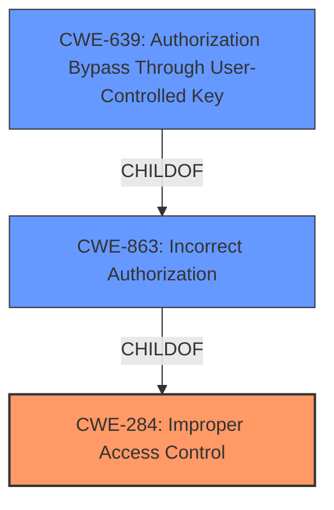

# Enhanced Analysis for CVE-2021-20633

# Summary
| CWE ID | CWE Name | Confidence | CWE Abstraction Level | CWE Vulnerability Mapping Label | CWE-Vulnerability Mapping Notes |
|---|---|---|---|---|---|
| CWE-284 | Improper Access Control | 0.8 | Pillar | Primary | Discouraged. The description indicates a failure to properly restrict access, but more specific CWEs should be considered. |
| CWE-863 | Incorrect Authorization | 0.7 | Class | Secondary | Allowed-with-Review. The vulnerability involves an authorization check that is not correctly performed. |
| CWE-639 | Authorization Bypass Through User-Controlled Key | 0.6 | Base | Secondary | Allowed. The vulnerability could involve a user-controlled key being used to bypass authorization. |

## Evidence and Confidence

*   **Confidence Score:** 0.7
*   **Evidence Strength:** MEDIUM

## Relationship Analysis
The primary CWE is CWE-284, which is a high-level category. The analysis considered more specific child CWEs like CWE-863 and CWE-639. CWE-863 is a child of CWE-284, indicating a hierarchical relationship where CWE-863 provides more specific details about the authorization process. CWE-639 is a base CWE and a child of CWE-863, representing a specific type of authorization bypass. The decision to include CWE-863 and CWE-639 is based on the need for more granularity in describing the vulnerability.



## Vulnerability Chain
The vulnerability chain starts with **improper access control**, which leads to the ability to bypass access restrictions and ultimately obtain unauthorized data.
  - **Root Cause:** **Improper Access Control** (CWE-284)
  - **Weakness:** Incorrect Authorization (CWE-863) or Authorization Bypass Through User-Controlled Key (CWE-639)
  - **Impact:** Bypass access restriction and obtain the date of Cabinet

## Summary of Analysis
The initial analysis identified **improper access control** as the root cause, which aligns with CWE-284. However, CWE-284 is a high-level pillar. Therefore, a more detailed analysis was performed to identify more specific CWEs. The CVE Reference Links Content Summary indicates the issue is due to an improper implementation of access control.

The retriever results also suggest CWE-284, CWE-863, and CWE-639 as potential matches.

The decision to include CWE-863 is based on the fact that the vulnerability involves an authorization check that is not correctly performed. The description states "**Improper access control** vulnerability in Cabinet of Cybozu Office 10.0.0 to 10.8.4 allows authenticated attackers to bypass access restriction".

CWE-639 was also considered because it describes a scenario where the authorization functionality does not prevent one user from gaining access to another user's data by modifying the key value identifying the data.

The selected CWEs provide a more granular understanding of the vulnerability, moving from a general **improper access control** to specific issues with authorization and potential bypass mechanisms.

The selected CWEs are at the optimal level of specificity because they capture both the high-level issue of **improper access control** and the more specific details of how the access control is bypassed.

Relevant CWE Information:

# Enhanced Context (25 CWEs)
The following CWEs were identified as potentially relevant to this vulnerability:

## CWE-274: Improper Handling of Insufficient Privileges
**Abstraction Level**: Base
**Similarity Score**: 0.75
**Source**: dense

**Description**:
The product does not handle or incorrectly handles when it has insufficient privileges to perform an operation, leading to resultant weaknesses.

**Mapping Guidance**:
- Usage: Discouraged
- Rationale: This CWE entry could be deprecated in a future version of CWE.

*Not Selected:* This CWE is not appropriate because the vulnerability is not due to the product incorrectly handling insufficient privileges.

## CWE-653: Improper Isolation or Compartmentalization
**Abstraction Level**: Class
**Similarity Score**: 0.74
**Source**: dense

**Description**:
The product does not properly compartmentalize or isolate functionality, processes, or resources that require different privilege levels, rights, or permissions.

**Mapping Guidance**:
- Usage: Allowed
- Rationale: This CWE entry is at the Base level of abstraction, which is a preferred level of abstraction for mapping to the root causes of vulnerabilities.

*Not Selected:* This CWE does not fit the vulnerability description. The issue is not related to a failure to properly isolate or compartmentalize functionality.

## CWE-668: Exposure of Resource to Wrong Sphere
**Abstraction Level**: Class
**Similarity Score**: 0.74
**Source**: dense

**Description**:
The product exposes a resource to the wrong control sphere, providing unintended actors with inappropriate access to the resource.

**Mapping Guidance**:
- Usage: Discouraged
- Rationale: CWE-668 is high-level and is often misused as a catch-all when lower-level CWE IDs might be applicable. It is sometimes used for low-information vulnerability reports [REF-1287]. It is a level-1 Class (i.e., a child of a Pillar). It is not useful for trend analysis.

*Not Selected:* This CWE is too general. While the vulnerability does involve unauthorized access, more specific CWEs are available.

## CWE-280: Improper Handling of Insufficient Permissions or Privileges
**Abstraction Level**: Base
**Similarity Score**: 0.74
**Source**: dense

**Description**:
The product does not handle or incorrectly handles when it has insufficient privileges to access resources or functionality as specified by their permissions. This may cause it to follow unexpected code paths that may leave the product in an invalid state.

**Mapping Guidance**:
- Usage: Allowed
- Rationale: This CWE entry is at the Base level of abstraction, which is a preferred level of abstraction for mapping to the root causes of vulnerabilities.

*Not Selected:* The vulnerability isn't about handling insufficient privileges; it's about bypassing access restrictions.

## CWE-639: Authorization Bypass Through User-Controlled Key
**Abstraction Level**: Base
**Similarity Score**: 0.74
**Source**: dense

**Description**:
The system's authorization functionality does not prevent one user from gaining access to another user's data or record by modifying the key value identifying the data.

**Mapping Guidance**:
- Usage: Allowed
- Rationale: This CWE entry is at the Base level of abstraction, which is a preferred level of abstraction for mapping to the root causes of vulnerabilities.

*Selected:* As a secondary CWE, this aligns with the possibility of bypassing authorization checks through a user-controlled key.

## CWE-41: Improper Resolution of Path Equivalence
**Abstraction Level**: Base
**Similarity Score**: 0.73
**Source**: dense

**Description**:
The product is vulnerable to file system contents disclosure through path equivalence. Path equivalence involves the use of special characters in file and directory names. The associated manipulations are intended to generate multiple names for the same object.

**Mapping Guidance**:
- Usage: Allowed
- Rationale: This CWE entry is at the Base level of abstraction, which is a preferred level of abstraction for mapping to the root causes of vulnerabilities.

*Not Selected:* This CWE is specific to file system path equivalence issues, which is not the nature of this vulnerability.

## CWE-1220: Insufficient Granularity of Access Control
**Abstraction Level**: Base
**Similarity Score**: 0.73
**Source**: dense

**Description**:
The product implements access controls via a policy or other feature with the intention to disable or restrict accesses (reads and/or writes) to assets in a system from untrusted agents. However, implemented access controls lack required granularity, which renders the control policy too broad because it allows accesses from unauthorized agents to the security-sensitive assets.

**Mapping Guidance**:
- Usage: Allowed
- Rationale: This CWE entry is at the Base level of abstraction, which is a preferred level of abstraction for mapping to the root causes of vulnerabilities.

*Not Selected:* While the **improper access control** might involve insufficient granularity, there's no explicit evidence to support this.

## CWE-266: Incorrect Privilege Assignment
**Abstraction Level**: Base
**Similarity Score**: 0.73
**Source**: dense

**Description**:
A product incorrectly assigns a privilege to a particular actor, creating an unintended sphere of control for that actor.

**Mapping Guidance**:
- Usage: Allowed
- R


## CWE Relationship Analysis

Current CWEs represent these abstraction levels: .


### Vulnerability Chain Analysis

**Chain starting from CWE-284:**
- 284 (Improper Access Control) - ROOT


**Chain starting from CWE-653:**
- 653 (Improper Isolation or Compartmentalization) - ROOT


### CWE Relationship Diagram

```mermaid
graph TD
    classDef primary fill:#f96,stroke:#333,stroke-width:2px
    classDef secondary fill:#69f,stroke:#333
    classDef tertiary fill:#9e9,stroke:#333
```