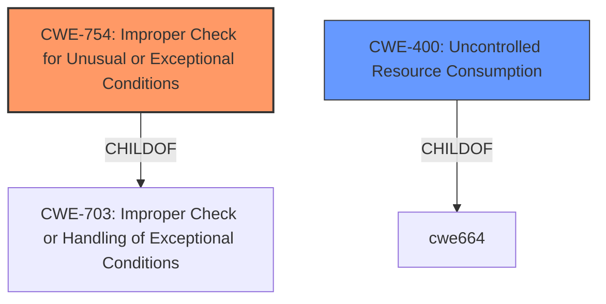

# Enhanced Analysis for CVE-2021-20637

# Summary
| CWE ID | CWE Name | Confidence | CWE Abstraction Level | CWE Vulnerability Mapping Label | CWE-Vulnerability Mapping Notes |
|---|---|---|---|---|---|
| CWE-754 | Improper Check for Unusual or Exceptional Conditions | 0.8 | Class | Primary | Allowed-with-Review |
| CWE-400 | Uncontrolled Resource Consumption | 0.6 | Class | Secondary | Discouraged |

## Evidence and Confidence

*   **Confidence Score:** 0.7
*   **Evidence Strength:** HIGH

## Relationship Analysis
The primary CWE, CWE-754 (Improper Check for Unusual or Exceptional Conditions), is a class-level CWE and a child of CWE-703. CWE-754 captures the **improper handling of exceptional conditions**, which aligns with the vulnerability description. CWE-400 (Uncontrolled Resource Consumption) is included as a potential secondary weakness because the attack leads to a denial-of-service (DoS) condition, implying resource exhaustion. However, CWE-400 is a class-level CWE and is often misused, so it's considered secondary.



## Vulnerability Chain
The chain of events is as follows:
1.  **Improper check or handling of exceptional conditions** (CWE-754) in the product.
2.  A remote attacker sends a specially crafted URL.
3.  The product experiences a denial-of-service (DoS) condition, which can be viewed as **Uncontrolled Resource Consumption** (CWE-400).

## Summary of Analysis
The initial assessment identified **Improper check or handling of exceptional conditions** as the primary weakness, based on the vulnerability description and key phrases. The CVE Reference Links Content Summary supports this by stating the root cause is an **improper handling of exceptional conditions**. The Retriever Results also list CWE-754 as a candidate.

CWE-754 is selected as the primary CWE because it reflects the **root cause** of the vulnerability. The vulnerability description explicitly mentions **"Improper check or handling of exceptional conditions"** which directly aligns with CWE-754.

CWE-400 is added as a secondary CWE because the impact of the vulnerability is a denial-of-service (DoS), which often results from uncontrolled resource consumption. However, it is considered a secondary impact rather than a direct cause.

The selection of CWE-754 is at the Class level. A more specific CWE might exist, but there isn't enough information in the description to pinpoint a base or variant-level CWE. CWE-754 appropriately captures the generalized **improper handling of exceptional conditions** without specifying the exact nature of the error.

Relevant CWE Information:

# Enhanced Context (25 CWEs)
The following CWEs were identified as potentially relevant to this vulnerability:

## CWE-799: Improper Control of Interaction Frequency
**Abstraction Level**: Class
**Similarity Score**: 0.79
**Source**: dense

**Description**:
The product does not properly limit the number or frequency of interactions that it has with an actor, such as the number of incoming requests.

**Mapping Guidance**:
- Usage: Allowed-with-Review
- Rationale: This CWE entry is a Class and might have Base-level children that would be more appropriate

*   *Not selected*: Although a DoS attack is involved, the **root cause** is not an **improper control of interaction frequency**, but rather **improper handling of a specific input (a specially crafted URL)**.

## CWE-405: Asymmetric Resource Consumption (Amplification)
**Abstraction Level**: Class
**Similarity Score**: 0.75
**Source**: dense

**Description**:
The product does not properly control situations in which an adversary can cause the product to consume or produce excessive resources without requiring the adversary to invest equivalent work or otherwise prove authorization, i.e., the adversary's influence is "asymmetric."

**Mapping Guidance**:
- Usage: Allowed-with-Review
- Rationale: This CWE entry is a Class and might have Base-level children that would be more appropriate

*   *Not selected*: Similar to CWE-799, while DoS is a consequence, the vulnerability doesn't explicitly involve asymmetric resource consumption. The issue is in **handling a specific crafted URL**, not necessarily amplifying resource usage.

## CWE-664: Improper Control of a Resource Through its Lifetime
**Abstraction Level**: Pillar
**Similarity Score**: 0.73
**Source**: dense

**Description**:
The product does not maintain or incorrectly maintains control over a resource throughout its lifetime of creation, use, and release.

**Mapping Guidance**:
- Usage: Discouraged
- Rationale: This CWE entry is high-level when lower-level children are available.

*   *Not selected*: This is too general. The problem is not about the general resource lifecycle, but specifically the handling of a crafted URL causing an exceptional condition.

## CWE-1289: Improper Validation of Unsafe Equivalence in Input
**Abstraction Level**: Base
**Similarity Score**: 0.73
**Source**: dense

**Description**:
The product receives an input value that is used as a resource identifier or other type of reference, but it does not validate or incorrectly validates that the input is equivalent to a potentially-unsafe value.

**Mapping Guidance**:
- Usage: Allowed
- Rationale: This CWE entry is at the Base level of abstraction, which is a preferred level of abstraction for mapping to the root causes of vulnerabilities.

*   *Not selected*: This is too specific. It refers to validating equivalence, which isn't directly mentioned. The problem is broader than that; it's how the URL is handled in exceptional cases.

## CWE-606: Unchecked Input for Loop Condition
**Abstraction Level**: Base
**Similarity Score**: 0.72
**Source**: dense

**Description**:
The product does not properly check inputs that are used for loop conditions, potentially leading to a denial of service or other consequences because of excessive looping.

**Mapping Guidance**:
- Usage: Allowed
- Rationale: This CWE entry is at the Base level of abstraction, which is a preferred level of abstraction for mapping to the root causes of vulnerabilities.

*   *Not selected*: The description doesn't point towards a loop condition issue.

## CWE-691: Insufficient Control Flow Management
**Abstraction Level**: Pillar
**Similarity Score**: 0.72
**Source**: dense

**Description**:
The code does not sufficiently manage its control flow during execution, creating conditions in which the control flow can be modified in unexpected ways.

**Mapping Guidance**:
- Usage: Discouraged
- Rationale: This CWE entry is extremely high-level, a Pillar. However, classification research is limited for weaknesses of this type, so there can be gaps or organizational difficulties within CWE that force use of this weakness, even at such a high level of abstraction.

*   *Not selected*: This is too general and high-level.

## CWE-653: Improper Isolation or Compartmentalization
**Abstraction Level**: Class
**Similarity Score**: 0.72
**Source**: dense

**Description**:
The product does not properly compartmentalize or isolate functionality, processes, or resources that require different privilege levels, rights, or permissions.

**Mapping Guidance**:
- Usage: Allowed
- Rationale: This CWE entry is at the Base level of abstraction, which is a preferred level of abstraction for mapping to the root causes of vulnerabilities.

*   *Not selected*: Not relevant; the vulnerability does not involve isolation or compartmentalization issues.

## CWE-807: Reliance on Untrusted Inputs in a Security Decision
**Abstraction Level**: Base
**Similarity Score**: 0.72
**Source**: dense

**Description**:
The product uses a protection mechanism that relies on the existence or values of an input, but the input can be modified by an untrusted actor in a way that bypasses the protection mechanism.

**Mapping Guidance**:
- Usage: Allowed
- Rationale: This CWE entry is at the Base level of abstraction, which is a preferred level of abstraction for mapping to the root causes of vulnerabilities.

*   *Not selected*: Not applicable; the description doesn't indicate a security decision based on untrusted input.

## CWE-184: Incomplete List of Disallowed Inputs
**Abstraction Level**: Base
**Similarity Score**: 0.72
**Source**: dense

**Description**:
The product implements a protection mechanism that relies on a list of inputs (or properties of inputs) that are not allowed by policy or otherwise require other action to neutralize before additional processing takes place, but the list is incomplete.

**Mapping


## CWE Relationship Analysis

Current CWEs represent these abstraction levels: .


### Vulnerability Chain Analysis

**Chain starting from CWE-754:**
- 754 (Improper Check for Unusual or Exceptional Conditions) - ROOT


**Chain starting from CWE-691:**
- 691 (Insufficient Control Flow Management) - ROOT


### CWE Relationship Diagram

```mermaid
graph TD
    classDef primary fill:#f96,stroke:#333,stroke-width:2px
    classDef secondary fill:#69f,stroke:#333
    classDef tertiary fill:#9e9,stroke:#333
```