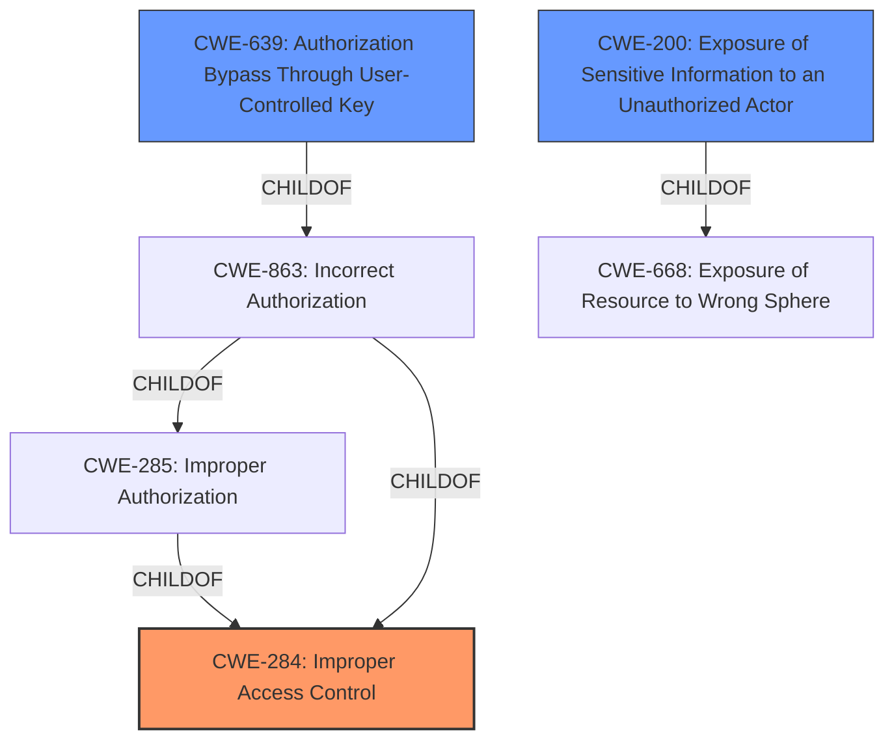

# Enhanced Analysis for CVE-2021-20670

# Summary
| CWE ID | CWE Name | Confidence | CWE Abstraction Level | CWE Vulnerability Mapping Label | CWE-Vulnerability Mapping Notes |
|---|---|---|---|---|---|
| CWE-284 | Improper Access Control | 0.75 | Pillar | Primary | Discouraged |
| CWE-200 | Exposure of Sensitive Information to an Unauthorized Actor | 0.6 | Class | Secondary | Discouraged |
| CWE-639 | Authorization Bypass Through User-Controlled Key | 0.5 | Base | Secondary | Allowed |

## Evidence and Confidence

*   **Confidence Score:** 0.7
*   **Evidence Strength:** MEDIUM

## Relationship Analysis
The primary CWE identified is CWE-284, Improper Access Control (Pillar). However, due to its high-level nature, it's necessary to consider more specific child CWEs. CWE-639, Authorization Bypass Through User-Controlled Key (Base), and CWE-200, Exposure of Sensitive Information to an Unauthorized Actor (Class), are considered as secondary candidates. CWE-639 is a child of CWE-863 (Incorrect Authorization), which in turn is a child of CWE-285 (Improper Authorization) and CWE-284. CWE-200 is a child of CWE-668 (Exposure of Resource to Wrong Sphere). The relationships show a hierarchical structure where the higher-level CWE-284 is too broad, and the lower-level CWEs offer more specific classifications of the vulnerability.



## Vulnerability Chain
The vulnerability chain starts with the **improper access control** (CWE-284), leading to unauthorized access, and resulting in the exposure of sensitive information (CWE-200). A more specific instance of **improper access control** could be **Authorization Bypass Through User-Controlled Key** (CWE-639), where an attacker modifies a key to access unauthorized data.

## Summary of Analysis
Initial analysis identified **improper access control** as the root cause, aligning with CWE-284. The retriever results also listed CWE-284 as the top combined result. However, CWE-284 is a Pillar, which makes it too generic. The vulnerability allows a remote unauthenticated attacker to read user's personal information and server's internal information.

Based on the retriever results, CWE-200, Exposure of Sensitive Information to an Unauthorized Actor, and CWE-639, Authorization Bypass Through User-Controlled Key, were also considered.

CWE-200 is a Class-level CWE, but the vulnerability description specifically notes "improper access control" as the root cause, with the impact being the exposure of sensitive information. CWE-200 is often misused to represent the loss of confidentiality and is a technical impact rather than a root cause. Therefore, it is a secondary CWE.

CWE-639, Authorization Bypass Through User-Controlled Key, is a Base-level CWE that specifies the system's authorization functionality does not prevent one user from gaining access to another user's data by modifying the key value. While this could be a possible attack vector, the description does not explicitly state the key is user-controlled.

Therefore, the primary CWE is CWE-284 because the vulnerability description key phrases identify the root cause as **improper access control**. The evidence from the vulnerability description is: "**improper access control** vulnerability in GROWI versions v4.2.2 and earlier allows a remote unauthenticated attacker to read the users personal information and/or servers internal information via unspecified vectors."

CWE-200 is a Class-level CWE and is listed as a secondary CWE because the impact of the vulnerability leads to the exposure of sensitive information.

CWE-639 is a Base-level CWE and is listed as a secondary CWE because it is a more specific type of access control bypass.

While CWE-284 is discouraged, there isn't enough information to pick a more specific CWE.

Relevant CWE Information:

# Enhanced Context (25 CWEs)
The following CWEs were identified as potentially relevant to this vulnerability:

## CWE-639: Authorization Bypass Through User-Controlled Key
**Abstraction Level**: Base
**Similarity Score**: 0.75
**Source**: dense

**Description**:
The system's authorization functionality does not prevent one user from gaining access to another user's data or record by modifying the key value identifying the data.

**Mapping Guidance**:
- Usage: Allowed
- Rationale: This CWE entry is at the Base level of abstraction, which is a preferred level of abstraction for mapping to the root causes of vulnerabilities.
## CWE-807: Reliance on Untrusted Inputs in a Security Decision
**Abstraction Level**: Base
**Similarity Score**: 0.75
**Source**: dense

**Description**:
The product uses a protection mechanism that relies on the existence or values of an input, but the input can be modified by an untrusted actor in a way that bypasses the protection mechanism.

**Mapping Guidance**:
- Usage: Allowed
- Rationale: This CWE entry is at the Base level of abstraction, which is a preferred level of abstraction for mapping to the root causes of vulnerabilities.
## CWE-274: Improper Handling of Insufficient Privileges
**Abstraction Level**: Base
**Similarity Score**: 0.74
**Source**: dense

**Description**:
The product does not handle or incorrectly handles when it has insufficient privileges to perform an operation, leading to resultant weaknesses.

**Mapping Guidance**:
- Usage: Discouraged
- Rationale: This CWE entry could be deprecated in a future version of CWE.
## CWE-303: Incorrect Implementation of Authentication Algorithm
**Abstraction Level**: Base
**Similarity Score**: 0.74
**Source**: dense

**Description**:
The requirements for the product dictate the use of an established authentication algorithm, but the implementation of the algorithm is incorrect.

**Mapping Guidance**:
- Usage: Allowed
- Rationale: This CWE entry is at the Base level of abstraction, which is a preferred level of abstraction for mapping to the root causes of vulnerabilities.
## CWE-1390: Weak Authentication
**Abstraction Level**: Class
**Similarity Score**: 0.74
**Source**: dense

**Description**:
The product uses an authentication mechanism to restrict access to specific users or identities, but the mechanism does not sufficiently prove that the claimed identity is correct.

**Mapping Guidance**:
- Usage: Allowed-with-Review
- Rationale: This CWE entry is a Class and might have Base-level children that would be more appropriate
## CWE-1220: Insufficient Granularity of Access Control
**Abstraction Level**: Base
**Similarity Score**: 0.74
**Source**: dense

**Description**:
The product implements access controls via a policy or other feature with the intention to disable or restrict accesses (reads and/or writes) to assets in a system from untrusted agents. However, implemented access controls lack required granularity, which renders the control policy too broad because it allows accesses from unauthorized agents to the security-sensitive assets.

**Mapping Guidance**:
- Usage: Allowed
- Rationale: This CWE entry is at the Base level of abstraction, which is a preferred level of abstraction for mapping to the root causes of vulnerabilities.
## CWE-280: Improper Handling of Insufficient Permissions or Privileges
**Abstraction Level**: Base
**Similarity Score**: 0.74
**Source**: dense

**Description**:
The product does not handle or incorrectly handles when it has insufficient privileges to access resources or functionality as specified by their permissions. This may cause it to follow unexpected code paths that may leave the product in an invalid state.

**Mapping Guidance**:
- Usage: Allowed
- Rationale: This CWE entry is at the Base level of abstraction, which is a preferred level of abstraction for mapping to the root causes of vulnerabilities.
## CWE-653: Improper Isolation or Compartmentalization
**Abstraction Level**: Class
**Similarity Score**: 0.73
**Source**: dense

**Description**:
The product does not


## CWE Relationship Analysis

Current CWEs represent these abstraction levels: .


### Vulnerability Chain Analysis

**Chain starting from CWE-303:**
- 303 (Incorrect Implementation of Authentication Algorithm) - ROOT


**Chain starting from CWE-284:**
- 284 (Improper Access Control) - ROOT


### CWE Relationship Diagram

```mermaid
graph TD
    classDef primary fill:#f96,stroke:#333,stroke-width:2px
    classDef secondary fill:#69f,stroke:#333
    classDef tertiary fill:#9e9,stroke:#333
```