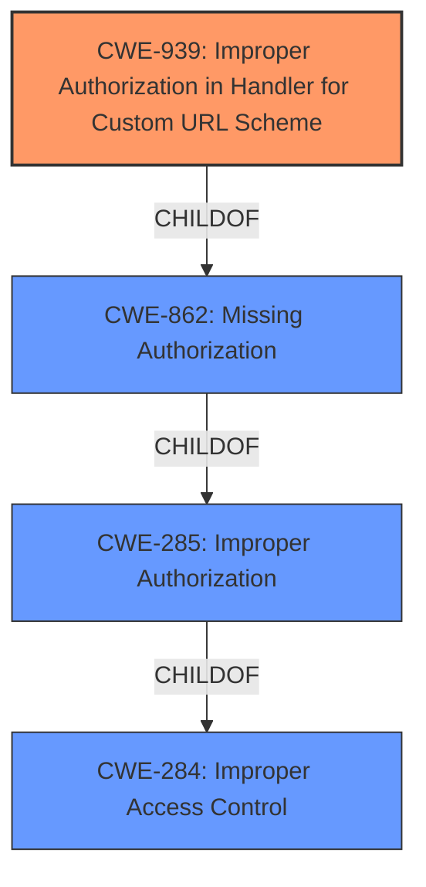

# Analysis for CVE-2021-20693

# Summary
| CWE ID  | CWE Name                                                | Confidence | CWE Abstraction Level | CWE Vulnerability Mapping Label | CWE-Vulnerability Mapping Notes |
| :------- | :------------------------------------------------------ | :--------- | :-------------------- | :------------------------------ | :------------------------------ |
| CWE-939  | Improper Authorization in Handler for Custom URL Scheme | 0.9        | Base                  | Primary                        | Allowed                       |
| CWE-284  | Improper Access Control                                 | 0.5        | Pillar                  | Secondary                      | Discouraged                   |

## Evidence and Confidence

*   **Confidence Score:** 0.9
*   **Evidence Strength:** HIGH

## Relationship Analysis
The primary CWE, CWE-939, is a base-level weakness that is a child of CWE-862 (Missing Authorization), which in turn is a child of CWE-285 (Improper Authorization). CWE-284 is a high-level Pillar, making CWE-939 a more specific and appropriate choice. The vulnerability involves a custom URL scheme, aligning well with the description of CWE-939.

## Vulnerability Chain
The vulnerability chain starts with the **improper access control** in the Gurunavi App's handler for a custom URL scheme (CWE-939). This allows a remote attacker to lead a user to access an arbitrary website, potentially leading to a phishing attack. The **root cause** is the **improper access control** in the custom URL scheme handler, which allows untrusted actors to invoke the handler. The final impact is that a user can be tricked into accessing an arbitrary website.

## Summary of Analysis
The initial assessment identified **improper access control** as the **root cause**, which aligns with CWE-939. The CVE Reference Links Content Summary confirms this, stating that the Gurunavi Apps lack proper access control, allowing arbitrary apps to send requests and trigger URL access.

>   "The Gurunavi Apps for Android and iOS use a Custom URL Scheme to access a requested URL. However, they lack proper access control, allowing arbitrary apps to send requests and trigger URL access."

CWE-939 (Improper Authorization in Handler for Custom URL Scheme) is the most specific and appropriate CWE. It directly addresses the vulnerability where the app uses a custom URL scheme but fails to properly restrict which actors can invoke the handler.

CWE-284 (Improper Access Control) is a very general, high-level CWE (a Pillar) and is discouraged by MITRE for this reason. While the vulnerability is related to access control, choosing CWE-284 would be too broad and would not capture the specific nature of the flaw (custom URL scheme handler).

Therefore, CWE-939 is selected because it accurately represents the **root cause** with supporting evidence.