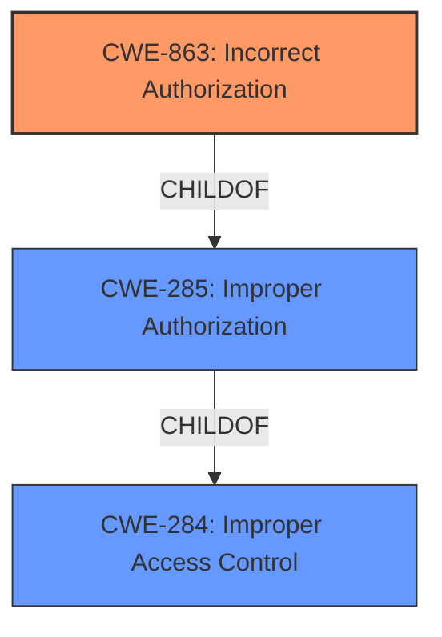

# Enhanced Analysis for CVE-2021-20694

# Summary
| CWE ID | CWE Name | Confidence | CWE Abstraction Level | CWE Vulnerability Mapping Label | CWE-Vulnerability Mapping Notes |
|---|---|---|---|---|---|
| CWE-863 | Incorrect Authorization | 0.9 | Base | Primary | Allowed |
| CWE-285 | Improper Authorization | 0.7 | Class | Secondary | Discouraged |
| CWE-284 | Improper Access Control | 0.6 | Pillar | Secondary | Discouraged |

## Evidence and Confidence

*   **Confidence Score:** 0.9
*   **Evidence Strength:** HIGH

## Relationship Analysis
The primary CWE, CWE-863 (Incorrect Authorization), is a base-level CWE, providing a specific description of the vulnerability. It is related to the class-level CWE-285 (Improper Authorization) and pillar-level CWE-284 (Improper Access Control) as a child. The decision to select CWE-863 was influenced by its higher specificity compared to its parents.



## Vulnerability Chain
The vulnerability chain starts with the **improper access control**, leading to the ability to bypass access restrictions and start a telnet service.
  - The root cause is **improper access control**.
  - The weakness is **incorrect authorization**.
  - The impact is bypassing access restriction and starting a telnet service.

## Summary of Analysis
The analysis is based on the vulnerability description and CVE reference summary, which clearly indicate an **improper access control** issue. The vulnerability allows a remote authenticated attacker to bypass access restrictions and start a telnet service. The CVE reference summary explicitly states the root cause as **improper access control**, where an authenticated user can enable the telnet service without proper authorization.

The retriever results suggest CWE-284 (Improper Access Control), CWE-285 (Improper Authorization), and CWE-287 (Improper Authentication). However, CWE-284 is a pillar-level CWE and too general. CWE-285 is a class-level CWE and also less specific than CWE-863. CWE-287 is not appropriate because the attacker is already authenticated; the problem lies in the authorization process after authentication.

The final selection of CWE-863 (Incorrect Authorization) is based on its base-level specificity and the vulnerability description, which highlights that the authorization check is not correctly performed.

Relevant CWE Information:

# Enhanced Context (25 CWEs)
The following CWEs were identified as potentially relevant to this vulnerability:

## CWE-653: Improper Isolation or Compartmentalization
**Abstraction Level**: Class
**Similarity Score**: 0.77
**Source**: dense

**Description**:
The product does not properly compartmentalize or isolate functionality, processes, or resources that require different privilege levels, rights, or permissions.
(Considered but rejected because the vulnerability is more specifically about incorrect authorization, not a general lack of isolation.)

## CWE-274: Improper Handling of Insufficient Privileges
**Abstraction Level**: Base
**Similarity Score**: 0.76
**Source**: dense

**Description**:
The product does not handle or incorrectly handles when it has insufficient privileges to perform an operation, leading to resultant weaknesses.
(Considered but rejected because the vulnerability isn't about the handling of insufficient privileges, but rather the incorrect granting of access.)

## CWE-280: Improper Handling of Insufficient Permissions or Privileges 
**Abstraction Level**: Base
**Similarity Score**: 0.75
**Source**: dense

**Description**:
The product does not handle or incorrectly handles when it has insufficient privileges to access resources or functionality as specified by their permissions. This may cause it to follow unexpected code paths that may leave the product in an invalid state.
(Considered but rejected because the vulnerability isn't about the handling of insufficient privileges, but rather the incorrect granting of access.)

## CWE-266: Incorrect Privilege Assignment
**Abstraction Level**: Base
**Similarity Score**: 0.75
**Source**: dense

**Description**:
A product incorrectly assigns a privilege to a particular actor, creating an unintended sphere of control for that actor.
(Considered but rejected because the vulnerability is less about assigning privileges incorrectly in general and more about the authorization check itself being incorrect.)

## CWE-668: Exposure of Resource to Wrong Sphere
**Abstraction Level**: Class
**Similarity Score**: 0.74
**Source**: dense

**Description**:
The product exposes a resource to the wrong control sphere, providing unintended actors with inappropriate access to the resource.
(Considered but rejected as CWE-668 is too high-level and a lower-level CWE ID is applicable.)

## CWE-667: Improper Locking
**Abstraction Level**: Class
**Similarity Score**: 0.74
**Source**: dense

**Description**:
The product does not properly acquire or release a lock on a resource, leading to unexpected resource state changes and behaviors.
(Considered but rejected because the vulnerability doesn't involve locking mechanisms.)

## CWE-404: Improper Resource Shutdown or Release
**Abstraction Level**: Class
**Similarity Score**: 0.74
**Source**: dense

**Description**:
The product does not release or incorrectly releases a resource before it is made available for re-use.
(Considered but rejected because the vulnerability isn't related to resource shutdown or release.)

## CWE-267: Privilege Defined With Unsafe Actions
**Abstraction Level**: Base
**Similarity Score**: 0.74
**Source**: dense

**Description**:
A particular privilege, role, capability, or right can be used to perform unsafe actions that were not intended, even when it is assigned to the correct entity.
(Considered but rejected because the issue is the authorization check itself is incorrect.)

## CWE-226: Sensitive Information in Resource Not Removed Before Reuse
**Abstraction Level**: Base
**Similarity Score**: 0.74
**Source**: dense

**Description**:
The product releases a resource such as memory or a file so that it can be made available for reuse, but it does not clear or "zeroize" the information contained in the resource before the product performs a critical state transition or makes the resource available for reuse by other entities.
(Considered but rejected because this is not a resource reuse issue)

## CWE-1220: Insufficient Granularity of Access Control
**Abstraction Level**: Base
**Similarity Score**: 0.74
**Source**: dense

**Description**:
The product implements access controls via a policy or other feature with the intention to disable or restrict accesses (reads and/or writes) to assets in a system from untrusted agents. However, implemented access controls lack required granularity, which renders the control policy too broad because it allows accesses from unauthorized agents to the security-sensitive assets.
(Considered but rejected because the issue is not the granularity of access control but that the authorization check is incorrect.)

## CWE-863: Incorrect Authorization
**Abstraction Level**: Class
**Similarity Score**: 7659.00
**Source**: sparse

**Description**:
The product performs an authorization check when an actor attempts to access a resource or perform an action, but it does not correctly perform the check.

**Mapping Guidance**:
- Usage: Allowed-with-Review
- Rationale: This CWE entry is a Class and might have Base-level children that would be more appropriate
(Selected as the primary CWE because the authorization check is not correctly performed.)

## CWE-200: Exposure of Sensitive Information to an Unauthorized Actor
**Abstraction Level**: Class
**Similarity Score**: 7518.36
**Source**: sparse

**Description**:
The product exposes sensitive information to an actor that is not explicitly authorized to have access to that information.
(Considered but rejected because this is not an information exposure issue.)

## CWE-287: Improper Authentication
**Abstraction Level**: Class
**Similarity Score**: 7502.45
**Source**: sparse

**Description**:
When an actor claims to have a given identity, the product does not prove or insufficiently proves that the claim is correct.
(Considered but rejected because the attacker is already authenticated; the problem lies in the authorization process after authentication.)

## CWE-285: Improper Authorization
**Abstraction Level**: Class
**Similarity Score**: 7492.84
**Source**: sparse

**Description**:
The product does not perform or incorrectly performs an authorization check when an actor attempts to access a resource or perform an action.
(Selected as a secondary CWE because authorization is not correctly performed, but CWE-863 is


## CWE Relationship Analysis

Current CWEs represent these abstraction levels: .


### Vulnerability Chain Analysis

**Chain starting from CWE-667:**
- 667 (Improper Locking) - ROOT


**Chain starting from CWE-404:**
- 404 (Improper Resource Shutdown or Release) - ROOT


### CWE Relationship Diagram

```mermaid
graph TD
    classDef primary fill:#f96,stroke:#333,stroke-width:2px
    classDef secondary fill:#69f,stroke:#333
    classDef tertiary fill:#9e9,stroke:#333
```