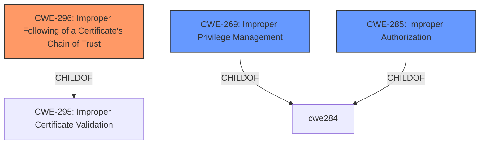

# Enhanced Analysis for CVE-2021-20695

# Summary
| CWE ID | CWE Name | Confidence | CWE Abstraction Level | CWE Vulnerability Mapping Label | CWE-Vulnerability Mapping Notes |
|---|---|---|---|---|---|
| CWE-296 | Improper Following of a Certificate's Chain of Trust | 1.0 | Base | Allowed | Primary CWE |
| CWE-269 | Improper Privilege Management | 0.5 | Class | Discouraged | Secondary Candidate |
| CWE-285 | Improper Authorization | 0.5 | Class | Discouraged | Secondary Candidate |

## Evidence and Confidence

*   **Confidence Score:** 0.8
*   **Evidence Strength:** HIGH

## Relationship Analysis
The primary CWE is CWE-296, which is a base-level CWE. CWE-296 is a child of CWE-295 (Improper Certificate Validation) and CWE-573 (Missing Synchronization). CWE-285 and CWE-269 were considered as secondary candidates but were at the Class level of abstraction.



## Vulnerability Chain
The vulnerability chain starts with the **improper following of a certificate's chain of trust**, leading to a privilege escalation and ultimately granting root privileges.

CWE-296 (Root Cause) -> Privilege Escalation (Impact) -> Root Privileges (Final Impact)

## Summary of Analysis
The initial analysis of the vulnerability description and the retriever results strongly suggests CWE-296 (Improper Following of a Certificate's Chain of Trust) as the primary CWE. The vulnerability description key phrases mention "**Improper following of a certificates chain of trust**" as the root cause, which aligns directly with CWE-296. The CVE Reference Links Content Summary also mentions "**Improper privilege management**", which could potentially point to related privilege escalation issues.

The retriever results show CWE-296 as the top candidate with a significant score, further reinforcing the initial assessment. CWE-296 is also a base-level CWE, which is preferred for accurate representation.

The selection of CWE-296 is at the optimal level of specificity because it directly addresses the root cause of the vulnerability, which is the **improper handling of the certificate chain of trust**. This **weakness** leads to the attacker gaining elevated privileges.

CWE-269 (Improper Privilege Management) and CWE-285 (Improper Authorization) are considered but not used as primary CWEs because they are at the Class level of abstraction and are more general. The evidence points more specifically to the certificate chain of trust issue.

Relevant CWE Information:

# Enhanced Context (25 CWEs)

## CWE-296: Improper Following of a Certificate's Chain of Trust
**Abstraction:** Base
**Status:** Draft

### Description
The product does not follow, or incorrectly follows, the chain of trust for a certificate back to a trusted root certificate, resulting in incorrect trust of any resource that is associated with that certificate.

### Extended Description
If a system does not follow the chain of trust of a certificate to a root server, the certificate loses all usefulness as a metric of trust.

### Observed Examples
- **CVE-2016-2402:** Server allows bypass of certificate pinning by sending a chain of trust that includes a trusted CA that is not pinned.

## CWE-269: Improper Privilege Management
**Abstraction:** Class
**Status:** Draft

### Description
The product does not properly assign, modify, track, or check privileges for an actor, creating an unintended sphere of control for that actor.

### Mapping Guidance
**Usage:** Discouraged
**Rationale:** CWE-269 is commonly misused. It can be conflated with "privilege escalation," which is a technical impact that is listed in many low-information vulnerability reports [REF-1287]. It is not useful for trend analysis.

### Observed Examples
- **CVE-2001-1555:** Terminal privileges are not reset when a user logs out.

## CWE-285: Improper Authorization
**Abstraction:** Class
**Status:** Draft

### Description
The product does not perform or incorrectly performs an authorization check when an actor attempts to access a resource or perform an action.

### Extended Description
Assuming a user with a given identity, authorization is the process of determining whether that user can access a given resource, based on the user's privileges and any permissions or other access-control specifications that apply to the resource.

### Observed Examples
- **CVE-2022-24730:** Go-based continuous deployment product does not check that a user has certain privileges to update or create an app, allowing adversaries to read sensitive repository information


## CWE Relationship Analysis

Current CWEs represent these abstraction levels: .


### Vulnerability Chain Analysis

**Chain starting from CWE-285:**
- 285 (Improper Authorization) - ROOT


**Chain starting from CWE-573:**
- 573 (Improper Following of Specification by Caller) - ROOT


### CWE Relationship Diagram

```mermaid
graph TD
    classDef primary fill:#f96,stroke:#333,stroke-width:2px
    classDef secondary fill:#69f,stroke:#333
    classDef tertiary fill:#9e9,stroke:#333
```