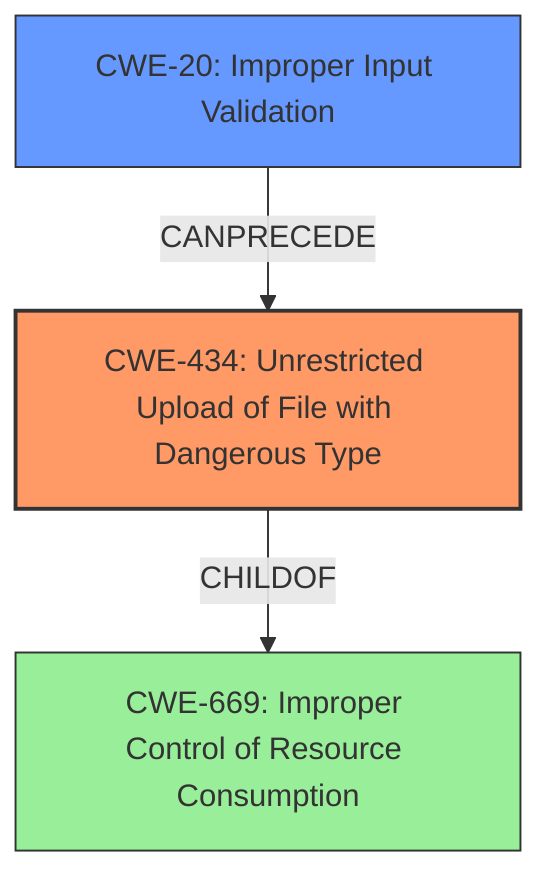

# Enhanced Analysis for CVE-2021-20705

# Summary
| CWE ID  | CWE Name                                                                     | Confidence | CWE Abstraction Level | CWE Vulnerability Mapping Label | CWE-Vulnerability Mapping Notes |
| ------- | ---------------------------------------------------------------------------- | ---------- | --------------------- | ------------------------------- | ------------------------------- |
| CWE-434 | Unrestricted Upload of File with Dangerous Type                              | 0.9        | Base                  | Primary                         | Allowed                       |
| CWE-20  | Improper Input Validation                                                      | 0.6        | Class                 | Secondary                       | Discouraged                     |

## Evidence and Confidence

*   **Confidence Score:** 0.8
*   **Evidence Strength:** HIGH

## Relationship Analysis
The primary CWE is CWE-434, which is a base level CWE and a child of CWE-669 (Improper Control of Resource Consumption). CWE-20 is considered as a secondary CWE as the root cause is **improper input validation** that leads to the impact of unrestricted file upload of a dangerous type. CWE-20 is a class level CWE, and parent of multiple base level CWEs.



## Vulnerability Chain
The vulnerability chain starts with **improper input validation** (CWE-20), which leads to unrestricted upload of file with dangerous type (CWE-434). The uploaded file can potentially be used for arbitrary code execution on the server.

## Summary of Analysis
The vulnerability description clearly states that the vulnerability is due to **improper input validation**, which allows an attacker to upload a file via network. The "CVE Reference Links Content Summary" also indicates that the root cause is an unrestricted file upload vulnerability in the WebManager function. The **improper input validation** is the root cause, and the unrestricted file upload is the resulting weakness.

Based on the description, the primary weakness is CWE-434 (Unrestricted Upload of File with Dangerous Type), because this is the most direct result of the vulnerability. The "Retriever Results" also lists CWE-434 as a relevant CWE with a density score of 0.512, but lists CWE-20 with a much lower sparse score of 0.310. While the root cause is **improper input validation**, leading to the unrestricted file upload, the unrestricted file upload is the more immediate and impactful weakness.

CWE-20 (Improper Input Validation) is also considered as a secondary weakness because the **improper input validation** is the root cause.

CWE-22 (Improper Limitation of a Pathname to a Restricted Directory ('Path Traversal')), CWE-427 (Uncontrolled Search Path Element), CWE-732 (Incorrect Permission Assignment for Critical Resource), CWE-79 (Improper Neutralization of Input During Web Page Generation ('Cross-site Scripting')), CWE-522 (Insufficiently Protected Credentials), CWE-284 (Improper Access Control), and CWE-200 (Exposure of Sensitive Information to an Unauthorized Actor) were considered but not selected.
CWE-22 was not selected because the vulnerability is not related to path traversal.
CWE-427 was not selected because the vulnerability is not related to uncontrolled search path.
CWE-732 was not selected because the vulnerability is not related to incorrect permission assignment.
CWE-79 was not selected because the vulnerability is not related to cross-site scripting.
CWE-522 was not selected because the vulnerability is not related to credentials.
CWE-284 was not selected because it is a high level, Pillar abstraction, and because other more specific CWEs were identified.
CWE-200 was not selected because the vulnerability description does not contain evidence of information exposure to an unauthorized actor.

The selected CWEs are at the optimal level of specificity because they directly represent the root cause and the immediate weakness resulting from the vulnerability, based on the provided evidence.


## CWE Relationship Analysis

Current CWEs represent these abstraction levels: .


### Vulnerability Chain Analysis

**Chain starting from CWE-732:**
- 732 (Incorrect Permission Assignment for Critical Resource) - ROOT


**Chain starting from CWE-79:**
- 79 (Improper Neutralization of Input During Web Page Generation ('Cross-site Scripting')) - ROOT


### CWE Relationship Diagram

```mermaid
graph TD
    classDef primary fill:#f96,stroke:#333,stroke-width:2px
    classDef secondary fill:#69f,stroke:#333
    classDef tertiary fill:#9e9,stroke:#333
```