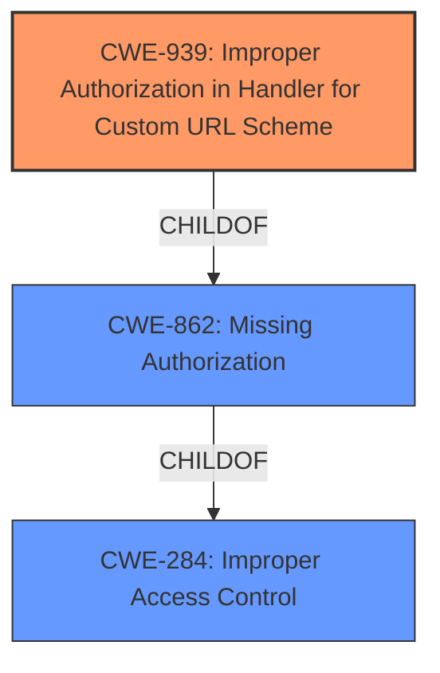

# Analysis Report for CVE-2021-20728

# Vulnerability Analysis Report: CVE-2021-20728

## Description


## Analysis (with Relationship Data)

# Summary
| CWE ID | CWE Name | Confidence | CWE Abstraction Level | CWE Vulnerability Mapping Label | CWE-Vulnerability Mapping Notes |
|---|---|---|---|---|---|
| CWE-939 | Improper Authorization in Handler for Custom URL Scheme | 0.9 | Base | Allowed | Primary CWE. The application doesn't properly authorize which actors can invoke the handler using the custom URL scheme. |
| CWE-284 | Improper Access Control | 0.6 | Pillar | Discouraged | Secondary CWE. A general category that applies because the app doesn't restrict access to the custom URL scheme handler, but CWE-939 is more specific. |
| CWE-862 | Missing Authorization | 0.6 | Class | Allowed-with-Review | Secondary CWE. The app is missing authorization for a critical function, but CWE-939 is more specific in this case. |

## Evidence and Confidence

*   **Confidence Score:** 0.9
*   **Evidence Strength:** HIGH

## Relationship Analysis
The primary CWE, CWE-939 (Improper Authorization in Handler for Custom URL Scheme), is a child of CWE-862 (Missing Authorization), which in turn is a child of CWE-284 (Improper Access Control). This hierarchical relationship indicates that CWE-939 is a more specific case of a missing authorization check. The selection of CWE-939 is influenced by its base-level abstraction, which provides more granularity than its parent classes, aligning well with the vulnerability description.



## Vulnerability Chain
The chain of weaknesses starts with the **improper access control** in the goo blog app, specifically the lack of authorization in the custom URL scheme handler. This leads to a remote attacker being able to redirect users to arbitrary websites, potentially for phishing attacks.

## Summary of Analysis
The initial assessment focused on the **improper access control** in the goo blog app, leading to a consideration of CWE-284 (Improper Access Control) and its related children, including CWE-862 (Missing Authorization). However, the retriever results and vulnerability description both pointed towards a more specific weakness: the improper handling of custom URL schemes. The final decision was to map the vulnerability to CWE-939 (Improper Authorization in Handler for Custom URL Scheme) because it accurately reflects the **root cause** of the vulnerability: the lack of authorization checks in the custom URL scheme handler. This is supported by the vulnerability description which states that the app "**does not properly restrict access to the function that uses custom URL schemes**."

The hierarchical relationship of CWE-939 being a child of CWE-862 and CWE-284 helped refine the selection. While CWE-284 broadly applies, CWE-939 provides the necessary specificity for the identified weakness. The evidence from the CVE Reference Links Content Summary further strengthens this decision, confirming the improper restriction of custom URL schemes.

Relevant CWE Information:

# Enhanced Context (25 CWEs)
The following CWEs were identified as potentially relevant to this vulnerability:

## CWE-939: Improper Authorization in Handler for Custom URL Scheme
**Abstraction Level**: Base
**Similarity Score**: 0.377
**Source**: sparse

**Description**:
The product uses a handler for a custom URL scheme, but it **does not properly restrict** which actors can invoke the handler using the scheme.

**Mapping Guidance**:
- Usage: Allowed
- Rationale: This CWE entry is at the Base level of abstraction, which is a preferred level of abstraction for mapping to the root causes of vulnerabilities.
**Comments:** Carefully read both the name and description to ensure that this mapping is an appropriate fit. Do not try to 'force' a mapping to a lower-level Base/Variant simply to comply with this preferred level of abstraction.
**Reasons:**
- Acceptable-Use

## CWE-284: Improper Access Control
**Abstraction Level**: Pillar
**Similarity Score**: 0.306
**Source**: sparse

**Description**:
The product **does not restrict** or incorrectly restricts access to a resource from an unauthorized actor.

**Mapping Guidance**:
- Usage: Discouraged
- Rationale: CWE-284 is extremely high-level, a Pillar. Its name, "Improper Access Control," is often misused in low-information vulnerability reports [REF-1287] or by active use of the OWASP Top Ten, such as "A01:2021-Broken Access Control". It is not useful for trend analysis.
**Comments:** Consider using descendants of CWE-284 that are more specific to the kind of access control involved, such as those involving authorization (Missing Authorization (CWE-862), Incorrect Authorization (CWE-863), Incorrect Permission Assignment for Critical Resource (CWE-732), etc.); authentication (Missing Authentication (CWE-306) or Weak Authentication (CWE-1390)); Incorrect User Management (CWE-286); Improper Restriction of Communication Channel to Intended Endpoints (CWE-923); etc.
**Reasons:**
- Frequent Misuse
- Abstraction
**Suggested Alternatives:**
- CWE-862: Missing Authorization
- CWE-863: Incorrect Authorization
- CWE-732: Incorrect Permission Assignment for Critical Resource
- CWE-306: Missing Authentication
- CWE-1390: Weak Authentication
- CWE-923: Improper Restriction of Communication Channel to Intended Endpoints

## CWE-862: Missing Authorization
**Abstraction Level**: Class
**Similarity Score**: 0.266
**Source**: sparse

**Description**:
The product **does not perform an authorization check** when an actor attempts to access a resource or perform an action.

**Mapping Guidance**:
- Usage: Allowed-with-Review
- Rationale: This CWE entry is a Class and might have Base-level children that would be more appropriate
**Comments:** Examine children of this entry to see if there is a better fit
**Reasons:**
- Abstraction


## CWE Relationship Analysis

Current CWEs represent these abstraction levels: .


### Vulnerability Chain Analysis

**Chain starting from CWE-732:**
- 732 (Incorrect Permission Assignment for Critical Resource) - ROOT


**Chain starting from CWE-286:**
- 286 (Incorrect User Management) - ROOT


### CWE Relationship Diagram

```mermaid
graph TD
    classDef primary fill:#f96,stroke:#333,stroke-width:2px
    classDef secondary fill:#69f,stroke:#333
    classDef tertiary fill:#9e9,stroke:#333
```


*Report generated on 2025-04-02 15:05:15*
