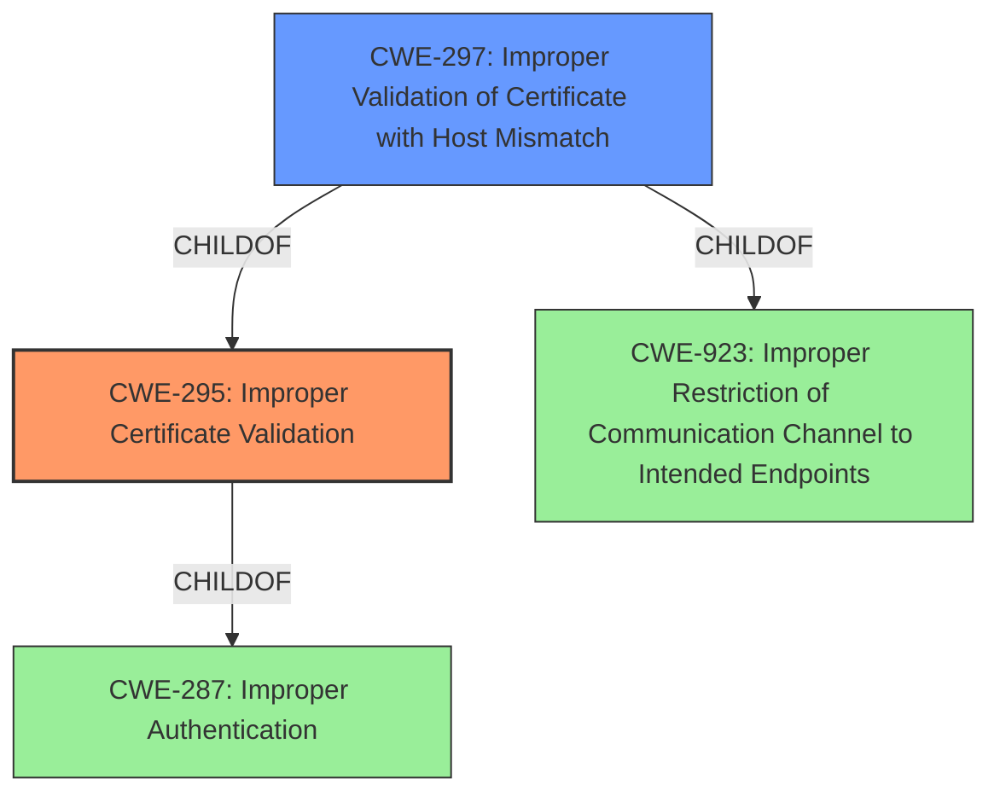

# Analysis for CVE-2021-20732

# Summary
| CWE ID | CWE Name | Confidence | CWE Abstraction Level | CWE Vulnerability Mapping Label | CWE-Vulnerability Mapping Notes |
|---|---|---|---|---|---|
| CWE-295 | Improper Certificate Validation | 1.0 | Base | Allowed | Primary CWE |
| CWE-297 | Improper Validation of Certificate with Host Mismatch | 0.7 | Variant | Allowed | Secondary Candidate |

## Evidence and Confidence

*   **Confidence Score:** 0.9
*   **Evidence Strength:** HIGH

## Relationship Analysis
The primary CWE is CWE-295, which represents the **improper certificate validation**. A more specific variant, CWE-297 (Improper Validation of Certificate with Host Mismatch), was also considered since it is a `ChildOf` CWE-295.

## Vulnerability Chain
The vulnerability chain starts with the **improper certificate validation**, leading to the possibility of a man-in-the-middle attack and eavesdropping on encrypted communication.
  - **Root Cause:** **Improper Certificate Validation** (CWE-295)
  - **Impact:** Eavesdropping on encrypted communication

## Summary of Analysis
The initial assessment, based on the **Vulnerability Description Key Phrases** and **CVE Reference Links Content Summary**, points towards **improper certificate validation** as the root cause. The vulnerability description states that the application "**does not verify server certificate properly**". The CVE reference confirms "**improper server certificate verification**" as the root cause and lists CWE-295 as a weakness.

The graph relationships highlight CWE-295 as the primary weakness, with CWE-297 as a more specific variant. CWE-295 is a base-level CWE, which is an acceptable level of abstraction.

CWE-297 (Improper Validation of Certificate with Host Mismatch) was also considered, as it is a variant of CWE-295. However, the description does not explicitly state that the host is not properly validated, but it can be implied since the certificate is not verified properly. Thus, CWE-295 is the more appropriate choice, but I will include CWE-297 as a secondary candidate.

Relevant CWE Information:

# Enhanced Context (25 CWEs)

## CWE-297: Improper Validation of Certificate with Host Mismatch
**Abstraction Level**: Variant
**Similarity Score**: 0.79
**Source**: dense

**Description**:
The product communicates with a host that provides a certificate, but the product does not properly ensure that the certificate is actually associated with that host.

**Mapping Guidance**:
- Usage: Allowed
- Rationale: This CWE entry is at the Variant level of abstraction, which is a preferred level of abstraction for mapping to the root causes of vulnerabilities.

## CWE-295: Improper Certificate Validation
**Abstraction Level**: Base
**Similarity Score**: 0.79
**Source**: dense

**Description**:
The product does not validate, or incorrectly validates, a certificate.

**Mapping Guidance**:
- Usage: Allowed
- Rationale: This CWE entry is at the Base level of abstraction, which is a preferred level of abstraction for mapping to the root causes of vulnerabilities.

## CWE-295: Improper Certificate Validation
**Abstraction Level**: Base
**Similarity Score**: 6780.61
**Source**: sparse

**Description**:
The product does not validate, or incorrectly validates, a certificate.

**Mapping Guidance**:
- Usage: Allowed
- Rationale: This CWE entry is at the Base level of abstraction, which is a preferred level of abstraction for mapping to the root causes of vulnerabilities.

## CWE-297: Improper Validation of Certificate with Host Mismatch
**Abstraction Level**: Variant
**Similarity Score**: 6106.27
**Source**: sparse

**Description**:
The product communicates with a host that provides a certificate, but the product does not properly ensure that the certificate is actually associated with that host.

**Mapping Guidance**:
- Usage: Allowed
- Rationale: This CWE entry is at the Variant level of abstraction, which is a preferred level of abstraction for mapping to the root causes of vulnerabilities.