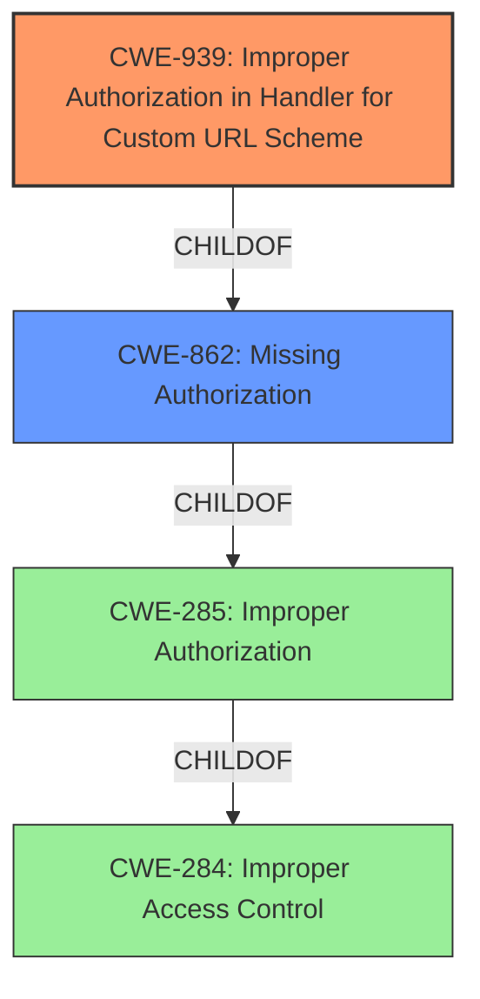

# Analysis for CVE-2021-20733

# Summary
| CWE ID | CWE Name | Confidence | CWE Abstraction Level | CWE Vulnerability Mapping Label | CWE-Vulnerability Mapping Notes |
|---|---|---|---|---|---|
| CWE-939 | Improper Authorization in Handler for Custom URL Scheme | 1.0 | Base | Allowed | Primary CWE |
| CWE-862 | Missing Authorization | 0.7 | Class | Allowed-with-Review | Secondary Candidate |

## Evidence and Confidence

*   **Confidence Score:** 0.9
*   **Evidence Strength:** HIGH

## Relationship Analysis
The primary relationship that impacted my decision was the ChildOf relationship between CWE-939 (Improper Authorization in Handler for Custom URL Scheme) and CWE-862 (Missing Authorization). CWE-939 is a more specific case of CWE-862, focusing on the context of custom URL schemes. The vulnerability description explicitly mentions a custom URL scheme, making CWE-939 a more appropriate choice.

## Vulnerability Chain
The vulnerability chain starts with the **improper authorization** in the handler for the custom URL scheme. This allows a remote attacker to trick a user into accessing an arbitrary website.

Root Cause: **Improper authorization** in the custom URL scheme handler (CWE-939).
Impact: Access to an arbitrary website, potentially leading to phishing or other malicious activities.

## Summary of Analysis
Initially, the vulnerability description points towards a general authorization issue. However, the "CVE Reference Links Content Summary" section provides crucial details about the **root cause** being related to the custom URL scheme functionality of the Android application. This led to selecting CWE-939 as the primary CWE, which is a more specific and accurate representation of the vulnerability.

The evidence is substantial, particularly the "CVE Reference Links Content Summary" section. The key phrase "Improper Restriction of Custom URL Schemes (CWE-939)" directly supports the selection of CWE-939.

The selection of CWE-939 is at the optimal level of specificity because it precisely describes the **weakness** in the context of custom URL schemes, rather than just a general authorization issue. The "Mapping Guidance" for CWE-939 recommends it as an allowed Base level CWE.

Other CWEs Considered:

*   CWE-284 (Improper Access Control): Rejected because it is too high-level (Pillar) and doesn't provide enough specific information about the vulnerability. The mapping guidance discourages its use and suggests using more specific descendants.
*   CWE-285 (Improper Authorization): Rejected because it is a Class-level CWE and CWE-939 provides more specific details.
*   CWE-862 (Missing Authorization): Considered as a secondary CWE because CWE-939 is a child of CWE-862, but CWE-939 is more precise.
*   CWE-863 (Incorrect Authorization): Rejected because the vulnerability involves a **missing** authorization check, not an incorrect one.
*   CWE-425 (Direct Request ('Forced Browsing')): Rejected because the primary issue is with the URL scheme handler, not direct access to resources.
*   CWE-639 (Authorization Bypass Through User-Controlled Key): Rejected because the vulnerability doesn't involve modifying a key value to access another user's data.

Relevant CWE Information:

# Enhanced Context (25 CWEs)
The following CWEs were identified as potentially relevant to this vulnerability:

## CWE-639: Authorization Bypass Through User-Controlled Key
**Abstraction Level**: Base
**Similarity Score**: 0.76
**Source**: dense

**Description**:
The system's authorization functionality does not prevent one user from gaining access to another user's data or record by modifying the key value identifying the data.

**Mapping Guidance**:
- Usage: Allowed
- Rationale: This CWE entry is at the Base level of abstraction, which is a preferred level of abstraction for mapping to the root causes of vulnerabilities.

## CWE-668: Exposure of Resource to Wrong Sphere
**Abstraction Level**: Class
**Similarity Score**: 0.76
**Source**: dense

**Description**:
The product exposes a resource to the wrong control sphere, providing unintended actors with inappropriate access to the resource.

**Mapping Guidance**:
- Usage: Discouraged
- Rationale: CWE-668 is high-level and is often misused as a catch-all when lower-level CWE IDs might be applicable. It is sometimes used for low-information vulnerability reports [REF-1287]. It is a level-1 Class (i.e., a child of a Pillar). It is not useful for trend analysis.

## CWE-538: Insertion of Sensitive Information into Externally-Accessible File or Directory
**Abstraction Level**: Base
**Similarity Score**: 0.76
**Source**: dense

**Description**:
The product places sensitive information into files or directories that are accessible to actors who are allowed to have access to the files, but not to the sensitive information.

**Mapping Guidance**:
- Usage: Allowed
- Rationale: This CWE entry is at the Base level of abstraction, which is a preferred level of abstraction for mapping to the root causes of vulnerabilities.

## CWE-451: User Interface (UI) Misrepresentation of Critical Information
**Abstraction Level**: Class
**Similarity Score**: 0.75
**Source**: dense

**Description**:
The user interface (UI) does not properly represent critical information to the user, allowing the information - or its source - to be obscured or spoofed. This is often a component in phishing attacks.

**Mapping Guidance**:
- Usage: Allowed-with-Review
- Rationale: This CWE entry is a Class and might have Base-level children that would be more appropriate

## CWE-41: Improper Resolution of Path Equivalence
**Abstraction Level**: Base
**Similarity Score**: 0.75
**Source**: dense

**Description**:
The product is vulnerable to file system contents disclosure through path equivalence. Path equivalence involves the use of special characters in file and directory names. The associated manipulations are intended to generate multiple names for the same object.

**Mapping Guidance**:
- Usage: Allowed
- Rationale: This CWE entry is at the Base level of abstraction, which is a preferred level of abstraction for mapping to the root causes of vulnerabilities.

## CWE-23: Relative Path Traversal
**Abstraction Level**: Base
**Similarity Score**: 0.75
**Source**: dense

**Description**:
The product uses external input to construct a pathname that should be within a restricted directory, but it does not properly neutralize sequences such as ".." that can resolve to a location that is outside of that directory.

**Mapping Guidance**:
- Usage: Allowed
- Rationale: This CWE entry is at the Base level of abstraction, which is a preferred level of abstraction for mapping to the root causes of vulnerabilities.

## CWE-212: Improper Removal of Sensitive Information Before Storage or Transfer
**Abstraction Level**: Base
**Similarity Score**: 0.75
**Source**: dense

**Description**:
The product stores, transfers, or shares a resource that contains sensitive information, but it does not properly remove that information before the product makes the resource available to unauthorized actors.

**Mapping Guidance**:
- Usage: Allowed
- Rationale: This CWE entry is at the Base level of abstraction, which is a preferred level of abstraction for mapping to the root causes of vulnerabilities.

## CWE-807: Reliance on Untrusted Inputs in a Security Decision
**Abstraction Level**: Base
**Similarity Score**: 0.75
**Source**: dense

**Description**:
The product uses a protection mechanism that relies on the existence or values of an input, but the input can be modified by an untrusted actor in a way that bypasses the protection mechanism.

**Mapping Guidance**:
- Usage: Allowed
- Rationale: This CWE entry is at the Base level of abstraction, which is a preferred level of abstraction for mapping to the root causes of vulnerabilities.

## CWE-552: Files or Directories Accessible to External Parties
**Abstraction Level**: Base
**Similarity Score**: 0.75
**Source**: dense

**Description**:
The product makes files or directories accessible to unauthorized actors, even though they should not be.

**Mapping Guidance**:
- Usage: Allowed
- Rationale: This CWE entry is at the Base level of