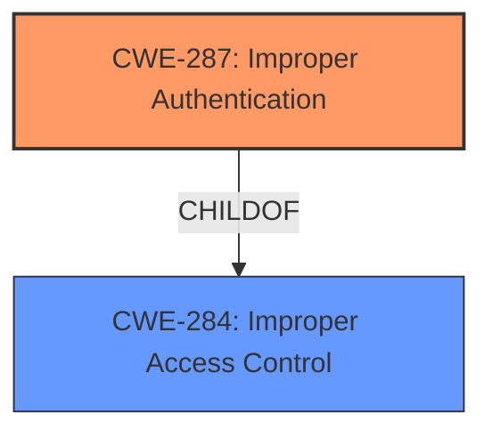

# Analysis for CVE-2021-20737

# Summary
| CWE ID | CWE Name | Confidence | CWE Abstraction Level | CWE Vulnerability Mapping Label | CWE-Vulnerability Mapping Notes |
|---|---|---|---|---|---|
| CWE-287 | Improper Authentication | 0.9 | Class | Primary | Discouraged |
| CWE-284 | Improper Access Control | 0.6 | Pillar | Secondary | Discouraged |

## Evidence and Confidence

*   **Confidence Score:** 0.9
*   **Evidence Strength:** HIGH

## Relationship Analysis
The primary CWE, CWE-287 **Improper Authentication**, is a child of CWE-284 **Improper Access Control**. This indicates a hierarchical relationship where authentication is a specific type of access control. The vulnerability description explicitly mentions "**Improper authentication**", making CWE-287 the more specific and appropriate choice. CWE-284 is considered a higher-level categorization.

## Vulnerability Chain
The vulnerability chain starts with **Improper Authentication**, which leads to unauthorized access to pages.

## Summary of Analysis
The initial assessment identified CWE-287 **Improper Authentication** as the primary weakness based on the vulnerability description and the CVE Reference Links Content Summary, which states: "The vulnerability is due to **improper authentication** within the GROWI application" and "Weaknesses/vulnerabilities present: **Improper authentication** (CWE-287)".

The retriever results listed CWE-287 as a candidate. However, the retriever results also included other CWEs such as CWE-284 **Improper Access Control**, CWE-306 **Missing Authentication for Critical Function**, and CWE-285 **Improper Authorization**.

CWE-287 is a Class-level CWE, and the mapping guidance discourages its use when more specific CWEs are available. However, in this case, the description explicitly mentions "**Improper authentication**," making CWE-287 the most accurate representation of the weakness. CWE-306 **Missing Authentication for Critical Function** could be considered, but the description implies that some form of authentication exists, albeit flawed, rather than a complete absence of authentication.

CWE-284 **Improper Access Control** is a more general category (Pillar), and while it is related, CWE-287 is more specific to the root cause.

The final decision is to use CWE-287 as the primary CWE due to the explicit mention of "**Improper authentication**" in the vulnerability description and supporting CVE reference. CWE-284 is included as a secondary CWE to reflect the broader category of access control issues. The evidence is strong, and the confidence level is high.

Relevant CWE Information:

# Enhanced Context (25 CWEs)

## CWE-274: Improper Handling of Insufficient Privileges
**Abstraction Level**: Base
**Similarity Score**: 0.76
**Source**: dense

**Description**:
The product does not handle or incorrectly handles when it has insufficient privileges to perform an operation, leading to resultant weaknesses.

**Mapping Guidance**:
- Usage: Discouraged
- Rationale: This CWE entry could be deprecated in a future version of CWE.

*This CWE was considered, but it doesn't fit the vulnerability description as the root cause is not about handling insufficient privileges, but about the authentication process itself.*

## CWE-653: Improper Isolation or Compartmentalization
**Abstraction Level**: Class
**Similarity Score**: 0.75
**Source**: dense

**Description**:
The product does not properly compartmentalize or isolate functionality, processes, or resources that require different privilege levels, rights, or permissions.

**Mapping Guidance**:
- Usage: Allowed
- Rationale: This CWE entry is at the Base level of abstraction, which is a preferred level of abstraction for mapping to the root causes of vulnerabilities.

*This CWE was considered, but it doesn't directly relate to authentication issues described in the vulnerability.*

## CWE-280: Improper Handling of Insufficient Permissions or Privileges 
**Abstraction Level**: Base
**Similarity Score**: 0.74
**Source**: dense

**Description**:
The product does not handle or incorrectly handles when it has insufficient privileges to access resources or functionality as specified by their permissions. This may cause it to follow unexpected code paths that may leave the product in an invalid state.

**Mapping Guidance**:
- Usage: Allowed
- Rationale: This CWE entry is at the Base level of abstraction, which is a preferred level of abstraction for mapping to the root causes of vulnerabilities.

*This CWE was considered, but it focuses on handling insufficient permissions, while the vulnerability is centered around improper authentication.*

## CWE-266: Incorrect Privilege Assignment
**Abstraction Level**: Base
**Similarity Score**: 0.74
**Source**: dense

**Description**:
A product incorrectly assigns a privilege to a particular actor, creating an unintended sphere of control for that actor.

**Mapping Guidance**:
- Usage: Allowed
- Rationale: This CWE entry is at the Base level of abstraction, which is a preferred level of abstraction for mapping to the root causes of vulnerabilities.

*This CWE was considered, but incorrect privilege assignment is not the primary weakness. The core issue is with the authentication process itself.*

## CWE-267: Privilege Defined With Unsafe Actions
**Abstraction Level**: Base
**Similarity Score**: 0.74
**Source**: dense

**Description**:
A particular privilege, role, capability, or right can be used to perform unsafe actions that were not intended, even when it is assigned to the correct entity.

**Mapping Guidance**:
- Usage: Allowed
- Rationale: This CWE entry is at the Base level of abstraction, which is a preferred level of abstraction for mapping to the root causes of vulnerabilities.

*This CWE was considered, but it does not directly address the improper authentication aspect of the vulnerability.*

## CWE-668: Exposure of Resource to Wrong Sphere
**Abstraction Level**: Class
**Similarity Score**: 0.74
**Source**: dense

**Description**:
The product exposes a resource to the wrong control sphere, providing unintended actors with inappropriate access to the resource.

**Mapping Guidance**:
- Usage: Discouraged
- Rationale: CWE-668 is high-level and is often misused as a catch-all when lower-level CWE IDs might be applicable. It is sometimes used for low-information vulnerability reports [REF-1287]. It is a level-1 Class (i.e., a child of a Pillar). It is not useful for trend analysis.

*This CWE was considered, but it's too generic and doesn't pinpoint the root cause of the vulnerability, which is related to authentication.*

## CWE-1220: Insufficient Granularity of Access Control
**Abstraction Level**: Base
**Similarity Score**: 0.74
**Source**: dense

**Description**:
The product implements access controls via a policy or other feature with the intention to disable or restrict accesses (reads and/or writes) to assets in a system from untrusted agents. However, implemented access controls lack required granularity, which renders the control policy too broad because it allows accesses from unauthorized agents to the security-sensitive assets.

**Mapping Guidance**:
- Usage: Allowed
- Rationale: This CWE entry is at the Base level of abstraction, which is a preferred level of abstraction for mapping to the root causes of vulnerabilities.

*This CWE was considered, but the issue is not the granularity of access control, but the initial authentication itself.*

## CWE-807: Reliance on Untrusted Inputs in a Security Decision
**Abstraction Level**: Base
**Similarity Score**: 0.74
**Source**: dense

**Description**:
The product uses a protection mechanism that relies on the existence or values of an input, but the input can be modified by an untrusted actor in a way that bypasses the protection mechanism.

**Mapping Guidance**:
- Usage: Allowed
- Rationale: This CWE entry is at the Base level of abstraction, which is a preferred level of abstraction for mapping to the root causes of vulnerabilities.

*This CWE was considered, but the vulnerability is not directly related to reliance on untrusted inputs in a security decision.*

## CWE-639: Authorization Bypass Through User-Controlled Key
**Abstraction Level**: Base
**Similarity Score**: 0.73
**Source**: dense

**Description**:
The system's authorization functionality does not prevent one user from gaining access to another user's data or record by modifying the key value identifying the data.

**Mapping Guidance**:
- Usage: Allowed
- Rationale: This CWE entry is at the Base level of abstraction, which is a preferred level of abstraction for mapping to the root causes of vulnerabilities.

*This CWE was considered, but it focuses on authorization bypass through user-controlled keys, which is not the specific issue described in the vulnerability.*

## CWE-472: External Control of Assumed-Immutable Web Parameter
**