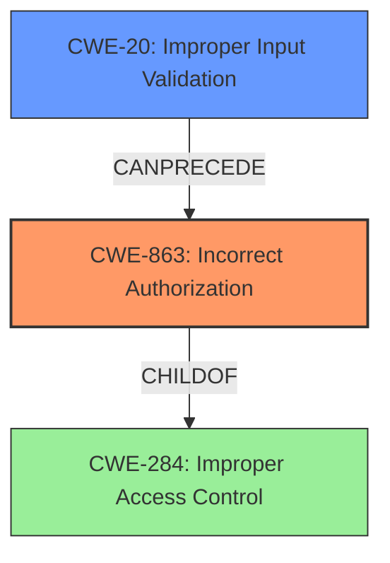

# Analysis for CVE-2021-20754

# Summary

| CWE ID | CWE Name | Confidence | CWE Abstraction Level | CWE Vulnerability Mapping Label | CWE-Vulnerability Mapping Notes |
|---|---|---|---|---|---|
| CWE-863 | Incorrect Authorization | 0.9 | Class | Allowed-with-Review | Primary CWE |
| CWE-20 | Improper Input Validation | 0.7 | Class | Discouraged | Secondary Candidate |

## Evidence and Confidence

*   **Confidence Score:** 0.8
*   **Evidence Strength:** HIGH

## Relationship Analysis

The primary relationship impacting the decision is that CWE-863 (Incorrect Authorization) is a child of CWE-284 (Improper Access Control), providing a more specific classification. CWE-20 (Improper Input Validation) can precede authorization issues. The abstraction level of CWE-863 is Class, which is more specific than the Pillar level of CWE-284.

## Vulnerability Chain

The chain of events for this vulnerability begins with **improper input validation** (CWE-20), which then leads to **incorrect authorization** (CWE-863), ultimately allowing an attacker to alter workflow data without proper privileges. The root cause is the **improper input validation**, which then leads to the impact of **incorrect authorization**.

## Summary of Analysis

The initial analysis focused on the provided vulnerability description and key phrases, identifying **improper input validation** as a root cause. The CVE Reference Links Content Summary confirmed this, explicitly mentioning "Improper input validation in the Workflow module of Cybozu Garoon" and the presence of CWE-20.

However, the impact of the vulnerability is that a logged-in user can "alter Workflow data without proper privileges". This points towards an authorization issue. While **improper input validation** is the root cause, the direct consequence is a failure in the authorization mechanism. Therefore, CWE-863 (Incorrect Authorization) is a more direct and appropriate classification.

The graph relationships influenced the final selection by highlighting that CWE-863 is a more specific child of CWE-284 (Improper Access Control), and that CWE-20 can precede authorization issues.

The selected CWEs are at the optimal level of specificity because CWE-863 directly addresses the authorization failure, while CWE-20 acknowledges the underlying cause. The evidence supports these classifications, as the vulnerability description explicitly mentions **improper input validation** and the ability to "alter...data...without proper privileges."

Relevant CWE Information:

# Enhanced Context (25 CWEs)

## CWE-113: Improper Neutralization of CRLF Sequences in HTTP Headers ('HTTP Request/Response Splitting')
**Abstraction Level**: Variant
**Similarity Score**: 0.78
**Source**: dense
**Description**: The product receives data from an HTTP agent/component (e.g., web server, proxy, browser, etc.), but it does not neutralize or incorrectly neutralizes CR and LF characters before the data is included in outgoing HTTP headers.
**Mapping Guidance**:
- Usage: Allowed
- Rationale: This CWE entry is at the Variant level of abstraction, which is a preferred level of abstraction for mapping to the root causes of vulnerabilities.

*Not Selected*: This is not relevant as the vulnerability isn't related to HTTP headers.

## CWE-444: Inconsistent Interpretation of HTTP Requests ('HTTP Request/Response Smuggling')
**Abstraction Level**: Base
**Similarity Score**: 0.75
**Source**: dense
**Description**: The product acts as an intermediary HTTP agent
         (such as a proxy or firewall) in the data flow between two
         entities such as a client and server, but it does not
         interpret malformed HTTP requests or responses in ways that
         are consistent with how the messages will be processed by
         those entities that are at the ultimate destination.
**Mapping Guidance**:
- Usage: Allowed
- Rationale: This CWE entry is at the Base level of abstraction, which is a preferred level of abstraction for mapping to the root causes of vulnerabilities.

*Not Selected*: This is not relevant as the vulnerability isn't related to HTTP request/response smuggling.

## CWE-74: Improper Neutralization of Special Elements in Output Used by a Downstream Component ('Injection')
**Abstraction Level**: Class
**Similarity Score**: 0.73
**Source**: dense
**Description**: The product constructs all or part of a command, data structure, or record using externally-influenced input from an upstream component, but it does not neutralize or incorrectly neutralizes special elements that could modify how it is parsed or interpreted when it is sent to a downstream component.
**Mapping Guidance**:
- Usage: Discouraged
- Rationale: CWE-74 is high-level and often misused when lower-level weaknesses are more appropriate.

*Not Selected*: While **improper input validation** can lead to injection vulnerabilities, this is not directly an injection issue.

## CWE-1289: Improper Validation of Unsafe Equivalence in Input
**Abstraction Level**: Base
**Similarity Score**: 0.73
**Source**: dense
**Description**: The product receives an input value that is used as a resource identifier or other type of reference, but it does not validate or incorrectly validates that the input is equivalent to a potentially-unsafe value.
**Mapping Guidance**:
- Usage: Allowed
- Rationale: This CWE entry is at the Base level of abstraction, which is a preferred level of abstraction for mapping to the root causes of vulnerabilities.

*Not Selected*: This is not the primary issue, although it could be related to the **improper input validation**.

## CWE-41: Improper Resolution of Path Equivalence
**Abstraction Level**: Base
**Similarity Score**: 0.73
**Source**: dense
**Description**: The product is vulnerable to file system contents disclosure through path equivalence. Path equivalence involves the use of special characters in file and directory names. The associated manipulations are intended to generate multiple names for the same object.
**Mapping Guidance**:
- Usage: Allowed
- Rationale: This CWE entry is at the Base level of abstraction, which is a preferred level of abstraction for mapping to the root causes of vulnerabilities.

*Not Selected*: Not relevant to the vulnerability description.

## CWE-184: Incomplete List of Disallowed Inputs
**Abstraction Level**: Base
**Similarity Score**: 0.73
**Source**: dense
**Description**: The product implements a protection mechanism that relies on a list of inputs (or properties of inputs) that are not allowed by policy or otherwise require other action to neutralize before additional processing takes place, but the list is incomplete.
**Mapping Guidance**:
- Usage: Allowed
- Rationale: This CWE entry is at the Base level of abstraction, which is a preferred level of abstraction for mapping to the root causes of vulnerabilities.

*Not Selected*: While potentially related to **improper input validation**, the description doesn't specifically indicate an incomplete list of disallowed inputs.

## CWE-436: Interpretation Conflict
**Abstraction Level**: Class
**Similarity Score**: 0.71
**Source**: dense
**Description**: Product A handles inputs or steps differently than Product B, which causes A to perform incorrect actions based on its perception of B's state.
**Mapping Guidance**:
- Usage: Allowed-with-Review
- Rationale: This CWE entry is a Class and might have Base-level children that would be more appropriate

*Not Selected*: Not relevant to the vulnerability description.

## CWE-138: Improper Neutralization of Special Elements
**Abstraction Level**: Class
**Similarity Score**: 0.71
**Source**: dense
**Description**: The product receives input from an upstream component, but it does not neutralize or incorrectly neutralizes special elements that could be interpreted as control elements or syntactic markers when they are sent to a downstream component.
**Mapping Guidance**:
- Usage: Discouraged
- Rationale: This CWE entry is a level-1 Class (i.e., a child of a Pillar). It might have lower-level children that would be more appropriate

*Not Selected*: Potentially related to **improper input validation** but too general.

## CWE-23: Relative Path Traversal
**Abstraction Level**: Base
**Similarity Score**: 0.71
**Source**: dense
**Description**: The product uses external input to construct a pathname that should be within a restricted directory, but it does not properly neutralize sequences such as ".." that can resolve to a location that is outside of that directory.
**Mapping Guidance**:
- Usage: Allowed
- Rationale: This CWE entry is at the Base level of abstraction, which is a preferred level of abstraction for mapping to the root causes of vulnerabilities.

*