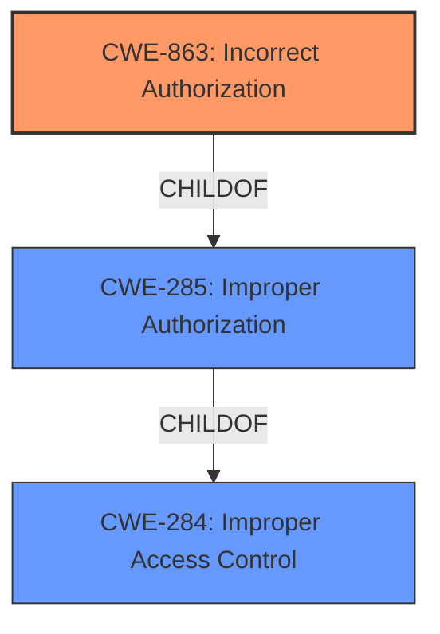

# Enhanced Analysis for CVE-2021-20757

# Summary
| CWE ID | CWE Name | Confidence | CWE Abstraction Level | CWE Vulnerability Mapping Label | CWE-Vulnerability Mapping Notes |
|---|---|---|---|---|---|
| CWE-863 | Incorrect Authorization | 0.9 | Class | Primary | Allowed-with-Review |
| CWE-285 | Improper Authorization | 0.7 | Class | Secondary | Discouraged |
| CWE-284 | Improper Access Control | 0.6 | Pillar | Secondary | Discouraged |

## Evidence and Confidence

*   **Confidence Score:** 0.9
*   **Evidence Strength:** HIGH

## Relationship Analysis
The primary CWE selected is CWE-863 (Incorrect Authorization), which is a child of both CWE-285 (Improper Authorization) and CWE-284 (Improper Access Control). This hierarchical relationship indicates that CWE-863 is a more specific form of authorization issue than its parents. The analysis considered starting with the more general CWE-284, but the specific context of authorization checks in the vulnerability description led to the selection of CWE-863 as the most appropriate choice.



## Vulnerability Chain
The vulnerability chain starts with an **operational restrictions bypass** due to an unspecified flaw in the E-mail module. This leads to the ability for a remote authenticated attacker to **alter the data of Portal without the appropriate privilege**, which is the impact. This could be because the application doesn't perform the authorization check correctly (CWE-863), doesn't perform it at all (CWE-285), or has some general access control issue (CWE-284).

## Summary of Analysis
The initial analysis focused on identifying the root cause of the vulnerability based on the provided description and the CVE reference content summary. The key phrase "Operational restrictions bypass" and the impact "alter the data of Portal without the appropriate privilege" suggested an authorization-related issue.

The CVE Reference Links Content Summary explicitly states that the root cause is "Operational restrictions bypass vulnerability in E-mail module of Cybozu Garoon due to improper access control" and identifies **CWE-264** as a weakness, which is "Permissions, Privileges, and Access Controls". However, CWE-264 is not a valid CWE ID. Further review led to considering CWE-863 (Incorrect Authorization), CWE-285 (Improper Authorization), and CWE-284 (Improper Access Control).

The Retriever Results also listed CWE-863 as a candidate with an "Allowed-with-Review" usage. Given the evidence pointing to an authorization check being performed incorrectly, CWE-863 was selected as the primary CWE.

The mapping guidance for CWE-863 suggests examining its children for a better fit, but none of the children were applicable based on the available information. Therefore, CWE-863 was considered the most specific and appropriate CWE for this vulnerability.

The selection of CWE-863 is also supported by the similarity of the vulnerability description to examples provided in the CWE specification. For instance, the example "A microservice integration and management platform compares the hostname in the HTTP Host header in a case-sensitive way (CWE-178, CWE-1289), allowing bypass of the authorization policy (CWE-863) using a hostname with mixed case or other variations" shows a scenario where an authorization check is performed but done incorrectly, leading to a bypass.

CWE-285 (Improper Authorization) and CWE-284 (Improper Access Control) were considered but ultimately deemed less specific. While they represent the general category of authorization and access control issues, CWE-863 directly addresses the scenario where an authorization check exists but is flawed.

Relevant CWE Information:

# Enhanced Context (25 CWEs)
The following CWEs were identified as potentially relevant to this vulnerability:

## CWE-1289: Improper Validation of Unsafe Equivalence in Input
**Abstraction Level**: Base
**Similarity Score**: 0.80
**Source**: dense

**Description**:
The product receives an input value that is used as a resource identifier or other type of reference, but it does not validate or incorrectly validates that the input is equivalent to a potentially-unsafe value.

**Mapping Guidance**:
- Usage: Allowed
- Rationale: This CWE entry is at the Base level of abstraction, which is a preferred level of abstraction for mapping to the root causes of vulnerabilities.

*Not selected:* This CWE is not selected because the description does not focus on validating equivalence, but more on the authorization process itself.

## CWE-807: Reliance on Untrusted Inputs in a Security Decision
**Abstraction Level**: Base
**Similarity Score**: 0.79
**Source**: dense

**Description**:
The product uses a protection mechanism that relies on the existence or values of an input, but the input can be modified by an untrusted actor in a way that bypasses the protection mechanism.

**Mapping Guidance**:
- Usage: Allowed
- Rationale: This CWE entry is at the Base level of abstraction, which is a preferred level of abstraction for mapping to the root causes of vulnerabilities.

*Not selected:* This CWE could be related but there is no direct indication that the protection mechanism relies on untrusted inputs.

## CWE-183: Permissive List of Allowed Inputs
**Abstraction Level**: Base
**Similarity Score**: 0.77
**Source**: dense

**Description**:
The product implements a protection mechanism that relies on a list of inputs (or properties of inputs) that are explicitly allowed by policy because the inputs are assumed to be safe, but the list is too permissive - that is, it allows an input that is unsafe, leading to resultant weaknesses.

**Mapping Guidance**:
- Usage: Allowed
- Rationale: This CWE entry is at the Base level of abstraction, which is a preferred level of abstraction for mapping to the root causes of vulnerabilities.

*Not selected:* This CWE could be related, but there is no direct indication that a permissive list is the issue.

## CWE-472: External Control of Assumed-Immutable Web Parameter
**Abstraction Level**: Base
**Similarity Score**: 0.76
**Source**: dense

**Description**:
The web application does not sufficiently verify inputs that are assumed to be immutable but are actually externally controllable, such as hidden form fields.

**Mapping Guidance**:
- Usage: Allowed
- Rationale: This CWE entry is at the Base level of abstraction, which is a preferred level of abstraction for mapping to the root causes of vulnerabilities.

*Not selected:* This CWE could be related, but there is no direct indication that an externally controlled parameter is the root cause.

## CWE-274: Improper Handling of Insufficient Privileges
**Abstraction Level**: Base
**Similarity Score**: 0.76
**Source**: dense

**Description**:
The product does not handle or incorrectly handles when it has insufficient privileges to perform an operation, leading to resultant weaknesses.

**Mapping Guidance**:
- Usage: Discouraged
- Rationale: This CWE entry could be deprecated in a future version of CWE.

*Not selected:* This CWE is not selected because the vulnerability focuses on bypassing restrictions, not on handling insufficient privileges.

## CWE-639: Authorization Bypass Through User-Controlled Key
**Abstraction Level**: Base
**Similarity Score**: 0.76
**Source**: dense

**Description**:
The system's authorization functionality does not prevent one user from gaining access to another user's data or record by modifying the key value identifying the data.

**Mapping Guidance**:
- Usage: Allowed
- Rationale: This CWE entry is at the Base level of abstraction, which is a preferred level of abstraction for mapping to the root causes of vulnerabilities.

*Not selected:* This CWE could be related if the authorization bypass is due to user-controlled keys. However, there is no direct evidence supporting this.

## CWE-184: Incomplete List of Disallowed Inputs
**Abstraction Level**: Base
**Similarity Score**: 0.76
**Source**: dense

**Description**:
The product implements a protection mechanism that relies on a list of inputs (or properties of inputs) that are not allowed by policy or otherwise require other action to neutralize before additional processing takes place, but the list is incomplete.

**Mapping Guidance**:
- Usage: Allowed
- Rationale: This CWE entry is at the Base level of abstraction, which is a preferred level of abstraction for mapping to the root causes of vulnerabilities.

*Not selected:* This CWE could be related, but there is no direct indication that an incomplete list is the issue.

## CWE-179: Incorrect Behavior Order: Early Validation
**Abstraction Level**: Base


## CWE Relationship Analysis

Current CWEs represent these abstraction levels: .


### Vulnerability Chain Analysis

**Chain starting from CWE-284:**
- 284 (Improper Access Control) - ROOT


**Chain starting from CWE-285:**
- 285 (Improper Authorization) - ROOT


### CWE Relationship Diagram

```mermaid
graph TD
    classDef primary fill:#f96,stroke:#333,stroke-width:2px
    classDef secondary fill:#69f,stroke:#333
    classDef tertiary fill:#9e9,stroke:#333
```