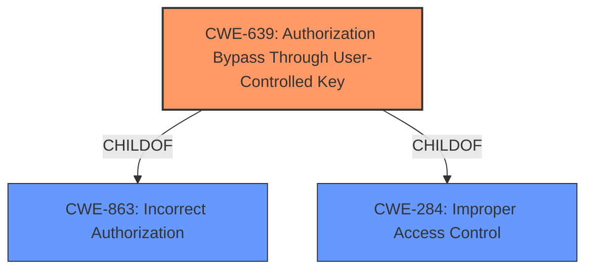

# Enhanced Analysis for CVE-2021-20759

# Summary
| CWE ID | CWE Name | Confidence | CWE Abstraction Level | CWE Vulnerability Mapping Label | CWE-Vulnerability Mapping Notes |
|---|---|---|---|---|---|
| CWE-639 | Authorization Bypass Through User-Controlled Key | 0.8 | Base | Allowed | Primary CWE |
| CWE-863 | Incorrect Authorization | 0.6 | Class | Allowed-with-Review | Secondary Candidate |

## Evidence and Confidence

*   **Confidence Score:** 0.7
*   **Evidence Strength:** MEDIUM

## Relationship Analysis
The primary CWE, CWE-639, is a child of CWE-863 and CWE-284, indicating a more specific type of authorization issue. The relationship shows that the authorization bypass occurs through a user-controlled key, making CWE-639 a more precise mapping than its parents.



## Vulnerability Chain
The vulnerability chain starts with the **operational restrictions bypass**, leading to the ability to alter portal data without appropriate privileges.

## Summary of Analysis
The initial analysis identified that the vulnerability is related to an **operational restrictions bypass** in Cybozu Garoon, which allows an authenticated attacker to alter portal data without proper privileges. The key evidence for this assessment comes from the "Vulnerability Description Key Phrases" and "CVE Reference Links Content Summary," specifically noting the **"operational restrictions bypass"** and the ability to "alter the data of Bulletin without the appropriate privilege."

The retriever results suggested several CWEs related to access control and authorization. The primary CWE match from similar CVE descriptions was CWE-NVD-Other, which is not specific enough. The top CWEs included CWE-863 (Incorrect Authorization) and CWE-NVD-noinfo, which again lacks specificity.

After reviewing the retriever results and the complete CWE specifications, CWE-639 (Authorization Bypass Through User-Controlled Key) was identified as the most appropriate primary CWE. This decision is based on the fact that the attacker, being authenticated, bypasses authorization by potentially manipulating a key or identifier that controls access to data. The vulnerability description mentions "alter the data of Portal without the appropriate privilege", which aligns with the concept of unauthorized data access via a user-controlled key.

CWE-863 (Incorrect Authorization) was considered as a secondary CWE. While it broadly captures the authorization issue, it doesn't specify the mechanism of the bypass, making it less precise than CWE-639.

CWE-284 (Improper Access Control) and CWE-285 (Improper Authorization) were considered but deemed too high-level. CWE-113 (Improper Neutralization of CRLF Sequences in HTTP Headers) was not applicable as there's no mention of HTTP header manipulation. CWE-472 (External Control of Assumed-Immutable Web Parameter) was also considered but not chosen because the description doesn't explicitly state that the bypass is due to modification of assumed immutable parameters, but rather a more general **operational restrictions bypass**.

The selection of CWE-639 is at the optimal level of specificity because it captures the essence of the vulnerability – an authorization bypass achieved through manipulation of a user-controlled key, allowing unauthorized data alteration. The evidence supports this mapping, and the CWE's base level abstraction provides a clear and actionable categorization of the weakness.

Relevant CWE Information:

# Enhanced Context (25 CWEs)
The following CWEs were identified as potentially relevant to this vulnerability:

## CWE-113: Improper Neutralization of CRLF Sequences in HTTP Headers ('HTTP Request/Response Splitting')
**Abstraction Level**: Variant
**Similarity Score**: 0.80
**Source**: dense

**Description**:
The product receives data from an HTTP agent/component (e.g., web server, proxy, browser, etc.), but it does not neutralize or incorrectly neutralizes CR and LF characters before the data is included in outgoing HTTP headers.

**Mapping Guidance**:
- Usage: Allowed
- Rationale: This CWE entry is at the Variant level of abstraction, which is a preferred level of abstraction for mapping to the root causes of vulnerabilities.


## CWE-444: Inconsistent Interpretation of HTTP Requests ('HTTP Request/Response Smuggling')
**Abstraction Level**: Base
**Similarity Score**: 0.76
**Source**: dense

**Description**:
The product acts as an intermediary HTTP agent
         (such as a proxy or firewall) in the data flow between two
         entities such as a client and server, but it does not
         interpret malformed HTTP requests or responses in ways that
         are consistent with how the messages will be processed by
         those entities that are at the ultimate destination.

**Mapping Guidance**:
- Usage: Allowed
- Rationale: This CWE entry is at the Base level of abstraction, which is a preferred level of abstraction for mapping to the root causes of vulnerabilities.


## CWE-1289: Improper Validation of Unsafe Equivalence in Input
**Abstraction Level**: Base
**Similarity Score**: 0.75
**Source**: dense

**Description**:
The product receives an input value that is used as a resource identifier or other type of reference, but it does not validate or incorrectly validates that the input is equivalent to a potentially-unsafe value.

**Mapping Guidance**:
- Usage: Allowed
- Rationale: This CWE entry is at the Base level of abstraction, which is a preferred level of abstraction for mapping to the root causes of vulnerabilities.


## CWE-41: Improper Resolution of Path Equivalence
**Abstraction Level**: Base
**Similarity Score**: 0.74
**Source**: dense

**Description**:
The product is vulnerable to file system contents disclosure through path equivalence. Path equivalence involves the use of special characters in file and directory names. The associated manipulations are intended to generate multiple names for the same object.

**Mapping Guidance**:
- Usage: Allowed
- Rationale: This CWE entry is at the Base level of abstraction, which is a preferred level of abstraction for mapping to the root causes of vulnerabilities.


## CWE-74: Improper Neutralization of Special Elements in Output Used by a Downstream Component ('Injection')
**Abstraction Level**: Class
**Similarity Score**: 0.74
**Source**: dense

**Description**:
The product constructs all or part of a command, data structure, or record using externally-influenced input from an upstream component, but it does not neutralize or incorrectly neutralizes special elements that could modify how it is parsed or interpreted when it is sent to a downstream component.

**Mapping Guidance**:
- Usage: Discouraged
- Rationale: CWE-74 is high-level and often misused when lower-level weaknesses are more appropriate.


## CWE-184: Incomplete List of Disallowed Inputs
**Abstraction Level**: Base
**Similarity Score**: 0.73
**Source**: dense

**Description**:
The product implements a protection mechanism that relies on a list of inputs (or properties of inputs) that are not allowed by policy or otherwise require other action to neutralize before additional processing takes place, but the list is incomplete.

**Mapping Guidance**:
- Usage: Allowed
- Rationale: This CWE entry is at the Base level of abstraction, which is a preferred level of abstraction for mapping to the root causes of vulnerabilities.


## CWE-436: Interpretation Conflict
**Abstraction Level**: Class
**Similarity Score**: 0.73
**Source**: dense

**Description**:
Product A handles inputs or steps differently than Product B, which causes A to perform incorrect actions based on its perception of B's state.

**Mapping Guidance**:
- Usage: Allowed-with-Review
- Rationale: This CWE entry is a Class and might have Base-level children that would be more appropriate


## CWE-807: Reliance on Untrusted Inputs in a Security Decision
**Abstraction Level**: Base
**Similarity Score**: 0.72
**Source**: dense

**Description**:
The product uses a protection mechanism that relies on the existence or values of an input, but the input can be modified by an untrusted actor in a way that bypasses the protection mechanism.

**Mapping Guidance**:
- Usage: Allowed
- Rationale: This CWE entry is at the Base level of abstraction, which is a preferred level of abstraction for mapping to the root causes of vulnerabilities.


## CWE-138: Improper Neutralization of Special Elements
**Abstraction Level**: Class
**Similarity Score**: 0.72
**Source**: dense

**Description**:
The product receives input from an upstream component, but it does not neutralize or incorrectly neutralizes special elements that could be interpreted as control elements or syntactic markers when they are sent to a downstream component.

**Mapping Guidance**:
- Usage: Discour


## CWE Relationship Analysis

Current CWEs represent these abstraction levels: .


### Vulnerability Chain Analysis

**Chain starting from CWE-113:**
- 113 (Improper Neutralization of CRLF Sequences in HTTP Headers ('HTTP Request/Response Splitting')) - ROOT


**Chain starting from CWE-284:**
- 284 (Improper Access Control) - ROOT


### CWE Relationship Diagram

```mermaid
graph TD
    classDef primary fill:#f96,stroke:#333,stroke-width:2px
    classDef secondary fill:#69f,stroke:#333
    classDef tertiary fill:#9e9,stroke:#333
```