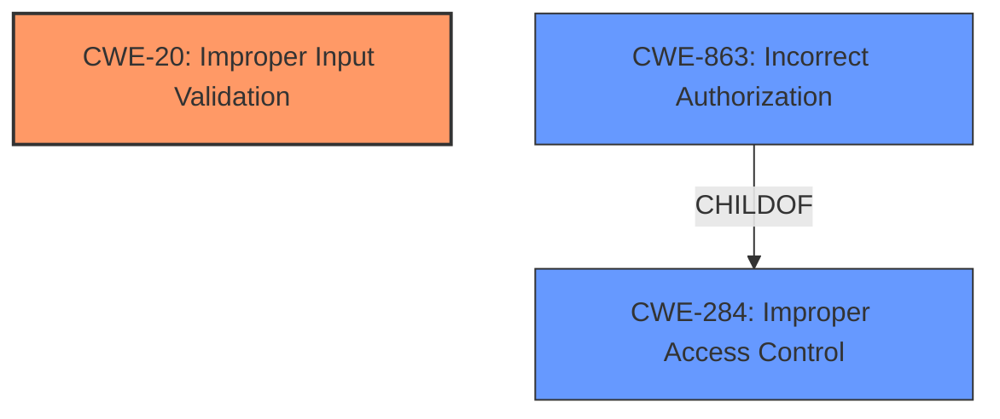

# Enhanced Analysis for CVE-2021-20762

# Summary
| CWE ID | CWE Name | Confidence | CWE Abstraction Level | CWE Vulnerability Mapping Label | CWE-Vulnerability Mapping Notes |
|---|---|---|---|---|---|
| CWE-20 | Improper Input Validation | 0.9 | Class | Discouraged | Allowed with Review |
| CWE-863 | Incorrect Authorization | 0.7 | Class | Discouraged | Allowed with Review |

## Evidence and Confidence

*   **Confidence Score:** 0.8
*   **Evidence Strength:** HIGH

## Relationship Analysis
The primary CWE is CWE-20, which is a class-level weakness. While less specific than base or variant level CWEs, it accurately captures the core issue described in the vulnerability. CWE-20 is a parent of many specific input validation weaknesses. CWE-863 is a child of CWE-284 (Improper Access Control), representing a more specific form of access control failure due to authorization logic errors.



## Vulnerability Chain
The vulnerability chain starts with **improper input validation** (CWE-20), leading to the ability to **alter the data of E-mail without the appropriate privilege**. This privilege escalation can be described by **Incorrect Authorization** (CWE-863).

## Summary of Analysis
The initial assessment focused on the stated **root cause** of the vulnerability **Improper input validation**. The description clearly states this as the core issue. The retriever results also support this, with CWE-20 being the top-ranked CWE.

The analysis considered the provided evidence, specifically:
*   **Vulnerability Description Key Phrases:** "**rootcause:** **Improper input validation**"
*   **CVE Reference Links Content Summary:** "**Root cause of vulnerability:** Improper input validation." and "**Weaknesses/vulnerabilities present:** The vulnerability is caused by improper input validation in the email functionality of Cybozu Garoon. Specifically, a user can alter email data without the proper permissions."

CWE-20 is chosen as the primary CWE because it directly reflects the **root cause**. However, CWE-20 is a Class-level CWE and the mapping guidance discourages its use. While it is desirable to use a more specific CWE, there is no specific evidence to select a more specific input validation CWE.

CWE-863 (Incorrect Authorization) is included as a secondary CWE because the vulnerability allows an attacker to "alter the data of E-mail without the appropriate privilege," meaning the system's authorization checks are not working correctly. This directly aligns with the definition of CWE-863.

Both CWE-20 and CWE-863 are at the Class level of abstraction. While more specific Base or Variant CWEs are preferred, there is insufficient evidence to determine a more specific CWE for either of them.

Relevant CWE Information:

# Enhanced Context (25 CWEs)
The following CWEs were identified as potentially relevant to this vulnerability:

## CWE-1289: Improper Validation of Unsafe Equivalence in Input
**Abstraction Level**: Base
**Similarity Score**: 0.78
**Source**: dense

**Description**:
The product receives an input value that is used as a resource identifier or other type of reference, but it does not validate or incorrectly validates that the input is equivalent to a potentially-unsafe value.

**Mapping Guidance**:
- Usage: Allowed
- Rationale: This CWE entry is at the Base level of abstraction, which is a preferred level of abstraction for mapping to the root causes of vulnerabilities.

CWE-1289 was considered but not selected because there is no direct evidence that the input is used as a resource identifier or reference. The vulnerability description lacks details about the specific type of input that is not being validated.

## CWE-807: Reliance on Untrusted Inputs in a Security Decision
**Abstraction Level**: Base
**Similarity Score**: 0.76
**Source**: dense

**Description**:
The product uses a protection mechanism that relies on the existence or values of an input, but the input can be modified by an untrusted actor in a way that bypasses the protection mechanism.

**Mapping Guidance**:
- Usage: Allowed
- Rationale: This CWE entry is at the Base level of abstraction, which is a preferred level of abstraction for mapping to the root causes of vulnerabilities.

CWE-807 was considered but not selected because, while related, the core issue is the lack of validation, not necessarily the reliance on untrusted input for security decisions. The vulnerability description focuses on the **improper input validation** rather than the security decision made based on the input.

## CWE-113: Improper Neutralization of CRLF Sequences in HTTP Headers ('HTTP Request/Response Splitting')
**Abstraction Level**: Variant
**Similarity Score**: 0.76
**Source**: dense

**Description**:
The product receives data from an HTTP agent/component (e.g., web server, proxy, browser, etc.), but it does not neutralize or incorrectly neutralizes CR and LF characters before the data is included in outgoing HTTP headers.

**Mapping Guidance**:
- Usage: Allowed
- Rationale: This CWE entry is at the Variant level of abstraction, which is a preferred level of abstraction for mapping to the root causes of vulnerabilities.

CWE-113 was considered but not selected because the vulnerability description does not provide any information about HTTP headers or CRLF sequences. This CWE seems unrelated to the provided information.

## CWE-184: Incomplete List of Disallowed Inputs
**Abstraction Level**: Base
**Similarity Score**: 0.75
**Source**: dense

**Description**:
The product implements a protection mechanism that relies on a list of inputs (or properties of inputs) that are not allowed by policy or otherwise require other action to neutralize before additional processing takes place, but the list is incomplete.

**Mapping Guidance**:
- Usage: Allowed
- Rationale: This CWE entry is at the Base level of abstraction, which is a preferred level of abstraction for mapping to the root causes of vulnerabilities.

CWE-184 was considered but not selected because it is not clear if the application relies on a list of disallowed inputs. The description simply states that there is **improper input validation**, without specifying if a list-based approach is used.

## CWE-74: Improper Neutralization of Special Elements in Output Used by a Downstream Component ('Injection')
**Abstraction Level**: Class
**Similarity Score**: 0.74
**Source**: dense

**Description**:
The product constructs all or part of a command, data structure, or record using externally-influenced input from an upstream component, but it does not neutralize or incorrectly neutralizes special elements that could modify how it is parsed or interpreted when it is sent to a downstream component.

**Mapping Guidance**:
- Usage: Discouraged
- Rationale: CWE-74 is high-level and often misused when lower-level weaknesses are more appropriate.

CWE-74 was considered but not selected because there's no evidence of injection. The description focuses on the lack of validation, not the injection of special elements into a downstream component.

## CWE-183: Permissive List of Allowed Inputs
**Abstraction Level**: Base
**Similarity Score**: 0.74
**Source**: dense

**Description**:
The product implements a protection mechanism that relies on a list of inputs (or properties of inputs) that are explicitly allowed by policy because the inputs are assumed to be safe, but the list is too permissive - that is, it allows an input that is unsafe, leading to resultant weaknesses.

**Mapping Guidance**:
- Usage: Allowed
- Rationale: This CWE entry is at the Base level of abstraction, which is a preferred level of abstraction for mapping to the root causes of vulnerabilities.

CWE-183 was considered but not selected because the description doesn't suggest a "permissive list" approach.

## CWE-472: External Control of Assumed-Immutable Web Parameter
**Abstraction Level**: Base
**Similarity Score**: 0.74
**Source**: dense

**Description**:
The web application does not sufficiently verify inputs that are assumed to be immutable but are actually externally controllable, such as hidden form fields.

**Mapping Guidance**:
- Usage: Allowed
- Rationale: This CWE entry is at the Base level of abstraction, which is a preferred level of abstraction for mapping to the root causes of vulnerabilities.

CWE-472 was considered but not selected because the vulnerability description provides no information on whether the input is an assumed-immutable web parameter like a hidden form field.

## CWE-138: Improper Neutralization of Special Elements
**Abstraction Level**: Class
**Similarity Score**: 0.73
**Source**: dense

**Description**:
The product receives input from an upstream component, but it does not neutralize or incorrectly neutralizes special elements that could be interpreted as control elements or syntactic markers when they are sent


## CWE Relationship Analysis

Current CWEs represent these abstraction levels: .


### Vulnerability Chain Analysis

**Chain starting from CWE-113:**
- 113 (Improper Neutralization of CRLF Sequences in HTTP Headers ('HTTP Request/Response Splitting')) - ROOT


**Chain starting from CWE-284:**
- 284 (Improper Access Control) - ROOT


### CWE Relationship Diagram

```mermaid
graph TD
    classDef primary fill:#f96,stroke:#333,stroke-width:2px
    classDef secondary fill:#69f,stroke:#333
    classDef tertiary fill:#9e9,stroke:#333
```