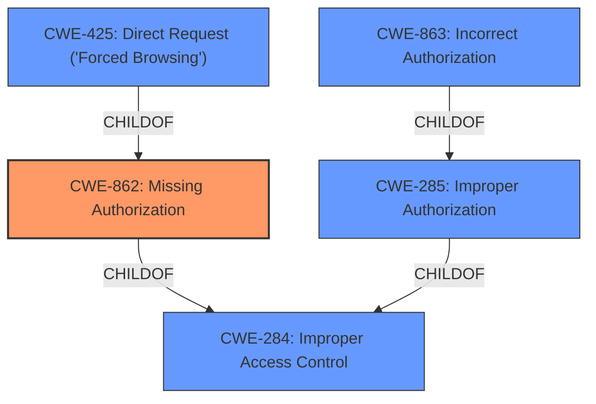

# Analysis Report for CVE-2021-20763

# Vulnerability Analysis Report: CVE-2021-20763

## Description


## Analysis (with Relationship Data)

# Summary
| CWE ID | CWE Name | Confidence | CWE Abstraction Level | CWE Vulnerability Mapping Label | CWE-Vulnerability Mapping Notes |
|---|---|---|---|---|---|
| CWE-862 | Missing Authorization | 0.9 | Base | Primary | Allowed |
| CWE-284 | Improper Access Control | 0.6 | Pillar | Secondary | Discouraged |
| CWE-285 | Improper Authorization | 0.6 | Class | Secondary | Discouraged |
| CWE-863 | Incorrect Authorization | 0.6 | Class | Secondary | Allowed-with-Review |
| CWE-425 | Direct Request ('Forced Browsing') | 0.5 | Base | Secondary | Allowed |

## Evidence and Confidence

*   **Confidence Score:** 0.9
*   **Evidence Strength:** HIGH

## Relationship Analysis
The primary CWE is CWE-862. The vulnerability description indicates that a remote authenticated attacker can obtain data of Portal without appropriate privilege because of a **operational restrictions bypass**.

CWE-862 (Missing Authorization) is a child of CWE-284 (Improper Access Control). CWE-863 (Incorrect Authorization) and CWE-425 (Direct Request ('Forced Browsing')) are related to authorization issues. CWE-285 (Improper Authorization) is a class-level CWE that is a child of CWE-284 (Improper Access Control). Since the vulnerability is due to missing authorization, CWE-862 is more specific than its parent CWE-284 and siblings like CWE-863 and CWE-425.


## Vulnerability Chain
The vulnerability chain starts with a missing authorization check (**CWE-862**), which leads to the ability to bypass operational restrictions and obtain Portal data. The root cause is the missing authorization, and the impact is unauthorized data access.

## Summary of Analysis
The initial analysis identified **operational restrictions bypass** as the key weakness, leading to unauthorized data access. The retriever results suggested several CWEs related to access control and authorization.

The vulnerability description states that a remote authenticated attacker can obtain the data of Portal without the appropriate privilege. The "CVE Reference Links Content Summary" confirms this, stating "Operational restrictions bypass vulnerability in Portal" and listing "CWE-264: Improper Control of Access" and "Viewing restrictions bypass" as weaknesses. The impact is that "A user who can log in to the product may alter the data of Portal without the appropriate privilege."

CWE-862 (Missing Authorization) best fits this scenario because it directly addresses the **lack of an authorization check** that allows the attacker to bypass restrictions and access data. While CWE-284 (Improper Access Control) is a broader category, CWE-862 is more specific to the missing authorization aspect of the vulnerability. CWE-863 (Incorrect Authorization) would apply if the authorization check was present but flawed, which is not indicated in the vulnerability description. CWE-425 (Direct Request ('Forced Browsing')) is also related but less directly applicable than CWE-862.

The provided evidence strongly supports the selection of CWE-862 as the primary CWE, indicating a high confidence level.

Relevant CWE Information:

# Enhanced Context (25 CWEs)

## CWE-862: Missing Authorization
**Abstraction:** Base
**Description:** The application does not perform any authorization checks before allowing the user to access a resource or perform an action.
**Mapping Guidance:** Usage: Allowed
**Rationale:** This CWE entry is at the Base level of abstraction, which is a preferred level of abstraction for mapping to the root causes of vulnerabilities.


## CWE Relationship Analysis

Current CWEs represent these abstraction levels: .


### Vulnerability Chain Analysis

**Chain starting from CWE-862:**
- 862 (Missing Authorization) - ROOT


**Chain starting from CWE-284:**
- 284 (Improper Access Control) - ROOT


### CWE Relationship Diagram

```mermaid
graph TD
    classDef primary fill:#f96,stroke:#333,stroke-width:2px
    classDef secondary fill:#69f,stroke:#333
    classDef tertiary fill:#9e9,stroke:#333
```


*Report generated on 2025-04-02 06:46:24*
