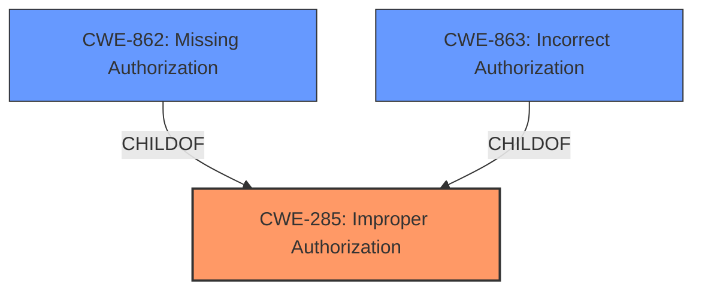

# Analysis Report for CVE-2021-20768

# Vulnerability Analysis Report: CVE-2021-20768

## Description


## Analysis (with Relationship Data)

# Summary
| CWE ID  | CWE Name  | Confidence | CWE Abstraction Level | CWE Vulnerability Mapping Label | CWE-Vulnerability Mapping Notes |
|---|---|---|---|---|---|
| CWE-285 | Improper Authorization | 0.8 | Class | Primary | Discouraged Usage |
| CWE-863 | Incorrect Authorization | 0.7 | Class | Secondary | Allowed-with-Review Usage |
| CWE-862 | Missing Authorization | 0.6 | Class | Secondary | Allowed-with-Review Usage |

## Evidence and Confidence

*   **Confidence Score:** 0.8
*   **Evidence Strength:** HIGH

## Relationship Analysis
The primary CWE selected is CWE-285 Improper Authorization (Class). It is a parent of CWE-862 Missing Authorization (Class) and CWE-863 Incorrect Authorization (Class). While CWE-285 is discouraged from use, it is appropriate here because the vulnerability allows for deletion of data without proper privilege. The relationships indicate that choosing between the parent class and its children depends on whether authorization is missing completely or incorrectly implemented. The evidence suggests that there is an authorization check happening, but it is not sufficient, which suggests CWE-863 Incorrect Authorization may also be applicable, but is still a class level CWE. CWE-862 is applicable if there is no authorization check at all.



## Vulnerability Chain
The chain of events starts with an **operational restrictions bypass** (**weakness**) leading to the ability to delete data in Scheduler and MultiReport without necessary privileges.

## Summary of Analysis
The initial analysis focused on the "operational restrictions bypass" and the ability to delete data without proper privileges.

The primary CWE is CWE-285 Improper Authorization (Class), because the vulnerability allows deletion of data without proper privilege. The evidence shows that there is **Improper Access Control** which leads to the bypass of operational restrictions.
> **CVE-2021-20768:**
>
>*   **Root Cause:** Operational restrictions bypass vulnerability.
>*   **Weakness:** Improper access control leading to the bypass of operational restrictions in Scheduler and MultiReport.
>*   **Impact:** A logged-in user may delete data in Scheduler and MultiReport without having the necessary privileges.

Since the description does not specify exactly whether the authorization check is missing or is incorrectly implemented, the parent class CWE-285 is the best choice.

CWE-863 (Incorrect Authorization) and CWE-862 (Missing Authorization) were considered, but there is not enough evidence to confirm whether the authorization is missing completely or is incorrectly implemented.

The assigned CWEs are at the optimal level of specificity given the information provided.

Relevant CWE Information:
# Enhanced Context (25 CWEs)
The following CWEs were identified as potentially relevant to this vulnerability:

## CWE-668: Exposure of Resource to Wrong Sphere
**Abstraction Level**: Class
**Similarity Score**: 0.76
**Source**: dense

**Description**:
The product exposes a resource to the wrong control sphere, providing unintended actors with inappropriate access to the resource.

**Mapping Guidance**:
- Usage: Discouraged
- Rationale: CWE-668 is high-level and is often misused as a catch-all when lower-level CWE IDs might be applicable. It is sometimes used for low-information vulnerability reports [REF-1287]. It is a level-1 Class (i.e., a child of a Pillar). It is not useful for trend analysis.

*Reason for not selecting*: This is a very broad CWE, and the vulnerability is more specific to authorization issues.

## CWE-274: Improper Handling of Insufficient Privileges
**Abstraction Level**: Base
**Similarity Score**: 0.76
**Source**: dense

**Description**:
The product does not handle or incorrectly handles when it has insufficient privileges to perform an operation, leading to resultant weaknesses.

**Mapping Guidance**:
- Usage: Discouraged
- Rationale: This CWE entry could be deprecated in a future version of CWE.

*Reason for not selecting*: While related to privileges, the core issue is the bypass of operational restrictions, making authorization the more relevant weakness.

## CWE-497: Exposure of Sensitive System Information to an Unauthorized Control Sphere
**Abstraction Level**: Base
**Similarity Score**: 0.75
**Source**: dense

**Description**:
The product does not properly prevent sensitive system-level information from being accessed by unauthorized actors who do not have the same level of access to the underlying system as the product does.

**Mapping Guidance**:
- Usage: Allowed
- Rationale: This CWE entry is at the Base level of abstraction, which is a preferred level of abstraction for mapping to the root causes of vulnerabilities.

*Reason for not selecting*: The vulnerability is about bypassing operational restrictions to delete data, not about exposing sensitive system information.

## CWE-280: Improper Handling of Insufficient Permissions or Privileges
**Abstraction Level**: Base
**Similarity Score**: 0.75
**Source**: dense

**Description**:
The product does not handle or incorrectly handles when it has insufficient privileges to access resources or functionality as specified by their permissions. This may cause it to follow unexpected code paths that may leave the product in an invalid state.

**Mapping Guidance**:
- Usage: Allowed
- Rationale: This CWE entry is at the Base level of abstraction, which is a preferred level of abstraction for mapping to the root causes of vulnerabilities.

*Reason for not selecting*: This is about handling insufficient privileges in general, whereas the vulnerability is about bypassing operational restrictions through improper authorization.

## CWE-1220: Insufficient Granularity of Access Control
**Abstraction Level**: Base
**Similarity Score**: 0.75
**Source**: dense

**Description**:
The product implements access controls via a policy or other feature with the intention to disable or restrict accesses (reads and/or writes) to assets in a system from untrusted agents. However, implemented access controls lack required granularity, which renders the control policy too broad because it allows accesses from unauthorized agents to the security-sensitive assets.

**Mapping Guidance**:
- Usage: Allowed
- Rationale: This CWE entry is at the Base level of abstraction, which is a preferred level of abstraction for mapping to the root causes of vulnerabilities.

*Reason for not selecting*: While this could be a contributing factor, the core issue is the ability to bypass operational restrictions, making authorization a better fit.

## CWE-807: Reliance on Untrusted Inputs in a Security Decision
**Abstraction Level**: Base
**Similarity Score**: 0.75
**Source**: dense

**Description**:
The product uses a protection mechanism that relies on the existence or values of an input, but the input can be modified by an untrusted actor in a way that bypasses the protection mechanism.

**Mapping Guidance**:
- Usage: Allowed
- Rationale: This CWE entry is at the Base level of abstraction, which is a preferred level of abstraction for mapping to the root causes of vulnerabilities.

*Reason for not selecting*: This CWE focuses on relying on untrusted inputs, whereas the described vulnerability is about bypassing operational restrictions due to improper authorization, not necessarily due to untrusted inputs.

## CWE-226: Sensitive Information in Resource Not Removed Before Reuse
**Abstraction Level**: Base
**Similarity Score**: 0.75
**Source**: dense

**Description**:
The product releases a resource such as memory or a file so that it can be made available for reuse, but it does not clear or "zeroize" the information contained in the resource before the product performs a critical state transition or makes the resource available for reuse by other entities.

**Mapping Guidance**:
- Usage: Allowed
- Rationale: This CWE entry is at the Base level of abstraction, which is a preferred level of abstraction for mapping to the root causes of vulnerabilities.

*Reason for not selecting*: This is about sensitive information not being cleared before reuse, which is not the case in this vulnerability.

## CWE-653: Improper Isolation or Compartmentalization
**Abstraction Level**: Class
**Similarity Score**: 0.75
**Source**: dense

**Description**:
The product does not properly compartmentalize or isolate functionality, processes, or resources that require different privilege levels, rights, or permissions.

**Mapping Guidance**:
- Usage: Allowed
- Rationale: This CWE entry is at the Base level of abstraction, which is a preferred level of abstraction for mapping to the root causes of vulnerabilities.

*Reason for not selecting*: While related to privilege levels, the direct cause is an authorization bypass.

## CWE-404: Improper Resource Shutdown or Release
**Abstraction Level**: Class
**Similarity Score


## CWE Relationship Analysis

Current CWEs represent these abstraction levels: .


### Vulnerability Chain Analysis

**Chain starting from CWE-497:**
- 497 (Exposure of Sensitive System Information to an Unauthorized Control Sphere) - ROOT


**Chain starting from CWE-862:**
- 862 (Missing Authorization) - ROOT


### CWE Relationship Diagram

```mermaid
graph TD
    classDef primary fill:#f96,stroke:#333,stroke-width:2px
    classDef secondary fill:#69f,stroke:#333
    classDef tertiary fill:#9e9,stroke:#333
```


*Report generated on 2025-04-01 22:04:26*
