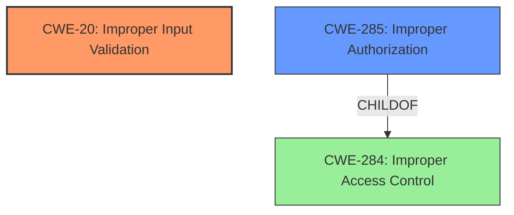

# Enhanced Analysis for CVE-2021-20775

# Summary
| CWE ID | CWE Name | Confidence | CWE Abstraction Level | CWE Vulnerability Mapping Label | CWE-Vulnerability Mapping Notes |
|---|---|---|---|---|---|
| CWE-20 [Improper Input Validation](https://cwe.mitre.org/data/definitions/20.html) | Improper Input Validation | 1.0 | Class | Primary | Allowed-with-Review |
| CWE-285 [Improper Authorization](https://cwe.mitre.org/data/definitions/285.html) | Improper Authorization | 0.7 | Class | Secondary | Discouraged |

## Evidence and Confidence

*   **Confidence Score:** 0.85
*   **Evidence Strength:** HIGH

## Relationship Analysis
The primary CWE is CWE-20 [Improper Input Validation](https://cwe.mitre.org/data/definitions/20.html), a Class-level CWE. It's a general category, but the provided information explicitly mentions **improper input validation** as the root cause. It can **precede** CWE-22 [Improper Limitation of a Pathname to a Restricted Directory ('Path Traversal')](https://cwe.mitre.org/data/definitions/22.html), CWE-41 [Improper Resolution of Path Equivalence](https://cwe.mitre.org/data/definitions/41.html), CWE-74 [Improper Neutralization of Special Elements in Output Used by a Downstream Component ('Injection')](https://cwe.mitre.org/data/definitions/74.html), and CWE-770 [Allocation of Resources Without Limits or Throttling](https://cwe.mitre.org/data/definitions/770.html).

CWE-285 [Improper Authorization](https://cwe.mitre.org/data/definitions/285.html) is considered as a secondary CWE because the vulnerability allows an attacker to obtain data without the viewing privilege. It is child of CWE-284 [Improper Access Control](https://cwe.mitre.org/data/definitions/284.html).



## Vulnerability Chain
The vulnerability chain starts with **improper input validation** (CWE-20 [Improper Input Validation](https://cwe.mitre.org/data/definitions/20.html)). This leads to the ability to obtain data without the necessary viewing privileges which indicates a problem with authorization (CWE-285 [Improper Authorization](https://cwe.mitre.org/data/definitions/285.html)).

## Summary of Analysis
The initial assessment was based on the vulnerability description that highlights the **improper input validation** as the root cause of the vulnerability. The vulnerability description mentions that a remote authenticated attacker can obtain the data of Comment and Space without the viewing privilege. The CVE Reference Links Content Summary confirms the **improper input validation** as the root cause and CWE-20 [Improper Input Validation](https://cwe.mitre.org/data/definitions/20.html) as a weakness. The retriever results also point to CWE-20 [Improper Input Validation](https://cwe.mitre.org/data/definitions/20.html) as a candidate CWE.

CWE-20 [Improper Input Validation](https://cwe.mitre.org/data/definitions/20.html) is selected as the primary CWE because the vulnerability description mentions **improper input validation** as the root cause. While CWE-20 [Improper Input Validation](https://cwe.mitre.org/data/definitions/20.html) is a Class-level CWE, the provided evidence does not give enough information to determine a more specific Base or Variant CWE.

CWE-285 [Improper Authorization](https://cwe.mitre.org/data/definitions/285.html) is a secondary candidate because the attacker is able to obtain data without the viewing privilege.

Other CWEs Considered but Not Used:

*   CWE-22 [Improper Limitation of a Pathname to a Restricted Directory ('Path Traversal')](https://cwe.mitre.org/data/definitions/22.html): This CWE was considered because the attacker can obtain data without the viewing privilege. However, there is no evidence to suggest that the vulnerability is related to path traversal.
*   CWE-73 [External Control of File Name or Path](https://cwe.mitre.org/data/definitions/73.html): This CWE was considered because the attacker can obtain data without the viewing privilege. However, there is no evidence to suggest that the vulnerability is related to external control of file name or path.
*   CWE-113 [Improper Neutralization of CRLF Sequences in HTTP Headers ('HTTP Request/Response Splitting')](https://cwe.mitre.org/data/definitions/113.html): This CWE was considered because the attacker can obtain data without the viewing privilege. However, there is no evidence to suggest that the vulnerability is related to improper neutralization of CRLF sequences in HTTP headers.
*   CWE-639 [Authorization Bypass Through User-Controlled Key](https://cwe.mitre.org/data/definitions/639.html): This CWE was considered because the attacker can obtain data without the viewing privilege. However, there is no evidence to suggest that the vulnerability is related to authorization bypass through user-controlled key.


## CWE Relationship Analysis

Current CWEs represent these abstraction levels: .


### Vulnerability Chain Analysis

**Chain starting from CWE-113:**
- 113 (Improper Neutralization of CRLF Sequences in HTTP Headers ('HTTP Request/Response Splitting')) - ROOT


**Chain starting from CWE-41:**
- 41 (Improper Resolution of Path Equivalence) - ROOT


### CWE Relationship Diagram

```mermaid
graph TD
    classDef primary fill:#f96,stroke:#333,stroke-width:2px
    classDef secondary fill:#69f,stroke:#333
    classDef tertiary fill:#9e9,stroke:#333
```