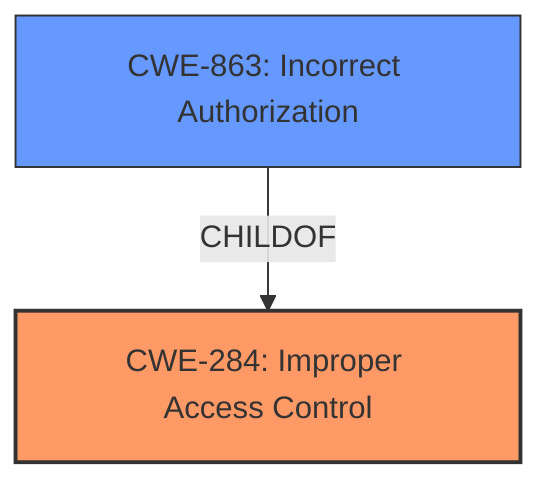

# Raw Analyzer Response for CVE-2021-20791

# Summary
| CWE ID  | CWE Name   | Confidence | CWE Abstraction Level | CWE Vulnerability Mapping Label | CWE-Vulnerability Mapping Notes |
|-----------------|-----------------------------------------|-------------------|--------------------------|------------------------------------|--------------------------------------------------------------------|
| CWE-284 | Improper Access Control | 0.8 | Pillar | Primary | Discouraged |
| CWE-863 | Incorrect Authorization | 0.7 | Class | Secondary | Allowed-with-Review |

## Evidence and Confidence

*   **Confidence Score:** 0.8
*   **Evidence Strength:** HIGH

## Relationship Analysis
The primary CWE is CWE-284, which is a high-level Pillar. CWE-863 is a ChildOf CWE-284 and is a Class level CWE. CWE-863 is a more specific case of access control, which is incorrect authorization.

## Vulnerability Chain
The **improper access control** (CWE-284) leads to an incorrect authorization (CWE-863) which allows an attacker to bypass access restrictions and exchange unauthorized files.

## Summary of Analysis
The vulnerability description clearly states that the root cause is **improper access control**.
> **Improper access control** vulnerability in RevoWorks Browser 2.1.230 and earlier allows an attacker to bypass access restriction and to exchange unauthorized files between the local environment and the isolated environment or settings of the web browser via unspecified vectors.
The CVE Reference Links Content Summary also supports this.
> **Root Cause of Vulnerability:**
- Improper access control between the local environment and the isolated environment in RevoWorks Browser.

The initial assessment was to select CWE-284. However, this is a Pillar level CWE and is discouraged. A more specific CWE is CWE-863, which is Incorrect Authorization. This CWE is a child of CWE-284 and is a Class level CWE. Although this is a Class level CWE, it is more specific than CWE-284 and is a better fit for the vulnerability description. The evidence supports the selection of CWE-284 as the primary weakness, but the MITRE guidance suggests to use a more specific CWE. Therefore, CWE-863 is selected as a secondary weakness.

Relevant CWE Information:

# Enhanced Context (25 CWEs)
The following CWEs were identified as potentially relevant to this vulnerability:

## CWE-668: Exposure of Resource to Wrong Sphere
**Abstraction Level**: Class
**Similarity Score**: 0.75

## CWE-664: Improper Control of a Resource Through its Lifetime
**Abstraction Level**: Pillar
**Similarity Score**: 0.74

## CWE-610: Externally Controlled Reference to a Resource in Another Sphere
**Abstraction Level**: Class
**Similarity Score**: 0.74

## CWE-653: Improper Isolation or Compartmentalization
**Abstraction Level**: Class
**Similarity Score**: 0.73

## CWE-552: Files or Directories Accessible to External Parties
**Abstraction Level**: Base
**Similarity Score**: 0.73

## CWE-1220: Insufficient Granularity of Access Control
**Abstraction Level**: Base
**Similarity Score**: 0.73

## CWE-669: Incorrect Resource Transfer Between Spheres
**Abstraction Level**: Class
**Similarity Score**: 0.73

## CWE-405: Asymmetric Resource Consumption (Amplification)
**Abstraction Level**: Class
**Similarity Score**: 0.72

## CWE-807: Reliance on Untrusted Inputs in a Security Decision
**Abstraction Level**: Base
**Similarity Score**: 0.72

## CWE-404: Improper Resource Shutdown or Release
**Abstraction Level**: Class
**Similarity Score**: 0.72

## CWE-863: Incorrect Authorization
**Abstraction Level**: Class
**Similarity Score**: 6760.88

## CWE-285: Improper Authorization
**Abstraction Level**: Class
**Similarity Score**: 6687.31

## CWE-200: Exposure of Sensitive Information to an Unauthorized Actor
**Abstraction Level**: Class
**Similarity Score**: 6611.23

## CWE-639: Authorization Bypass Through User-Controlled Key
**Abstraction Level**: Base
**Similarity Score**: 6604.56

## CWE-923: Improper Restriction of Communication Channel to Intended Endpoints
**Abstraction Level**: Class
**Similarity Score**: 6604.25

## CWE-322: Key Exchange without Entity Authentication
**Abstraction Level**: base
**Similarity Score**: 5.03

## CWE-98: Improper Control of Filename for Include/Require Statement in PHP Program ('PHP Remote File Inclusion')
**Abstraction Level**: variant
**Similarity Score**: 4.40

## CWE-425: Direct Request ('Forced Browsing')
**Abstraction Level**: base
**Similarity Score**: 4.33

## CWE-471: Modification of Assumed-Immutable Data (MAID)
**Abstraction Level**: base
**Similarity Score**: 4.33

## CWE-295: Improper Certificate Validation
**Abstraction Level**: base
**Similarity Score**: 3.64

## CWE-426: Untrusted Search Path
**Abstraction Level**: base
**Similarity Score**: 3.64

## CWE-1289: Improper Validation of Unsafe Equivalence in Input
**Abstraction Level**: base
**Similarity Score**: 3.64

## CWE-178: Improper Handling of Case Sensitivity
**Abstraction Level**: base
**Similarity Score**: 3.64

## CWE-427: Uncontrolled Search Path Element
**Abstraction Level**: base
**Similarity Score**: 3.64

## CWE-457: Use of Uninitialized Variable
**Abstraction Level**: variant
**Similarity Score**: 3.34